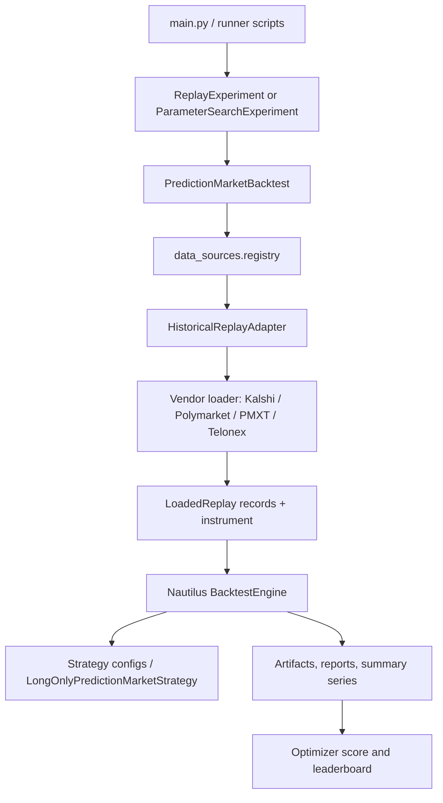

# Codebase UML Inventory

This file is generated from Python AST metadata and excludes `tests/` plus git-ignored private strategy/research directories.
Generated: 2026-08-13T16:26:31+00:00
Modules: 258 | Classes: 532 | Functions/methods: 3498

## Backtesting Data Flow

## Module Inventory

### `backtests/__init__.py`
- Imports: none

### `backtests/_beffer45_trade_data.py`
- Imports: `__future__`

### `backtests/_script_helpers.py`
- Imports: `__future__, importlib, pathlib, sys`
- Function L8: `ensure_repo_root(script_path: str | Path) -> Path`
- Function L23: `parse_csv_env(raw: str) -> list[str]`
- Function L27: `parse_bool_env(raw: str, *, default: bool = True) -> bool`

### `backtests/polymarket_beffer45_trade_replay_telonex.py`
- Imports: `__future__, collections, csv, datetime, decimal, pathlib, re, typing`
- Function L44: `_decimal(value: object) -> Decimal`
- Function L48: `_trade_notional(trade: Mapping[str, object]) -> Decimal`
- Function L52: `_trade_timestamp(trade: Mapping[str, object]) -> datetime`
- Function L56: `_iso(timestamp: datetime) -> str`
- Function L60: `_group_trades_by_instrument(trades: Iterable[Mapping[str, object]]) -> dict[tuple[str, int], tuple[dict[str, object], ...]]`
- Function L72: `_replay_window(*, slug: str, trades: Sequence[Mapping[str, object]]) -> tuple[str, str]`
- Function L91: `_ledger_cash_pnl(trades: Sequence[Mapping[str, object]]) -> Decimal`
- Function L102: `_ledger_open_quantity(trades: Sequence[Mapping[str, object]]) -> Decimal`
- Function L113: `_ledger_settlement_pnl(trades: Sequence[Mapping[str, object]], realized_outcome: object) -> Decimal | None`
- Function L121: `_sum_notional(trades: Iterable[Mapping[str, object]], *, side: str) -> Decimal`
- Function L128: `_build_replays() -> tuple[Any, ...]`
- Function L160: `_print_ledger_header() -> None`
- Function L187: `_write_comparison_csv(rows: Sequence[Mapping[str, object]]) -> None`
- Function L209: `_print_backtest_comparison(results: Sequence[Mapping[str, Any]]) -> None`
- Function L277: `run() -> None`

### `backtests/polymarket_book_ema_crossover.py`
- Imports: `__future__, decimal`
- Function L18: `run() -> None`

### `backtests/polymarket_book_ema_optimizer.py`
- Imports: `__future__, decimal`
- Function L18: `run() -> None`

### `backtests/polymarket_book_joint_portfolio_runner.py`
- Imports: `__future__, decimal`
- Function L18: `run() -> None`

### `backtests/polymarket_btc_15m_opening_mispricing_maker.py`
- Imports: `__future__, argparse, btc_short_horizon, collections, dataclasses, datetime, decimal, hashlib, json, pathlib, prediction_market_extensions, typing`
- Function L49: `parse_args(argv: Sequence[str] | None = None) -> argparse.Namespace`
- Function L81: `load_runner_inputs(args: argparse.Namespace) -> RunnerInputs`
- Function L115: `build_backtest_from_args(args: argparse.Namespace) -> Any`
- Function L121: `run(argv: Sequence[str] | None = None) -> list[dict[str, Any]]`
- Function L145: `build_run_artifacts(*, args: argparse.Namespace, inputs: RunnerInputs, results: Sequence[Mapping[str, object]], order_events: Sequence[Mapping[str, object]] = ()) -> BtcRunArtifacts`
- Function L245: `_build_backtest(*, args: argparse.Namespace, inputs: RunnerInputs) -> Any`
- Function L275: `_load_market(*, args: argparse.Namespace, config: BtcProjectConfig) -> MarketWindow`
- Function L296: `_read_metadata(path: Path) -> dict[str, object]`
- Function L300: `_read_json_object(path: Path, label: str) -> dict[str, object]`
- Function L310: `_validate_signal_manifest(*, path: Path, config: BtcProjectConfig, market: MarketWindow, signals: Sequence[BtcOpeningMispricingSignal]) -> str`
- Function L353: `_validate_pmxt_coverage(*, path: Path, market: MarketWindow, replay_start: datetime, replay_book_end: datetime) -> Mapping[str, object]`
- Function L403: `_validate_model_artifact(*, directory: Path, signal: BtcOpeningMispricingSignal, expected_model_hash: str) -> str`
- Function L431: `_pmxt_records_sha256(payload: Mapping[str, object], side: str) -> str`
- Function L440: `_mapping_field(payload: Mapping[str, object], field: str, label: str) -> Mapping[str, object]`
- Function L451: `_json_utc_datetime(value: object, label: str) -> datetime`
- Function L463: `_market_input_hashes(args: argparse.Namespace) -> dict[str, str]`
- Function L470: `_prediction_record(signal: BtcOpeningMispricingSignal) -> dict[str, object]`
- Function L490: `_flatten_results(*, market_slug: str, results: Sequence[Mapping[str, object]], order_events: Sequence[Mapping[str, object]]) -> tuple[tuple[dict[str, object], ...], tuple[dict[str, object], ...]]`
- Function L536: `_audit_fill_records(*, market_slug: str, results: Sequence[Mapping[str, object]], order_events: Sequence[Mapping[str, object]]) -> tuple[dict[str, object], ...]`
- Function L604: `_result_metrics(results: Sequence[Mapping[str, object]], *, order_events: Sequence[Mapping[str, object]], fills: Sequence[Mapping[str, object]]) -> dict[str, object]`
- Function L633: `_markout_metrics(fills: Sequence[Mapping[str, object]]) -> dict[str, object]`
- Function L665: `_order_lifecycle_metrics(order_events: Sequence[Mapping[str, object]]) -> dict[str, int]`
- Function L689: `_order_plan_quality_metrics(order_events: Sequence[Mapping[str, object]]) -> dict[str, float | None]`
- Function L700: `_audit_fill_metrics(order_events: Sequence[Mapping[str, object]]) -> dict[str, object]`
- Function L773: `_validate_formal_results(*, results: Sequence[Mapping[str, object]], order_events: Sequence[Mapping[str, object]]) -> None`
- Function L822: `_validate_formal_markouts(*, audit_fills: Sequence[Mapping[str, object]], order_events: Sequence[Mapping[str, object]]) -> None`
- Function L882: `_validate_fill_ledger(*, results: Sequence[Mapping[str, object]], order_events: Sequence[Mapping[str, object]]) -> None`
- Function L951: `_cancel_race_fill_count(order_events: Sequence[Mapping[str, object]]) -> int`
- Function L966: `_decimal_amount(value: object) -> Decimal`
- Function L982: `_decimal_close(left: Decimal, right: Decimal) -> bool`
- Function L986: `_strict_binary_outcome(value: object) -> Decimal`
- Function L993: `_strict_nonnegative_int(value: object, name: str) -> int`
- Function L999: `_price_points(value: object) -> tuple[tuple[object, object], ...]`
- Function L1007: `_mapping_sequence(value: object) -> tuple[Mapping[str, object], ...]`
- Function L1013: `_as_int(value: object) -> int`
- Function L1020: `_as_float(value: object) -> float`
- Function L1027: `_sha256_file(path: Path) -> str`
- Function L1035: `_require_sha256(value: object, name: str) -> str`
- Function L1042: `_require_git_revision(value: object, name: str) -> str`
- Function L1049: `_parse_utc_datetime(value: str) -> datetime`
- Function L1059: `_require_text(value: object, name: str) -> str`
- Class L41: `RunnerInputs`

### `backtests/polymarket_btc_5m_late_favorite_taker_hold.py`
- Imports: `__future__, datetime, decimal`
- Function L26: `_utc_iso(value: datetime) -> str`
- Function L30: `_btc_5m_windows() -> tuple[tuple[str, datetime, datetime], ...]`
- Function L42: `_btc_5m_replays() -> Any`
- Function L65: `run() -> None`

### `backtests/polymarket_btc_5m_pair_arbitrage.py`
- Imports: `__future__, datetime, decimal`
- Function L24: `_utc_iso(value: datetime) -> str`
- Function L28: `_btc_5m_windows() -> tuple[tuple[str, str, str], ...]`
- Function L40: `_btc_5m_replays() -> Any`
- Function L56: `run() -> None`

### `backtests/polymarket_pmxt_book_100_replay_runner.py`
- Imports: `__future__, decimal`
- Function L126: `run() -> None`

### `backtests/polymarket_telonex_book_100_replay_runner.py`
- Imports: `__future__, decimal`
- Function L126: `run() -> None`

### `backtests/polymarket_telonex_book_joint_portfolio_runner.py`
- Imports: `__future__, decimal`
- Function L18: `run() -> None`

### `backtests/sitecustomize.py`
- Imports: `__future__, importlib, pathlib, sys`

### `btc_short_horizon/__init__.py`
- Imports: none

### `btc_short_horizon/backtest/__init__.py`
- Imports: `__future__, btc_short_horizon, importlib, typing`
- Function L54: `__getattr__(name: str) -> Any`

### `btc_short_horizon/backtest/audit.py`
- Imports: `__future__, typing`
- Function L40: `_json_ready_details(details: Mapping[str, object]) -> dict[str, object]`
- Class L8: `OrderAuditTrail`
  - Method L11: `__init__(self) -> None`
  - Method L15: `records(self) -> tuple[dict[str, object], ...]`
  - Method L18: `record(self, *, event_type: str, ts_ns: int, client_order_id: str | None = None, **details: object) -> None`

### `btc_short_horizon/backtest/joint.py`
- Imports: `__future__, btc_short_horizon, dataclasses, datetime, decimal, math, prediction_market_extensions, typing`
- Function L35: `_as_utc(value: datetime, name: str) -> datetime`
- Function L150: `build_btc_joint_backtest(*, name: str, data: MarketDataConfig, config: BtcJointReplayConfig) -> PredictionMarketBacktest`
- Function L262: `collect_btc_order_events(backtest: PredictionMarketBacktest) -> tuple[dict[str, object], ...]`
- Class L42: `BtcJointReplayConfig`
  - Method L59: `__post_init__(self) -> None`

### `btc_short_horizon/backtest/signal_io.py`
- Imports: `__future__, btc_short_horizon, numbers, pathlib, pyarrow, typing`
- Function L37: `write_opening_mispricing_signals(path: Path, signals: Sequence[BtcOpeningMispricingSignal]) -> None`
- Function L48: `read_opening_mispricing_signals(path: Path, *, market_slug: str | None = None) -> tuple[BtcOpeningMispricingSignal, ...]`
- Function L65: `_signal_record(signal: BtcOpeningMispricingSignal) -> dict[str, object]`
- Function L69: `_signal_from_record(record: dict[str, object]) -> BtcOpeningMispricingSignal`
- Function L94: `_text(record: dict[str, object], field: str) -> str`
- Function L101: `_integer(record: dict[str, object], field: str) -> int`
- Function L108: `_real(record: dict[str, object], field: str) -> float`
- Function L115: `_boolean(record: dict[str, object], field: str) -> bool`
- Function L122: `_signal_sort_key(signal: BtcOpeningMispricingSignal) -> tuple[int, int, str, str, str]`

### `btc_short_horizon/backtest/signals.py`
- Imports: `btc_short_horizon, math, nautilus_trader`
- Function L37: `to_opening_mispricing_signal(prediction: OpeningMispricingPrediction) -> BtcOpeningMispricingSignal`
- Function L59: `validate_opening_mispricing_signal(signal: BtcOpeningMispricingSignal) -> None`
- Function L85: `opening_signal_data_age_seconds(signal: BtcOpeningMispricingSignal, *, now_ts_ns: int) -> float`
- Function L94: `opening_signal_entry_rejection_reason(signal: BtcOpeningMispricingSignal, *, now_ts_ns: int, stale_after_seconds: float) -> str | None`
- Class L12: `BtcOpeningMispricingSignal(Data)`
- Class L31: `BtcReplayBoundary(Data)`

### `btc_short_horizon/backtest/strategy.py`
- Imports: `__future__, btc_short_horizon, dataclasses, decimal, functools, nautilus_trader, prediction_market_extensions, typing`
- Function L44: `_as_float(value: object | None) -> float | None`
- Function L56: `_event_ts_ns(event: object) -> int`
- Class L71: `BtcOpeningMispricingConfig(StrategyConfig)`
  - Method L92: `__post_init__(self) -> None`
  - Method L101: `maker_config(self) -> MakerStrategyConfig`
- Class L120: `BtcOpeningMispricingStrategy(Strategy)`
  - Method L123: `__init__(self, config: BtcOpeningMispricingConfig) -> None`
  - Method L143: `order_audit_events(self) -> tuple[dict[str, object], ...]`
  - Method L146: `on_start(self) -> None`
  - Method L167: `on_data(self, data) -> None`
  - Method L182: `on_order_book_deltas(self, deltas) -> None`
  - Method L194: `on_order_accepted(self, event) -> None`
  - Method L205: `on_order_filled(self, event) -> None`
  - Method L286: `on_order_canceled(self, event) -> None`
  - Method L289: `on_order_expired(self, event) -> None`
  - Method L292: `on_order_rejected(self, event) -> None`
  - Method L295: `on_order_denied(self, event) -> None`
  - Method L298: `on_order_cancel_rejected(self, event) -> None`
  - Method L311: `on_stop(self) -> None`
  - Method L315: `on_reset(self) -> None`
  - Method L326: `_process_signal(self, *, now_ts_ns: int) -> None`
  - Method L335: `_submit_plan_if_actionable(self, *, signal: BtcOpeningMispricingSignal, now_ts_ns: int) -> None`
  - Method L404: `_evaluate_working_orders(self, *, signal: BtcOpeningMispricingSignal, now_ts_ns: int) -> None`
  - Method L432: `_outcome_books(self) -> OutcomeBooks | None`
  - Method L442: `_side_book(self, side: TokenSide) -> SideBook | None`
  - Method L465: `_visible_levels(levels: list[Any]) -> tuple[VisibleBookLevel, ...]`
  - Method L476: `_materialize_plan(self, plan: OrderPlan) -> OrderPlan | None`
  - Method L513: `_submit_orders(self, plan: OrderPlan) -> None`
  - Method L575: `_request_cancel(self, reason: str, *, now_ts_ns: int) -> None`
  - Method L589: `_close_order_event(self, event, *, terminal_event: str, rejected: bool) -> None`
  - Method L612: `_confirm_candidate(self, *, side: TokenSide, signal_ts_ns: int) -> bool`
  - Method L615: `_reset_candidate(self) -> None`
  - Method L618: `_on_work_expiry(self, event) -> None`
  - Method L623: `_schedule_fill_markouts(self, *, client_order_id: str, trade_id: str, instrument_id: InstrumentId, fill_price: float, fill_ts_ns: int) -> None`
  - Method L649: `_on_fill_markout(self, event, *, client_order_id: str, trade_id: str, instrument_id: InstrumentId, fill_price: float, horizon_seconds: int) -> None`
  - Method L688: `_clear_work_expiry(self) -> None`
  - Method L693: `_side_for_instrument(self, instrument_id: object) -> TokenSide | None`
  - Method L700: `_instrument_id_for(self, side: TokenSide) -> InstrumentId`
  - Method L705: `_book_age_seconds(self, *, side: TokenSide, now_ts_ns: int) -> float | None`
  - Method L711: `_execution_book_rejection_reason(self, *, now_ts_ns: int) -> str | None`

### `btc_short_horizon/config.py`
- Imports: `__future__, btc_short_horizon, dataclasses, math, pathlib, prediction_market_extensions, tomllib, typing`
- Function L242: `load_btc_project_config(path: Path) -> BtcProjectConfig`
- Function L418: `_paper_execution_variant(section: Mapping[str, object]) -> PaperExecutionVariantConfig`
- Function L441: `_stage_policy(value: object) -> StagePolicyConfig`
- Function L475: `_simple_ascii_identifier(value: object, name: str) -> str`
- Function L491: `_scenario(section: Mapping[str, object]) -> ExecutionScenario`
- Function L525: `_validate_formal_scenario_grid(scenarios: tuple[ExecutionScenario, ...]) -> None`
- Function L562: `_forward_collection(section: Mapping[str, object]) -> ForwardCollectionConfig`
- Function L629: `_stream_names(section: Mapping[str, object], name: str) -> tuple[str, ...]`
- Function L643: `_family(section: Mapping[str, object]) -> BtcMarketFamily`
- Function L652: `_mapping(raw: Mapping[str, object], name: str) -> Mapping[str, object]`
- Function L659: `_mapping_list(raw: Mapping[str, object], name: str) -> tuple[Mapping[str, object], ...]`
- Function L666: `_text(section: Mapping[str, object], name: str) -> str`
- Function L673: `_text_list(raw: Mapping[str, object], name: str) -> tuple[str, ...]`
- Function L680: `_data_sources(root: Path, raw: Mapping[str, object]) -> tuple[str, ...]`
- Function L684: `_resolve_data_source(root: Path, value: str) -> str`
- Function L693: `_int(section: Mapping[str, object], name: str) -> int`
- Function L700: `_positive_int(section: Mapping[str, object], name: str) -> int`
- Function L707: `_int_list(section: Mapping[str, object], name: str) -> tuple[int, ...]`
- Function L714: `_nonnegative_int_list(section: Mapping[str, object], name: str) -> tuple[int, ...]`
- Function L721: `_positive_float(section: Mapping[str, object], name: str) -> float`
- Function L728: `_nonnegative_float(section: Mapping[str, object], name: str) -> float`
- Function L741: `_nonnegative_float_default(section: Mapping[str, object], name: str, default: float) -> float`
- Function L745: `_probability(section: Mapping[str, object], name: str) -> float`
- Function L752: `_probability_excluding_zero(section: Mapping[str, object], name: str) -> float`
- Function L759: `_probability_excluding_zero_default(section: Mapping[str, object], name: str, default: float) -> float`
- Function L765: `_bool(section: Mapping[str, object], name: str) -> bool`
- Function L772: `_bool_default(section: Mapping[str, object], name: str, default: bool) -> bool`
- Function L776: `_positive_int_default(section: Mapping[str, object], name: str, default: int) -> int`
- Function L780: `_resolve_path(root: Path, value: str) -> Path`
- Class L33: `ProjectPaths`
- Class L40: `ResearchTimingConfig`
- Class L50: `OkxPublicSubscriptionConfig`
- Class L56: `ForwardCollectionConfig`
- Class L79: `ExecutionScenario`
- Class L86: `PaperExecutionVariantConfig`
  - Method L103: `__post_init__(self) -> None`
- Class L212: `PaperResearchConfig`
- Class L218: `BtcProjectConfig`
  - Method L235: `require_scenario(self, name: str) -> ExecutionScenario`

### `btc_short_horizon/data/__init__.py`
- Imports: `btc_short_horizon`

### `btc_short_horizon/data/archive.py`
- Imports: `__future__, btc_short_horizon, dataclasses, datetime, hashlib, json, os, pathlib, re, shutil, subprocess, typing, uuid`
- Function L193: `create_backup_snapshot(*, raw_data_root: Path, session_ids: Sequence[str] | None = None, created_at: datetime | None = None) -> tuple[BackupSnapshot, Path]`
- Function L251: `upload_backup_snapshot(*, raw_data_root: Path, snapshot: BackupSnapshot, snapshot_path: Path, transport: ObjectTransport) -> None`
- Function L268: `verify_remote_snapshot(*, raw_data_root: Path, snapshot_id: str, transport: ObjectTransport, temporary_root: Path) -> tuple[BackupSnapshot, BackupReceipt, Path]`
- Function L321: `restore_remote_snapshot(*, destination_root: Path, snapshot_id: str, transport: ObjectTransport, temporary_root: Path) -> BackupSnapshot`
- Function L343: `_restore_remote_snapshot_unlocked(*, destination_root: Path, snapshot_id: str, transport: ObjectTransport, temporary_root: Path) -> BackupSnapshot`
- Function L393: `archive_verified_sessions_locally(*, raw_data_root: Path, receipt_path: Path, session_ids: Sequence[str] | None = None, completed_before: datetime | None = None, apply: bool = False) -> LocalArchivePlan`
- Function L425: `_archive_verified_sessions_locally_unlocked(*, raw_data_root: Path, receipt_path: Path, session_ids: Sequence[str] | None = None, completed_before: datetime | None = None, apply: bool = False) -> LocalArchivePlan`
- Function L548: `read_backup_snapshot(path: Path) -> BackupSnapshot`
- Function L605: `read_backup_receipt(path: Path) -> BackupReceipt`
- Function L641: `_select_complete_sessions(sessions: Sequence[CollectorSessionRecord], *, session_ids: Sequence[str] | None) -> tuple[CollectorSessionRecord, ...]`
- Function L667: `_backup_file(*, root: Path, path: Path) -> BackupFile`
- Function L678: `_read_backup_file(value: object) -> BackupFile`
- Function L702: `_validate_snapshot_scope(*, session_ids: tuple[str, ...], files: tuple[BackupFile, ...]) -> None`
- Function L738: `_snapshot_payload(snapshot: BackupSnapshot) -> dict[str, object]`
- Function L748: `_persist_verified_snapshot(root: Path, *, downloaded_path: Path, snapshot: BackupSnapshot) -> Path`
- Function L773: `_install_verified_file(source: Path, *, target: Path, expected: BackupFile) -> None`
- Function L796: `_snapshot_object_key(snapshot_id: str) -> str`
- Function L800: `_verify_local_backup_file(path: Path, expected: BackupFile) -> None`
- Function L807: `_restore_order(item: BackupFile) -> tuple[int, str]`
- Function L815: `_safe_relative(value: object, name: str) -> Path`
- Function L833: `_require_sha256(value: object, name: str) -> str`
- Function L843: `_parse_timestamp(value: object) -> datetime`
- Function L855: `_utc_text(value: datetime) -> str`
- Function L861: `_utc_datetime(value: datetime) -> datetime`
- Function L867: `_nonnegative_int(value: object, name: str) -> int`
- Function L873: `_fsync_file(path: Path) -> None`
- Function L879: `_fsync_directory(path: Path) -> None`
- Class L36: `BackupIntegrityError(ValueError)`
- Class L41: `BackupFile`
- Class L49: `BackupSnapshot`
- Class L58: `BackupReceipt`
- Class L69: `LocalArchivePlan`
- Class L77: `ObjectTransport(Protocol)`
  - Method L79: `remote_id(self) -> str`
  - Method L81: `put(self, local_path: Path, object_key: str) -> None`
  - Method L83: `get(self, object_key: str, local_path: Path) -> None`
- Class L86: `LocalObjectTransport`
  - Method L89: `__init__(self, root: Path) -> None`
  - Method L93: `remote_id(self) -> str`
  - Method L96: `put(self, local_path: Path, object_key: str) -> None`
  - Method L114: `get(self, object_key: str, local_path: Path) -> None`
- Class L129: `RcloneObjectTransport`
  - Method L132: `__init__(self, remote_root: str, *, executable: str = 'rclone', runner: Callable[..., subprocess.CompletedProcess[str]] = subprocess.run) -> None`
  - Method L148: `remote_id(self) -> str`
  - Method L151: `put(self, local_path: Path, object_key: str) -> None`
  - Method L162: `get(self, object_key: str, local_path: Path) -> None`
  - Method L173: `_remote_path(self, object_key: str) -> str`
  - Method L177: `_run(self, *arguments: str) -> None`

### `btc_short_horizon/data/binance.py`
- Imports: `__future__, btc_short_horizon, collections, dataclasses, datetime, enum, math, typing`
- Function L37: `normalize_binance_trade(payload: Mapping[str, object], *, collector_receive_ts: datetime | None, source: str = 'binance_spot', availability_delay: timedelta = timedelta(0)) -> BinanceTradeRecord`
- Function L80: `normalize_binance_kline(payload: Mapping[str, object], *, collector_receive_ts: datetime, source: str = 'binance_spot') -> TimedMarketEvent`
- Function L133: `normalize_binance_depth_update(payload: Mapping[str, object], *, collector_receive_ts: datetime | None, source: str = 'binance_spot', availability_delay: timedelta = timedelta(0)) -> TimedMarketEvent`
- Function L161: `normalize_binance_depth_snapshot(payload: Mapping[str, object], *, instrument: str, collector_receive_ts: datetime, source: str = 'binance_spot') -> TimedMarketEvent`
- Function L190: `normalize_binance_book_ticker(payload: Mapping[str, object], *, collector_receive_ts: datetime, source: str = 'binance_spot') -> TimedMarketEvent`
- Function L595: `_validate_depth_source(source: str) -> None`
- Function L600: `_retains_depth_update(*, source: str, final_update_id: int, snapshot_update_id: int) -> bool`
- Function L611: `_required_text(payload: Mapping[str, object], key: str) -> str`
- Function L618: `_positive_float(payload: Mapping[str, object], key: str) -> float`
- Function L625: `_nonnegative_float(payload: Mapping[str, object], key: str) -> float`
- Function L632: `_float(value: object, key: str) -> float`
- Function L642: `_bool(value: object, key: str) -> bool`
- Function L648: `_nonnegative_int(payload: Mapping[str, object], key: str) -> int`
- Function L658: `_levels(value: object) -> tuple[tuple[float, float], ...]`
- Function L673: `_first_present(payload: Mapping[str, object], *keys: str) -> object | None`
- Function L680: `_timestamp_from_millis(value: object | None, field_name: str, *, default: datetime | None = None) -> datetime`
- Function L698: `_normalize_receive_ts(value: datetime | None) -> datetime | None`
- Function L706: `_available_time(source_ts: datetime, receive_ts: datetime | None, delay: timedelta) -> datetime`
- Function L713: `_datetime_to_ns(value: datetime) -> int`
- Class L16: `DepthUpdateStatus(StrEnum)`
- Class L24: `BinanceTradeRecord`
- Class L30: `DepthApplyResult`
- Class L220: `BinanceDiffDepthBook`
  - Method L223: `__init__(self, *, instrument: str, source: str = 'binance_spot', availability_delay: timedelta = timedelta(0)) -> None`
  - Method L245: `last_update_id(self) -> int | None`
  - Method L248: `apply_snapshot(self, payload: Mapping[str, object], *, collector_receive_ts: datetime) -> DepthApplyResult`
  - Method L292: `apply_delta(self, payload: Mapping[str, object], *, collector_receive_ts: datetime | None) -> DepthApplyResult`
  - Method L355: `_gap_result(self, reason: str) -> DepthApplyResult`
  - Method L365: `_apply_levels(levels: dict[float, float], changes: Sequence[tuple[float, float]]) -> tuple[tuple[float, float | None], ...]`
  - Method L379: `_rollback_levels(levels: dict[float, float], undo: Sequence[tuple[float, float | None]]) -> None`
  - Method L389: `_book_top(self, *, source_ts: datetime, receive_ts: datetime | None, bids: Mapping[float, float], asks: Mapping[float, float]) -> BtcBookTop | None`
- Class L417: `_BufferedDepthUpdate`
- Class L422: `BinanceDepthSynchronizer`
  - Method L425: `__init__(self, *, instrument: str, source: str = 'binance_spot', availability_delay: timedelta = timedelta(0), max_buffered_events: int = 10000) -> None`
  - Method L446: `synchronized(self) -> bool`
  - Method L450: `needs_snapshot(self) -> bool`
  - Method L454: `requires_snapshot(self) -> bool`
  - Method L458: `buffered_event_count(self) -> int`
  - Method L461: `invalidate(self) -> None`
  - Method L469: `observe_delta(self, payload: Mapping[str, object], *, collector_receive_ts: datetime | None) -> DepthApplyResult`
  - Method L495: `apply_snapshot(self, payload: Mapping[str, object], *, collector_receive_ts: datetime) -> DepthApplyResult`
  - Method L566: `_buffer_update(self, payload: Mapping[str, object], *, collector_receive_ts: datetime | None) -> DepthApplyResult`
  - Method L587: `_new_book(self) -> BinanceDiffDepthBook`

### `btc_short_horizon/data/catalog_io.py`
- Imports: `__future__, btc_short_horizon, collections, datetime, json, pathlib, uuid`
- Function L26: `write_market_catalog(*, path: Path, catalog: MarketCatalog, collected_at: datetime | None = None) -> None`
- Function L42: `market_catalog_payload(*, catalog: MarketCatalog, collected_at: datetime) -> dict[str, object]`
- Function L55: `read_market_catalog(path: Path, *, allow_unproven_legacy: bool = False) -> MarketCatalog`
- Function L94: `_family_record(family: BtcMarketFamily) -> dict[str, object]`
- Function L103: `_market_record(window: MarketWindow) -> dict[str, object]`
- Function L122: `_family_from_record(value: object) -> BtcMarketFamily`
- Function L136: `_market_from_record(value: object, *, families_by_name: Mapping[str, BtcMarketFamily], require_rule_contract: bool) -> MarketWindow`
- Function L184: `_require_value(value: Mapping[str, object], name: str) -> object`
- Function L191: `_require_text(value: Mapping[str, object], name: str) -> str`
- Function L198: `_require_int(value: Mapping[str, object], name: str) -> int`
- Function L205: `_normalize_timestamp(value: datetime, name: str) -> datetime`
- Function L211: `_parse_timestamp(value: object, name: str) -> datetime`

### `btc_short_horizon/data/collector.py`
- Imports: `__future__, asyncio, btc_short_horizon, collections, dataclasses, datetime, inspect, json, math, pathlib, pyarrow, random, re, types, typing, websockets`
- Function L452: `async _maybe_await(value: object) -> object`
- Function L458: `_message_payloads(raw: str | bytes) -> tuple[Mapping[str, object], ...]`
- Function L475: `normalize_collector_session_id(value: object) -> str`
- Function L484: `_freeze_json_value(value: object) -> object`
- Class L33: `BusinessPayloadInactivityError(TimeoutError)`
  - Method L36: `__init__(self, *, endpoint: str, timeout_seconds: float) -> None`
- Class L45: `RawCollectorEvent`
  - Method L54: `__post_init__(self) -> None`
  - Method L88: `estimated_size_bytes(self) -> int`
  - Method L105: `as_row(self) -> dict[str, object]`
  - Method L126: `with_admission_sequence(self, value: int) -> RawCollectorEvent`
- Class L139: `PartitionedRawEventWriter`
  - Method L142: `__init__(self, root: Path, *, manifest_attributes: Mapping[str, str] | None = None, inventory: PartWriteInventory | None = None) -> None`
  - Method L161: `write(self, events: Sequence[RawCollectorEvent], *, quality_counts: Mapping[RawPartitionKey, tuple[int, int]] | None = None) -> tuple[DataPartitionManifest, ...]`
- Class L230: `WebSocketSubscription`
  - Method L240: `__post_init__(self) -> None`
- Class L264: `JsonWebSocketCollector`
  - Method L267: `__init__(self, subscription: WebSocketSubscription, *, jitter_source: Callable[[], float] = random.random) -> None`
  - Method L276: `async collect_forever(self, *, stop_event: asyncio.Event, on_payload: Callable[[Mapping[str, object], datetime], object | Awaitable[object]], on_error: Callable[[Exception], object | Awaitable[object]] | None = None, on_connected: Callable[[], object | Awaitable[object]] | None = None) -> None`
  - Method L325: `async _connect_once(self, *, stop_event: asyncio.Event, on_payload: Callable[[Mapping[str, object], datetime], object | Awaitable[object]], on_activity: Callable[[], None], on_connected: Callable[[], object | Awaitable[object]] | None) -> None`
  - Method L355: `async _collect_connection(self, *, socket, stop_event: asyncio.Event, on_payload: Callable[[Mapping[str, object], datetime], object | Awaitable[object]]) -> None`
  - Method L421: `async _send_heartbeats(self, *, socket, stop_event: asyncio.Event) -> None`
  - Method L432: `async _wait_for_stop(self, stop_event: asyncio.Event, delay: float) -> bool`
  - Method L439: `_reconnect_delay(self, attempt: int) -> float`

### `btc_short_horizon/data/contracts.py`
- Imports: `__future__, dataclasses, datetime, enum, re`
- Function L33: `_normalize_utc(value: datetime, *, field_name: str) -> datetime`
- Function L41: `_normalize_window_time(value: datetime, *, field_name: str) -> datetime`
- Function L48: `_require_text(value: str, *, field_name: str) -> str`
- Function L57: `_epoch_seconds(value: datetime) -> int`
- Class L14: `MarketValidationError(ValueError)`
- Class L18: `MarketCollectionMode(str, Enum)`
- Class L25: `MarketOutcome(str, Enum)`
- Class L62: `BtcMarketFamily`
  - Method L70: `__post_init__(self) -> None`
  - Method L95: `window_minutes(self) -> int`
  - Method L100: `window_seconds_as_timedelta(self) -> timedelta`
  - Method L105: `is_collection_only(self) -> bool`
  - Method L109: `slug_for(self, t0: datetime) -> str`
  - Method L119: `parse_slug(self, slug: str) -> datetime`
- Class L158: `MarketWindow`
  - Method L173: `__post_init__(self) -> None`
  - Method L220: `_normalize_resolution(value: MarketOutcome | str | None) -> MarketOutcome | None`
  - Method L229: `_normalize_label_available_ts(value: datetime | None, *, resolution: MarketOutcome | None, t1: datetime) -> datetime | None`
  - Method L248: `winning_token_id(self) -> str | None`
  - Method L257: `is_resolved(self) -> bool`
- Class L263: `TimedMarketEvent`
  - Method L275: `__post_init__(self) -> None`
  - Method L310: `is_event_time_only(self) -> bool`

### `btc_short_horizon/data/coverage_index.py`
- Imports: `__future__, btc_short_horizon, dataclasses, datetime, hashlib, json, pathlib`
- Function L157: `coverage_evidence_sha256(entries: tuple[dict[str, object], ...]) -> str`
- Function L161: `_timestamp_ns(value: str) -> int`
- Class L16: `SessionCoverage`
- Class L25: `SessionCoverageIndex`
  - Method L26: `__init__(self, root: Path) -> None`
  - Method L29: `append(self, session: CollectorSessionRecord, *, inventory_path: Path) -> None`
  - Method L86: `coverage_evidence(self, *, start_ns: int, end_ns: int, required_sources: tuple[str, ...], maximum_session_gap_ns: int = 1000000, maximum_source_boundary_gap_ns: int = 5000000000) -> tuple[dict[str, object], ...]`
  - Method L133: `overlapping_session_ids(self, *, start_ns: int, end_ns: int, required_sources: tuple[str, ...]) -> tuple[str, ...]`
  - Method L145: `_read(self) -> dict[str, object]`

### `btc_short_horizon/data/disk_pressure.py`
- Imports: `__future__, asyncio, collections, dataclasses, enum, math`
- Function L104: `async supervise_optional_feed(*, stop_event: asyncio.Event, enabled_event: asyncio.Event, run_once: Callable[[asyncio.Event], Awaitable[None]], retry_seconds: float = 1.0, on_disabled: Callable[[], Awaitable[None]] | None = None, on_recovered: Callable[[], Awaitable[None]] | None = None) -> None`
- Function L149: `async _wait_until_cleared(enabled: asyncio.Event, stopped: asyncio.Event) -> None`
- Class L12: `DiskPressureState(StrEnum)`
- Class L20: `DiskProtectionPolicy`
  - Method L25: `__post_init__(self) -> None`
  - Method L40: `evaluate_free_gib(self, free_gib: float) -> DiskPressureState`
- Class L53: `DiskFeedSupervisor`
  - Method L60: `update(self, free_gib: float) -> DiskPressureState`
  - Method L84: `optional_feeds_enabled(self) -> bool`
  - Method L90: `subscriptions(self, *, core_spot: tuple[str, ...], optional_perp: tuple[str, ...], optional_okx: tuple[dict[str, str], ...]) -> dict[str, tuple[object, ...]]`

### `btc_short_horizon/data/forward.py`
- Imports: `__future__, asyncio, btc_short_horizon, collections, copy, dataclasses, datetime, httpx, json, math, pathlib, queue, threading, time, typing, uuid`
- Function L3116: `_session_epoch_id(*, epoch_id_offset: int, local_epoch_id: int) -> int`
- Function L3127: `_normalize_gap_identity(*, source: str, instrument: str, stream_id: str, reason: str) -> tuple[str, str, str, str]`
- Function L3152: `_consume_background_task_exception(task: asyncio.Task[Any]) -> None`
- Function L3157: `_cancel_background_task(task: asyncio.Task[Any]) -> None`
- Function L3163: `_gap_boundary_time(*, observed_at: datetime | None, previous_available_ts: datetime | None) -> datetime`
- Function L3180: `_quality_gap_requires_resubscribe(*, source: str, stream_id: str) -> bool`
- Function L3186: `_raise_first_with_notes(errors: Sequence[BaseException], *, note_prefix: str) -> None`
- Function L3199: `_pending_event_candidate(*, timing: TimedMarketEvent, event_type: str, payload: Mapping[str, object], collector_session_id: str) -> RawCollectorEvent`
- Function L3215: `_normalize_polymarket_token_groups(*, token_ids: tuple[str, ...], token_groups: Sequence[Sequence[str]] | None) -> tuple[tuple[str, ...], ...]`
- Function L3235: `_normalize_polymarket_subscription_windows(*, token_groups: tuple[tuple[str, ...], ...], subscription_windows: Sequence[PolymarketSubscriptionWindow] | None) -> tuple[PolymarketSubscriptionWindow, ...]`
- Function L3248: `async _wait_until_or_stop(*, deadline: datetime, stop_event: asyncio.Event) -> bool`
- Function L3261: `async _collect_polymarket_during_window(*, token_group: tuple[str, ...], window: PolymarketSubscriptionWindow, stop_event: asyncio.Event, on_payload: Callable[[Mapping[str, object], datetime], Awaitable[bool]], on_error: Callable[[Exception], Awaitable[None]]) -> None`
- Function L3305: `_rejected(reason: str) -> CollectorIngressResult`
- Function L3309: `_with_depth_status(outcome: CollectorIngressResult, status: DepthUpdateStatus, reason: str | None, *, resubscribe_on_unavailable: bool = True) -> CollectorIngressResult`
- Function L3333: `_okx_source_for_instrument(instrument: str) -> str | None`
- Function L3341: `_okx_item_payload(payload: Mapping[str, object], item: Mapping[str, object]) -> Mapping[str, object]`
- Function L3352: `_positive_number(value: object, name: str) -> float`
- Function L3362: `_binance_instruments(streams: Sequence[str]) -> tuple[str, ...]`
- Function L3374: `_binance_depth_instruments(streams: Sequence[str]) -> tuple[str, ...]`
- Function L3387: `_binance_stream_ids(streams: Sequence[str]) -> tuple[str, ...]`
- Function L3408: `_is_binance_partial_depth_stream(stream: str) -> bool`
- Function L3413: `_is_binance_partial_depth_suffix(suffix: str) -> bool`
- Function L3424: `_binance_feed_keys(source: str, streams: Sequence[str]) -> set[_QualityStreamKey]`
- Function L3436: `_okx_stream_id(channel: object) -> str | None`
- Function L3447: `_partition_key(timing: TimedMarketEvent, *, collector_session_id: str) -> _RawPartitionKey`
- Function L3464: `_add_quality_counts(counts_by_partition: dict[_RawPartitionKey, tuple[int, int]], key: _RawPartitionKey, *, duplicate_count: int = 0, gap_count: int = 0) -> None`
- Function L3478: `async _record_okx_boundaries(collector: BtcForwardCollector, reason: str) -> None`
- Class L99: `PolymarketSubscriptionWindow`
  - Method L106: `__post_init__(self) -> None`
- Class L124: `CollectorIngressResult`
  - Method L131: `merged(self, other: CollectorIngressResult) -> CollectorIngressResult`
- Class L142: `RequiredFeedHealth`
- Class L149: `CollectorBufferStats`
- Class L164: `CollectorBufferCapacityError(RuntimeError)`
- Class L168: `AdmittedEventBuffer`
  - Method L175: `__init__(self, *, max_events: int = 10000) -> None`
  - Method L183: `pending_events(self) -> int`
  - Method L187: `overflowed(self) -> bool`
  - Method L191: `dropped_events(self) -> int`
  - Method L194: `publish(self, event: RawCollectorEvent) -> None`
  - Method L203: `get_nowait(self) -> RawCollectorEvent`
- Class L210: `_FeedResubscribeRequired(RuntimeError)`
- Class L214: `BtcForwardCollector`
  - Method L217: `__init__(self, *, raw_data_root: Path, polymarket_token_ids: Sequence[str], polymarket_token_groups: Sequence[Sequence[str]] | None = None, polymarket_subscription_windows: Sequence[PolymarketSubscriptionWindow] | None = None, flush_size: int = 10000, flush_interval_seconds: float = 60.0, shutdown_flush_timeout_seconds: float = 30.0, ingest_version: str = 'btc-short-horizon-v1', epoch_id_offset: int = 0, collector_session_id: str | None = None, max_pending_events: int = _DEFAULT_MAX_PENDING_EVENTS, max_pending_bytes: int = _DEFAULT_MAX_PENDING_BYTES, binance_depth_snapshot_url: str = _BINANCE_DEPTH_SNAPSHOT_URL, binance_futures_depth_snapshot_url: str = _BINANCE_FUTURES_DEPTH_SNAPSHOT_URL, binance_spot_depth_snapshot_limit: int = 1000, binance_futures_depth_snapshot_limit: int = 1000, binance_depth_snapshot_timeout_seconds: float = 10.0, binance_depth_snapshot_retry_initial_seconds: float = 0.5, binance_depth_snapshot_retry_max_seconds: float = 30.0, polymarket_source_timestamp_regression_tolerance_seconds: float = 1.0, okx_instruments_url: str = _OKX_PUBLIC_INSTRUMENTS_URL, okx_swap_contract_value: float | None = None, rule_contract_sha256: str | None = None) -> None`
  - Method L409: `_storage_session_attributes(self) -> dict[str, str]`
  - Method L435: `_start_storage_session(self) -> tuple[CollectorSessionInventory, PartitionedRawEventWriter]`
  - Method L461: `register_polymarket_subscription_window(self, window: PolymarketSubscriptionWindow) -> bool`
  - Method L506: `async wait_polymarket_subscription_window(self, window: PolymarketSubscriptionWindow, *, stop_event: asyncio.Event, timeout_seconds: float) -> bool`
  - Method L544: `async rotate_storage_session(self, *, epoch_id_offset: int) -> str`
  - Method L572: `_retire_polymarket_subscription_window(self, window: PolymarketSubscriptionWindow) -> None`
  - Method L599: `subscribe_admitted_events(self, buffer: AdmittedEventBuffer) -> None`
  - Method L612: `pending_event_count(self) -> int`
  - Method L617: `pending_bytes(self) -> int`
  - Method L622: `flush_required(self) -> bool`
  - Method L629: `buffer_at_capacity(self) -> bool`
  - Method L637: `buffer_stats(self) -> CollectorBufferStats`
  - Method L655: `quality_stats(self) -> dict[_QualityStreamKey, DataQualityStats]`
  - Method L658: `configure_required_feeds(self, *, binance_streams: Sequence[str] = DEFAULT_BINANCE_STREAMS, binance_futures_market_streams: Sequence[str] = DEFAULT_BINANCE_FUTURES_MARKET_STREAMS, binance_futures_public_streams: Sequence[str] = DEFAULT_BINANCE_FUTURES_PUBLIC_STREAMS, okx_subscriptions: Sequence[Mapping[str, str]] = DEFAULT_OKX_SUBSCRIPTIONS) -> None`
  - Method L682: `configure_required_polymarket_tokens(self, token_ids: Sequence[str]) -> None`
  - Method L694: `async record_optional_feed_boundary(self, source: str, *, reason: str) -> None`
  - Method L732: `feed_health(self, *, now: datetime, stale_after_seconds: float) -> RequiredFeedHealth`
  - Method L822: `handle_polymarket(self, payload: Mapping[str, object], *, collector_receive_ts: datetime) -> CollectorIngressResult`
  - Method L833: `_handle_polymarket_tokens(self, payload: Mapping[str, object], *, collector_receive_ts: datetime, token_ids: tuple[str, ...]) -> CollectorIngressResult`
  - Method L974: `handle_chainlink_rtds(self, payload: Mapping[str, object], *, collector_receive_ts: datetime) -> CollectorIngressResult`
  - Method L988: `handle_chainlink_twap_60s_rtds(self, payload: Mapping[str, object], *, collector_receive_ts: datetime) -> CollectorIngressResult`
  - Method L1005: `invalidate_polymarket_token(self, token_id: str) -> None`
  - Method L1012: `handle_binance(self, payload: Mapping[str, object], *, collector_receive_ts: datetime, source: str = 'binance_spot') -> CollectorIngressResult`
  - Method L1064: `_handle_binance_partial_depth_snapshot(self, message: Mapping[str, object], *, payload: Mapping[str, object], instrument: str, collector_receive_ts: datetime, source: str) -> CollectorIngressResult`
  - Method L1094: `handle_binance_depth_snapshot(self, *, instrument: str, payload: Mapping[str, object], collector_receive_ts: datetime, source: str = 'binance_spot') -> CollectorIngressResult`
  - Method L1210: `async refresh_binance_depth_snapshot(self, *, instrument: str, client: httpx.AsyncClient | None = None, source: str = 'binance_spot', snapshot_handler: Callable[[Mapping[str, object], datetime], Awaitable[CollectorIngressResult]] | None = None) -> CollectorIngressResult`
  - Method L1257: `binance_depth_needs_snapshot(self, instrument: str, *, source: str = 'binance_spot') -> bool`
  - Method L1262: `binance_depth_requires_snapshot(self, instrument: str, *, source: str = 'binance_spot') -> bool`
  - Method L1270: `binance_depth_is_synchronized(self, instrument: str, *, source: str = 'binance_spot') -> bool`
  - Method L1278: `invalidate_binance_depth(self, instrument: str, *, source: str = 'binance_spot') -> None`
  - Method L1281: `_invalidate_binance_depth_after_error(self, *, source: str, instrument: str, reason: str, observed_at: datetime) -> None`
  - Method L1312: `_handle_binance_trade(self, message: Mapping[str, object], *, payload: Mapping[str, object], collector_receive_ts: datetime, source: str) -> CollectorIngressResult`
  - Method L1335: `_handle_binance_kline(self, message: Mapping[str, object], *, payload: Mapping[str, object], collector_receive_ts: datetime, source: str) -> CollectorIngressResult`
  - Method L1361: `_handle_binance_depth_update(self, message: Mapping[str, object], *, payload: Mapping[str, object], collector_receive_ts: datetime, source: str) -> CollectorIngressResult`
  - Method L1477: `_handle_binance_book_ticker(self, message: Mapping[str, object], *, payload: Mapping[str, object], collector_receive_ts: datetime, source: str) -> CollectorIngressResult`
  - Method L1500: `handle_okx(self, payload: Mapping[str, object], *, collector_receive_ts: datetime) -> CollectorIngressResult`
  - Method L1573: `async refresh_okx_swap_contract_value(self, *, client: httpx.AsyncClient | None = None) -> float`
  - Method L1622: `_handle_okx_trades(self, *, data: Sequence[object], payload: Mapping[str, object], instrument: str, collector_receive_ts: datetime, source: str) -> CollectorIngressResult`
  - Method L1679: `_handle_okx_books(self, *, data: Sequence[object], payload: Mapping[str, object], action: str, instrument: str, collector_receive_ts: datetime, source: str, snapshot_only: bool = False) -> CollectorIngressResult`
  - Method L1808: `_invalidate_okx_book_after_error(self, *, source: str, instrument: str, reason: str, observed_at: datetime) -> None`
  - Method L1842: `mark_gap(self, *, source: str, instrument: str, stream_id: str, reason: str, observed_at: datetime | None = None) -> None`
  - Method L1857: `mark_gaps(self, gaps: Sequence[tuple[str, str, str, str, datetime | None]]) -> None`
  - Method L1897: `_gap_capacity_event_locked(self, *, source: str, instrument: str, stream_id: str, observed_at: datetime | None) -> RawCollectorEvent`
  - Method L1919: `flush(self) -> tuple[DataPartitionManifest, ...]`
  - Method L1991: `async collect_forever(self, *, stop_event: asyncio.Event, binance_streams: Sequence[str] = DEFAULT_BINANCE_STREAMS, binance_futures_market_streams: Sequence[str] = DEFAULT_BINANCE_FUTURES_MARKET_STREAMS, binance_futures_public_streams: Sequence[str] = DEFAULT_BINANCE_FUTURES_PUBLIC_STREAMS, okx_subscriptions: Sequence[Mapping[str, str]] = DEFAULT_OKX_SUBSCRIPTIONS, optional_feeds_enabled: asyncio.Event | None = None) -> None`
  - Method L2690: `_record_session_failure(self, error: BaseException) -> None`
  - Method L2696: `async _await_flush_task(self, task: asyncio.Task[Any], *, deadline: float) -> Any`
  - Method L2724: `async _flush_async(self) -> tuple[DataPartitionManifest, ...]`
  - Method L2759: `async _quiesce_tasks(self, tasks: Sequence[asyncio.Task[Any]], *, deadline: float) -> tuple[BaseException, ...]`
  - Method L2799: `async _coordinate_buffer(self, *, flush_requested: asyncio.Event, capacity_available: asyncio.Event) -> None`
  - Method L2813: `async _run_flush_worker(self, *, stop_event: asyncio.Event, flush_requested: asyncio.Event, capacity_available: asyncio.Event) -> None`
  - Method L2849: `_ingest(self, *, timing: TimedMarketEvent, event_type: str, payload: Mapping[str, object], stream_id: str) -> CollectorIngressResult`
  - Method L2928: `_quality_would_accept(self, *, timing: TimedMarketEvent, stream_id: str) -> bool`
  - Method L2946: `_ensure_capacity_locked(self, events: Sequence[RawCollectorEvent]) -> None`
  - Method L2956: `_validator(self, *, source: str, instrument: str, stream_id: str) -> EventQualityValidator`
  - Method L2964: `_new_gap_event(self, *, source: str, instrument: str, stream_id: str, reason: str, observed_at: datetime | None, previous_available_ts: datetime | None) -> RawCollectorEvent`
  - Method L3005: `_append_gap_event_locked(self, *, event: RawCollectorEvent, validator: EventQualityValidator, stream_id: str) -> None`
  - Method L3039: `_commit_gap_event_locked(self, *, event: RawCollectorEvent, validator: EventQualityValidator, stream_id: str, reason: str) -> None`
  - Method L3054: `_append_pending_event_locked(self, event: RawCollectorEvent) -> None`
  - Method L3072: `_binance_depth_snapshot_url(self, source: str) -> str`
  - Method L3079: `_binance_depth_snapshot_limit(self, source: str) -> int`
  - Method L3086: `_depth_synchronizer(self, *, source: str, instrument: str) -> BinanceDepthSynchronizer`
  - Method L3095: `_okx_book_synchronizer(self, *, source: str, instrument: str) -> OkxBookSynchronizer`
  - Method L3103: `_invalidate_state_after_quality_gap(self, timing: TimedMarketEvent, *, stream_id: str) -> None`

### `btc_short_horizon/data/gamma.py`
- Imports: `__future__, btc_short_horizon, collections, datetime, hashlib, httpx, json`
- Function L104: `gamma_market_to_window(payload: Mapping[str, object], *, family: BtcMarketFamily, rule_epoch: str) -> MarketWindow`
- Function L150: `_closed_states(closed: bool | None) -> tuple[bool, ...]`
- Function L156: `_requested_slugs(family: BtcMarketFamily, slugs: Sequence[str] | None) -> tuple[str, ...]`
- Function L165: `_keyset_page(value: object) -> tuple[Sequence[object], str | None]`
- Function L179: `gamma_rule_hash(payload: Mapping[str, object]) -> str`
- Function L199: `_resolution_from_payload(payload: Mapping[str, object], *, outcomes: Sequence[str]) -> MarketOutcome`
- Function L217: `_label_available_time(payload: Mapping[str, object], *, minimum: datetime) -> datetime`
- Function L227: `_string_list(value: object, name: str) -> tuple[str, ...]`
- Function L239: `_timestamp(value: object) -> datetime`
- Function L254: `_text(value: object, name: str) -> str`
- Function L260: `_float(value: object, name: str) -> float`
- Function L267: `_bool(value: object, name: str) -> bool`
- Function L275: `_first_present(payload: Mapping[str, object], *keys: str) -> object | None`
- Class L23: `GammaMarketClient`
  - Method L26: `__init__(self, *, base_url: str = _GAMMA_MARKETS_KEYSET_URL, timeout_seconds: float = 20.0) -> None`
  - Method L36: `async discover_catalog(self, *, family: BtcMarketFamily, rule_epoch: str, closed: bool | None = None, page_size: int = 100, slugs: Sequence[str] | None = None, client: httpx.AsyncClient | None = None) -> MarketCatalog`

### `btc_short_horizon/data/market_catalog.py`
- Imports: `__future__, btc_short_horizon, collections, dataclasses, datetime`
- Class L19: `ParsedMarketSlug`
- Class L26: `MarketCatalog`
  - Method L29: `__init__(self, *, families: Iterable[BtcMarketFamily] = (BTC_15M_MARKET_FAMILY, BTC_5M_MARKET_FAMILY), windows: Iterable[MarketWindow] = ()) -> None`
  - Method L63: `families(self) -> tuple[BtcMarketFamily, ...]`
  - Method L67: `parse_slug(self, slug: str) -> ParsedMarketSlug`
  - Method L81: `register(self, window: MarketWindow) -> None`
  - Method L100: `get(self, slug: str) -> MarketWindow | None`
  - Method L104: `require(self, slug: str) -> MarketWindow`
  - Method L111: `windows(self, *, family_name: str | None = None) -> tuple[MarketWindow, ...]`
  - Method L124: `__len__(self) -> int`

### `btc_short_horizon/data/okx.py`
- Imports: `__future__, btc_short_horizon, collections, dataclasses, datetime, hashlib, json, math`
- Function L23: `normalize_okx_trade(payload: Mapping[str, object], *, collector_receive_ts: datetime | None, source: str, quantity_multiplier: float = 1.0, availability_delay: timedelta = timedelta(0)) -> OkxTradeRecord`
- Function L69: `normalize_okx_book_update(payload: Mapping[str, object], *, action: str, instrument: str, collector_receive_ts: datetime | None, source: str) -> TimedMarketEvent`
- Function L245: `_book_top(*, bids: Mapping[float, float], asks: Mapping[float, float], source_ts: datetime, receive_ts: datetime | None, source: str, instrument: str) -> BtcBookTop | None`
- Function L273: `_apply_levels(levels: dict[float, float], changes: Sequence[tuple[float, float]]) -> None`
- Function L281: `_levels(value: object, name: str) -> tuple[tuple[float, float], ...]`
- Function L294: `_require_source(source: str) -> None`
- Function L299: `_text(payload: Mapping[str, object], field: str) -> str`
- Function L306: `_finite(value: object, name: str, *, positive: bool) -> float`
- Function L317: `_positive(payload: Mapping[str, object], field: str) -> float`
- Function L321: `_nonnegative(payload: Mapping[str, object], field: str) -> int`
- Function L328: `_signed_integer(payload: Mapping[str, object], field: str) -> int`
- Function L337: `_timestamp_from_millis(value: object, field: str) -> datetime`
- Function L342: `_receive_time(value: datetime | None) -> datetime | None`
- Function L350: `_available_time(source_ts: datetime, receive_ts: datetime | None, availability_delay: timedelta) -> datetime`
- Function L357: `_payload_hash(payload: Mapping[str, object]) -> str`
- Function L367: `_datetime_to_ns(value: datetime) -> int`
- Class L18: `OkxTradeRecord`
- Class L102: `OkxBookSynchronizer`
  - Method L105: `__init__(self, *, instrument: str, source: str) -> None`
  - Method L117: `synchronized(self) -> bool`
  - Method L120: `reset(self) -> None`
  - Method L126: `apply(self, *, action: str, payload: Mapping[str, object], collector_receive_ts: datetime | None) -> DepthApplyResult`

### `btc_short_horizon/data/polymarket.py`
- Imports: `__future__, btc_short_horizon, dataclasses, datetime, enum, hashlib, json, math, typing`
- Function L418: `_levels(value: object) -> tuple[tuple[float, float], ...]`
- Function L434: `_metadata_references_token(payload: Mapping[str, object], token_id: str) -> bool`
- Function L446: `_payload_hash(payload: Mapping[str, object]) -> str`
- Function L451: `_text(value: object, name: str) -> str`
- Function L457: `_number(value: object, name: str) -> float`
- Function L467: `_probability(value: object, name: str) -> float`
- Function L474: `_positive_float(value: object, name: str) -> float`
- Function L481: `_nonnegative_float(value: object, name: str) -> float`
- Function L488: `_timestamp_millis(value: object, name: str) -> datetime`
- Function L498: `_as_utc(value: datetime, name: str) -> datetime`
- Function L504: `_datetime_to_ns(value: datetime) -> int`
- Class L17: `PolymarketL2Status(StrEnum)`
- Class L25: `PolymarketL2Result`
- Class L38: `PolymarketL2Normalizer`
  - Method L41: `__init__(self, *, token_id: str, source: str = 'polymarket_clob', source_timestamp_regression_tolerance: timedelta = timedelta(seconds=1)) -> None`
  - Method L63: `tick_size(self) -> float | None`
  - Method L67: `has_snapshot(self) -> bool`
  - Method L70: `book_levels(self) -> tuple[tuple[tuple[float, float], ...], tuple[tuple[float, float], ...]]`
  - Method L80: `fork(self) -> PolymarketL2Normalizer`
  - Method L96: `reset(self) -> None`
  - Method L106: `apply(self, payload: Mapping[str, object], *, collector_receive_ts: datetime) -> PolymarketL2Result`
  - Method L136: `_apply_book(self, payload: Mapping[str, object], *, receive_ts: datetime) -> PolymarketL2Result`
  - Method L172: `_apply_price_change(self, payload: Mapping[str, object], *, receive_ts: datetime) -> PolymarketL2Result`
  - Method L258: `_apply_trade(self, payload: Mapping[str, object], *, receive_ts: datetime) -> PolymarketL2Result`
  - Method L294: `_apply_tick_size_change(self, payload: Mapping[str, object], *, receive_ts: datetime) -> PolymarketL2Result`
  - Method L323: `_apply_market_metadata(self, payload: Mapping[str, object], *, receive_ts: datetime, event_type: str) -> PolymarketL2Result`
  - Method L346: `_ignored(self, payload: Mapping[str, object], receive_ts: datetime, reason: str) -> PolymarketL2Result`
  - Method L356: `_timing(self, payload: Mapping[str, object], *, receive_ts: datetime) -> TimedMarketEvent`
  - Method L377: `_accept_timing(self, timing: TimedMarketEvent) -> None`
  - Method L386: `_has_material_source_timestamp_regression(self, source_ts: datetime) -> bool`
  - Method L391: `_book_top(self, timing: TimedMarketEvent, *, bids: Mapping[float, float] | None = None, asks: Mapping[float, float] | None = None) -> BtcBookTop | None`

### `btc_short_horizon/data/quality.py`
- Imports: `__future__, btc_short_horizon, collections, dataclasses, datetime`
- Class L13: `DataQualityDecision`
- Class L21: `DataQualityStats`
- Class L32: `PreparedQualityEvent`
- Class L41: `EventQualityValidator`
  - Method L44: `__init__(self, *, max_seen_identifiers: int = 100000, max_transport_delay: timedelta = timedelta(seconds=1)) -> None`
  - Method L69: `epoch_id(self) -> int`
  - Method L73: `last_available_ts(self) -> datetime | None`
  - Method L79: `stats(self) -> DataQualityStats`
  - Method L90: `mark_gap(self, *, reason: str) -> DataQualityDecision`
  - Method L98: `prepare(self, event: TimedMarketEvent) -> PreparedQualityEvent`
  - Method L127: `commit(self, prepared: PreparedQualityEvent) -> DataQualityDecision`
  - Method L151: `_start_gap(self, *, reason: str) -> DataQualityDecision`
  - Method L159: `observe(self, event: TimedMarketEvent) -> DataQualityDecision`
  - Method L165: `_remember(self, identifier: tuple[str, str, str, str]) -> None`

### `btc_short_horizon/data/readiness.py`
- Imports: `__future__, btc_short_horizon, dataclasses, hashlib, json, pathlib`
- Function L39: `register_readiness_candidate(*, root: Path, market: MarketWindow, ingest_version: str, collector_session_id: str, evidence_sessions: tuple[dict[str, object], ...], coverage_error: str | None, exit_evidence_sessions: tuple[dict[str, object], ...], exit_coverage_error: str | None, exit_collection_policy: str, catalog_path: Path, decision_offsets_seconds: tuple[int, ...], protocol_sha256: str) -> Path`
- Class L17: `ReadinessCandidate`

### `btc_short_horizon/data/rtds.py`
- Imports: `__future__, btc_short_horizon, dataclasses, datetime, decimal, hashlib, json, math, typing`
- Function L39: `normalize_chainlink_btc_usd(message: Mapping[str, object], *, collector_receive_ts: datetime) -> RtdsReferenceRecord`
- Function L81: `normalize_chainlink_btc_usd_twap_60s(message: Mapping[str, object], *, collector_receive_ts: datetime) -> RtdsTwapRecord`
- Function L137: `_text(value: object, name: str) -> str`
- Function L143: `_timestamp(value: object, name: str) -> datetime`
- Function L153: `_positive_float(value: object, name: str) -> float`
- Function L163: `_decimal(value: object, name: str) -> Decimal`
- Function L175: `_as_utc(value: datetime) -> datetime`
- Function L181: `_datetime_to_ns(value: datetime) -> int`
- Class L22: `RtdsReferenceRecord`
- Class L28: `RtdsTwapRecord`

### `btc_short_horizon/data/rule_contract.py`
- Imports: `__future__, btc_short_horizon, collections, hashlib, json, re`
- Function L47: `rule_contract_sha256(rule_epoch: str) -> str`
- Function L58: `classify_btc_15m_rule_epoch(payload: Mapping[str, object]) -> str`
- Function L78: `require_btc_15m_rule_epoch(payload: Mapping[str, object], *, expected_epoch: str) -> str`
- Function L89: `_rule_text(payload: Mapping[str, object]) -> str`
- Function L100: `_resolution_source(payload: Mapping[str, object]) -> str`

### `btc_short_horizon/data/session_inventory.py`
- Imports: `__future__, btc_short_horizon, dataclasses, datetime, io, json, os, pathlib, re, threading, typing`
- Function L685: `_inventory_payload(record: CollectorSessionRecord) -> dict[str, object]`
- Function L710: `_read_inventory(path: Path) -> CollectorSessionRecord`
- Function L783: `_read_part(value: object, *, session_id: str, session_started_at: datetime) -> SessionPartRecord`
- Function L836: `_read_archive_marker(path: Path, *, expected_session_id: str) -> dict[str, object]`
- Function L887: `_part_overlaps(part: SessionPartRecord, *, source: str, instrument: str, start_available_ts_ns: int, end_available_ts_ns: int, ingest_version: str | None) -> bool`
- Function L910: `_manifest_immutable_payload(manifest: DataPartitionManifest) -> dict[str, object]`
- Function L916: `_manifest_sha256(manifest: DataPartitionManifest) -> str`
- Function L922: `_normalize_session_id(value: object) -> str`
- Function L931: `_safe_relative_text(value: object, *, name: str) -> str`
- Function L935: `_safe_relative_path(value: object, *, name: str = 'path') -> Path`
- Function L953: `normalize_session_id(value: object) -> str`
- Function L959: `_required_text(value: object, name: str) -> str`
- Function L965: `_string_mapping(value: object, name: str) -> dict[str, str]`
- Function L974: `_require_sha256(value: object, name: str) -> str`
- Function L980: `_utc_now_text() -> str`
- Function L984: `_utc_text(value: datetime, name: str) -> str`
- Function L990: `_parse_utc_text(value: object, name: str) -> datetime`
- Function L1002: `_lock_file(handle: BufferedRandom) -> None`
- Function L1019: `_unlock_file(handle: BufferedRandom) -> None`
- Class L65: `SessionInventoryError(ValueError)`
- Class L69: `SessionArchivedError(SessionInventoryError)`
- Class L74: `SessionPartRecord`
- Class L84: `CollectorSessionRecord`
- Class L98: `SessionInventoryAudit`
- Class L111: `CollectorStorageLease`
  - Method L114: `__init__(self, root: Path, *, owner: Mapping[str, str] | None = None) -> None`
  - Method L121: `acquire(self) -> CollectorStorageLease`
  - Method L153: `release(self) -> None`
  - Method L164: `__enter__(self) -> CollectorStorageLease`
  - Method L167: `__exit__(self, *_exc: object) -> None`
- Class L171: `SessionInventoryRepository`
  - Method L174: `__init__(self, root: Path) -> None`
  - Method L179: `start_session(self, *, session_id: str, ingest_version: str, attributes: Mapping[str, str] | None = None, started_at: datetime | None = None) -> CollectorSessionInventory`
  - Method L222: `open_session(self, session_id: str) -> CollectorSessionInventory`
  - Method L227: `read_session(self, session_id: str) -> CollectorSessionRecord`
  - Method L248: `read_all(self) -> tuple[CollectorSessionRecord, ...]`
  - Method L262: `expected_parts(self, *, source: str, instrument: str, start_available_ts_ns: int, end_available_ts_ns: int, ingest_version: str | None) -> tuple[SessionPartRecord, ...]`
  - Method L310: `audit(self, *, allow_open_sessions: bool = True, allow_failed_sessions: bool = False) -> SessionInventoryAudit`
  - Method L394: `recover_interrupted_sessions(self, *, reason: str = 'collector process ended before session completion') -> tuple[str, ...]`
  - Method L421: `archive_marker_path(self, session_id: str) -> Path`
  - Method L429: `registry_path(self, session_id: str) -> Path`
  - Method L432: `inventory_path(self, session_id: str) -> Path`
  - Method L435: `read_archive_marker(self, session_id: str) -> dict[str, object]`
  - Method L442: `archived_snapshot_for_part(self, *, session_id: str, part: SessionPartRecord) -> str | None`
  - Method L469: `verify_part(self, part: SessionPartRecord) -> None`
  - Method L497: `_read_registry(self, path: Path) -> dict[str, object]`
- Class L513: `CollectorSessionInventory`
  - Method L516: `__init__(self, *, repository: SessionInventoryRepository, session_id: str) -> None`
  - Method L522: `path(self) -> Path`
  - Method L525: `snapshot(self) -> CollectorSessionRecord`
  - Method L529: `update_attributes(self, attributes: Mapping[str, str]) -> None`
  - Method L548: `prepare_part(self, *, manifest_path: str, manifest: DataPartitionManifest) -> DataPartitionManifest`
  - Method L599: `commit_part(self, *, manifest_path: str, manifest_sha256: str) -> None`
  - Method L639: `complete(self) -> None`
  - Method L660: `fail(self, reason: str) -> None`
  - Method L681: `_write(self, record: CollectorSessionRecord) -> None`

### `btc_short_horizon/data/storage.py`
- Imports: `__future__, dataclasses, datetime, hashlib, json, os, pathlib, pyarrow, re, typing, urllib, uuid`
- Function L237: `_require_safe_path_part(value: str) -> None`
- Function L242: `_safe_relative_posix_path(value: object, *, name: str) -> Path`
- Function L260: `_validate_optional_bounds(minimum: int | None, maximum: int | None, *, name: str) -> None`
- Function L281: `instrument_directory_name(value: str) -> str`
- Function L296: `_ensure_instrument_identity(directory: Path, instrument: str) -> None`
- Function L321: `_validate_instrument_identity(path: Path, expected: dict[str, str]) -> None`
- Function L330: `_instrument_digest(instrument: str) -> str`
- Function L334: `_column_min(table: pa.Table, name: str) -> int | None`
- Function L341: `_column_max(table: pa.Table, name: str) -> int | None`
- Function L348: `canonical_json_bytes(payload: object) -> bytes`
- Function L352: `write_atomic_json(path: Path, payload: object) -> None`
- Function L366: `_content_id(content_hash: str) -> str`
- Function L370: `sha256_file(path: Path) -> str`
- Function L378: `manifest_relative_path(manifest: DataPartitionManifest) -> str`
- Function L383: `_manifest_storage_identity(manifest: DataPartitionManifest) -> tuple[object, ...]`
- Function L402: `_fsync_file(path: Path) -> None`
- Function L408: `_fsync_directory(path: Path) -> None`
- Class L29: `DataPartitionManifest`
  - Method L46: `__post_init__(self) -> None`
- Class L92: `PartWriteInventory(Protocol)`
  - Method L95: `prepare_part(self, *, manifest_path: str, manifest: DataPartitionManifest) -> DataPartitionManifest`
  - Method L102: `commit_part(self, *, manifest_path: str, manifest_sha256: str) -> None`
- Class L110: `ImmutableParquetStore`
  - Method L113: `__init__(self, root: Path) -> None`
  - Method L116: `write(self, *, table: pa.Table, source: str, instrument: str, partition_date: str, partition_hour: str, schema_version: str, ingest_version: str, duplicate_count: int = 0, gap_count: int = 0, attributes: Mapping[str, str] | None = None, inventory: PartWriteInventory | None = None) -> DataPartitionManifest`
  - Method L220: `read_manifest(self, relative_path: str) -> DataPartitionManifest`

### `btc_short_horizon/data/subscriptions.py`
- Imports: `__future__, btc_short_horizon, json, urllib`
- Function L20: `polymarket_market_subscription(token_ids: tuple[str, ...]) -> WebSocketSubscription`
- Function L36: `polymarket_rtds_chainlink_btc_subscription() -> WebSocketSubscription`
- Function L55: `polymarket_rtds_chainlink_btc_twap_60s_subscription() -> WebSocketSubscription`
- Function L76: `binance_combined_stream_subscription(streams: tuple[str, ...]) -> WebSocketSubscription`
- Function L83: `binance_futures_market_stream_subscription(streams: tuple[str, ...]) -> WebSocketSubscription`
- Function L92: `binance_futures_public_stream_subscription(streams: tuple[str, ...]) -> WebSocketSubscription`
- Function L101: `_binance_combined_stream_subscription(*, endpoint: str, streams: tuple[str, ...]) -> WebSocketSubscription`
- Function L122: `okx_public_subscription(arguments: tuple[dict[str, str], ...]) -> WebSocketSubscription`

### `btc_short_horizon/execution_timing.py`
- Imports: `__future__, math`
- Function L11: `paper_execution_lifecycle_tail_seconds(*, mode: str, maker_work_seconds: float, cancel_latency_ms: float, taker_latency_ms: float, taker_server_delay_ms: float) -> float`

### `btc_short_horizon/features/__init__.py`
- Imports: `events, opening, schema`

### `btc_short_horizon/features/events.py`
- Imports: `__future__, dataclasses, math, typing`
- Function L10: `_require_timestamp(name: str, value: int) -> None`
- Function L15: `_require_positive(name: str, value: float) -> None`
- Class L21: `BtcTrade`
  - Method L30: `__post_init__(self) -> None`
- Class L42: `BtcBookTop`
  - Method L52: `__post_init__(self) -> None`
- Class L66: `BtcReferencePrice`
  - Method L73: `__post_init__(self) -> None`

### `btc_short_horizon/features/market_relative.py`
- Imports: `__future__, btc_short_horizon, dataclasses, math`
- Function L44: `market_relative_feature_schema_v2() -> FeatureSchema`
- Function L60: `market_relative_feature_values_v2(*, direction_p_up: float, boundary_p_up: float, market_p_up: float, elapsed_seconds: float, btc_data_age_seconds: float, up: DualTokenBookSnapshot, down: DualTokenBookSnapshot) -> dict[str, float]`
- Function L92: `_imbalance(book: DualTokenBookSnapshot) -> float`
- Function L96: `_microprice_distance(book: DualTokenBookSnapshot) -> float`
- Class L27: `DualTokenBookSnapshot`
  - Method L33: `__post_init__(self) -> None`

### `btc_short_horizon/features/opening.py`
- Imports: `__future__, btc_short_horizon, collections, dataclasses, math, statistics, typing`
- Function L20: `opening_feature_schema() -> FeatureSchema`
- Function L358: `build_opening_feature_observations(*, state: OpeningFeatureState, events: Iterable[BtcTrade | BtcBookTop | BtcReferencePrice], decision_times_ns: Iterable[int], market_window_start_ns: int) -> tuple[OpeningFeatureObservation, ...]`
- Function L385: `_trades_since(trades: deque[BtcTrade], cutoff_ns: int) -> tuple[BtcTrade, ...]`
- Function L389: `_trade_window_values(window: tuple[BtcTrade, ...], latest_price: float | None) -> tuple[float, float, float]`
- Function L413: `_book_values(book: BtcBookTop | None) -> tuple[float, float, float]`
- Function L426: `_dispersion_bps(prices: list[float], consensus: float | None) -> float`
- Class L55: `OpeningFeatureObservation`
  - Method L66: `eligible(self) -> bool`
- Class L71: `_VenueState`
- Class L78: `OpeningFeatureState`
  - Method L81: `__init__(self, *, up_token_id: str, down_token_id: str, schema: FeatureSchema | None = None, required_venue_sources: tuple[str, ...] = _VENUE_SOURCES, venue_stale_seconds: float = 1.0, chainlink_stale_seconds: float = 10.0) -> None`
  - Method L116: `mark_gap(self, *, source: str, instrument: str) -> None`
  - Method L130: `update(self, event: BtcTrade | BtcBookTop | BtcReferencePrice) -> None`
  - Method L148: `snapshot(self, *, decision_ts_ns: int, market_window_start_ns: int) -> OpeningFeatureObservation`
  - Method L233: `_state(self, *, source: str, instrument: str) -> _VenueState`
  - Method L244: `_venue_values(self, *, source: str, decision_ts_ns: int) -> tuple[dict[str, float], set[str], float | None, float, list[float]]`
  - Method L296: `_reference_prices(self, *, decision_ts_ns: int, market_window_start_ns: int) -> tuple[BtcReferencePrice | None, BtcReferencePrice | None]`
  - Method L307: `_market_probability(self, *, decision_ts_ns: int) -> tuple[float, set[str]]`
  - Method L324: `_boundary_probability(*, consensus: float | None, opening_reference: float | None, rv_300: float, remaining_seconds: float) -> tuple[float, float, float, float]`
  - Method L347: `_prune_trades(state: _VenueState, now_ns: int) -> None`
  - Method L352: `_prune_references(self, now_ns: int) -> None`

### `btc_short_horizon/features/schema.py`
- Imports: `__future__, dataclasses, hashlib, json, math, typing`
- Class L11: `FeatureSchema`
  - Method L15: `__post_init__(self) -> None`
  - Method L26: `hash(self) -> str`
  - Method L34: `vector_from(self, values: Mapping[str, float]) -> tuple[float, ...]`
  - Method L46: `mapping_from(self, vector: Sequence[float]) -> dict[str, float]`

### `btc_short_horizon/live/__init__.py`
- Imports: `btc_short_horizon`

### `btc_short_horizon/live/append_only_ledger.py`
- Imports: `__future__, hashlib, json, pathlib, sqlite3, typing`
- Function L15: `_canonical(value: object) -> str`
- Class L19: `AppendOnlyLedgerRepository`
  - Method L22: `__init__(self, path: Path, *, execution_epoch: str, variant_id: str, read_only: bool = False) -> None`
  - Method L90: `_validate_schema(self) -> None`
  - Method L96: `append_snapshot(self, payload: Mapping[str, object], *, reason: str = 'snapshot', migration_source_sha256: str | None = None) -> int`
  - Method L231: `latest(self) -> dict[str, object] | None`
  - Method L251: `rollback(self, snapshot_id: int) -> None`
  - Method L267: `revision_count(self) -> int`
  - Method L276: `_active_snapshot(self) -> tuple[int, int] | None`
  - Method L287: `close(self) -> None`

### `btc_short_horizon/live/authentication.py`
- Imports: `__future__, collections, dataclasses, enum, importlib, os, pathlib, re, typing, urllib`
- Function L129: `assert_live_sdk_version() -> str`
- Function L144: `build_live_clob_client(credentials: LiveCredentials, *, settings: ClobClientSettings = ClobClientSettings(), client_factory: Callable[..., Any] | None = None, api_creds_factory: Callable[..., Any] | None = None) -> Any`
- Function L189: `_required_secret(value: object, name: str) -> str`
- Function L199: `_environment_secret(source: Mapping[str, str], name: str) -> str`
- Class L23: `SignatureType(IntEnum)`
- Class L31: `ClobClientSettings`
  - Method L35: `__post_init__(self) -> None`
- Class L56: `LiveCredentials`
  - Method L66: `__post_init__(self) -> None`
  - Method L87: `from_environment(cls, environment: Mapping[str, str] | None = None) -> LiveCredentials`
  - Method L119: `user_channel_auth(self) -> dict[str, str]`

### `btc_short_horizon/live/dashboard.py`
- Imports: `__future__, base64, binascii, btc_short_horizon, collections, dataclasses, datetime, http, json, math, os, pathlib, urllib`
- Function L69: `build_dashboard_payload(config: DashboardConfig, *, now: datetime | None = None) -> dict[str, object]`
- Function L156: `_readiness_status(runtime_root: Path) -> dict[str, object]`
- Function L182: `build_order_history_payload(config: DashboardConfig, *, limit: int = _ORDER_HISTORY_DEFAULT_LIMIT, cursor: str | None = None, variant: str | None = None, epoch: str | None = None) -> dict[str, object]`
- Function L240: `_read_order_history(runtime_root: Path) -> tuple[list[tuple[tuple[int, str, str, str], dict[str, object]]], list[str], list[str]]`
- Function L346: `_paper_ledger_paths(runtime_root: Path) -> list[Path]`
- Function L382: `_project_order_record(raw: object, *, schema_version: int, variant_id: str, execution_epoch: str) -> tuple[tuple[int, str, str, str], dict[str, object]]`
- Function L504: `_encode_order_cursor(key: tuple[int, str, str, str]) -> str`
- Function L509: `_decode_order_cursor(value: str) -> tuple[int, str, str, str]`
- Function L529: `_history_query(raw_query: str) -> tuple[int, str | None, str | None, str | None]`
- Function L550: `_validate_variant_id(value: str) -> None`
- Function L554: `_request_variant_id(value: object) -> str`
- Function L561: `_data_variant_id(value: object) -> str`
- Function L575: `_data_text(value: object, *, maximum: int) -> str`
- Function L581: `_data_optional_text(value: object, *, maximum: int) -> str | None`
- Function L587: `_data_integer(value: object, *, minimum: int) -> int`
- Function L593: `_data_optional_integer(value: object, *, minimum: int) -> int | None`
- Function L599: `_data_number(value: object, *, minimum: float | None = None, maximum: float | None = None) -> float`
- Function L617: `_data_optional_number(value: object) -> float | None`
- Function L623: `_data_boolean(value: object) -> bool`
- Function L629: `_project_signal_observation(raw: object) -> dict[str, object]`
- Function L658: `_request_integer(value: object, label: str) -> int`
- Function L665: `_reject_nonfinite_json(_value: str) -> None`
- Function L669: `_snapshot_health(snapshot: BotDashboardSnapshot | None, *, now: datetime, max_age_seconds: float) -> dict[str, object]`
- Function L690: `_shadow_projection(status: RuntimeStatus | None, errors: list[str]) -> dict[str, object] | None`
- Function L708: `create_dashboard_server(config: DashboardConfig, *, host: str, port: int, now: Callable[[], datetime] = lambda: datetime.now(UTC)) -> ThreadingHTTPServer`
- Function L802: `serve_dashboard(config: DashboardConfig, *, host: str, port: int) -> None`
- Function L809: `_status_payload(status: RuntimeStatus, now: datetime, max_age_seconds: float) -> dict[str, object]`
- Function L829: `_status_max_age_seconds(status: RuntimeStatus | None, *, config: DashboardConfig) -> float`
- Class L35: `_OrderHistoryDataError(ValueError)`
- Class L39: `_OrderHistoryRequestError(ValueError)`
- Class L44: `DashboardConfig`
  - Method L51: `__post_init__(self) -> None`

### `btc_short_horizon/live/dashboard_page.py`
- Imports: `__future__`
- Function L6: `dashboard_html() -> str`

### `btc_short_horizon/live/dashboard_state.py`
- Imports: `__future__, collections, dataclasses, datetime, enum, json, math, os, pathlib, uuid`
- Function L1160: `_mapping(value: object, name: str) -> Mapping[str, object]`
- Function L1166: `_sequence(value: object, name: str) -> Sequence[object]`
- Function L1172: `_require_identifier(value: object, name: str) -> None`
- Function L1178: `_require_text(value: object, name: str) -> None`
- Function L1182: `_text(value: object, name: str) -> str`
- Function L1188: `_optional_text(value: object, name: str) -> str | None`
- Function L1192: `_optional_bool(value: object, name: str) -> bool | None`
- Function L1200: `_finite(value: float, name: str) -> None`
- Function L1205: `_float(value: object, name: str) -> float`
- Function L1211: `_optional_float(value: object, name: str) -> float | None`
- Function L1215: `_nonnegative(value: float, name: str) -> None`
- Function L1221: `_optional_finite(value: float | None, name: str) -> None`
- Function L1226: `_optional_probability(value: float | None, name: str) -> None`
- Function L1233: `_optional_nonnegative(value: float | None, name: str) -> None`
- Function L1238: `_integer(value: object, name: str) -> int`
- Function L1244: `_optional_integer(value: object, name: str) -> int | None`
- Function L1248: `_as_utc(value: datetime, name: str) -> datetime`
- Function L1254: `_timestamp(value: object, name: str) -> datetime`
- Function L1264: `_optional_timestamp(value: object, name: str) -> datetime | None`
- Function L1268: `_optional_iso(value: datetime | None) -> str | None`
- Class L19: `HealthState(StrEnum)`
- Class L26: `StrategyStage(StrEnum)`
- Class L35: `GateState(StrEnum)`
- Class L44: `HealthIndicator`
  - Method L52: `__post_init__(self) -> None`
  - Method L61: `to_json(self) -> dict[str, object]`
  - Method L72: `from_json(cls, raw: object) -> HealthIndicator`
- Class L85: `EquityPoint`
  - Method L89: `__post_init__(self) -> None`
  - Method L95: `to_json(self) -> dict[str, object]`
  - Method L99: `from_json(cls, raw: object) -> EquityPoint`
- Class L108: `OrderPerformance`
  - Method L137: `__post_init__(self) -> None`
  - Method L178: `to_json(self) -> dict[str, object]`
  - Method L210: `from_json(cls, raw: object) -> OrderPerformance`
- Class L248: `ExecutionSegmentPerformance`
  - Method L257: `__post_init__(self) -> None`
  - Method L267: `to_json(self) -> dict[str, object]`
  - Method L279: `from_json(cls, raw: object) -> ExecutionSegmentPerformance`
- Class L295: `DirectionStageSummary`
  - Method L306: `__post_init__(self) -> None`
  - Method L326: `to_json(self) -> dict[str, object]`
  - Method L330: `from_json(cls, raw: object) -> DirectionStageSummary`
- Class L348: `DirectionHealthSnapshot`
  - Method L364: `__post_init__(self) -> None`
  - Method L397: `to_json(self) -> dict[str, object]`
  - Method L416: `from_json(cls, raw: object) -> DirectionHealthSnapshot`
- Class L446: `DirectionExecutionPerformance`
  - Method L458: `__post_init__(self) -> None`
  - Method L480: `to_json(self) -> dict[str, object]`
  - Method L484: `from_json(cls, raw: object) -> DirectionExecutionPerformance`
- Class L509: `ExecutionVariantPerformance`
  - Method L542: `__post_init__(self) -> None`
  - Method L609: `fill_rate(self) -> float | None`
  - Method L612: `to_json(self) -> dict[str, object]`
  - Method L649: `from_json(cls, raw: object) -> ExecutionVariantPerformance`
- Class L737: `DecisionFunnelSnapshot`
  - Method L752: `__post_init__(self) -> None`
  - Method L784: `to_json(self) -> dict[str, object]`
  - Method L788: `from_json(cls, raw: object) -> DecisionFunnelSnapshot`
- Class L813: `PerformanceSnapshot`
  - Method L834: `__post_init__(self) -> None`
  - Method L874: `to_json(self) -> dict[str, object]`
  - Method L902: `from_json(cls, raw: object) -> PerformanceSnapshot`
- Class L949: `StrategyCycle`
  - Method L965: `__post_init__(self) -> None`
  - Method L997: `to_json(self) -> dict[str, object]`
  - Method L1016: `from_json(cls, raw: object) -> StrategyCycle`
- Class L1045: `DashboardAlert`
  - Method L1050: `__post_init__(self) -> None`
  - Method L1058: `to_json(self) -> dict[str, object]`
  - Method L1066: `from_json(cls, raw: object) -> DashboardAlert`
- Class L1076: `BotDashboardSnapshot`
  - Method L1084: `__post_init__(self) -> None`
  - Method L1093: `to_json(self) -> dict[str, object]`
  - Method L1105: `from_json(cls, raw: object) -> BotDashboardSnapshot`
- Class L1128: `DashboardSnapshotStore`
  - Method L1131: `__init__(self, runtime_root: Path) -> None`
  - Method L1134: `write(self, snapshot: BotDashboardSnapshot) -> Path`
  - Method L1150: `read(self) -> BotDashboardSnapshot | None`

### `btc_short_horizon/live/deployment.py`
- Imports: `__future__, collections, dataclasses, datetime, hashlib, json, math, os, pathlib, re, shutil, time, typing, uuid`
- Function L300: `run_deployment_preflight(config: DeploymentPreflightConfig, *, http_client, ntp_synchronized: bool, clock_ns: Callable[[], int] = time_ns, latency_clock_ns: Callable[[], int] = monotonic_ns, observed_at: datetime | None = None) -> DeploymentPreflightReport`
- Function L416: `_check_runtime_paths(data_root: Path, output_root: Path) -> tuple[bool, str]`
- Function L437: `_check_disk_capacity(config: DeploymentPreflightConfig) -> tuple[bool, str]`
- Function L451: `_check_geoblock(http_client, *, timeout_seconds: float) -> tuple[bool, str]`
- Function L469: `_probe_endpoint(*, name: str, url: str, params: Mapping[str, object] | None, samples: int, timeout_seconds: float, http_client, validator: Callable[[object], float | None], clock_ns: Callable[[], int], latency_clock_ns: Callable[[], int]) -> _ProbeResult`
- Function L517: `_clob_time_seconds(value: object) -> float`
- Function L523: `_binance_time_seconds(value: object) -> None`
- Function L530: `_gamma_payload(value: object) -> None`
- Function L536: `_percentile(values: tuple[float, ...], quantile: float) -> float`
- Function L542: `_atomic_write_bytes(path: Path, encoded: bytes) -> None`
- Function L556: `_fsync_directory(path: Path) -> None`
- Function L566: `_canonical_json(value: object) -> bytes`
- Function L576: `_strict_json(encoded: bytes) -> object`
- Function L585: `_mapping(value: object, name: str) -> Mapping[str, object]`
- Function L591: `_sequence(value: object, name: str) -> tuple[object, ...]`
- Function L597: `_text(value: object, name: str) -> str`
- Function L603: `_optional_text(value: object, name: str) -> str | None`
- Function L607: `_identifier(value: object, name: str) -> str`
- Function L614: `_bool(value: object, name: str) -> bool`
- Function L620: `_integer(value: object, name: str) -> int`
- Function L626: `_optional_float(value: object, name: str) -> float | None`
- Function L634: `_sha256_text(value: object, name: str) -> str`
- Function L641: `_timestamp(value: object, name: str) -> datetime`
- Function L650: `_utc(value: datetime, name: str) -> datetime`
- Class L31: `DeploymentPreflightConfig`
  - Method L44: `__post_init__(self) -> None`
- Class L85: `PreflightCheck`
  - Method L90: `__post_init__(self) -> None`
  - Method L96: `to_json(self) -> dict[str, object]`
  - Method L100: `from_json(cls, value: object) -> PreflightCheck`
- Class L110: `EndpointLatency`
  - Method L119: `__post_init__(self) -> None`
  - Method L151: `to_json(self) -> dict[str, object]`
  - Method L163: `from_json(cls, value: object) -> EndpointLatency`
- Class L177: `DeploymentPreflightReport`
  - Method L184: `__post_init__(self) -> None`
  - Method L201: `passed(self) -> bool`
  - Method L204: `to_json(self) -> dict[str, object]`
  - Method L216: `from_json(cls, value: object) -> DeploymentPreflightReport`
- Class L239: `PreflightWriteReceipt`
- Class L246: `_ProbeResult`
- Class L251: `PreflightReportStore`
  - Method L254: `__init__(self, runtime_root: Path) -> None`
  - Method L258: `latest_path(self) -> Path`
  - Method L261: `write(self, report: DeploymentPreflightReport) -> PreflightWriteReceipt`
  - Method L279: `read_latest(self) -> DeploymentPreflightReport | None`

### `btc_short_horizon/live/direction_health.py`
- Imports: `__future__, btc_short_horizon, collections, datetime, math, pathlib, sqlite3`
- Function L226: `_stage_summary(stage: str, paired: dict[str, tuple[float, str]]) -> DirectionStageSummary`
- Function L244: `_summarize_probabilities(paired: dict[str, tuple[float, str]]) -> tuple[int, int, int, int, int, float | None, float | None, str]`
- Class L23: `DirectionEvidenceStore`
  - Method L26: `__init__(self, runtime_root: Path, execution_epoch: str) -> None`
  - Method L58: `register_market(self, market: MarketWindow) -> None`
  - Method L78: `append_prediction(self, prediction: OpeningMispricingPrediction, *, stage: OpeningStage | str) -> None`
  - Method L117: `settle(self, market_slug: str, outcome: MarketOutcome, *, label_available_ts_ns: int) -> None`
  - Method L148: `unresolved_market_slugs(self) -> tuple[str, ...]`
  - Method L154: `snapshot(self) -> DirectionHealthSnapshot | None`
  - Method L218: `checkpoint(self) -> None`
  - Method L221: `close(self) -> None`

### `btc_short_horizon/live/forward_runtime.py`
- Imports: `__future__, asyncio, btc_short_horizon, collections, dataclasses, datetime, math, pathlib`
- Function L36: `async run_forward_collector_runtime(*, config: ForwardCollectorRuntimeConfig, collect: CollectorEntrypoint, status_details: StatusDetailsProvider = lambda: {}, status_health: StatusHealthProvider = lambda: (True, 'ok'), stop_event: asyncio.Event | None = None, now: Callable[[], datetime] = lambda: datetime.now(UTC)) -> None`
- Function L165: `async _wait_for_activity(*, collector_task: asyncio.Task[None], stop_event: asyncio.Event, timeout_seconds: float) -> None`
- Function L183: `async _await_shutdown(collector_task: asyncio.Task[None]) -> None`
- Function L192: `_write_status(*, store: RuntimeStatusStore, config: ForwardCollectorRuntimeConfig, state: str, healthy: bool, started_at: datetime, now: Callable[[], datetime], status_details: StatusDetailsProvider, status_health: StatusHealthProvider, stop_reason: str | None, error: str | None = None, apply_status_health: bool = False) -> None`
- Function L229: `_utc(value: datetime) -> datetime`
- Class L21: `ForwardCollectorRuntimeConfig`
  - Method L27: `__post_init__(self) -> None`

### `btc_short_horizon/live/gateway.py`
- Imports: `__future__, collections, dataclasses, decimal, httpx, math, re, time, types, typing`
- Function L528: `_parse_order_response(raw: object, *, order_build_ns: int, submit_round_trip_ns: int) -> GatewayOrderResponse`
- Function L564: `_verify_prepared_response(response: GatewayOrderResponse, prepared: PreparedPostOnlyOrder) -> GatewayOrderResponse`
- Function L579: `_parse_cancel_response(raw: object) -> GatewayCancelResult`
- Function L596: `_v2_order_id(client, signed_order: object, *, neg_risk: bool) -> str`
- Function L623: `_definite_rejection(exc: Exception) -> str | None`
- Function L639: `_expired_heartbeat_id(exc: Exception) -> str | None`
- Function L649: `_safe_reason(value: object, *, fallback: str = 'venue_rejected') -> str`
- Function L660: `_required_text(value: object, name: str) -> str`
- Class L25: `LiveOrderRequest`
  - Method L41: `__post_init__(self) -> None`
  - Method L105: `notional(self) -> Decimal`
- Class L110: `GatewayMarketPrewarm`
  - Method L116: `__post_init__(self) -> None`
- Class L131: `GatewayOrderResponse`
  - Method L139: `__post_init__(self) -> None`
- Class L161: `GatewayCancelResult`
  - Method L165: `__post_init__(self) -> None`
- Class L182: `GatewaySubmissionUnknownError(RuntimeError)`
- Class L186: `GatewayCancellationUnknownError(RuntimeError)`
- Class L190: `GatewayHeartbeatError(RuntimeError)`
- Class L195: `PreparedPostOnlyOrder`
  - Method L201: `__post_init__(self) -> None`
- Class L215: `LiveOrderGateway(Protocol)`
  - Method L216: `prewarm_market(self, request: LiveOrderRequest) -> GatewayMarketPrewarm`
  - Method L218: `prepare_post_only_buy(self, request: LiveOrderRequest) -> PreparedPostOnlyOrder`
  - Method L220: `submit_prepared_post_only_buy(self, prepared: PreparedPostOnlyOrder) -> GatewayOrderResponse`
  - Method L224: `submit_prepared_post_only_buys(self, prepared: Sequence[PreparedPostOnlyOrder]) -> tuple[GatewayOrderResponse, ...]`
  - Method L228: `cancel_order(self, venue_order_id: str) -> GatewayCancelResult`
  - Method L230: `cancel_market(self, condition_id: str, token_id: str | None = None) -> GatewayCancelResult`
  - Method L234: `cancel_all(self) -> GatewayCancelResult`
  - Method L236: `send_heartbeat(self, heartbeat_id: str = '') -> str`
- Class L239: `PaperOrderGateway`
  - Method L242: `__init__(self) -> None`
  - Method L247: `open_orders(self) -> dict[str, LiveOrderRequest]`
  - Method L250: `prewarm_market(self, request: LiveOrderRequest) -> GatewayMarketPrewarm`
  - Method L253: `prepare_post_only_buy(self, request: LiveOrderRequest) -> PreparedPostOnlyOrder`
  - Method L263: `submit_prepared_post_only_buy(self, prepared: PreparedPostOnlyOrder) -> GatewayOrderResponse`
  - Method L278: `submit_prepared_post_only_buys(self, prepared: Sequence[PreparedPostOnlyOrder]) -> tuple[GatewayOrderResponse, ...]`
  - Method L283: `cancel_order(self, venue_order_id: str) -> GatewayCancelResult`
  - Method L288: `cancel_market(self, condition_id: str, token_id: str | None = None) -> GatewayCancelResult`
  - Method L299: `cancel_all(self) -> GatewayCancelResult`
  - Method L304: `send_heartbeat(self, heartbeat_id: str = '') -> str`
- Class L308: `PyClobV2Gateway`
  - Method L311: `__init__(self, client, *, order_id_resolver: Callable[[object, bool], str] | None = None) -> None`
  - Method L325: `prewarm_market(self, request: LiveOrderRequest) -> GatewayMarketPrewarm`
  - Method L345: `prepare_post_only_buy(self, request: LiveOrderRequest) -> PreparedPostOnlyOrder`
  - Method L381: `submit_prepared_post_only_buy(self, prepared: PreparedPostOnlyOrder) -> GatewayOrderResponse`
  - Method L417: `submit_prepared_post_only_buys(self, prepared: Sequence[PreparedPostOnlyOrder]) -> tuple[GatewayOrderResponse, ...]`
  - Method L470: `cancel_order(self, venue_order_id: str) -> GatewayCancelResult`
  - Method L484: `cancel_market(self, condition_id: str, token_id: str | None = None) -> GatewayCancelResult`
  - Method L495: `cancel_all(self) -> GatewayCancelResult`
  - Method L498: `_cancel(self, operation) -> GatewayCancelResult`
  - Method L507: `send_heartbeat(self, heartbeat_id: str = '') -> str`

### `btc_short_horizon/live/ledger.py`
- Imports: `__future__, btc_short_horizon, collections, dataclasses, datetime, hashlib, json, math, os, pathlib, re, uuid`
- Function L353: `ledger_performance_snapshot(history: Sequence[DailyAccountLedger], *, recent_trade_limit: int = 10) -> PerformanceSnapshot`
- Function L427: `_trade_to_json(value: LedgerTradeCoverage) -> dict[str, object]`
- Function L437: `_trade_from_json(raw: object) -> LedgerTradeCoverage`
- Function L451: `_atomic_write_json(path: Path, value: Mapping[str, object]) -> None`
- Function L466: `_write_new_file(path: Path, encoded: bytes) -> None`
- Function L474: `_fsync_directory(path: Path) -> None`
- Function L484: `_canonical_json(value: object) -> bytes`
- Function L490: `_read_json(path: Path) -> object`
- Function L497: `_reject_constant(value: str) -> object`
- Function L501: `_mapping(value: object, name: str) -> Mapping[str, object]`
- Function L507: `_sequence(value: object, name: str) -> Sequence[object]`
- Function L513: `_text(value: object, name: str) -> str`
- Function L519: `_number(value: object, name: str) -> float`
- Function L525: `_finite(value: object, name: str) -> None`
- Function L529: `_nonnegative(value: object, name: str) -> None`
- Function L534: `_positive(value: object, name: str) -> None`
- Function L539: `_probability(value: object, name: str) -> None`
- Function L545: `_integer(value: object, name: str) -> int`
- Function L551: `_nonnegative_int(value: object, name: str) -> None`
- Function L555: `_condition_id(value: object) -> str`
- Function L561: `_token_id(value: object) -> str`
- Class L32: `LedgerClosedPosition`
  - Method L44: `__post_init__(self) -> None`
  - Method L58: `to_json(self) -> dict[str, object]`
  - Method L71: `from_json(cls, raw: object) -> LedgerClosedPosition`
- Class L86: `DailyAccountLedger`
  - Method L109: `__post_init__(self) -> None`
  - Method L184: `equity(self) -> float`
  - Method L187: `to_reconciliation_snapshot(self, ledger_sha256: str) -> DailyLedgerSnapshot`
  - Method L197: `to_json(self) -> dict[str, object]`
  - Method L221: `from_json(cls, raw: object) -> DailyAccountLedger`
- Class L268: `LedgerWriteReceipt`
- Class L274: `DailyAccountLedgerStore`
  - Method L277: `__init__(self, runtime_root: Path) -> None`
  - Method L280: `write(self, ledger: DailyAccountLedger) -> LedgerWriteReceipt`
  - Method L324: `read(self, day: date) -> tuple[DailyAccountLedger, str]`
  - Method L329: `_read_pointer(self, pointer_path: Path) -> tuple[DailyAccountLedger, str]`

### `btc_short_horizon/live/ledger_sources.py`
- Imports: `__future__, btc_short_horizon, collections, dataclasses, datetime, decimal, math, re, time, typing`
- Function L380: `_records(value: object, name: str) -> tuple[Mapping[str, object], ...]`
- Function L388: `_fixed_decimal(value: object, name: str) -> Decimal`
- Function L392: `_fixed_amount(value: object, name: str) -> float`
- Function L399: `_decimal(value: object, name: str) -> Decimal`
- Function L411: `_positive_decimal(value: object, name: str) -> Decimal`
- Function L418: `_probability(value: object, name: str) -> Decimal`
- Function L425: `_text(value: object, name: str) -> str`
- Function L431: `_condition_id(value: object, name: str) -> str`
- Function L438: `_token_id(value: object, name: str) -> str`
- Function L445: `_btc_slug(value: object) -> str`
- Function L452: `_unix(value: object, name: str) -> int`
- Function L458: `_nonnegative_int(value: object, name: str) -> None`
- Class L26: `LedgerRefreshConfig`
  - Method L34: `__post_init__(self) -> None`
- Class L54: `ClobAccountLedgerRefresher`
  - Method L57: `__init__(self, clob_client, *, http_client, funder: str, signature_type: int, config: LedgerRefreshConfig = LedgerRefreshConfig(), clock_ns: Callable[[], int] = time_ns) -> None`
  - Method L78: `refresh(self, *, capture_started_at_ns: int, submitted_order_count: int, confirmed_fill_count: int, previous: DailyAccountLedger | None = None) -> DailyAccountLedger`
  - Method L154: `_fetch_collateral(self) -> tuple[float, float]`
  - Method L172: `_fetch_open_orders(self) -> tuple[float, int]`
  - Method L198: `_fetch_trades(self, *, current_day: object, previous: DailyAccountLedger | None) -> tuple[LedgerTradeCoverage, ...]`
  - Method L272: `_fetch_current_positions(self) -> tuple[float, float, float]`
  - Method L305: `_fetch_closed_positions(self) -> tuple[LedgerClosedPosition, ...]`
  - Method L339: `_validate_position_identity(self, item: Mapping[str, object]) -> None`
  - Method L346: `_data_api_records(self, *, path: str, page_size: int, maximum: int, extra: Mapping[str, object]) -> tuple[Mapping[str, object], ...]`

### `btc_short_horizon/live/operations.py`
- Imports: `__future__, asyncio, btc_short_horizon, collections, dataclasses, datetime, math, time, typing`
- Function L408: `async run_live_operations_runtime(*, controller: LiveOperationsController, readiness_provider: Callable[[], ExternalReadiness], strategy_provider: Callable[[], StrategyCycle], dashboard_store: DashboardSnapshotStore, status_store: RuntimeStatusStore, stop_event: asyncio.Event | None = None, now: Callable[[], datetime] = lambda: datetime.now(UTC), clock_ns: Callable[[], int] = time_ns) -> None`
- Function L570: `async _wait_for_user_channel(*, channel: UserChannel, channel_task: asyncio.Task[None], stop_event: asyncio.Event, timeout_seconds: float) -> None`
- Function L591: `async _publish_operations_projection(*, controller: LiveOperationsController, strategy_provider: Callable[[], StrategyCycle], dashboard_store: DashboardSnapshotStore, status_store: RuntimeStatusStore, state: str, started_at: datetime, now: Callable[[], datetime]) -> None`
- Function L615: `_write_runtime_status(*, controller: LiveOperationsController, store: RuntimeStatusStore, state: str, healthy: bool, started_at: datetime, now: Callable[[], datetime], error: Exception | None = None) -> None`
- Function L661: `_timestamp(value: object, name: str) -> None`
- Function L666: `_utc(value: datetime) -> datetime`
- Class L38: `LiveOperationsConfig`
  - Method L48: `__post_init__(self) -> None`
- Class L75: `ExternalReadiness`
  - Method L83: `__post_init__(self) -> None`
- Class L90: `AccountLedgerRefresher(Protocol)`
  - Method L91: `refresh(self, *, capture_started_at_ns: int, submitted_order_count: int, confirmed_fill_count: int, previous: DailyAccountLedger | None = None) -> DailyAccountLedger`
- Class L101: `StartupReconciler(Protocol)`
  - Method L102: `reconcile(self, *, expected_orders: Sequence[object], ledger: object, readiness: StartupReadiness) -> StartupReconciliationResult`
- Class L111: `UserChannel(Protocol)`
  - Method L113: `health(self) -> UserChannelHealth`
  - Method L115: `acknowledge_reconciliation(self, generation: int) -> None`
- Class L118: `CollectingUserChannel(UserChannel, Protocol)`
  - Method L119: `async collect_forever(self, *, stop_event: asyncio.Event, on_event: object, on_health: object) -> None`
- Class L128: `LiveOperationsController`
  - Method L131: `__init__(self, *, config: LiveOperationsConfig, service: LiveExecutionService, user_channel: UserChannel | AuthenticatedUserChannel, ledger_refresher: AccountLedgerRefresher, ledger_store: DailyAccountLedgerStore, reconciler: StartupReconciler | ClobStartupReconciler) -> None`
  - Method L159: `restore(self) -> int`
  - Method L166: `send_heartbeat(self, *, ts_ns: int) -> str`
  - Method L177: `refresh_and_reconcile(self, *, readiness: ExternalReadiness, ts_ns: int) -> StartupReconciliationResult`
  - Method L237: `handle_user_event(self, event: Mapping[str, object], *, ts_ns: int) -> bool`
  - Method L244: `handle_user_channel_health(self, *, ts_ns: int) -> bool`
  - Method L252: `enforce_heartbeat_timeout(self, *, ts_ns: int) -> bool`
  - Method L259: `shutdown(self, *, ts_ns: int, reason: str) -> bool`
  - Method L263: `build_dashboard_snapshot(self, *, strategy: StrategyCycle, now: datetime) -> BotDashboardSnapshot`
  - Method L293: `_health_indicators(self, now: datetime, now_ns: int) -> tuple[HealthIndicator, ...]`
  - Method L350: `_assert_independent_account_match(self, ledger: DailyAccountLedger, account: AccountSnapshot) -> None`
  - Method L385: `_validate_external_readiness(self, readiness: ExternalReadiness, *, ts_ns: int) -> None`
  - Method L397: `_heartbeat_healthy(self, ts_ns: int) -> bool`
  - Method L403: `_require_restored(self) -> None`

### `btc_short_horizon/live/paper_execution.py`
- Imports: `__future__, btc_short_horizon, collections, dataclasses, decimal, hashlib, json, math, nautilus_trader, prediction_market_extensions, typing`
- Class L20: `PaperExecutionConfig`
  - Method L28: `__post_init__(self) -> None`
- Class L42: `PaperMarketRules`
  - Method L57: `__post_init__(self) -> None`
  - Method L100: `rules_sha256(self) -> str`
  - Method L118: `to_json(self) -> dict[str, object]`
  - Method L137: `from_json(cls, raw: object) -> PaperMarketRules`
- Class L200: `PaperOrderLayerState`
  - Method L211: `remaining_size(self) -> float`
- Class L216: `PaperFakQuote`
  - Method L226: `__post_init__(self) -> None`
  - Method L262: `fully_filled(self) -> bool`
  - Method L266: `average_price(self) -> float | None`
  - Method L270: `all_in_average_price(self) -> float | None`
- Class L279: `PaperPlacement`
  - Method L310: `filled_size(self) -> float`
  - Method L314: `filled_notional(self) -> float`
  - Method L322: `maker_filled_size(self) -> float`
  - Method L326: `maker_filled_notional(self) -> float`
  - Method L330: `average_fill_price(self) -> float | None`
  - Method L334: `fak_total_latency_ms(self) -> float`
- Class L338: `PaperExecutionSimulator`
  - Method L341: `__init__(self, *, gateway: PaperOrderGateway, config: PaperExecutionConfig) -> None`
  - Method L349: `placements(self) -> tuple[PaperPlacement, ...]`
  - Method L352: `retire_terminal_placements(self) -> None`
  - Method L360: `submit(self, *, plan: OrderPlan, rules: PaperMarketRules, book: SideBook, now_ts_ns: int) -> PaperPlacement`
  - Method L421: `submit_direct_fak(self, *, plan: OrderPlan | TakerOrderPlan, rules: PaperMarketRules, book: SideBook, now_ts_ns: int, selected_probability: float, minimum_net_edge: float, slippage_buffer: float, model_uncertainty_buffer: float) -> PaperPlacement`
  - Method L500: `preview_fak(self, *, token_id: str, requested_size: float, rules: PaperMarketRules, book: SideBook, now_ts_ns: int, selected_probability: float, minimum_net_edge: float, slippage_buffer: float, model_uncertainty_buffer: float, maximum_price: float | None = None) -> PaperFakQuote`
  - Method L587: `advance(self, *, now_ts_ns: int, books: dict[str, SideBook]) -> None`
  - Method L625: `request_cancel(self, placement: PaperPlacement, *, now_ts_ns: int, reason: str = 'risk_cancel') -> None`
  - Method L639: `request_fak(self, placement: PaperPlacement, *, now_ts_ns: int, selected_probability: float, minimum_net_edge: float, slippage_buffer: float, model_uncertainty_buffer: float, book: SideBook) -> bool`
  - Method L690: `invalidate_fak_evidence(self, placement: PaperPlacement, *, now_ts_ns: int, reason: str) -> None`
  - Method L703: `on_trade(self, *, token_id: str, aggressor_side: Literal['buy', 'sell', 'unknown'], price: float, size: float, available_ts_ns: int) -> None`
  - Method L750: `_reject(self, placement: PaperPlacement, reason: str) -> None`
  - Method L759: `_validate_order_inputs(*, plan: OrderPlan, rules: PaperMarketRules, book: SideBook, now_ts_ns: int) -> None`
  - Method L780: `_validate_market_inputs(*, token_id: str, rules: PaperMarketRules, book: SideBook, now_ts_ns: int) -> None`
  - Method L805: `_validate_fak_inputs(*, selected_probability: float, minimum_net_edge: float, slippage_buffer: float, model_uncertainty_buffer: float) -> None`
  - Method L830: `_execute_fak(self, placement: PaperPlacement, *, book: SideBook, now_ts_ns: int) -> None`

### `btc_short_horizon/live/paper_replay.py`
- Imports: `__future__, btc_short_horizon, collections, dataclasses, datetime, math, numpy, pathlib`
- Function L51: `load_research_paper_events(*, raw_data_root: Path, streams: Sequence[PaperReplayRawStream], start_time: datetime, end_time: datetime) -> tuple[RawCollectorEvent, ...]`
- Function L86: `forward_raw_event_to_collector_event(event: ForwardRawEvent) -> RawCollectorEvent`
- Function L114: `build_replay_binance_history(events: Sequence[RawCollectorEvent], *, cutoff_ts_ns: int, minimum_bars: int) -> BinanceKlineHistory`
- Function L178: `replay_research_paper(*, portfolio: ResearchPaperPortfolio, market: MarketWindow, rules: Mapping[str, PaperMarketRules], events: Sequence[RawCollectorEvent], decision_ts_ns: Sequence[int], replay_end_ts_ns: int, outcome: MarketOutcome | None = None, label_available_ts_ns: int | None = None) -> PaperReplayResult`
- Function L263: `_event_available_ts_ns(event: RawCollectorEvent) -> int`
- Function L269: `_datetime_from_ns(value: int) -> datetime`
- Function L273: `_wire_integer(value: object, name: str) -> int`
- Function L285: `_wire_number(value: object, name: str) -> float`
- Function L297: `_event_sort_key(event: RawCollectorEvent) -> tuple[int, str, int, str, str, str]`
- Class L26: `PaperReplayDecision`
- Class L32: `PaperReplayResult`
- Class L39: `PaperReplayRawStream`
  - Method L44: `__post_init__(self) -> None`

### `btc_short_horizon/live/paper_runtime.py`
- Imports: `__future__, asyncio, btc_short_horizon, collections, dataclasses, datetime, httpx, math, numpy, os, pathlib, queue`
- Function L54: `_runtime_identity() -> dict[str, str | None]`
- Function L297: `build_research_paper_portfolio(*, project: BtcProjectConfig, predictor: ModelPaperPredictor, runtime_root: Path, starting_balance: float, stage_policy: StagePolicyConfig | None = None) -> ResearchPaperPortfolio`
- Function L777: `_positive_number(value: object, name: str) -> float`
- Function L787: `_closed_binance_kline_open_ms(event: RawCollectorEvent) -> int | None`
- Function L807: `_nonnegative_number(value: object, name: str) -> float`
- Function L817: `_nonnegative_integer(value: object, name: str) -> int`
- Function L827: `_decimal_text(value: object, name: str) -> str`
- Class L71: `PublicPaperRulesClient`
  - Method L74: `__init__(self, *, base_url: str = _CLOB_HOST, timeout_seconds: float = 10.0, enabled_taker_delay_ms: float = CLOB_DELAYED_TAKER_SERVER_MS, taker_delay_policy_id: str = 'clob-itode-250ms-v1') -> None`
  - Method L95: `async fetch(self, market: MarketWindow, *, client: httpx.AsyncClient | None = None) -> dict[str, PaperMarketRules]`
- Class L163: `MarketRelativePaperAdapter`
  - Method L166: `__init__(self, *, directory: Path, expected_rule_epoch: str) -> None`
  - Method L174: `attach(self, prediction: OpeningMispricingPrediction) -> OpeningMispricingPrediction`
- Class L197: `ModelPaperPredictor`
  - Method L200: `__init__(self, *, project: BtcProjectConfig, model_directory: Path, market_relative_model_directory: Path | None = None) -> None`
  - Method L244: `model_id(self) -> str`
  - Method L248: `stage_model_ids(self) -> dict[str, str]`
  - Method L254: `market_relative_model_id(self) -> str | None`
  - Method L258: `ledger_model_identity(self) -> dict[str, object]`
  - Method L270: `__call__(self, market, history, observation) -> Any`
- Class L368: `ResearchPaperRuntime`
  - Method L371: `__init__(self, *, project: BtcProjectConfig, model_directory: Path, market_relative_model_directory: Path | None = None, runtime_root: Path, rule_epoch: str, event_buffer: AdmittedEventBuffer, starting_balance: float = 1000.0, rules_client: PublicPaperRulesClient | None = None, gamma_client: GammaMarketClient | None = None, settlement_trades_client: PublicSettlementTradesClient | None = None) -> None`
  - Method L434: `model_id(self) -> str`
  - Method L437: `register_markets(self, market: MarketWindow, lookahead: MarketWindow | None) -> None`
  - Method L459: `async run(self, *, stop_event: asyncio.Event) -> None`
  - Method L492: `close(self) -> None`
  - Method L498: `_checkpoint_evaluations(self) -> None`
  - Method L503: `async _bootstrap_history(self, *, stop_event: asyncio.Event) -> bool`
  - Method L540: `async _fetch_rules(self, market: MarketWindow) -> None`
  - Method L550: `_schedule_rule_fetch(self, market: MarketWindow, *, now: datetime) -> None`
  - Method L565: `_drain_events(self) -> None`
  - Method L573: `_consume_event(self, event: RawCollectorEvent) -> None`
  - Method L577: `_activate_current_market(self, now: datetime) -> None`
  - Method L625: `_run_due_decision(self, now: datetime) -> None`
  - Method L665: `async _settle_resolved_markets(self) -> None`
  - Method L699: `async _refresh_resolutions(self) -> None`
  - Method L708: `_publish_running_if_due(self, now: datetime) -> None`
  - Method L718: `_publish(self, *, now: datetime, state: str, healthy: bool) -> None`

### `btc_short_horizon/live/reconciliation.py`
- Imports: `__future__, btc_short_horizon, collections, dataclasses, datetime, decimal, enum, hashlib, json, math, re, time, typing`
- Function L743: `_local_order_expectations(values: Sequence[LocalOrderExpectation]) -> tuple[LocalOrderExpectation, ...]`
- Function L767: `_venue_order_identity(item: Mapping[str, object]) -> tuple[str, str, str, float, float, float]`
- Function L785: `_match_open_orders(local_orders: tuple[LocalOrderExpectation, ...], venue_orders: tuple[VenueOpenOrder, ...], terminal_orders: tuple[RecoveredTerminalOrder, ...]) -> tuple[frozenset[str], frozenset[str], frozenset[str], tuple[RecoveredOrderBinding, ...], frozenset[str]]`
- Function L852: `_same_order_identity(local: LocalOrderExpectation, venue: VenueOpenOrder | RecoveredTerminalOrder) -> bool`
- Function L864: `account_snapshot_sha256(account: AccountSnapshot) -> str`
- Function L877: `_fixed_amount(value: object, name: str) -> float`
- Function L883: `_decimal_amount(value: object, name: str) -> float`
- Function L895: `_finite_number(value: object, name: str) -> float`
- Function L901: `_nonnegative_number(value: object, name: str) -> float`
- Function L908: `_positive_number(value: object, name: str) -> float`
- Function L915: `_probability(value: object, name: str) -> float`
- Function L922: `_unix_seconds(value: object, name: str) -> int`
- Function L928: `_unix_nanoseconds(value: object, name: str) -> int`
- Function L934: `_nonnegative_int(value: object, name: str) -> int`
- Function L940: `_required_text(value: object, name: str) -> str`
- Function L946: `_condition_id(value: object, name: str) -> str`
- Function L953: `_token_id(value: object, name: str) -> str`
- Function L960: `_text_set(values: Iterable[str], name: str) -> frozenset[str]`
- Class L28: `StartupReconciliationConfig`
  - Method L36: `__post_init__(self) -> None`
- Class L60: `VenueTradeStatus(StrEnum)`
- Class L69: `LedgerTradeCoverage`
  - Method L78: `__post_init__(self) -> None`
- Class L95: `DailyLedgerSnapshot`
  - Method L103: `__post_init__(self) -> None`
- Class L128: `StartupReadiness`
  - Method L136: `__post_init__(self) -> None`
- Class L150: `LocalOrderExpectation`
  - Method L160: `__post_init__(self) -> None`
- Class L179: `VenueOpenOrder`
  - Method L189: `__post_init__(self) -> None`
  - Method L200: `remaining_notional(self) -> float`
- Class L205: `RecoveredOrderBinding`
  - Method L215: `__post_init__(self) -> None`
- Class L226: `TerminalVenueOrderStatus(StrEnum)`
- Class L234: `RecoveredTerminalOrder`
  - Method L246: `__post_init__(self) -> None`
- Class L270: `StartupReconciliationEvidence`
  - Method L286: `__post_init__(self) -> None`
  - Method L350: `reconciled(self) -> bool`
- Class L360: `StartupReconciliationResult`
- Class L366: `_PositionTotals`
- Class L373: `ClobStartupReconciler`
  - Method L376: `__init__(self, clob_client, *, http_client, funder: str, signature_type: int, config: StartupReconciliationConfig = StartupReconciliationConfig(), clock_ns: Callable[[], int] = time_ns) -> None`
  - Method L397: `reconcile(self, *, expected_orders: Sequence[LocalOrderExpectation], ledger: DailyLedgerSnapshot, readiness: StartupReadiness) -> StartupReconciliationResult`
  - Method L482: `_validate_local_snapshot_age(self, now_ns: int, observed_ns: int, *, name: str) -> None`
  - Method L489: `_fetch_collateral(self) -> tuple[float, float]`
  - Method L507: `_fetch_open_orders(self) -> tuple[VenueOpenOrder, ...]`
  - Method L536: `_fetch_terminal_orders(self, local_orders: tuple[LocalOrderExpectation, ...], open_orders: tuple[VenueOpenOrder, ...]) -> tuple[RecoveredTerminalOrder, ...]`
  - Method L585: `_fetch_pending_trade_ids(self, ledger: DailyLedgerSnapshot) -> frozenset[str]`
  - Method L660: `_fetch_positions(self) -> _PositionTotals`
  - Method L721: `_fetch_geo(self) -> tuple[bool, str, str]`

### `btc_short_horizon/live/research_paper.py`
- Imports: `__future__, btc_short_horizon, collections, dataclasses, datetime, hashlib, json, math, numpy, os, pathlib, sqlite3, uuid`
- Function L2726: `_signal_edge_decay(observations: list[PaperSignalObservation]) -> float | None`
- Function L2731: `_price_bucket(executable_ask: float) -> str`
- Function L2739: `_opening_regime_for_live_decision(*, elapsed_seconds: float, cadence_seconds: float, tolerance_seconds: float) -> str`
- Function L2754: `_segment_performance(records: list[PaperTradeRecord]) -> tuple[ExecutionSegmentPerformance, ...]`
- Function L2777: `_direction_execution_performance(records: list[PaperTradeRecord], evaluation_counts: PaperEvaluationCounts) -> tuple[DirectionExecutionPerformance, ...]`
- Function L2812: `_bounded_equity_curve(points: Sequence[EquityPoint], *, maximum_points: int = 2000) -> tuple[EquityPoint, ...]`
- Function L2828: `_text(value: object, name: str) -> str`
- Function L2834: `_identifier(value: object, name: str, *, maximum: int = 64) -> str`
- Function L2849: `_mapping_value(value: object, name: str) -> Mapping[str, object]`
- Function L2855: `_sequence_value(value: object, name: str) -> list[object]`
- Function L2861: `_boolean(value: object, name: str) -> bool`
- Function L2867: `_optional_text(value: object, name: str) -> str | None`
- Function L2871: `_integer(value: object, name: str) -> int`
- Function L2877: `_optional_integer(value: object, name: str) -> int | None`
- Function L2881: `_number(value: object, name: str) -> float`
- Function L2887: `_wire_number(value: object, name: str) -> float`
- Function L2899: `_optional_number(value: object, name: str) -> float | None`
- Class L89: `PaperSignalObservation`
  - Method L98: `__post_init__(self) -> None`
  - Method L112: `to_json(self) -> dict[str, object]`
  - Method L124: `from_json(cls, raw: object) -> PaperSignalObservation`
- Class L140: `PaperEvaluationObservation`
  - Method L164: `to_json(self) -> dict[str, object]`
  - Method L189: `from_json(cls, raw: object) -> PaperEvaluationObservation`
- Class L218: `PaperTradeRecord`
  - Method L271: `entry_price(self) -> float | None`
  - Method L274: `to_json(self) -> dict[str, object]`
  - Method L329: `from_json(cls, raw: object) -> PaperTradeRecord`
- Class L422: `PaperLedgerSnapshot`
- Class L427: `PaperLedgerStore`
  - Method L430: `__init__(self, runtime_root: Path, execution_epoch: str, variant_id: str, *, research_identity: Mapping[str, object] | None = None) -> None`
  - Method L459: `write(self, snapshot: PaperLedgerSnapshot) -> Path`
  - Method L494: `read(self) -> PaperLedgerSnapshot | None`
- Class L551: `PaperEvaluationCounts`
- Class L566: `PaperEvaluationStore`
  - Method L571: `__init__(self, runtime_root: Path, execution_epoch: str) -> None`
  - Method L624: `append(self, records: Sequence[PaperEvaluationObservation]) -> int`
  - Method L673: `counts_by_variant(self) -> dict[str, PaperEvaluationCounts]`
  - Method L730: `checkpoint(self) -> None`
  - Method L733: `close(self) -> None`
- Class L738: `PaperRuleSnapshotStore`
  - Method L741: `__init__(self, runtime_root: Path, execution_epoch: str) -> None`
  - Method L746: `write(self, market: MarketWindow, rules: Mapping[str, PaperMarketRules]) -> Path`
  - Method L785: `read(self, market: MarketWindow) -> dict[str, PaperMarketRules]`
  - Method L815: `load_or_create(self, market: MarketWindow, rules: Mapping[str, PaperMarketRules]) -> dict[str, PaperMarketRules]`
  - Method L832: `_path(self, market_slug: str) -> Path`
  - Method L836: `_validate_rules(market: MarketWindow, rules: Mapping[str, PaperMarketRules]) -> None`
- Class L851: `ResearchPaperEngine`
  - Method L854: `__init__(self, *, predictor: PaperPredictor, model_id: str, maker_config: MakerStrategyConfig, execution_config: PaperExecutionConfig, variant: PaperExecutionVariantConfig, ledger_store: PaperLedgerStore, starting_balance: float, kline_history: BinanceKlineHistory | None = None, stage_policy: StagePolicyConfig | None = None, clob_capture_end_seconds: float, tail_entry_price_threshold: float, evidence_target_markets: int, dashboard_primary_model_id: str | None = None, dashboard_dependency_model_id: str | None = None) -> None`
  - Method L949: `active_placement(self) -> PaperPlacement | None`
  - Method L953: `last_evaluation(self) -> PaperEvaluationObservation | None`
  - Method L957: `active_model_id(self) -> str`
  - Method L964: `_decision_model_id(self, prediction: OpeningMispricingPrediction) -> str`
  - Method L972: `predict_current(self, *, now_ts_ns: int) -> OpeningMispricingPrediction | None`
  - Method L980: `needs_prediction(self, *, now_ts_ns: int) -> bool`
  - Method L995: `set_kline_history(self, history: BinanceKlineHistory) -> None`
  - Method L998: `activate_market(self, market: MarketWindow, *, rules: Mapping[str, PaperMarketRules]) -> None`
  - Method L1035: `on_event(self, event: RawCollectorEvent) -> None`
  - Method L1080: `_advance_execution_before(self, event_ts_ns: int) -> None`
  - Method L1108: `on_trade(self, *, token_id: str, aggressor_side: str, price: float, size: float, available_ts_ns: int) -> None`
  - Method L1126: `advance(self, *, now_ts_ns: int) -> None`
  - Method L1147: `_unsafe_execution_reason(self, *, now_ts_ns: int) -> str | None`
  - Method L1177: `decide(self, *, now_ts_ns: int, prediction: OpeningMispricingPrediction | None = None) -> str`
  - Method L1650: `_evaluation_from_taker_decision(self, *, decision: TakerPlanDecision, stage_rule: StageRule, now_ts_ns: int, model_version: str, robust_candidate: RobustExecutableCost | None = None, market_anchor_up: float | None = None, probability_interval: ProbabilityInterval | None = None) -> PaperEvaluationObservation`
  - Method L1708: `reevaluate(self, prediction: OpeningMispricingPrediction, *, now_ts_ns: int) -> str`
  - Method L1747: `settle(self, *, market_slug: str, outcome: MarketOutcome, label_available_ts_ns: int) -> None`
  - Method L1778: `requires_settlement_trade_evidence(self, market_slug: str) -> bool`
  - Method L1791: `apply_settlement_trade_evidence(self, *, market_slug: str, trades: tuple[SettlementTrade, ...], assessed_at_ns: int) -> None`
  - Method L1853: `dashboard_snapshot(self, *, now: datetime) -> BotDashboardSnapshot`
  - Method L1888: `_sync_active_record(self) -> None`
  - Method L1927: `_maybe_request_fak(self, *, now_ts_ns: int) -> None`
  - Method L1964: `_prediction_safety_reason(self, prediction: OpeningMispricingPrediction) -> str | None`
  - Method L1982: `_signal_observation(self, *, plan: OrderPlan | TakerOrderPlan, book: SideBook, now_ts_ns: int, signal_number: int) -> PaperSignalObservation`
  - Method L2025: `_maybe_record_third_signal(self, *, prediction: OpeningMispricingPrediction, books: OutcomeBooks, now_ts_ns: int) -> None`
  - Method L2069: `_outcome_books(self) -> OutcomeBooks | None`
  - Method L2082: `_predict_current(self, *, books: OutcomeBooks, now_ts_ns: int) -> OpeningMispricingPrediction`
  - Method L2107: `_validate_shared_prediction(self, prediction: OpeningMispricingPrediction, *, now_ts_ns: int) -> None`
  - Method L2119: `_books_by_token(self) -> dict[str, SideBook]`
  - Method L2138: `performance_snapshot(self, *, now: datetime) -> PerformanceSnapshot`
  - Method L2239: `variant_performance(self) -> ExecutionVariantPerformance`
  - Method L2277: `_performance_totals(self) -> tuple[float, float]`
  - Method L2287: `_available_balance(self) -> float`
  - Method L2291: `_cash_and_working_notional(self) -> tuple[float, float]`
  - Method L2307: `_append_binance_kline(self, payload: Mapping[str, object]) -> None`
  - Method L2340: `_persist(self) -> None`
  - Method L2348: `_persist_taker_diagnostics(self, decision: TakerPlanDecision, *, now_ts_ns: int) -> None`
- Class L2435: `ResearchPaperPortfolio`
  - Method L2438: `__init__(self, engines: tuple[ResearchPaperEngine, ...]) -> None`
  - Method L2465: `model_id(self) -> str`
  - Method L2469: `market(self) -> MarketWindow | None`
  - Method L2473: `records(self) -> tuple[PaperTradeRecord, ...]`
  - Method L2477: `has_unfinished_placement(self) -> bool`
  - Method L2485: `set_kline_history(self, history: BinanceKlineHistory) -> None`
  - Method L2489: `activate_market(self, market: MarketWindow, *, rules: Mapping[str, PaperMarketRules]) -> None`
  - Method L2499: `on_event(self, event: RawCollectorEvent) -> None`
  - Method L2503: `advance(self, *, now_ts_ns: int) -> None`
  - Method L2507: `decide(self, *, now_ts_ns: int) -> str`
  - Method L2561: `settle(self, *, market_slug: str, outcome: MarketOutcome, label_available_ts_ns: int) -> None`
  - Method L2582: `requires_settlement_trade_evidence(self, market_slug: str) -> bool`
  - Method L2587: `deferred_fill_start_ns(self, market_slug: str) -> int | None`
  - Method L2598: `apply_settlement_trade_evidence(self, *, market_slug: str, trades: tuple[SettlementTrade, ...], assessed_at_ns: int) -> None`
  - Method L2612: `unresolved_market_slugs(self) -> tuple[str, ...]`
  - Method L2615: `checkpoint_evaluations(self) -> None`
  - Method L2619: `close(self) -> None`
  - Method L2623: `dashboard_snapshot(self, *, now: datetime) -> BotDashboardSnapshot`
  - Method L2701: `_decision_funnel(self) -> DecisionFunnelSnapshot`

### `btc_short_horizon/live/risk.py`
- Imports: `__future__, dataclasses, datetime, math`
- Function L181: `evaluate_order_risk(*, config: TradingSafetyConfig, account: AccountSnapshot, order_notional: float, market_id: str, now_ts_ns: int, reservations: RiskReservations = RiskReservations()) -> RiskDecision`
- Class L11: `TradingSafetyConfig`
  - Method L28: `__post_init__(self) -> None`
- Class L66: `AccountSnapshot`
  - Method L88: `__post_init__(self) -> None`
- Class L144: `RiskReservations`
  - Method L151: `__post_init__(self) -> None`
- Class L174: `RiskDecision`

### `btc_short_horizon/live/runtime.py`
- Imports: `__future__, collections, dataclasses, datetime, hashlib, json, os, pathlib, shutil, subprocess, uuid`
- Function L183: `build_runtime_identity(*, config_path: Path, ingest_version: str, model_sha256: str | None = None) -> dict[str, object]`
- Function L202: `filesystem_usage(path: Path) -> dict[str, object]`
- Function L219: `check_runtime_health(status: RuntimeStatus | None, *, now: datetime, max_age_seconds: float) -> RuntimeHealth`
- Function L244: `_read_status(path: Path) -> RuntimeStatus`
- Function L248: `_git_revision(config_path: Path) -> str`
- Function L263: `_read_stop_request(path: Path) -> StopRequest`
- Function L267: `_read_json(path: Path) -> object`
- Function L274: `_atomic_write_json(path: Path, value: Mapping[str, object]) -> None`
- Function L288: `_as_utc(value: datetime, name: str) -> datetime`
- Function L294: `_parse_timestamp(value: object, name: str) -> datetime`
- Function L304: `_require_identifier(value: object, name: str) -> None`
- Function L310: `_text(value: object, name: str) -> str`
- Function L316: `_bool(value: object, name: str) -> bool`
- Function L322: `_json_mapping(value: object, name: str) -> dict[str, object]`
- Function L328: `_json_value(value: object, name: str) -> object`
- Class L22: `RuntimeStatus`
  - Method L33: `__post_init__(self) -> None`
  - Method L48: `to_json(self) -> dict[str, object]`
  - Method L61: `from_json(cls, raw: object) -> RuntimeStatus`
- Class L78: `StopRequest`
  - Method L82: `__post_init__(self) -> None`
  - Method L87: `to_json(self) -> dict[str, object]`
  - Method L95: `from_json(cls, raw: object) -> StopRequest`
- Class L107: `RuntimeHealth`
- Class L113: `RuntimeStatusStore`
  - Method L116: `__init__(self, root: Path) -> None`
  - Method L119: `write(self, status: RuntimeStatus) -> Path`
  - Method L124: `read(self, service: str) -> RuntimeStatus | None`
  - Method L131: `all(self, services: Sequence[str] | None = None) -> tuple[RuntimeStatus, ...]`
  - Method L149: `status_path(self, service: str) -> Path`
- Class L154: `RuntimeControl`
  - Method L157: `__init__(self, root: Path) -> None`
  - Method L161: `stop_path(self) -> Path`
  - Method L164: `request_stop(self, *, reason: str, requested_at: datetime) -> StopRequest`
  - Method L169: `stop_request(self) -> StopRequest | None`
  - Method L175: `clear_stop(self) -> bool`

### `btc_short_horizon/live/runtime_archive.py`
- Imports: `__future__, btc_short_horizon, collections, dataclasses, datetime, hashlib, json, os, pathlib, re, shutil, typing, uuid`
- Function L302: `create_runtime_snapshot(*, sources: Mapping[str, Path], repository: RuntimeBackupRepository, release_revision: str, rule_epoch: str, created_at: datetime | None = None) -> tuple[RuntimeBackupSnapshot, Path]`
- Function L360: `upload_runtime_snapshot(*, snapshot: RuntimeBackupSnapshot, snapshot_path: Path, sources: Mapping[str, Path], transport: ObjectTransport) -> None`
- Function L381: `verify_runtime_snapshot(*, snapshot_id: str, repository: RuntimeBackupRepository, transport: ObjectTransport, temporary_root: Path, verified_at: datetime | None = None) -> tuple[RuntimeBackupSnapshot, RuntimeBackupReceipt, Path]`
- Function L410: `restore_runtime_snapshot(*, snapshot_id: str, destination_root: Path, repository: RuntimeBackupRepository, transport: ObjectTransport, temporary_root: Path, restored_at: datetime | None = None) -> tuple[RuntimeBackupSnapshot, RuntimeRestoreReceipt, Path]`
- Function L454: `audit_runtime_recovery(*, repository: RuntimeBackupRepository, snapshot_id: str, required_categories: Sequence[str], now: datetime, maximum_receipt_age: timedelta, require_restore_drill: bool = False, maximum_restore_age: timedelta | None = None) -> RuntimeRecoveryAudit`
- Function L545: `read_runtime_snapshot(path: Path) -> RuntimeBackupSnapshot`
- Function L572: `_download_verified_snapshot(*, snapshot_id: str, transport: ObjectTransport, temporary_root: Path) -> tuple[RuntimeBackupSnapshot, Path]`
- Function L605: `_normalize_sources(sources: Mapping[str, Path], *, repository: RuntimeBackupRepository | None = None) -> dict[str, Path]`
- Function L639: `_source_files(root: Path) -> tuple[Path, ...]`
- Function L654: `_reject_secret_path(relative_path: str) -> None`
- Function L663: `_reject_secret_content(path: Path) -> None`
- Function L678: `_verify_local_file(path: Path, expected: RuntimeBackupFile) -> None`
- Function L685: `_install_verified_file(*, source: Path, target: Path, expected: RuntimeBackupFile) -> None`
- Function L710: `_validate_restore_target(*, target: Path, destination: Path, expected: RuntimeBackupFile) -> None`
- Function L735: `_snapshot_payload(snapshot: RuntimeBackupSnapshot) -> dict[str, object]`
- Function L745: `_file_from_json(value: object) -> RuntimeBackupFile`
- Function L758: `_receipt_from_json(value: object) -> RuntimeBackupReceipt`
- Function L772: `_restore_receipt_from_json(value: object) -> RuntimeRestoreReceipt`
- Function L784: `_write_immutable_json(path: Path, payload: Mapping[str, object]) -> None`
- Function L795: `_read_json(path: Path, name: str) -> object`
- Function L802: `_mapping(value: object, name: str) -> Mapping[str, Any]`
- Function L808: `_safe_relative(value: object, name: str) -> Path`
- Function L817: `_identifier(value: object, name: str) -> str`
- Function L823: `_revision(value: object) -> str`
- Function L829: `_digest(value: object, name: str) -> str`
- Function L835: `_required_text(value: object, name: str) -> str`
- Function L841: `_integer(value: object, name: str) -> int`
- Function L847: `_nonnegative_integer(value: object, name: str) -> int`
- Function L853: `_utc_datetime(value: datetime, name: str) -> datetime`
- Function L859: `_utc_text(value: datetime, name: str) -> str`
- Function L863: `_parse_utc(value: object, name: str) -> datetime`
- Function L875: `_fsync_file(path: Path) -> None`
- Function L880: `_fsync_directory(path: Path) -> None`
- Class L54: `RuntimeArchiveIntegrityError(ValueError)`
- Class L59: `RuntimeBackupFile`
  - Method L66: `__post_init__(self) -> None`
  - Method L79: `to_json(self) -> dict[str, object]`
- Class L90: `RuntimeBackupSnapshot`
  - Method L98: `__post_init__(self) -> None`
  - Method L114: `categories(self) -> tuple[str, ...]`
  - Method L117: `to_json(self) -> dict[str, object]`
- Class L122: `RuntimeBackupReceipt`
  - Method L131: `__post_init__(self) -> None`
  - Method L141: `to_json(self) -> dict[str, object]`
- Class L154: `RuntimeRestoreReceipt`
  - Method L161: `__post_init__(self) -> None`
  - Method L169: `to_json(self) -> dict[str, object]`
- Class L180: `RuntimeRecoveryAudit`
- Class L189: `RuntimeBackupRepository`
  - Method L192: `__init__(self, root: Path) -> None`
  - Method L200: `write_snapshot(self, snapshot: RuntimeBackupSnapshot) -> Path`
  - Method L205: `read_snapshot(self, snapshot_id: str) -> RuntimeBackupSnapshot`
  - Method L208: `snapshot_path(self, snapshot_id: str) -> Path`
  - Method L211: `write_receipt(self, receipt: RuntimeBackupReceipt) -> Path`
  - Method L233: `read_receipt(self, snapshot_id: str) -> RuntimeBackupReceipt`
  - Method L255: `write_restore_receipt(self, receipt: RuntimeRestoreReceipt) -> Path`
  - Method L277: `read_restore_receipt(self, snapshot_id: str) -> RuntimeRestoreReceipt`

### `btc_short_horizon/live/service.py`
- Imports: `__future__, btc_short_horizon, collections, contextlib, dataclasses, enum, hashlib, json, math, re, threading`
- Function L1500: `_service_checkpoint_from_json(value: Mapping[str, object], *, mode: LiveMode, checkpoint_ts_ns: int) -> _ServiceCheckpoint`
- Function L1543: `_checkpoint_counter(value: object, name: str) -> int`
- Function L1549: `_client_order_id(request: LiveOrderRequest) -> str`
- Function L1565: `_trade_status_is_stale(current: LiveTradeStatus, desired: LiveTradeStatus) -> bool`
- Function L1574: `_order_event_identity(event: Mapping[str, object]) -> tuple[str, str, float, float]`
- Function L1586: `_mapping_sequence(value: object) -> tuple[Mapping[str, object], ...]`
- Function L1594: `_nonnegative_float(value: object, name: str) -> float`
- Function L1606: `_positive_float(value: object, name: str) -> float`
- Function L1613: `_probability_float(value: object, name: str) -> float`
- Function L1620: `_event_unix_seconds_ns(value: object, name: str) -> int`
- Function L1626: `_required_event_text(value: object, name: str) -> str`
- Function L1632: `_event_condition_id(value: object, name: str) -> str`
- Function L1639: `_event_token_id(value: object, name: str) -> str`
- Function L1646: `_optional_text(value: object) -> str | None`
- Function L1650: `_require_ts(value: object, *, name: str = 'ts_ns') -> None`
- Function L1655: `_live_order_from_json(value: Mapping[str, object]) -> LiveOrder`
- Function L1676: `_live_trade_from_json(value: Mapping[str, object]) -> LiveTrade`
- Class L54: `LiveMode(StrEnum)`
- Class L61: `LiveExecutionConfig`
  - Method L70: `__post_init__(self) -> None`
- Class L101: `SubmitResult`
- Class L109: `CanaryProgress`
  - Method L114: `ready_for_extended_canary(self) -> bool`
  - Method L118: `ready_for_scale_review(self) -> bool`
- Class L123: `_ServiceCheckpoint`
- Class L130: `LiveExecutionService`
  - Method L133: `__init__(self, *, config: LiveExecutionConfig, wal: JsonlWriteAheadLog, gateway: LiveOrderGateway | None = None) -> None`
  - Method L169: `canary_progress(self) -> CanaryProgress`
  - Method L173: `halted(self) -> bool`
  - Method L177: `recovery_required(self) -> bool`
  - Method L181: `startup_reconciled(self) -> bool`
  - Method L185: `reserved_notional(self) -> float`
  - Method L190: `startup_order_expectations(self) -> tuple[LocalOrderExpectation, ...]`
  - Method L214: `prewarm_market(self, request: LiveOrderRequest, *, ts_ns: int) -> GatewayMarketPrewarm`
  - Method L239: `complete_startup_reconciliation(self, *, account: AccountSnapshot, evidence: StartupReconciliationEvidence, ts_ns: int) -> None`
  - Method L375: `authorize_operator_recovery(self, *, account: AccountSnapshot, evidence: StartupReconciliationEvidence, ts_ns: int, approval_sha256: str, reason: str) -> None`
  - Method L448: `_apply_startup_binding(orders: dict[str, LiveOrder], venue_map: dict[str, str], binding: RecoveredOrderBinding) -> LiveOrder`
  - Method L484: `_apply_startup_terminal_order(orders: dict[str, LiveOrder], venue_map: dict[str, str], terminal: RecoveredTerminalOrder) -> LiveOrder`
  - Method L528: `submit(self, *, request: LiveOrderRequest, account: AccountSnapshot, ts_ns: int) -> SubmitResult`
  - Method L537: `submit_many(self, *, requests: Sequence[LiveOrderRequest], account: AccountSnapshot, ts_ns: int) -> tuple[SubmitResult, ...]`
  - Method L565: `request_cancel(self, *, client_order_id: str, ts_ns: int) -> None`
  - Method L615: `cancel_all(self, *, ts_ns: int, reason: str) -> None`
  - Method L697: `emergency_stop(self, *, ts_ns: int, reason: str) -> bool`
  - Method L714: `record_heartbeat(self, *, ts_ns: int) -> None`
  - Method L720: `send_venue_heartbeat(self, *, ts_ns: int) -> str`
  - Method L736: `enforce_heartbeat_timeout(self, *, now_ts_ns: int) -> bool`
  - Method L750: `reconcile_user_event(self, event: Mapping[str, object], *, ts_ns: int) -> bool`
  - Method L772: `checkpoint_and_rotate_wal(self, *, ts_ns: int) -> WalRotationReceipt`
  - Method L814: `restore_from_wal(self) -> int`
  - Method L907: `_submit_new_orders(self, items: tuple[LiveOrderRequest, ...], *, account: AccountSnapshot, ts_ns: int) -> tuple[SubmitResult, ...]`
  - Method L1030: `_submission_response_ids_are_valid(self, orders: Sequence[LiveOrder], responses: Sequence[GatewayOrderResponse]) -> bool`
  - Method L1053: `_validate_batch(self, items: tuple[LiveOrderRequest, ...]) -> None`
  - Method L1067: `_create_order(self, request: LiveOrderRequest, *, ts_ns: int) -> LiveOrder`
  - Method L1083: `_admission_reason(self, items: tuple[LiveOrderRequest, ...], *, account: AccountSnapshot, ts_ns: int) -> str | None`
  - Method L1124: `_risk_reservations(self) -> RiskReservations`
  - Method L1134: `_block_orders(self, orders: Sequence[LiveOrder], *, ts_ns: int, reason: str) -> tuple[SubmitResult, ...]`
  - Method L1146: `_reject_before_network(self, orders: Sequence[LiveOrder], *, ts_ns: int, reason: str, error_type: str) -> tuple[SubmitResult, ...]`
  - Method L1170: `_submission_unknown(self, orders: Sequence[LiveOrder], *, ts_ns: int, error_type: str) -> tuple[SubmitResult, ...]`
  - Method L1188: `_apply_submission_response(self, original: LiveOrder, response: GatewayOrderResponse, *, ts_ns: int) -> SubmitResult`
  - Method L1222: `_reconcile_order(self, event: Mapping[str, object], *, ts_ns: int) -> bool`
  - Method L1294: `_reconcile_trade(self, event: Mapping[str, object], *, ts_ns: int) -> bool`
  - Method L1408: `_record_cancel_unknown(self, order: LiveOrder, *, ts_ns: int, event_type: str, error_type: str) -> None`
  - Method L1425: `_halt_without_cancel(self, *, ts_ns: int, reason: str) -> bool`
  - Method L1434: `_sync_reservation(self, order: LiveOrder) -> None`
  - Method L1447: `_mark_ambiguous(self, market_id: str) -> None`
  - Method L1451: `_clear_market_ambiguity_if_resolved(self, market_id: str) -> None`
  - Method L1459: `_write_order(self, event_type: str, ts_ns: int, order: LiveOrder, **extra: object) -> None`
  - Method L1481: `_batch_wal(self) -> Iterator[None]`
  - Method L1493: `_write(self, event_type: str, ts_ns: int, payload: Mapping[str, object]) -> None`

### `btc_short_horizon/live/settlement_trades.py`
- Imports: `__future__, btc_short_horizon, collections, dataclasses, datetime, hashlib, httpx, json, math, os, pathlib, uuid`
- Function L158: `_parse_trades(rows: list[object], *, market: MarketWindow, start_seconds: int, end_seconds: int) -> tuple[SettlementTrade, ...]`
- Function L213: `_positive_number(value: object, name: str) -> float`
- Class L25: `SettlementTrade`
- Class L34: `SettlementTradeEvidence`
  - Method L42: `to_json(self) -> dict[str, object]`
- Class L64: `PublicSettlementTradesClient`
  - Method L67: `__init__(self, *, base_url: str = _DATA_API_HOST, timeout_seconds: float = 15.0) -> None`
  - Method L80: `async fetch(self, market: MarketWindow, *, start_seconds: int, end_seconds: int, client: httpx.AsyncClient | None = None) -> SettlementTradeEvidence`
- Class L137: `SettlementTradeEvidenceStore`
  - Method L138: `__init__(self, runtime_root: Path, execution_epoch: str) -> None`
  - Method L141: `write(self, evidence: SettlementTradeEvidence) -> Path`

### `btc_short_horizon/live/shadow_scheduler.py`
- Imports: `__future__, btc_short_horizon, dataclasses, datetime, math, pathlib`
- Function L27: `scan_shadow_windows(*, catalog_directory: Path, output_root: Path, family: BtcMarketFamily, model_sha256: str, now: datetime, handoff_delay_seconds: float, flush_interval_seconds: float, lookback: timedelta) -> ShadowWindowScan`
- Function L95: `_as_utc(value: datetime) -> datetime`
- Class L14: `ShadowWindow`
- Class L21: `ShadowWindowScan`

### `btc_short_horizon/live/state.py`
- Imports: `__future__, dataclasses, enum, math`
- Function L107: `_require_nonempty(name: str, value: str) -> None`
- Function L112: `_require_nonnegative(name: str, value: float) -> None`
- Class L10: `LiveOrderStatus(StrEnum)`
- Class L23: `LiveOrderFillStatus(StrEnum)`
- Class L29: `LiveTradeStatus(StrEnum)`
- Class L120: `LiveOrder`
  - Method L132: `__post_init__(self) -> None`
  - Method L166: `matched_size(self) -> float`
  - Method L170: `remaining_size(self) -> float`
  - Method L174: `fill_status(self) -> LiveOrderFillStatus`
  - Method L182: `is_terminal(self) -> bool`
  - Method L189: `transition(self, status: LiveOrderStatus, *, venue_order_id: str | None = None) -> LiveOrder`
  - Method L202: `expect_venue_order_id(self, venue_order_id: str) -> LiveOrder`
  - Method L216: `record_order_cumulative_match(self, matched_size: float) -> LiveOrder`
  - Method L219: `record_trade_cumulative_match(self, matched_size: float) -> LiveOrder`
  - Method L222: `_record_cumulative(self, field_name: str, matched_size: float) -> LiveOrder`
- Class L239: `LiveTrade`
  - Method L249: `__post_init__(self) -> None`
  - Method L278: `is_terminal(self) -> bool`
  - Method L281: `transition(self, status: LiveTradeStatus, *, transaction_hash: str | None = None, last_update_ns: int | None = None) -> LiveTrade`

### `btc_short_horizon/live/user_channel.py`
- Imports: `__future__, asyncio, btc_short_horizon, collections, dataclasses, inspect, json, math, re, time, typing, urllib, websockets`
- Function L354: `_condition_ids(values: Sequence[str]) -> frozenset[str]`
- Function L363: `async _wait_for_stop(stop_event: asyncio.Event, timeout: float) -> bool`
- Function L371: `async _maybe_await(value: object) -> object`
- Function L377: `async _notify(callback: HealthCallback | None) -> None`
- Class L26: `UserChannelConfig`
  - Method L35: `__post_init__(self) -> None`
- Class L70: `UserChannelHealth`
  - Method L79: `ready(self) -> bool`
- Class L90: `AuthenticatedUserChannel`
  - Method L93: `__init__(self, credentials: LiveCredentials, *, initial_markets: Sequence[str] = (), config: UserChannelConfig = UserChannelConfig()) -> None`
  - Method L110: `__repr__(self) -> str`
  - Method L117: `health(self) -> UserChannelHealth`
  - Method L120: `async replace_markets(self, markets: Sequence[str]) -> None`
  - Method L130: `acknowledge_reconciliation(self, generation: int) -> None`
  - Method L139: `async collect_forever(self, *, stop_event: asyncio.Event, on_event: UserEventCallback, on_health: HealthCallback | None = None) -> None`
  - Method L166: `async _connect_once(self, *, stop_event: asyncio.Event, on_event: UserEventCallback, on_health: HealthCallback | None) -> None`
  - Method L196: `async _run_connection(self, *, socket, stop_event: asyncio.Event, on_event: UserEventCallback, on_health: HealthCallback | None = None) -> None`
  - Method L256: `async _handle_frame(self, raw: object, *, on_event: UserEventCallback, on_health: HealthCallback | None) -> None`
  - Method L281: `async _ping_loop(self, socket, *, stop_event: asyncio.Event) -> None`
  - Method L293: `async _send_pending_market_update(self, socket) -> bool`
  - Method L320: `_subscription_payload(self) -> dict[str, object]`
  - Method L329: `_mark_connected(self) -> None`
  - Method L338: `_mark_pong(self) -> None`
  - Method L344: `_mark_disconnected(self, *, error_type: str | None = None) -> None`

### `btc_short_horizon/live/wal.py`
- Imports: `__future__, collections, contextlib, dataclasses, enum, hashlib, json, os, pathlib, re, threading, time, typing`
- Function L271: `_read_wal_file(path: Path, *, expected_sequence: int, expected_prev_hash: str) -> tuple[dict[str, Any], ...]`
- Function L302: `_segment_identity(path: Path) -> tuple[int, int, str]`
- Function L314: `_validate_record(value: object, *, expected_sequence: int | None = None, expected_prev_hash: str | None = None) -> dict[str, Any]`
- Function L367: `_last_record_state(path: Path) -> tuple[int, str]`
- Function L396: `_json_payload(payload: object) -> object`
- Function L419: `_canonical_json(value: object) -> bytes`
- Function L429: `_strict_json_loads(value: bytes) -> object`
- Function L436: `_is_sha256(value: object) -> bool`
- Function L445: `exclusive_file_lock(path: Path, *, timeout_seconds: float = 5.0) -> Iterator[None]`
- Function L483: `_fsync_directory(path: Path) -> None`
- Class L47: `WalRotationReceipt`
- Class L55: `JsonlWriteAheadLog`
  - Method L58: `__init__(self, path: Path) -> None`
  - Method L62: `segment_directory(self) -> Path`
  - Method L65: `append(self, *, event_type: str, ts_ns: int, payload: object) -> None`
  - Method L68: `append_many(self, records: Sequence[tuple[str, int, object]]) -> None`
  - Method L118: `read(self) -> tuple[dict[str, Any], ...]`
  - Method L122: `read_recovery_window(self) -> tuple[dict[str, Any], ...]`
  - Method L135: `rotate(self, *, event_type: str, ts_ns: int, payload: object) -> WalRotationReceipt`
  - Method L205: `_read_all_unlocked(self) -> tuple[dict[str, Any], ...]`
  - Method L236: `_read_active_unlocked(self) -> tuple[dict[str, Any], ...]`
  - Method L246: `_segment_paths(self) -> tuple[Path, ...]`
  - Method L254: `_last_archived_state(self) -> tuple[int, str]`
  - Method L265: `_last_global_state(self) -> tuple[int, str]`

### `btc_short_horizon/models/__init__.py`
- Imports: `artifacts, direction, opening_mispricing`

### `btc_short_horizon/models/artifacts.py`
- Imports: `__future__, dataclasses, direction, hashlib, joblib, json, numbers, os, pathlib, shutil, uuid`
- Function L144: `_sha256_file(path: Path) -> str`
- Function L152: `_validate_model_metadata_consistency(*, model: FittedDirectionModel, metadata: ModelArtifactMetadata) -> None`
- Function L166: `_canonical_json(value: object) -> str`
- Function L170: `_write_json_fsynced(path: Path, payload: object) -> None`
- Function L178: `_fsync_file(path: Path) -> None`
- Function L183: `_fsync_directory(path: Path) -> None`
- Function L193: `_is_sha256(value: str) -> bool`
- Class L18: `ModelArtifactMetadata`
  - Method L30: `__post_init__(self) -> None`
- Class L73: `ModelArtifactStore`
  - Method L77: `save(*, directory: Path, model: FittedDirectionModel, metadata: ModelArtifactMetadata) -> ModelArtifactMetadata`
  - Method L111: `load(*, directory: Path, expected_schema_hash: str, expected_rule_epoch: str | None = None) -> tuple[FittedDirectionModel, ModelArtifactMetadata]`

### `btc_short_horizon/models/direction.py`
- Imports: `__future__, btc_short_horizon, dataclasses, math, numbers, numpy, pandas, scipy, sklearn, typing`
- Function L216: `fit_direction_model(*, train_vectors: np.ndarray, train_labels: np.ndarray, calibration_vectors: np.ndarray, calibration_labels: np.ndarray, schema: FeatureSchema, config: DirectionModelConfig | None = None, train_weights: np.ndarray | None = None, calibration_weights: np.ndarray | None = None, early_stopping_vectors: np.ndarray | None = None, early_stopping_labels: np.ndarray | None = None, early_stopping_weights: np.ndarray | None = None, calibration_independent_sample_count: int | None = None) -> FittedDirectionModel`
- Function L295: `_fit_estimator(matrix: np.ndarray, labels: np.ndarray, config: DirectionModelConfig, *, schema: FeatureSchema, sample_weights: np.ndarray | None, early_stopping_matrix: np.ndarray | None, early_stopping_target: np.ndarray | None, early_stopping_weights: np.ndarray | None) -> object`
- Function L362: `_fit_calibrator(*, raw_probabilities: np.ndarray, labels: np.ndarray, sample_weights: np.ndarray | None, method: CalibrationMethod, random_seed: int, min_isotonic_calibration_samples: int, temperature_grid: tuple[float, ...], independent_sample_count: int | None) -> tuple[_Calibrator, CalibrationComparison | None]`
- Function L463: `_fit_sigmoid_calibrator(*, raw_probabilities: np.ndarray, labels: np.ndarray, sample_weights: np.ndarray | None, random_seed: int) -> _SigmoidCalibrator`
- Function L479: `_fit_beta_calibrator(*, raw_probabilities: np.ndarray, labels: np.ndarray, sample_weights: np.ndarray | None) -> _BetaCalibrator`
- Function L520: `_choose_guarded_calibrator(*, raw_probabilities: np.ndarray, labels: np.ndarray, sample_weights: np.ndarray | None, candidates: tuple[tuple[str, _Calibrator], ...]) -> tuple[_Calibrator, CalibrationComparison]`
- Function L553: `_fit_temperature_calibrator(*, raw_probabilities: np.ndarray, labels: np.ndarray, sample_weights: np.ndarray | None, grid: tuple[float, ...]) -> _Calibrator`
- Function L588: `_proper_scores(probabilities: np.ndarray, labels: np.ndarray, sample_weights: np.ndarray | None) -> tuple[float, float]`
- Function L610: `_predict_positive_probability(estimator: object, matrix: np.ndarray) -> np.ndarray`
- Function L628: `_estimator_matrix(*, matrix: np.ndarray, schema: FeatureSchema, config: DirectionModelConfig) -> np.ndarray | pd.DataFrame`
- Function L636: `_feature_frame(*, matrix: np.ndarray, schema: FeatureSchema) -> pd.DataFrame`
- Function L640: `_probability_logits(probabilities: np.ndarray) -> np.ndarray`
- Function L654: `_validate_matrix(vectors: np.ndarray, *, schema: FeatureSchema) -> np.ndarray`
- Function L669: `_validate_binary_labels(labels: np.ndarray, *, expected_rows: int, name: str) -> np.ndarray`
- Function L687: `_validate_independent_sample_count(value: int | None, *, maximum_rows: int) -> int | None`
- Function L699: `_validate_probability_vector(values: np.ndarray, *, expected_rows: int, name: str) -> np.ndarray`
- Function L712: `_stable_sigmoid(values: np.ndarray) -> np.ndarray`
- Function L721: `_validate_weights(weights: np.ndarray | None, *, expected_rows: int, name: str) -> np.ndarray | None`
- Function L734: `_validate_early_stopping_data(*, vectors: np.ndarray | None, labels: np.ndarray | None, weights: np.ndarray | None, schema: FeatureSchema) -> tuple[np.ndarray | None, np.ndarray | None, np.ndarray | None]`
- Class L24: `_Calibrator(Protocol)`
  - Method L25: `transform(self, probabilities: np.ndarray) -> np.ndarray`
- Class L29: `DirectionModelConfig`
  - Method L43: `__post_init__(self) -> None`
- Class L117: `FittedDirectionModel`
  - Method L124: `predict_raw_up_probability(self, vectors: np.ndarray) -> np.ndarray`
  - Method L131: `predict_up_probability(self, vectors: np.ndarray) -> np.ndarray`
  - Method L142: `config_dict(self) -> dict[str, object]`
- Class L150: `_IdentityCalibrator`
  - Method L151: `transform(self, probabilities: np.ndarray) -> np.ndarray`
- Class L156: `_SigmoidCalibrator`
  - Method L159: `transform(self, probabilities: np.ndarray) -> np.ndarray`
- Class L165: `_IsotonicCalibrator`
  - Method L168: `transform(self, probabilities: np.ndarray) -> np.ndarray`
- Class L173: `_TemperatureCalibrator`
  - Method L176: `transform(self, probabilities: np.ndarray) -> np.ndarray`
- Class L182: `_BetaCalibrator`
  - Method L187: `transform(self, probabilities: np.ndarray) -> np.ndarray`
- Class L204: `CalibrationCandidateScore`
- Class L211: `CalibrationComparison`

### `btc_short_horizon/models/market_relative.py`
- Imports: `__future__, btc_short_horizon, dataclasses, math, numpy, scipy`
- Function L23: `market_relative_runtime_feature_schema() -> FeatureSchema`
- Function L40: `market_relative_runtime_feature_values(*, direction_p_up: float, boundary_p_up: float, market_p_up: float, elapsed_seconds: float, btc_data_age_seconds: float) -> dict[str, float]`
- Function L77: `_scalar_logit(value: float) -> float`
- Function L82: `relative_probability(market_up_probability: np.ndarray, residual_logit: np.ndarray) -> np.ndarray`
- Function L174: `fit_market_relative_offset_model(*, train_vectors: np.ndarray, train_labels: np.ndarray, train_market_up_probability: np.ndarray, calibration_vectors: np.ndarray, calibration_labels: np.ndarray, calibration_market_up_probability: np.ndarray, schema: FeatureSchema, logistic_c: float = 0.1, train_weights: np.ndarray | None = None, calibration_weights: np.ndarray | None = None, random_seed: int = 17, calibration_method: CalibrationMethod = 'auto', calibration_independent_market_count: int | None = None, min_isotonic_calibration_markets: int = 2000, temperature_grid: tuple[float, ...] = (0.5, 0.75, 1.0, 1.5, 2.0)) -> FittedMarketRelativeOffsetModel`
- Function L270: `_matrix(values: np.ndarray, *, schema: FeatureSchema) -> np.ndarray`
- Function L279: `_labels(values: np.ndarray, *, rows: int, name: str) -> np.ndarray`
- Function L286: `_probabilities(values: np.ndarray, *, name: str) -> np.ndarray`
- Function L298: `_weights(values: np.ndarray | None, *, rows: int, name: str) -> np.ndarray`
- Function L310: `_sigmoid(values: np.ndarray) -> np.ndarray`
- Class L95: `ProbabilityInterval`
  - Method L100: `__post_init__(self) -> None`
  - Method L107: `point_fair(self, side: TokenSide | str) -> float`
  - Method L111: `robust_fair(self, side: TokenSide | str) -> float`
- Class L117: `FittedMarketRelativeOffsetModel`
  - Method L128: `predict_raw_up_probability(self, vectors: np.ndarray, market_up_probability: np.ndarray) -> np.ndarray`
  - Method L139: `predict_up_probability(self, vectors: np.ndarray, market_up_probability: np.ndarray) -> np.ndarray`
  - Method L146: `predict_probability_intervals(self, vectors: np.ndarray, market_up_probability: np.ndarray, *, z_value: float = 1.96) -> tuple[ProbabilityInterval, ...]`

### `btc_short_horizon/models/market_relative_artifacts.py`
- Imports: `__future__, btc_short_horizon, dataclasses, hashlib, joblib, json, os, pathlib, shutil, uuid`
- Function L95: `_validate(*, model: _MarketRelativeModel, metadata: ModelArtifactMetadata) -> None`
- Function L123: `validate_market_relative_promotion_contract(metadata: ModelArtifactMetadata) -> ModelArtifactMetadata`
- Function L215: `_require_sha256(value: object, label: str) -> None`
- Function L224: `_sha256_file(path: Path) -> str`
- Function L232: `_fsync_file(path: Path) -> None`
- Class L29: `MarketRelativeArtifactStore`
  - Method L33: `save(*, directory: Path, model: _MarketRelativeModel, metadata: ModelArtifactMetadata) -> ModelArtifactMetadata`
  - Method L65: `load(*, directory: Path, expected_schema_hash: str, expected_rule_epoch: str) -> tuple[_MarketRelativeModel, ModelArtifactMetadata]`

### `btc_short_horizon/models/market_relative_lightgbm.py`
- Imports: `__future__, btc_short_horizon, collections, dataclasses, lightgbm, math, numpy`
- Function L63: `fit_market_relative_lightgbm(*, train_vectors: np.ndarray, train_labels: np.ndarray, train_market_up_probability: np.ndarray, validation_vectors: np.ndarray, validation_labels: np.ndarray, validation_market_up_probability: np.ndarray, schema: FeatureSchema, probability_uncertainty_radius: float, num_leaves: int, max_depth: int, min_child_samples: int, learning_rate: float, n_estimators: int, early_stopping_rounds: int, random_seed: int, train_weights: np.ndarray | None = None, validation_weights: np.ndarray | None = None) -> FittedMarketRelativeLightGBM`
- Function L143: `minimum_leaf_unique_market_count(*, leaf_indices: np.ndarray, market_slugs: Sequence[str]) -> int`
- Function L168: `require_minimum_leaf_unique_markets(*, leaf_indices: np.ndarray, market_slugs: Sequence[str], minimum_markets_per_leaf: int) -> int`
- Function L190: `_matrix(values: np.ndarray) -> np.ndarray`
- Function L197: `_labels(values: np.ndarray, rows: int) -> np.ndarray`
- Function L204: `_probabilities(values: np.ndarray) -> np.ndarray`
- Function L216: `_weights(values: np.ndarray | None, rows: int) -> np.ndarray`
- Function L228: `_logit(probabilities: np.ndarray) -> np.ndarray`
- Class L19: `FittedMarketRelativeLightGBM`
  - Method L24: `__post_init__(self) -> None`
  - Method L31: `predict_up_probability(self, vectors: np.ndarray, market_up_probability: np.ndarray) -> np.ndarray`
  - Method L46: `predict_probability_intervals(self, vectors: np.ndarray, market_up_probability: np.ndarray) -> tuple[ProbabilityInterval, ...]`

### `btc_short_horizon/models/opening_mispricing.py`
- Imports: `__future__, btc_short_horizon, dataclasses, math, numpy, typing`
- Function L19: `_probability(name: str, value: float) -> None`
- Function L160: `fit_opening_mispricing_model(*, train_vectors: np.ndarray, train_labels: np.ndarray, calibration_vectors: np.ndarray, calibration_labels: np.ndarray, schema: FeatureSchema, config: DirectionModelConfig | None = None, train_weights: np.ndarray | None = None, calibration_weights: np.ndarray | None = None, early_stopping_vectors: np.ndarray | None = None, early_stopping_labels: np.ndarray | None = None, early_stopping_weights: np.ndarray | None = None, calibration_independent_sample_count: int | None = None) -> FittedOpeningMispricingModel`
- Class L25: `OpeningMispricingPrediction`
  - Method L51: `__post_init__(self) -> None`
  - Method L107: `elapsed_seconds(self) -> float`
- Class L112: `FittedOpeningMispricingModel`
  - Method L118: `schema(self) -> FeatureSchema`
  - Method L121: `predict(self, *, market_slug: str, model_version: str, market_window_start_ts_ns: int, trigger_ts_ns: int, feature_values: Mapping[str, float], p_boundary_up: float, p_market_mid_up: float, data_age_seconds: float, has_data_gap: bool = False, structure_valid: bool = True, tick_unchanged: bool = True, fee_unchanged: bool = True, latency_healthy: bool = True) -> OpeningMispricingPrediction`

### `btc_short_horizon/reporting/__init__.py`
- Imports: `btc_short_horizon`

### `btc_short_horizon/reporting/artifacts.py`
- Imports: `__future__, dataclasses, decimal, html, json, math, pathlib, pyarrow, shutil, typing, uuid`
- Function L83: `_atomic_json(path: Path, value: object) -> None`
- Function L90: `_atomic_text(path: Path, content: str) -> None`
- Function L99: `_atomic_parquet(path: Path, records: Sequence[Mapping[str, object]]) -> None`
- Function L113: `_jsonable(value: object) -> object`
- Function L131: `_html_report(*, title: str, metrics: Mapping[str, object], data_quality: Mapping[str, object]) -> str`
- Class L20: `RunManifest`
- Class L30: `BtcRunArtifacts`
- Class L42: `RunArtifactWriter`
  - Method L55: `write(cls, *, directory: Path, artifacts: BtcRunArtifacts, title: str) -> None`

### `btc_short_horizon/reporting/metrics.py`
- Imports: `__future__, dataclasses, math, numpy, sklearn, typing`
- Function L15: `_require_probability(name: str, value: float) -> None`
- Function L133: `evaluate_probabilities(evaluations: Sequence[ProbabilityEvaluation], *, bin_edges: Sequence[float] | None = None) -> ProbabilityMetrics`
- Function L162: `evaluate_maker_fills(evaluations: Sequence[MakerFillEvaluation]) -> MakerFillSummary`
- Function L182: `_normalize_bin_edges(edges: Sequence[float] | None) -> tuple[float, ...]`
- Function L193: `_calibration_bins(probabilities: np.ndarray, outcomes: np.ndarray, edges: tuple[float, ...]) -> tuple[CalibrationBin, ...]`
- Function L221: `_calibration_regression(probabilities: np.ndarray, outcomes: np.ndarray) -> tuple[float | None, float | None]`
- Class L21: `ProbabilityEvaluation`
  - Method L26: `__post_init__(self) -> None`
- Class L35: `CalibrationBin`
- Class L45: `ProbabilityMetrics`
- Class L56: `FairProbabilityAttribution`
  - Method L65: `total(self) -> float`
- Class L70: `MakerFillEvaluation`
  - Method L82: `__post_init__(self) -> None`
  - Method L100: `attribution(self) -> FairProbabilityAttribution`
  - Method L109: `expected_edge_per_share(self) -> float`
  - Method L113: `net_expected_value(self) -> float`
  - Method L117: `realized_pnl(self) -> float`
- Class L122: `MakerFillSummary`

### `btc_short_horizon/research/__init__.py`
- Imports: `btc_short_horizon`

### `btc_short_horizon/research/binance_history.py`
- Imports: `__future__, asyncio, calendar, dataclasses, datetime, hashlib, httpx, json, math, numpy, os, pandas, pathlib, pyarrow, typing, zipfile`
- Function L108: `plan_binance_spot_kline_archives(*, start_day: date, end_day: date, symbol: str = 'BTCUSDT', interval: str = '1s') -> tuple[BinanceArchivePlanItem, ...]`
- Function L154: `_binance_archive_url(*, kind: str, symbol: str, interval: str, stamp: str) -> str`
- Function L162: `async download_binance_kline_archive(*, item: BinanceArchivePlanItem, archive_root: Path, client: httpx.AsyncClient, retry_count: int = 2) -> BinanceArchiveDownload`
- Function L259: `async _download_checksum(*, item: BinanceArchivePlanItem, client: httpx.AsyncClient) -> str`
- Function L267: `_write_missing_inventory(*, path: Path, item: BinanceArchivePlanItem) -> None`
- Function L280: `async _download_archive_to_part(*, item: BinanceArchivePlanItem, part_path: Path, client: httpx.AsyncClient) -> bool`
- Function L312: `_valid_content_range(value: str | None, *, offset: int) -> bool`
- Function L319: `_checksum_sha256(checksum_text: str, *, filename: str) -> str`
- Function L329: `_sha256_file(path: Path) -> str`
- Function L337: `_write_archive_manifest(*, path: Path, item: BinanceArchivePlanItem, checksum_text: str, verified_sha256: str) -> None`
- Function L359: `_write_atomic_json(path: Path, payload: object) -> None`
- Function L369: `materialize_binance_kline_archive(*, item: BinanceArchivePlanItem, download: BinanceArchiveDownload, materialized_root: Path, batch_size: int = 10000) -> BinanceKlineMaterialization`
- Function L613: `_write_missing_day_manifest(*, root: Path, day: date, source: dict[str, str]) -> tuple[None, Path, int, int]`
- Function L655: `_parse_archive_kline_row(row: Sequence[str]) -> tuple[int, int, float, float, float, float, float, float, int, float, float]`
- Function L692: `_read_archive_manifest(path: Path) -> dict[str, str]`
- Function L700: `_read_json_mapping(path: Path) -> dict[str, object]`
- Function L710: `_manifest_int(payload: dict[str, object], name: str) -> int`
- Function L717: `_verify_reused_materialization(*, manifest: dict[str, object], part_path: Path, source: dict[str, str]) -> None`
- Function L792: `binance_spot_kline_url(*, day: str, symbol: str = 'BTCUSDT', interval: str = '1m') -> str`
- Function L798: `load_binance_kline_archives(paths: Sequence[Path], *, interval: str = '1m') -> BinanceKlineHistory`
- Function L843: `load_materialized_binance_kline_history(directory: Path, *, start_time: datetime, end_time: datetime, interval: str = '1s') -> BinanceKlineHistory`
- Function L906: `async fetch_binance_spot_kline_history(*, start_time: datetime, end_time: datetime, symbol: str = 'BTCUSDT', interval: str = '1s', maximum_bars: int = _MAX_BOOTSTRAP_BARS, timeout_seconds: float = 10.0, client: httpx.AsyncClient | None = None) -> BinanceKlineHistory`
- Function L1006: `_parse_rest_klines(*, rows: Sequence[Sequence[object]], start_ms: int, end_ms: int, interval_ms: int) -> list[tuple[int, float, float, float, float]]`
- Function L1033: `_integer_field(value: object, *, name: str) -> int`
- Function L1045: `_finite_float(value: object, *, name: str, positive: bool = False) -> float`
- Function L1056: `_epoch_to_ns(values: np.ndarray) -> np.ndarray`
- Class L32: `BinanceArchivePlanItem`
  - Method L40: `__post_init__(self) -> None`
  - Method L49: `checksum_url(self) -> str`
  - Method L53: `days(self) -> tuple[date, ...]`
- Class L61: `BinanceArchiveDownload`
- Class L70: `BinanceArchiveNotFoundError(FileNotFoundError)`
- Class L74: `_ArchiveRestartRequired(ValueError)`
- Class L78: `_ArchiveChecksumMismatch(ValueError)`
- Class L83: `BinanceKlineMaterialization`
- Class L449: `_KlineDayMaterializer`
  - Method L450: `__init__(self, *, root: Path, day: date, source: dict[str, str], batch_size: int) -> None`
  - Method L479: `append(self, row: tuple[int, int, float, float, float, float, float, float, int, float, float]) -> None`
  - Method L514: `finish(self) -> tuple[Path, Path, int, int]`
  - Method L559: `_flush(self) -> None`
  - Method L568: `abort(self) -> None`
  - Method L577: `_existing_manifest_or_raise(self) -> bool`
  - Method L599: `_coverage_gap_count(self) -> int`
- Class L748: `BinanceKlineHistory`
  - Method L758: `__post_init__(self) -> None`
  - Method L779: `source_hash(self) -> str`

### `btc_short_horizon/research/direction_artifacts.py`
- Imports: `__future__, btc_short_horizon, dataclasses, numbers, typing`
- Function L17: `build_direction_artifact_contract(*, model: FittedDirectionModel, rule_epoch: str, training_start_ns: int, training_end_ns: int, calibration_start_ns: int, calibration_end_ns: int, market_count: int, up_market_count: int, down_market_count: int, weighting_hash: str, split_config: WalkForwardConfig, source_hashes: Mapping[str, str]) -> dict[str, object]`

### `btc_short_horizon/research/direction_diagnostics.py`
- Imports: `__future__, btc_short_horizon, collections, dataclasses, json, math, numbers, os, pathlib, typing, uuid`
- Function L86: `rolling_direction_diagnostics(evidence: Sequence[DirectionMarketEvidence], *, windows: tuple[int, ...] = (96, 384)) -> tuple[RollingDirectionDiagnostic, ...]`
- Function L134: `write_direction_evidence(path: Path, evidence: Sequence[DirectionMarketEvidence]) -> None`
- Class L24: `DirectionMarketEvidence`
  - Method L39: `__post_init__(self) -> None`
- Class L72: `RollingDirectionDiagnostic`

### `btc_short_horizon/research/direction_horizon_research.py`
- Imports: `__future__, btc_short_horizon, collections, dataclasses, datetime, math, numpy`
- Function L43: `collapse_oof_to_market_probabilities(*, dataset: DirectionDataset, predictions: Sequence[OofPrediction], stage: OpeningStage) -> tuple[MarketProbabilityEvidence, ...]`
- Function L79: `paired_market_block_bootstrap(*, baseline: Sequence[MarketProbabilityEvidence], candidate: Sequence[MarketProbabilityEvidence], iterations: int = 10000, random_seed: int = 17, alpha: float = 0.05) -> PairedProbabilityEvidence`
- Function L145: `_binary_log_losses(labels: np.ndarray, probabilities: np.ndarray) -> np.ndarray`
- Class L21: `MarketProbabilityEvidence`
- Class L31: `PairedProbabilityEvidence`

### `btc_short_horizon/research/exit_policy.py`
- Imports: `__future__, dataclasses, enum, math`
- Function L64: `evaluate_exit_policies(observation: ExitObservation) -> ExitDecision`
- Class L10: `ExitAction(StrEnum)`
- Class L17: `ExitObservation`
  - Method L30: `__post_init__(self) -> None`
- Class L58: `ExitDecision`

### `btc_short_horizon/research/exit_replay.py`
- Imports: `__future__, btc_short_horizon, dataclasses, decimal, hashlib, json, math, nautilus_trader, prediction_market_extensions, typing`
- Function L89: `replay_exit_policies(payload: ExitReplayInput) -> ExitReplayReport`
- Function L172: `_walk_ladder(levels: Sequence[BookLevel], requested: float) -> _Walk`
- Function L188: `fee_rule_sha256(rate: float, exponent: int) -> str`
- Function L197: `_fee(payload: ExitReplayInput, fills: Sequence[tuple[float, float]]) -> float`
- Function L201: `_fee_per_share(payload: ExitReplayInput, price: float) -> float`
- Function L205: `_commission(payload: ExitReplayInput, *, price: float, quantity: float) -> float`
- Function L214: `_side_payout(payload: ExitReplayInput) -> float`
- Function L218: `_hold_report(payload: ExitReplayInput, reason: str) -> ExitReplayReport`
- Function L234: `_validate_ladder(levels: Sequence[BookLevel], *, descending: bool) -> None`
- Class L23: `BookLevel`
  - Method L27: `__post_init__(self) -> None`
- Class L35: `ExitReplayInput`
  - Method L53: `__post_init__(self) -> None`
- Class L75: `ExitReplayReport`
- Class L162: `_Walk`
  - Method L168: `vwap(self) -> float`

### `btc_short_horizon/research/gates.py`
- Imports: `__future__, dataclasses, math, numbers`
- Function L146: `evaluate_direction_gate(evidence: DirectionGateEvidence) -> GateDecision`
- Function L172: `evaluate_opening_mispricing_gate(evidence: OpeningMispricingGateEvidence) -> GateDecision`
- Function L180: `evaluate_maker_gate(evidence: MakerGateEvidence) -> GateDecision`
- Function L215: `_decision(failures: list[str]) -> GateDecision`
- Function L220: `_require_finite(value: float, name: str) -> None`
- Function L225: `_require_finite_nonnegative(value: float, name: str) -> None`
- Function L231: `_require_nonnegative_integer(value: int, name: str) -> None`
- Class L26: `GateDecision`
  - Method L30: `__post_init__(self) -> None`
- Class L51: `CalibrationBinEvidence`
  - Method L55: `__post_init__(self) -> None`
- Class L63: `DirectionGateEvidence`
  - Method L72: `__post_init__(self) -> None`
- Class L93: `OpeningMispricingGateEvidence`
  - Method L96: `__post_init__(self) -> None`
- Class L101: `MakerGateEvidence`
  - Method L118: `__post_init__(self) -> None`

### `btc_short_horizon/research/lightgbm_tuning.py`
- Imports: `__future__, btc_short_horizon, dataclasses, hashlib, itertools, json`
- Function L38: `controlled_lightgbm_grid(*, stage: str, random_seed: int = 17) -> tuple[LightGBMSearchCandidate, ...]`
- Function L76: `residual_logistic_grid(*, random_seed: int = 17) -> tuple[LightGBMSearchCandidate, ...]`
- Function L92: `residual_lightgbm_grid(*, random_seed: int = 17) -> tuple[LightGBMSearchCandidate, ...]`
- Class L19: `LightGBMSearchCandidate`
  - Method L25: `manifest_hash(self) -> str`

### `btc_short_horizon/research/market_relative_model_selection.py`
- Imports: `__future__, btc_short_horizon, collections, dataclasses, hashlib, json, math, statistics, typing`
- Function L71: `select_market_relative_models(*, stage_inputs: Mapping[OpeningStage, Any], evaluate_candidate: CandidateEvaluator, mode: ModelSearchMode = 'logistic', random_seed: int = 17, minimum_markets_per_leaf: int = 100, familywise_alpha: float = 0.05) -> dict[str, object]`
- Function L175: `selection_receipt_sha256(receipt: Mapping[str, object]) -> str`
- Function L182: `validate_selection_receipt(receipt: Mapping[str, object]) -> Mapping[str, object]`
- Function L196: `make_oof_candidate_evaluator(*, confidence: float, resamples: int, seed: int, execution_cost_per_share: float, minimum_trade_edge: float, minimum_order_size: float, tail_quarantine_price: float, stage_policy: StagePolicyConfig | None = None) -> CandidateEvaluator`
- Function L264: `_stage_candidate(candidate: LightGBMSearchCandidate, stage: OpeningStage) -> LightGBMSearchCandidate`
- Function L272: `_rank(value: Mapping[str, object]) -> tuple[float, float, float, str]`
- Class L25: `CandidateDevelopmentEvidence`
  - Method L36: `__post_init__(self) -> None`

### `btc_short_horizon/research/market_relative_shadow.py`
- Imports: `__future__, btc_short_horizon, collections, dataclasses, datetime, math, numpy, pathlib, pyarrow`
- Function L98: `load_market_relative_shadow_dataset(*, shadow_root: Path, labels_by_market: Mapping[str, int], end_before_epoch_seconds: int, maximum_pair_age_seconds: float = 1.0) -> MarketRelativeShadowDatasetBuild`
- Function L183: `run_market_relative_logistic_development(*, dataset: MarketRelativeShadowDataset, logistic_cs: tuple[float, ...] = (0.01, 0.03, 0.1, 0.3, 1.0), train_days: int = 4, calibration_days: int = 1, test_days: int = 1, minimum_training_markets: int = 250, minimum_calibration_markets: int = 50, minimum_oof_markets: int = 300, bootstrap_iterations: int = 5000, random_seed: int = 17) -> MarketRelativeDevelopmentResult`
- Function L355: `_proper_scores(labels: np.ndarray, probabilities: np.ndarray, weights: np.ndarray) -> tuple[float, float]`
- Function L368: `_paired_daily_bootstrap(*, dataset: MarketRelativeShadowDataset, indices: np.ndarray, baseline: np.ndarray, candidate: np.ndarray, iterations: int, random_seed: int) -> tuple[float, float, float, float, float, float]`
- Function L427: `_market_count(dataset: MarketRelativeShadowDataset, indices: np.ndarray) -> int`
- Function L431: `_empty_development_result(dataset: MarketRelativeShadowDataset, *, failure: str) -> MarketRelativeDevelopmentResult`
- Function L451: `_validated_market_rows(*, table: pa.Table, path: Path, labels_by_market: Mapping[str, int], end_before_epoch_seconds: int, maximum_pair_age_seconds: float, schema) -> tuple[str, list[tuple[str, int, OpeningStage, int, float, float, tuple[float, ...]]]] | None`
- Function L531: `_stage(elapsed_seconds: float) -> OpeningStage`
- Class L44: `MarketRelativeShadowDataset`
  - Method L55: `market_count(self) -> int`
- Class L60: `MarketRelativeShadowDatasetBuild`
- Class L70: `MarketRelativeLogisticCandidate`
- Class L84: `MarketRelativeDevelopmentResult`

### `btc_short_horizon/research/market_relative_stage_oof.py`
- Imports: `__future__, btc_short_horizon, dataclasses, decimal, math, nautilus_trader, numpy, prediction_market_extensions, typing`
- Function L67: `run_market_relative_stage_oof(anchored: AnchoredDirectionDataset, *, split_config: WalkForwardConfig | None = None, logistic_c: float = 0.1, calibration_method: str = 'auto', execution_cost_per_share: float = 0.01, minimum_trade_edge: float = 0.0, minimum_order_size: float = 5.0, tail_quarantine_price: float = 0.35, confidence: float = 0.95, resamples: int = 5000, seed: int = 17, fit_model: Callable[..., object] = fit_market_relative_offset_model, model_config: DirectionModelConfig | None = None, stage_policy: StagePolicyConfig | None = None) -> dict[str, object]`
- Function L257: `asdict_lower_bound(value) -> dict[str, object]`
- Function L268: `_select_stage(anchored: AnchoredDirectionDataset, stage: OpeningStage, *, policy: StagePolicyConfig | None = None) -> tuple[DirectionDataset, np.ndarray, tuple[np.ndarray, ...]]`
- Function L293: `_paired_scores(*, labels: np.ndarray, model: np.ndarray, market: np.ndarray, cost: float, minimum_edge: float) -> dict[str, tuple[np.ndarray, np.ndarray]]`
- Function L308: `_execution_scores(*, labels, model, up_asks, down_asks, up_sizes, down_sizes, fee_rates, minimum_edge, execution_cost, minimum_order_size, tail_quarantine_price) -> Any`
- Function L356: `_fee_per_share(price: float, rate: float) -> float`
- Function L365: `_calibration_selection(model: object) -> object`
- Function L370: `_metric_summary(name: str, *, candidate: np.ndarray, baseline: np.ndarray) -> dict[str, float]`
- Function L379: `_fold_metrics(*, fold_numbers: np.ndarray, scores: dict[str, tuple[np.ndarray, np.ndarray]], opportunity_mask: np.ndarray) -> tuple[dict[str, float], ...]`
- Class L31: `AnchoredDirectionDataset`
  - Method L41: `__post_init__(self) -> None`

### `btc_short_horizon/research/market_relative_uncertainty.py`
- Imports: `__future__, dataclasses, datetime, enum, math, numpy, typing`
- Function L35: `paired_block_lower_bound(*, candidate: np.ndarray, baseline: np.ndarray, market_ids: Sequence[str], market_times: Sequence[datetime], unit: BlockUnit, confidence: float, resamples: int, seed: int) -> PairedBlockLowerBound`
- Function L126: `_utc(value: datetime) -> datetime`
- Class L14: `BlockUnit(StrEnum)`
- Class L21: `PairedBlockLowerBound`

### `btc_short_horizon/research/market_relative_v2.py`
- Imports: `__future__, btc_short_horizon, dataclasses, datetime, enum, math, numpy, typing`
- Function L105: `market_relative_v2_research_schema(families: Sequence[MarketRelativeV2FactorFamily]) -> FeatureSchema`
- Function L116: `materialize_market_relative_v2(*, market_slug: str, up_token_id: str, down_token_id: str, label: int, label_available_ts: datetime, direction_p_up_by_decision: Mapping[int, float], raw_build: ForwardOpeningFeatureBuild, families: Sequence[MarketRelativeV2FactorFamily]) -> MarketRelativeV2DatasetBuild`
- Function L215: `_families(values: Sequence[MarketRelativeV2FactorFamily]) -> tuple[MarketRelativeV2FactorFamily, ...]`
- Function L224: `_missing_source_reasons(raw_build: ForwardOpeningFeatureBuild, families: tuple[MarketRelativeV2FactorFamily, ...]) -> list[str]`
- Function L237: `_dual_books(*, raw_build: ForwardOpeningFeatureBuild, up_token_id: str, down_token_id: str) -> dict[int, tuple[DualTokenBookSnapshot, DualTokenBookSnapshot]]`
- Function L265: `_snapshot(book: BtcBookTop) -> DualTokenBookSnapshot`
- Function L269: `_high_frequency_values(*, raw_build: ForwardOpeningFeatureBuild, decision_ts_ns: int) -> dict[str, float]`
- Function L321: `_datetime_ns(value: int) -> datetime`
- Class L25: `MarketRelativeV2FactorFamily(StrEnum)`
- Class L85: `MarketRelativeV2Coverage`
- Class L94: `MarketRelativeV2DatasetBuild`

### `btc_short_horizon/research/market_relative_workflow.py`
- Imports: `__future__, collections, dataclasses, hashlib, typing`
- Function L21: `evaluate_research_workflow(*, datasets_by_ablation: Mapping[str, Sequence[Any]], selected_ablation: str, minimum_eligible_markets: int, merge_datasets: Callable[[Sequence[Any]], Any], evaluate_stages: StageEvaluator) -> ResearchWorkflowResult`
- Function L74: `_has_nonpositive_lower_bound(stage_receipt: object) -> bool`
- Function L98: `_sample_order_lineage(datasets: Sequence[Any]) -> str`
- Class L14: `ResearchWorkflowResult`

### `btc_short_horizon/research/opening_dataset.py`
- Imports: `__future__, btc_short_horizon, collections, dataclasses, datetime, hashlib, json, numbers, numpy`
- Function L40: `build_opening_direction_dataset(*, markets: Sequence[MarketWindow], observations_by_market: Mapping[str, Sequence[OpeningFeatureObservation]], snapshot_seconds: int = 5, entry_start_seconds: int = 3, entry_end_seconds: int = 180) -> OpeningDirectionDatasetBuild`
- Function L156: `market_stage_sample_weights(stages: Sequence[OpeningStage | str], *, require_all_stages: bool = True) -> tuple[float, ...]`
- Function L184: `market_stage_weighting_hash() -> str`
- Function L196: `_index_market_observations(*, market: MarketWindow, observations: Sequence[OpeningFeatureObservation], expected_schema_hash: str) -> dict[int, OpeningFeatureObservation]`
- Function L220: `_snapshot_offsets(*, snapshot_seconds: int, entry_start_seconds: int, entry_end_seconds: int) -> tuple[int, ...]`
- Function L240: `_datetime_to_ns(value: datetime) -> int`
- Function L249: `_datetime_from_ns(value: int) -> datetime`
- Class L26: `OpeningDirectionDatasetBuild`

### `btc_short_horizon/research/opening_evidence.py`
- Imports: `__future__, btc_short_horizon, collections, dataclasses, datetime, hashlib, json, math, nautilus_trader, pathlib, pyarrow`
- Function L189: `load_forward_raw_events(*, raw_data_root: Path, source: str, instrument: str, start_time: datetime, end_time: datetime, ingest_version: str | None = None, expected_polymarket_source_timestamp_regression_tolerance_seconds: float | None = None) -> ForwardRawEventLoad`
- Function L340: `load_forward_polymarket_book_events(*, raw_data_root: Path, token_id: str, start_time: datetime, end_time: datetime, ingest_version: str | None = None, expected_source_timestamp_regression_tolerance_seconds: float | None = None) -> ForwardBookEventLoad`
- Function L490: `build_opening_market_observations(*, market: MarketWindow, up_events: Sequence[TokenBookStateEvent], down_events: Sequence[TokenBookStateEvent], decision_ts_ns: Sequence[int], initial_data_gap: bool = False) -> tuple[OpeningMarketObservation, ...]`
- Function L571: `pmxt_order_book_state_events(*, token_id: str, records: Sequence[OrderBookDeltas], gap_hours: Sequence[object] = ()) -> PmxtBookEventLoad`
- Function L633: `_raw_manifest_parts(*, raw_data_root: Path, source: str, instrument: str, start_time: datetime, end_time: datetime) -> Iterator[tuple[Path, DataPartitionManifest]]`
- Function L720: `_read_raw_manifest(path: Path) -> DataPartitionManifest`
- Function L732: `_validate_raw_manifest(manifest: DataPartitionManifest, *, manifest_path: Path, raw_data_root: Path, expected_source: str, expected_instrument: str) -> Path`
- Function L806: `_validate_raw_part_statistics(path: Path, *, manifest: DataPartitionManifest) -> None`
- Function L842: `_raw_rows(path: Path, *, manifest: DataPartitionManifest) -> Iterator[tuple[int, dict[str, object]]]`
- Function L875: `_sha256_path(path: Path) -> str`
- Function L886: `_validate_raw_identity(row: Mapping[str, object], *, expected_source: str, expected_instrument: str, path: Path, row_index: int) -> None`
- Function L902: `_payload_mapping(row: Mapping[str, object], *, path: Path, row_index: int) -> Mapping[str, object]`
- Function L915: `_validate_token_events(events: Sequence[TokenBookStateEvent], *, expected_token_id: str) -> None`
- Function L922: `_state_event_sort_key(event: TokenBookStateEvent) -> tuple[int, int, str, int, int, int, str, int]`
- Function L937: `_raw_payload_sort_key(row: ForwardRawEvent) -> tuple[int, int, str, int, int, int, str, str, int]`
- Function L953: `_window_ns(*, start_time: datetime, end_time: datetime) -> tuple[int, int]`
- Function L961: `_hours_between(*, start_time: datetime, end_time: datetime) -> Iterator[datetime]`
- Function L969: `_required_text(row: Mapping[str, object], name: str, path: Path, row_index: int) -> str`
- Function L976: `_required_int(row: Mapping[str, object], name: str, path: Path, row_index: int) -> int`
- Function L983: `_optional_int(row: Mapping[str, object], name: str, path: Path, row_index: int) -> int | None`
- Function L998: `_as_utc(value: datetime, name: str) -> datetime`
- Function L1004: `_datetime_to_ns(value: datetime) -> int`
- Function L1008: `_datetime_from_ns(value: int) -> datetime`
- Function L1012: `_as_float(value: object | None) -> float | None`
- Class L57: `RawPayloadError(ValueError)`
- Class L62: `TokenBookStateEvent`
  - Method L76: `__post_init__(self) -> None`
- Class L102: `ForwardBookEventLoad`
- Class L115: `PmxtBookEventLoad`
- Class L125: `OpeningMarketObservation`
  - Method L140: `__post_init__(self) -> None`
- Class L156: `ForwardRawEvent`
- Class L177: `ForwardRawEventLoad`

### `btc_short_horizon/research/opening_features.py`
- Imports: `__future__, btc_short_horizon, collections, dataclasses, datetime, pathlib`
- Function L102: `build_forward_opening_feature_observations(*, raw_data_root: Path, market: MarketWindow, start_time: datetime, end_time: datetime, decision_ts_ns: Sequence[int], ingest_version: str, polymarket_source_timestamp_regression_tolerance_seconds: float | None = None, required_venue_sources: tuple[str, ...] = _SUPPORTED_VENUE_SOURCES) -> ForwardOpeningFeatureBuild`
- Function L210: `_load_clob_feature_events(*, raw_data_root: Path, market: MarketWindow, start_time: datetime, end_time: datetime, ingest_version: str, polymarket_source_timestamp_regression_tolerance_seconds: float | None) -> tuple[tuple[ForwardFeatureStateEvent, ...], ForwardFeatureSourceSummary]`
- Function L277: `_load_chainlink_feature_events(*, raw_data_root: Path, start_time: datetime, end_time: datetime, ingest_version: str) -> tuple[tuple[ForwardFeatureStateEvent, ...], ForwardFeatureSourceSummary]`
- Function L305: `_load_binance_feature_events(*, raw_data_root: Path, source: str, start_time: datetime, end_time: datetime, ingest_version: str) -> tuple[tuple[ForwardFeatureStateEvent, ...], ForwardFeatureSourceSummary]`
- Function L334: `_load_okx_feature_events(*, raw_data_root: Path, source: str, start_time: datetime, end_time: datetime, ingest_version: str) -> tuple[tuple[ForwardFeatureStateEvent, ...], ForwardFeatureSourceSummary]`
- Function L364: `_chainlink_state_events(raw_events: Sequence[ForwardRawEvent]) -> tuple[tuple[ForwardFeatureStateEvent, ...], int]`
- Function L428: `_binance_state_events(raw_events: Sequence[ForwardRawEvent], *, source: str) -> tuple[tuple[ForwardFeatureStateEvent, ...], int]`
- Function L555: `_okx_state_events(raw_events: Sequence[ForwardRawEvent], *, source: str, instrument: str) -> tuple[tuple[ForwardFeatureStateEvent, ...], int]`
- Function L648: `_binance_feature_stream_id(event_type: str) -> str | None`
- Function L658: `_continuity_gap_stream_id(raw: ForwardRawEvent) -> str`
- Function L673: `_advance_epoch(*, raw: ForwardRawEvent, current_epoch: tuple[str, int] | None, completed_epochs: set[tuple[str, int]]) -> tuple[bool, tuple[str, int]]`
- Function L690: `_gap_event(raw: ForwardRawEvent, *, state_source: str, state_instrument: str) -> ForwardFeatureStateEvent`
- Function L708: `_value_event(raw: ForwardRawEvent, *, state_source: str, state_instrument: str, value: _FeatureValue) -> ForwardFeatureStateEvent`
- Function L730: `_binance_message(raw: ForwardRawEvent) -> dict[str, object]`
- Function L737: `_collector_receive_time(raw: ForwardRawEvent) -> datetime`
- Function L741: `_raw_normalization_error(raw: ForwardRawEvent, exc: Exception) -> RawPayloadError`
- Function L745: `_feature_event_sort_key(event: ForwardFeatureStateEvent) -> tuple[int, int, str, str, int, int, int, str]`
- Function L760: `_datetime_to_ns(value: datetime) -> int`
- Function L766: `_datetime_from_ns(value: int) -> datetime`
- Class L43: `ForwardFeatureStateEvent`
  - Method L60: `__post_init__(self) -> None`
- Class L80: `ForwardFeatureSourceSummary`
- Class L89: `ForwardOpeningFeatureBuild`
  - Method L94: `source_event_count(self, raw_source: str) -> int`

### `btc_short_horizon/research/opening_market_relative.py`
- Imports: `__future__, btc_short_horizon, collections, dataclasses, datetime, enum, math, numpy`
- Function L55: `opening_market_relative_feature_schema(*, base_schema: FeatureSchema, families: Sequence[MarketRelativeFeatureFamily]) -> FeatureSchema`
- Function L74: `build_opening_market_relative_datasets(*, control_build: OpeningProxyDatasetBuild, observations_by_market: Mapping[str, Sequence[OpeningMarketObservation]], families: Sequence[MarketRelativeFeatureFamily], max_market_data_age_seconds: float = _MAX_MARKET_DATA_AGE_SECONDS) -> OpeningMarketRelativeDatasetBuild`
- Function L197: `_normalize_families(families: Sequence[MarketRelativeFeatureFamily]) -> tuple[MarketRelativeFeatureFamily, ...]`
- Function L208: `_valid_observation(observation: OpeningMarketObservation, *, decision_ts_ns: int, max_data_age_seconds: float) -> bool`
- Function L225: `_factor_vector(*, control_vector: np.ndarray, base_names: Mapping[str, int], observation: OpeningMarketObservation, families: tuple[MarketRelativeFeatureFamily, ...]) -> tuple[float, ...]`
- Function L249: `_probability_logit(value: float) -> float`
- Function L254: `_datetime_ns(value: datetime) -> int`
- Class L23: `MarketRelativeFeatureFamily(StrEnum)`
- Class L43: `OpeningMarketRelativeDatasetBuild`

### `btc_short_horizon/research/opening_market_relative_research.py`
- Imports: `__future__, btc_short_horizon, collections, dataclasses, hashlib, json, math, numpy`
- Function L128: `run_market_relative_development(*, datasets_by_ablation: Mapping[str, OpeningMarketRelativeDatasetBuild], minimum_eligible_markets: int, split_config: WalkForwardConfig | None = None, model_config: DirectionModelConfig | None = None, bootstrap_iterations: int = 10000) -> MarketRelativeDevelopmentRun`
- Function L232: `evaluate_market_relative_research_gate(development: MarketRelativeDevelopmentRun) -> MarketRelativeDevelopmentRun`
- Function L271: `run_market_relative_sealed_holdout(*, development: MarketRelativeDevelopmentRun, datasets_by_ablation: Mapping[str, OpeningMarketRelativeDatasetBuild], minimum_holdout_markets: int = 2500, split_config: WalkForwardConfig | None = None, model_config: DirectionModelConfig | None = None, bootstrap_iterations: int = 10000) -> MarketRelativeSealedHoldoutRun`
- Function L372: `build_market_relative_artifact_contract(*, development: MarketRelativeDevelopmentRun, sealed_holdout: MarketRelativeSealedHoldoutRun, source_hash: str, rule_epoch: str, ingest_version: str, join_cadence_seconds: int, opening_protocol: Mapping[str, object]) -> dict[str, object]`
- Function L442: `_development_lineage(*, datasets_by_ablation: Mapping[str, OpeningMarketRelativeDatasetBuild], split_config: WalkForwardConfig, model_config: DirectionModelConfig) -> dict[str, object]`
- Function L500: `_dataset_payload(dataset: DirectionDataset | None) -> object`
- Function L520: `_canonical_hash(payload: object) -> str`
- Function L530: `market_relative_development_report(development: MarketRelativeDevelopmentRun) -> dict[str, object]`
- Function L577: `_coverage(builds: Sequence[OpeningMarketRelativeDatasetBuild]) -> dict[str, int]`
- Function L598: `_validate_paired_datasets(control: DirectionDataset, challengers: Mapping[str, DirectionDataset | None]) -> None`
- Function L619: `_validate_paired_predictions(baseline: Sequence[OofPrediction], challenger: Sequence[OofPrediction]) -> None`
- Function L632: `_candidate_metrics(name: str, families: tuple[MarketRelativeFeatureFamily, ...], run: WalkForwardModelRun, dataset: DirectionDataset) -> MarketRelativeCandidateMetrics`
- Function L651: `_probability_metrics(*, predictions: Sequence[OofPrediction] | Sequence[HoldoutPrediction], dataset: DirectionDataset) -> dict[str, float]`
- Class L39: `MarketRelativeAblation`
- Class L64: `MarketRelativeCandidateMetrics`
- Class L83: `MarketRelativeDevelopmentRun`
  - Method L99: `__post_init__(self) -> None`
- Class L105: `MarketRelativeSealedHoldoutRun`

### `btc_short_horizon/research/opening_model_gate.py`
- Imports: `__future__, btc_short_horizon, collections, dataclasses, datetime, math, numbers, numpy, sklearn`
- Function L122: `select_direction_candidate(candidates: Sequence[CandidateEvaluation]) -> CandidateSelectionDecision`
- Function L172: `paired_daily_block_bootstrap(*, candidate_predictions: Iterable[object], baseline_predictions: Iterable[object], weights: np.ndarray, baseline_name: str, iterations: int = 10000, seed: int = 17, block_length_days: int = 7, alpha: float = 0.05) -> CandidatePairedEvidence`
- Function L289: `weighted_calibration_error(*, labels: np.ndarray, probabilities: np.ndarray, weights: np.ndarray) -> float`
- Function L315: `calibration_slope(*, labels: np.ndarray, probabilities: np.ndarray, weights: np.ndarray) -> float`
- Function L330: `target_confidence_bands(*, predictions: Iterable[object], weights: np.ndarray) -> tuple[dict[str, object], ...]`
- Function L378: `build_direction_gate_artifact(*, sealed_holdout_markets: int, log_loss_improvement: float, log_loss_ci_lower: float, log_loss_ci_upper: float, brier_improvement: float, brier_ci_lower: float, brier_ci_upper: float, calibration_slope: float, target_bands: Sequence[Mapping[str, object]], protocol_eligible: bool, protocol_failures: Sequence[str] = (), confidence_level: float = 0.95) -> dict[str, object]`
- Function L493: `candidate_evaluation_dict(candidate: CandidateEvaluation) -> dict[str, object]`
- Function L499: `_binary_log_loss(labels: np.ndarray, probabilities: np.ndarray) -> np.ndarray`
- Function L503: `_validated_arrays(labels: np.ndarray, probabilities: np.ndarray, weights: np.ndarray) -> tuple[np.ndarray, np.ndarray, np.ndarray]`
- Function L531: `_prediction_map(predictions: Iterable[object], *, name: str) -> dict[int, object]`
- Function L557: `_selected_weights(weights: np.ndarray, indices: np.ndarray) -> np.ndarray`
- Function L568: `_market_id(sample_id: str) -> str`
- Class L23: `CandidatePairedEvidence`
  - Method L35: `__post_init__(self) -> None`
- Class L57: `CandidateEvaluation`
  - Method L67: `__post_init__(self) -> None`
- Class L84: `CandidateSelectionDecision`
  - Method L90: `__post_init__(self) -> None`

### `btc_short_horizon/research/opening_proxy.py`
- Imports: `__future__, btc_short_horizon, dataclasses, datetime, enum, math, numbers, numpy, typing`
- Function L43: `opening_regime_for_elapsed_seconds(elapsed_seconds: float) -> OpeningRegime`
- Function L55: `opening_proxy_protocol(*, entry_start_seconds: int, entry_end_seconds: int, snapshot_seconds: int) -> dict[str, object]`
- Function L93: `validate_opening_proxy_protocol(metadata_config: Mapping[str, object], *, expected: Mapping[str, object]) -> None`
- Function L115: `opening_proxy_feature_schema(interval_seconds: int) -> FeatureSchema`
- Function L142: `opening_proxy_decision_offsets_ms(*, cadence_ms: int, entry_start_seconds: int, entry_end_seconds: int) -> tuple[int, ...]`
- Function L171: `build_opening_proxy_dataset(*, markets: Sequence[MarketWindow], klines: BinanceKlineHistory, snapshot_seconds: int = 5, entry_start_seconds: int = 3, entry_end_seconds: int = 180, availability_delay: timedelta = timedelta(seconds=1)) -> OpeningProxyDatasetBuild`
- Function L315: `opening_proxy_feature_values_at(*, klines: BinanceKlineHistory, market_start: datetime, decision_time: datetime, availability_delay: timedelta = timedelta(seconds=1)) -> dict[str, float]`
- Function L384: `_feature_vector(*, klines: BinanceKlineHistory, available_ts_ns: np.ndarray, start: int, end: int, reference_index: int, decision_ns: int, elapsed_seconds: float, schema: FeatureSchema, windows: Sequence[int]) -> tuple[float, ...]`
- Function L462: `_has_full_history(*, available_ts_ns: np.ndarray, start: int, decision_ns: int, max_window_ns: int, interval_ns: int) -> bool`
- Function L473: `_snapshot_offsets(*, snapshot_seconds: int, entry_start_seconds: int, entry_end_seconds: int) -> tuple[int, ...]`
- Function L486: `_windows_for_interval(interval_seconds: int) -> tuple[int, ...]`
- Function L494: `_validate_timing(*, snapshot_seconds: int, entry_start_seconds: int, entry_end_seconds: int, interval_seconds: int, availability_delay: timedelta) -> None`
- Function L522: `_datetime_to_ns(value: datetime) -> int`
- Class L28: `CausalFeatureUnavailableError(ValueError)`
- Class L32: `OpeningRegime(StrEnum)`
- Class L104: `OpeningProxyDatasetBuild`

### `btc_short_horizon/research/opening_runtime.py`
- Imports: `__future__, btc_short_horizon, datetime`
- Function L19: `build_opening_proxy_prediction(*, model: FittedDirectionModel, metadata: ModelArtifactMetadata, market: MarketWindow, klines: BinanceKlineHistory, market_observation: OpeningMarketObservation, availability_delay: timedelta = timedelta(seconds=1), fee_unchanged: bool = True, latency_healthy: bool = True) -> OpeningMispricingPrediction`

### `btc_short_horizon/research/pipeline.py`
- Imports: `__future__, btc_short_horizon, dataclasses, datetime, math, numbers, numpy`
- Function L233: `run_walk_forward_model(*, dataset: DirectionDataset, split_config: WalkForwardConfig | None = None, model_config: DirectionModelConfig | None = None, early_stopping_fraction: float = 0.2) -> WalkForwardModelRun`
- Function L319: `run_sealed_holdout_model(*, dataset: DirectionDataset, split_config: WalkForwardConfig | None = None, model_config: DirectionModelConfig | None = None, early_stopping_fraction: float = 0.2) -> SealedHoldoutModelRun`
- Function L443: `_split_training_indices(*, indices: tuple[int, ...], labels: np.ndarray, samples: tuple[ResearchSample, ...], fraction: float, require_early_stopping: bool) -> tuple[tuple[int, ...], tuple[int, ...]]`
- Function L479: `_independent_group_count(samples: tuple[ResearchSample, ...], indices: tuple[int, ...]) -> int`
- Function L483: `_datetime_ns(value: datetime) -> int`
- Class L24: `DirectionDataset`
  - Method L32: `__post_init__(self) -> None`
  - Method L61: `labels(self) -> np.ndarray`
- Class L66: `OofPrediction`
  - Method L77: `__post_init__(self) -> None`
- Class L102: `WalkForwardModelRun`
  - Method L109: `__post_init__(self) -> None`
- Class L138: `HoldoutPrediction`
  - Method L146: `__post_init__(self) -> None`
- Class L171: `SealedHoldoutModelRun`
  - Method L182: `__post_init__(self) -> None`

### `btc_short_horizon/research/polymarket_price_history.py`
- Imports: `__future__, asyncio, collections, dataclasses, httpx, math`
- Function L30: `async fetch_polymarket_price_history(*, token_ids: Sequence[str], start_ts: int, end_ts: int, fidelity_minutes: int = 1, max_concurrency: int = 4, client: httpx.AsyncClient | None = None) -> tuple[TokenPricePoint, ...]`
- Function L82: `async _fetch_batch(*, client: httpx.AsyncClient, token_ids: tuple[str, ...], start_ts: int, end_ts: int, fidelity_minutes: int) -> tuple[TokenPricePoint, ...]`
- Function L110: `_parse_batch_response(payload: object, *, requested_tokens: set[str]) -> tuple[TokenPricePoint, ...]`
- Class L18: `TokenPricePoint`
  - Method L23: `__post_init__(self) -> None`

### `btc_short_horizon/research/provenance.py`
- Imports: `__future__, hashlib, pathlib, subprocess`
- Function L10: `git_provenance(*, repository: Path | None = None) -> dict[str, object]`

### `btc_short_horizon/research/residual_selection.py`
- Imports: `__future__, collections, dataclasses, math, statistics`
- Function L63: `rank_by_median_window_score(candidates: Sequence[CandidateWindowScore]) -> tuple[CandidateWindowScore, ...]`
- Function L79: `apply_bonferroni_correction(candidate_p_values: Mapping[str, float], *, family_alpha: float = 0.05) -> MultipleComparisonDecision`
- Function L108: `require_identical_paired_markets(*, shared_stage_markets: Sequence[str], independent_stage_markets: Sequence[str]) -> tuple[str, ...]`
- Function L142: `evaluate_development_gate(evidence: DevelopmentGateEvidence, *, minimum_opportunities: int = 300, maximum_concentration: float = 0.8) -> DevelopmentGateDecision`
- Class L13: `LeafAudit`
  - Method L19: `from_assignments(cls, *, leaf_by_sample: Sequence[int], market_by_sample: Sequence[str], minimum_markets_per_leaf: int) -> LeafAudit`
- Class L48: `CandidateWindowScore`
  - Method L52: `__post_init__(self) -> None`
  - Method L59: `median_score(self) -> float`
- Class L72: `MultipleComparisonDecision`
- Class L125: `DevelopmentGateEvidence`
- Class L137: `DevelopmentGateDecision`

### `btc_short_horizon/research/sealed_holdout.py`
- Imports: `__future__, dataclasses, datetime, json, os, pathlib`
- Function L19: `acquire_sealed_holdout_access(*, receipt_path: Path, development_gate_accepted: bool, protocol_hash: str) -> SealedHoldoutAccess`
- Class L13: `SealedHoldoutAccess`

### `btc_short_horizon/research/stage_aware_models.py`
- Imports: `__future__, btc_short_horizon, dataclasses`
- Function L14: `sample_elapsed_seconds(sample_id: str) -> float`
- Function L26: `select_stage_dataset(dataset: DirectionDataset, *, stage: OpeningStage, policy: StagePolicyConfig | None = None) -> DirectionDataset`
- Function L69: `run_stage_walk_forward_models(dataset: DirectionDataset, *, policy: StagePolicyConfig | None = None, split_config: WalkForwardConfig | None = None, model_config: DirectionModelConfig | None = None) -> StageModelRuns`
- Class L56: `StageModelRuns`
  - Method L61: `for_stage(self, stage: OpeningStage) -> WalkForwardModelRun | None`

### `btc_short_horizon/research/walk_forward.py`
- Imports: `__future__, dataclasses, datetime, numbers, typing`
- Function L11: `_as_utc(value: datetime, name: str) -> datetime`
- Function L17: `_require_positive_duration(name: str, value: timedelta) -> None`
- Function L203: `build_walk_forward_plan(samples: Sequence[ResearchSample], *, config: WalkForwardConfig | None = None) -> WalkForwardPlan`
- Function L310: `direction_horizon_protocols() -> dict[str, WalkForwardConfig]`
- Function L331: `_partition_indices(samples: Sequence[ResearchSample], candidates: Sequence[int], groups: Mapping[str, tuple[int, ...]], *, start: datetime, end: datetime, label_deadline: datetime | None) -> tuple[int, ...]`
- Function L352: `select_complete_group_indices(samples: Sequence[ResearchSample], candidates: Sequence[int], *, start: datetime, end: datetime, label_deadline: datetime | None) -> tuple[int, ...]`
- Function L379: `_grouped_indices(samples: Sequence[ResearchSample], candidates: Sequence[int]) -> dict[str, tuple[int, ...]]`
- Class L23: `ResearchSample`
  - Method L32: `__post_init__(self) -> None`
- Class L62: `WalkForwardConfig`
  - Method L73: `__post_init__(self) -> None`
- Class L92: `WalkForwardFold`
  - Method L106: `__post_init__(self) -> None`
- Class L146: `WalkForwardPlan`
  - Method L153: `__post_init__(self) -> None`

### `btc_short_horizon/strategy/__init__.py`
- Imports: `btc_short_horizon`

### `btc_short_horizon/strategy/causal_pair.py`
- Imports: `__future__, btc_short_horizon, dataclasses, math, numbers`
- Class L12: `PairValidationError(ValueError)`
- Class L17: `PairBookEvidence`
  - Method L29: `__post_init__(self) -> None`
- Class L51: `ValidatedCausalPair`
- Class L61: `CausalPairSession`
  - Method L71: `__post_init__(self) -> None`
  - Method L99: `validate(self, *, up: PairBookEvidence, down: PairBookEvidence, decision_ts_ns: int, maximum_age_ns: int, maximum_pair_skew_ns: int = 200000000, maximum_midpoint_sum_deviation: float = 0.1) -> ValidatedCausalPair`

### `btc_short_horizon/strategy/confirmation.py`
- Imports: `__future__, btc_short_horizon, dataclasses, math`
- Class L12: `ConsecutiveSignalConfirmation`
  - Method L20: `__post_init__(self) -> None`
  - Method L36: `observe(self, side: TokenSide, *, signal_ts_ns: int) -> bool`
  - Method L55: `reset(self) -> None`
- Class L62: `EdgeStableSignalConfirmation`
  - Method L73: `__post_init__(self) -> None`
  - Method L82: `observe(self, side: TokenSide, *, net_edge: float, signal_ts_ns: int) -> bool`
  - Method L119: `reset(self) -> None`

### `btc_short_horizon/strategy/lifecycle.py`
- Imports: `__future__, btc_short_horizon, dataclasses, enum, math`
- Class L12: `StrategyPhase(StrEnum)`
- Class L26: `MarketExecution`
  - Method L36: `__post_init__(self) -> None`
  - Method L49: `remaining_size(self) -> float`
  - Method L52: `begin_monitoring(self) -> MarketExecution`
  - Method L55: `submit_plan(self, plan: OrderPlan) -> MarketExecution`
  - Method L64: `request_cancel(self) -> MarketExecution`
  - Method L67: `reject_cancel(self) -> MarketExecution`
  - Method L70: `record_fill(self, size: float) -> MarketExecution`
  - Method L88: `acknowledge_cancel(self) -> MarketExecution`
  - Method L94: `reject_order(self) -> MarketExecution`
  - Method L99: `complete_working_orders(self) -> MarketExecution`
  - Method L106: `record_resolution(self) -> MarketExecution`
  - Method L116: `redeem(self) -> MarketExecution`
  - Method L123: `_transition(self, source: StrategyPhase, target: StrategyPhase) -> MarketExecution`

### `btc_short_horizon/strategy/maker.py`
- Imports: `__future__, btc_short_horizon, dataclasses, math`
- Function L108: `plan_opening_mispricing_orders(*, market_slug: str, p_boundary_up: float, p_up: float, books: OutcomeBooks, decision_ts_ns: int, elapsed_seconds: float, config: MakerStrategyConfig, selected_side: TokenSide | None = None, expires_ts_ns: int | None = None) -> PlanDecision`
- Function L184: `evaluate_cancellation(*, plan: OrderPlan, now_ts_ns: int, selected_probability: float, data_age_seconds: float, has_data_gap: bool, structure_valid: bool, tick_unchanged: bool, fee_unchanged: bool, latency_healthy: bool, config: MakerStrategyConfig) -> CancellationAssessment`
- Function L227: `_build_layers(*, p_fair: float, book: SideBook, config: MakerStrategyConfig) -> tuple[MakerOrderLayer, ...]`
- Function L270: `_snap_down(value: float, tick_size: float) -> float`
- Class L21: `MakerStrategyConfig`
  - Method L40: `__post_init__(self) -> None`
- Class L93: `PlanDecision`
  - Method L98: `accepted(self) -> bool`
- Class L103: `CancellationAssessment`

### `btc_short_horizon/strategy/robust_taker.py`
- Imports: `__future__, btc_short_horizon, dataclasses, decimal, enum, math, nautilus_trader, prediction_market_extensions, typing`
- Function L65: `evaluate_robust_executable_cost(*, side: TokenSide | str, interval: ProbabilityInterval, book: SideBook, requested_shares: float, fee_rate: float, slippage_stress: float, latency_stress: float, minimum_net_edge: float, available_balance: float, minimum_price: float = 0.35, maximum_price: float = 0.8) -> RobustExecutableCost`
- Class L19: `RobustTakerRejection(StrEnum)`
- Class L31: `RobustExecutableCost`
- Class L50: `RobustTakerPlan`
- Class L59: `RobustTakerDecision`
- Class L199: `OneSignalTakerPolicy`
  - Method L202: `__init__(self) -> None`
  - Method L207: `evaluate(self, *, session: CausalPairSession, pair: ValidatedCausalPair, interval: ProbabilityInterval, requested_shares: float, fee_rate_by_side: Mapping[TokenSide, float], slippage_stress: float, latency_stress: float, minimum_net_edge: float, available_balance: float, minimum_price: float = 0.35, maximum_price: float = 0.8) -> RobustTakerDecision`
  - Method L295: `record_execution_result(self, market_slug: str, *, filled_shares: float) -> None`

### `btc_short_horizon/strategy/stage_policy.py`
- Imports: `__future__, dataclasses, enum, math`
- Class L15: `OpeningStage(StrEnum)`
- Class L22: `StageRule`
  - Method L31: `__post_init__(self) -> None`
- Class L52: `StagePolicyConfig`
  - Method L56: `__post_init__(self) -> None`
  - Method L74: `default(cls) -> StagePolicyConfig`
  - Method L98: `rule_for(self, elapsed_seconds: float) -> StageRule`

### `btc_short_horizon/strategy/taker.py`
- Imports: `__future__, btc_short_horizon, dataclasses, decimal, enum, math, nautilus_trader, prediction_market_extensions, types, typing`
- Function L52: `plan_independent_taker_order(*, market_slug: str, p_boundary_up: float, p_up: float, books: OutcomeBooks, fee_rate_by_side: Mapping[TokenSide, float], max_shares: float, minimum_net_edge: float, slippage_buffer: float, model_uncertainty_buffer: float, available_balance: float, decision_ts_ns: int, minimum_price: float = 0.0, maximum_price: float = 1.0) -> TakerPlanDecision`
- Function L155: `_evaluate_side(*, side: TokenSide, fair_probability: float, book, fee_rate: float, max_shares: float, minimum_net_edge: float, slippage_buffer: float, model_uncertainty_buffer: float, available_balance: float, minimum_price: float, maximum_price: float) -> TakerCandidateEvaluation`
- Class L18: `TakerRejectionReason(StrEnum)`
- Class L28: `TakerCandidateEvaluation`
- Class L46: `TakerPlanDecision`

### `btc_short_horizon/strategy/types.py`
- Imports: `__future__, dataclasses, enum, math`
- Function L29: `_require_probability(name: str, value: float) -> None`
- Function L34: `_require_nonnegative(name: str, value: float) -> None`
- Function L39: `_require_positive(name: str, value: float) -> None`
- Class L10: `TokenSide(StrEnum)`
- Class L15: `LayerStructure(StrEnum)`
  - Method L21: `allocations(self) -> tuple[float, ...]`
- Class L45: `VisibleBookLevel`
  - Method L51: `__post_init__(self) -> None`
- Class L57: `SideBook`
  - Method L66: `__post_init__(self) -> None`
  - Method L89: `best_bid(self) -> float`
  - Method L93: `best_ask(self) -> float`
  - Method L97: `midpoint(self) -> float`
  - Method L100: `visible_bid_size_at(self, price: float) -> float`
- Class L105: `OutcomeBooks`
  - Method L111: `__post_init__(self) -> None`
  - Method L115: `for_side(self, side: TokenSide) -> SideBook`
  - Method L119: `implied_up_midpoint(self) -> float`
- Class L124: `MakerOrderLayer`
  - Method L130: `__post_init__(self) -> None`
  - Method L143: `notional(self) -> float`
  - Method L147: `visible_depth_fraction(self) -> float`
- Class L152: `OrderPlan`
  - Method L167: `__post_init__(self) -> None`
  - Method L183: `total_size(self) -> float`
  - Method L187: `total_notional(self) -> float`
  - Method L191: `model_edge(self) -> float`
  - Method L194: `net_edge(self, price: float) -> float`
- Class L199: `TakerOrderPlan`
  - Method L217: `__post_init__(self) -> None`
  - Method L237: `executable_vwap(self) -> float`
  - Method L241: `total_notional(self) -> float`
  - Method L245: `net_edge_per_share(self) -> float`

### `live/btc_eth_sol_snapshot_model_sandbox.py`
- Imports: `__future__, asyncio, live, os, pathlib, sys, typing`
- Function L30: `_configure_env_defaults() -> None`
- Function L39: `async _main(argv: Sequence[str] | None = None, *, force_run: bool = False) -> None`
- Function L44: `run() -> None`

### `live/btc_snapshot_model_sandbox.py`
- Imports: `__future__, argparse, asyncio, decimal, dotenv, json, nautilus_trader, os, pathlib, prediction_market_extensions, sys, typing`
- Function L56: `_model_path() -> str`
- Function L60: `_trade_size() -> Decimal`
- Function L64: `_env_float(name: str, default: float) -> float`
- Function L68: `_env_bool(name: str, default: bool) -> bool`
- Function L75: `_diagnostics_path() -> str | None`
- Function L83: `_settlement_path() -> str | None`
- Function L92: `_split_csv(raw: str | None) -> tuple[str, ...]`
- Function L98: `_instrument_id_for_spot_prefix(prefix: str) -> InstrumentId`
- Function L103: `_model_extra_spot_prefixes(model_path: str) -> tuple[str, ...]`
- Function L120: `_extra_spot_instrument_ids(model_path: str) -> tuple[InstrumentId, ...]`
- Function L129: `_strategy_parameters() -> dict[str, object]`
- Function L189: `_build_strategy_config(*, instrument_ids: tuple[InstrumentId, ...], btc_instrument_id: InstrumentId, extra_spot_instrument_ids: tuple[InstrumentId, ...] = ()) -> ImportableStrategyConfig`
- Function L208: `_parse_args(argv: Sequence[str] | None = None) -> argparse.Namespace`
- Function L281: `_resolve_btc_data_source(args: argparse.Namespace) -> str`
- Function L287: `_default_btc_instrument_id(btc_data_source: str) -> InstrumentId`
- Function L291: `_btc_data_source_label(btc_data_source: str) -> str`
- Function L297: `_policy_label(config: dict[str, object]) -> str`
- Function L311: `async _main(argv: Sequence[str] | None = None, *, force_run: bool = False) -> None`
- Function L406: `run() -> None`

### `main.py`
- Imports: `__future__, argparse, ast, asyncio, functools, importlib, inspect, json, os, pathlib, re, string, subprocess, sys, time, typing`
- Function L70: `_configure_mode(mode: str) -> None`
- Function L83: `_parse_args(argv: list[str] | tuple[str, ...]) -> argparse.Namespace`
- Function L94: `_env_flag_enabled(name: str) -> bool`
- Function L101: `_discoverable_backtest_paths(backtests_root: Path) -> list[Path]`
- Function L119: `_warn(message: str) -> None`
- Function L123: `_literal_string(node: ast.AST | None) -> str | None`
- Function L133: `_assignment_targets(node: ast.Assign | ast.AnnAssign) -> list[str]`
- Function L141: `_has_assignment(module_ast: ast.Module, target_name: str) -> bool`
- Function L150: `_call_name(node: ast.AST) -> str | None`
- Function L158: `_literal_runner_kwargs(call: ast.Call) -> dict[str, str]`
- Function L168: `_experiment_constructor_kwargs(module_ast: ast.Module) -> dict[str, str] | None`
- Function L191: `_has_run_entrypoint(module_ast: ast.Module) -> bool`
- Function L198: `_load_runner_metadata(path: Path) -> dict[str, Any] | None`
- Function L241: `_notebook_source_text(cell: dict[str, Any]) -> str`
- Function L248: `_notebook_description(cells: list[dict[str, Any]]) -> str`
- Function L263: `_load_notebook_metadata(path: Path, *, project_root: Path) -> dict[str, Any] | None`
- Function L305: `discover() -> list[dict]`
- Function L318: `_relative_parts(backtest: dict[str, Any]) -> tuple[str, ...]`
- Function L327: `_relative_runner_path(backtest: dict[str, Any]) -> Path`
- Function L331: `_runner_stem(backtest: dict[str, Any]) -> str`
- Function L335: `_menu_label(backtest: dict[str, Any]) -> str`
- Function L339: `_textual_menu_label(backtest: dict[str, Any], shortcut: str | None) -> str`
- Function L346: `_runner_search_text(backtest: dict[str, Any]) -> str`
- Function L358: `_filter_backtests(backtests: list[dict[str, Any]], query: str) -> list[int]`
- Function L369: `_shortcut_candidates(backtest: dict[str, Any]) -> list[str]`
- Function L400: `_assign_shortcuts(backtests: list[dict[str, Any]]) -> dict[str, str | None]`
- Function L418: `_runner_file_preview(path: Path) -> str`
- Function L425: `_runner_preview(backtest: dict[str, Any]) -> str`
- Function L429: `_runner_preview_lexer(backtest: dict[str, Any]) -> str`
- Function L438: `_runner_preview_renderable(backtest: dict[str, Any]) -> Any`
- Function L727: `_load_runner(backtest: dict[str, Any]) -> Any`
- Function L779: `_install_runtime_patches() -> None`
- Function L785: `_supports_textual_menu() -> bool`
- Function L806: `_show_basic_menu(backtests: list[dict[str, Any]]) -> int`
- Function L835: `_show_textual_menu(backtests: list[dict[str, Any]]) -> int`
- Function L845: `_build_menu_tree(backtests: list[dict[str, Any]]) -> dict[str, Any]`
- Function L856: `_render_menu_tree(node: dict[str, Any], *, prefix: str = '') -> list[str]`
- Function L883: `show_menu(backtests: list[dict]) -> int`
- Function L893: `main(argv: list[str] | tuple[str, ...] = ()) -> None`

### `prediction_market_extensions/__init__.py`
- Imports: `__future__`
- Function L8: `install_commission_patch() -> None`

### `prediction_market_extensions/_cache_writes.py`
- Imports: `__future__, collections, contextlib, dataclasses, os, pathlib, threading`
- Function L22: `cache_replace_slot(path: Path) -> Iterator[None]`
- Class L12: `_CacheReplaceLockState`

### `prediction_market_extensions/_native.py`
- Imports: `__future__, collections, importlib, nautilus_trader, os, pathlib, types, typing`
- Function L22: `_env_enabled(name: str) -> bool | None`
- Function L34: `_extension_module() -> ModuleType | None`
- Function L65: `_required_extension_module() -> ModuleType`
- Function L76: `native_available() -> bool`
- Function L83: `_required_native_function(module: ModuleType, name: str) -> Any`
- Function L93: `_validate_semantics(semantics: str) -> WindowSemantics`
- Function L100: `source_days_for_window_ns(start_ns: int, end_ns: int, *, semantics: str = 'inclusive') -> list[str]`
- Function L108: `telonex_source_days_for_window_ns(start_ns: int, end_ns: int) -> list[str]`
- Function L113: `telonex_day_window_ns(date: str, start_ns: int, end_ns: int) -> tuple[int, int] | None`
- Function L121: `telonex_flat_book_snapshot_diff_rows(*, timestamp_ns: Sequence[int], bid_prices: Sequence[Sequence[str]], bid_sizes: Sequence[Sequence[str]], ask_prices: Sequence[Sequence[str]], ask_sizes: Sequence[Sequence[str]], start_ns: int, end_ns: int) -> tuple[int | None, list[int], list[int], list[int], list[float], list[float], list[int], list[int], list[int], list[int]]`
- Function L177: `telonex_nested_book_snapshot_diff_rows(*, timestamp_ns: Sequence[int], bids: Sequence[object], asks: Sequence[object], start_ns: int, end_ns: int) -> tuple[int | None, list[int], list[int], list[int], list[float], list[float], list[int], list[int], list[int], list[int]]`
- Function L230: `telonex_parquet_book_snapshot_diff_rows(*, path: str, row_groups: Sequence[int], start_ns: int, end_ns: int) -> tuple[int | None, list[int], list[int], list[int], list[float], list[float], list[int], list[int], list[int], list[int]]`
- Function L281: `telonex_onchain_fill_trade_rows(*, timestamp_ns: Sequence[int], prices: Sequence[object], sizes: Sequence[object], sides: Sequence[object] | None, ids: Sequence[object] | None, start_ns: int, end_ns: int, token_suffix: str) -> tuple[list[float], list[float], list[int], list[str], list[int], list[int]]`
- Function L327: `decimal_seconds_to_ns(value: object) -> int`
- Function L333: `float_seconds_to_ms_string(value: float) -> str`
- Function L338: `fixed_raw_values(values: Sequence[object], precision: int) -> list[int]`
- Function L351: `pmxt_payload_sort_key(update_type: str, payload_text: str) -> tuple[int, int]`
- Function L357: `pmxt_sort_payload_columns(update_type_columns: Sequence[Sequence[str]], payload_text_columns: Sequence[Sequence[str]]) -> list[tuple[int, int, str, str]]`
- Function L372: `pmxt_payload_delta_rows(*, update_type_columns: Sequence[Sequence[str]], payload_text_columns: Sequence[Sequence[str]], token_id: str, start_ns: int, end_ns: int, has_snapshot: bool, last_payload_key: tuple[int, int] | None) -> tuple[bool, tuple[int, int] | None, dict[str, list[object]]]`
- Function L433: `pmxt_fixed_delta_rows(*, event_type_columns: Sequence[Sequence[str]], timestamp_ns_columns: Sequence[Sequence[int]], timestamp_received_ns_columns: Sequence[Sequence[int]], asset_id_columns: Sequence[Sequence[str]], bids_json_columns: Sequence[Sequence[object]], asks_json_columns: Sequence[Sequence[object]], price_columns: Sequence[Sequence[object]], size_columns: Sequence[Sequence[object]], side_columns: Sequence[Sequence[object]], token_id: str, start_ns: int, end_ns: int, has_snapshot: bool, last_payload_key: tuple[int, int] | None) -> tuple[bool, tuple[int, int] | None, dict[str, list[object]]]`
- Function L508: `polymarket_trade_sort_key(trade: Mapping[str, object]) -> tuple[int, str, str, str, str, str]`
- Function L521: `polymarket_trade_sort_keys(trades: Sequence[Mapping[str, object]]) -> list[tuple[int, str, str, str, str, str]]`
- Function L551: `polymarket_trade_id(transaction_hash: str, asset: str, sequence: int) -> str`
- Function L556: `polymarket_trade_ids(rows: Sequence[tuple[str, str, int]]) -> list[str]`
- Function L561: `polymarket_normalize_trade_side(side: str) -> str`
- Function L566: `polymarket_normalize_trade_sides(sides: Sequence[str]) -> list[str]`
- Function L571: `polymarket_is_tradable_probability_price(price: str) -> bool`
- Function L576: `polymarket_are_tradable_probability_prices(prices: Sequence[str]) -> list[bool]`
- Function L583: `polymarket_trade_event_timestamp_ns(base_timestamp_ns: int, occurrence_in_second: int) -> int`
- Function L591: `polymarket_trade_event_timestamp_ns_batch(rows: Sequence[tuple[int, int]]) -> list[int]`
- Function L598: `polymarket_public_trade_rows(trades: Sequence[Mapping[str, object]], *, token_id: str, sort: bool = False) -> tuple[list[float], list[float], list[int], list[str], list[int], list[int], list[tuple[int, str]], list[tuple[int, float]]]`
- Function L653: `replay_merge_plan(*, book_ts_events: Sequence[int], book_ts_inits: Sequence[int], trade_ts_events: Sequence[int], trade_ts_inits: Sequence[int]) -> list[tuple[int, int]]`
- Function L673: `pmxt_archive_hours_for_window_ns(start_ns: int, end_ns: int) -> list[int]`
- Function L678: `telonex_source_label_kind(source: str) -> str | None`
- Function L684: `telonex_stage_for_source(source: str) -> str`
- Function L689: `telonex_api_url(*, base_url: str, channel: str, date: str, market_slug: str, token_index: int, outcome: str | None) -> str`
- Function L702: `telonex_api_cache_relative_path(*, base_url_key: str, channel: str, date: str, market_slug: str, token_index: int, outcome: str | None) -> Path`
- Function L721: `telonex_deltas_cache_relative_path(*, channel: str, date: str, market_slug: str, token_index: int, outcome: str | None, instrument_key: str, start_ns: int, end_ns: int) -> Path`
- Function L749: `telonex_trade_ticks_cache_relative_path(*, channel: str, date: str, market_slug: str, token_index: int, outcome: str | None, instrument_key: str, start_ns: int, end_ns: int) -> Path`
- Function L777: `telonex_local_consolidated_candidate_paths(*, root: Path, channel: str, market_slug: str, token_index: int, outcome: str | None) -> tuple[Path, ...]`
- Function L794: `telonex_local_daily_candidate_paths(*, root: Path, channel: str, date: str, market_slug: str, token_index: int, outcome: str | None) -> tuple[Path, ...]`

### `prediction_market_extensions/_runtime_log.py`
- Imports: `__future__, collections, contextlib, dataclasses, datetime, inspect, json, os, pathlib, re, sys, threading, time, typing, urllib`
- Function L39: `format_utc_timestamp_ns(epoch_ns: int) -> str`
- Function L45: `_normalize_level(level: str) -> str`
- Function L52: `_caller_origin(*, stacklevel: int) -> str`
- Function L66: `_json_safe(value) -> Any`
- Function L80: `_env_flag_enabled(value: str | None, *, default: bool = True) -> bool`
- Function L86: `loader_progress_enabled(environ: Mapping[str, str] | None = None) -> bool`
- Function L91: `loader_progress_logs_enabled(environ: Mapping[str, str] | None = None) -> bool`
- Function L100: `_progress_log_interval_secs(environ: Mapping[str, str] | None = None) -> float`
- Function L204: `_format_status(value: str) -> str`
- Function L208: `_format_source_kind(event: LoaderEvent) -> str | None`
- Function L217: `_format_elapsed_ms(elapsed_ms: float | None) -> str | None`
- Function L223: `_format_int_count(value: int | None, label: str) -> str | None`
- Function L229: `_format_bytes(value: int | None) -> str | None`
- Function L244: `_format_progress_bytes(value: int | None) -> str`
- Function L249: `_progress_source_time_label(source: str) -> str | None`
- Function L263: `_infer_progress_source_kind(vendor: str, source: str, source_kind: str | None) -> str | None`
- Function L279: `_progress_source_kind_label(vendor: str, source_kind: str | None) -> str | None`
- Function L285: `_progress_source_label(vendor: str, source: str, source_kind: str | None) -> str`
- Function L298: `_progress_message(*, vendor: str, mode: str, source: str, source_kind: str | None, downloaded_bytes: int | None, total_bytes: int | None, scanned_batches: int | None, scanned_rows: int | None, matched_rows: int | None, finished: bool) -> str`
- Function L338: `emit_loader_progress_snapshot(*, owner: object, vendor: str, mode: str, source: str, source_kind: str | None = None, downloaded_bytes: int | None = None, total_bytes: int | None = None, scanned_batches: int | None = None, scanned_rows: int | None = None, matched_rows: int | None = None, finished: bool = False, clock: Callable[[], float] = time.monotonic) -> None`
- Function L416: `_event_time_label(event: LoaderEvent) -> str | None`
- Function L424: `_event_request_count(event: LoaderEvent) -> int | None`
- Function L436: `_event_error(event: LoaderEvent) -> str | None`
- Function L443: `_event_reason(event: LoaderEvent) -> str | None`
- Function L450: `_event_count_label(event: LoaderEvent) -> str | None`
- Function L462: `_event_location_label(event: LoaderEvent) -> str | None`
- Function L483: `_event_operation_label(event: LoaderEvent) -> str`
- Function L507: `_should_format_loader_event(event: LoaderEvent) -> bool`
- Function L529: `format_loader_event_message(event: LoaderEvent) -> str`
- Function L564: `_is_standard_stream(stream: TextIO) -> bool`
- Function L568: `_tqdm_write_line(line: str, *, stream: TextIO) -> bool`
- Function L579: `_write_console_line(line: str, *, stream: TextIO) -> None`
- Function L624: `loader_event_sinks_from_env(environ: Mapping[str, str] | None = None, *, include_console: bool = True) -> tuple[LoaderEventSink, ...]`
- Function L640: `format_log_line(message: object, *, level: str, origin: str, timestamp_ns: int) -> str`
- Function L655: `get_loader_event_sinks() -> tuple[LoaderEventSink, ...]`
- Function L660: `set_loader_event_sinks(sinks: Sequence[LoaderEventSink]) -> None`
- Function L666: `register_loader_event_sink(sink: LoaderEventSink) -> None`
- Function L671: `configure_loader_event_sinks_from_env(environ: Mapping[str, str] | None = None) -> None`
- Function L676: `loader_event_sinks(sinks: Sequence[LoaderEventSink]) -> Iterator[None]`
- Function L686: `capture_loader_events() -> Iterator[CaptureEventSink]`
- Function L692: `_emit_event(event: LoaderEvent, *, sinks: Sequence[LoaderEventSink] | None = None) -> None`
- Function L699: `emit_loader_event(message: object, *, level: LogLevel = 'INFO', stage: str = 'runtime', vendor: str = 'repo', status: str = 'complete', origin: str | None = None, clock_ns: Callable[[], int] = time.time_ns, stacklevel: int = 2, sinks: Sequence[LoaderEventSink] | None = None, **fields) -> None`
- Function L763: `log_message(message: object, *, level: LogLevel = 'INFO', origin: str | None = None, stream: TextIO | None = None, clock_ns: Callable[[], int] = time.time_ns, stacklevel: int = 2) -> None`
- Function L783: `log_debug(message: object, *, origin: str | None = None, stacklevel: int = 2) -> None`
- Function L787: `log_info(message: object, *, origin: str | None = None, stacklevel: int = 2) -> None`
- Function L791: `log_warning(message: object, *, origin: str | None = None, stacklevel: int = 2) -> None`
- Function L795: `log_error(message: object, *, origin: str | None = None, stacklevel: int = 2) -> None`
- Function L799: `clone_event(event: LoaderEvent, **changes) -> LoaderEvent`
- Class L112: `LoaderEvent`
  - Method L140: `__post_init__(self) -> None`
  - Method L149: `to_dict(self) -> dict[str, Any]`
- Class L188: `LoaderEventSink(Protocol)`
  - Method L189: `emit(self, event: LoaderEvent) -> None`
- Class L586: `ConsoleEventSink`
  - Method L589: `emit(self, event: LoaderEvent) -> None`
- Class L603: `JsonlEventSink`
  - Method L606: `emit(self, event: LoaderEvent) -> None`
- Class L614: `CaptureEventSink`
  - Method L617: `emit(self, event: LoaderEvent) -> None`

### `prediction_market_extensions/adapters/__init__.py`
- Imports: none

### `prediction_market_extensions/adapters/kalshi/__init__.py`
- Imports: none

### `prediction_market_extensions/adapters/kalshi/config.py`
- Imports: `__future__, nautilus_trader, os`
- Class L22: `KalshiDataClientConfig(LiveDataClientConfig)`
  - Method L58: `resolved_api_key_id(self) -> str | None`
  - Method L62: `resolved_private_key_pem(self) -> str | None`
  - Method L66: `has_credentials(self) -> bool`

### `prediction_market_extensions/adapters/kalshi/data.py`
- Imports: `__future__, asyncio, nautilus_trader, prediction_market_extensions, typing`
- Class L55: `KalshiDataClient(LiveMarketDataClient)`
  - Method L84: `__init__(self, loop: asyncio.AbstractEventLoop, msgbus: MessageBus, cache: Cache, clock: LiveClock, instrument_provider: KalshiInstrumentProvider, config: KalshiDataClientConfig, name: str | None) -> None`
  - Method L105: `async _connect(self) -> None`
  - Method L109: `async _disconnect(self) -> None`
  - Method L112: `_send_all_instruments_to_data_engine(self) -> None`
  - Method L119: `_log_unsupported(self, action: str) -> None`
  - Method L124: `async _subscribe_order_book_deltas(self, command: SubscribeOrderBook) -> None`
  - Method L127: `async _subscribe_quote_ticks(self, command: SubscribeQuoteTicks) -> None`
  - Method L130: `async _subscribe_trade_ticks(self, command: SubscribeTradeTicks) -> None`
  - Method L133: `async _subscribe_bars(self, command: SubscribeBars) -> None`
  - Method L136: `async _subscribe_instrument_status(self, command: SubscribeInstrumentStatus) -> None`
  - Method L139: `async _subscribe_instrument_close(self, command: SubscribeInstrumentClose) -> None`
  - Method L142: `async _unsubscribe_order_book_deltas(self, command: UnsubscribeOrderBook) -> None`
  - Method L145: `async _unsubscribe_quote_ticks(self, command: UnsubscribeQuoteTicks) -> None`
  - Method L148: `async _unsubscribe_trade_ticks(self, command: UnsubscribeTradeTicks) -> None`
  - Method L151: `async _unsubscribe_bars(self, command: UnsubscribeBars) -> None`
  - Method L154: `async _unsubscribe_instrument_status(self, command: UnsubscribeInstrumentStatus) -> None`
  - Method L157: `async _unsubscribe_instrument_close(self, command: UnsubscribeInstrumentClose) -> None`
  - Method L160: `async _request_instrument(self, request: RequestInstrument) -> None`
  - Method L168: `async _request_instruments(self, request: RequestInstruments) -> None`
  - Method L178: `async _request_quote_ticks(self, request: RequestQuoteTicks) -> None`
  - Method L181: `async _request_trade_ticks(self, request: RequestTradeTicks) -> None`
  - Method L184: `async _request_bars(self, request: RequestBars) -> None`

### `prediction_market_extensions/adapters/kalshi/factories.py`
- Imports: `__future__, asyncio, nautilus_trader, prediction_market_extensions, typing`
- Class L31: `KalshiLiveDataClientFactory(LiveDataClientFactory)`
  - Method L37: `create(loop: asyncio.AbstractEventLoop, name: str, config: KalshiDataClientConfig, msgbus: MessageBus, cache: Cache, clock: LiveClock) -> KalshiDataClient`

### `prediction_market_extensions/adapters/kalshi/fee_model.py`
- Imports: `__future__, datetime, decimal, nautilus_trader, prediction_market_extensions`
- Class L31: `KalshiProportionalFeeModelConfig(FeeModelConfig)`
- Class L45: `KalshiProportionalFeeModel(FeeModel)`
  - Method L97: `__init__(self, fee_rate: Decimal = KALSHI_TAKER_FEE_RATE, config: KalshiProportionalFeeModelConfig | None = None) -> None`
  - Method L107: `_fee_rate_for_fill(order, instrument, default_fee_rate: Decimal) -> Decimal`
  - Method L139: `get_commission(self, order, fill_qty, fill_px, instrument) -> Money`

### `prediction_market_extensions/adapters/kalshi/loaders.py`
- Imports: `__future__, hashlib, msgspec, nautilus_trader, pandas, prediction_market_extensions, typing, warnings`
- Class L47: `KalshiDataLoader`
  - Method L82: `_normalize_price(raw: float | str) -> float`
  - Method L107: `_trade_timestamp_ns(trade: dict[str, Any]) -> int`
  - Method L114: `_trade_timestamp_seconds(cls, trade: dict[str, Any]) -> int`
  - Method L118: `_trade_sort_key(cls, trade: dict[str, Any]) -> tuple[int, str, str, str, str, str]`
  - Method L129: `_extract_yes_price(cls, trade: dict[str, Any]) -> float`
  - Method L139: `_extract_quantity(payload: dict[str, Any], *, fp_key: str, raw_key: str) -> str | int | float`
  - Method L147: `_extract_candle_price(price_payload: dict[str, Any], field: str) -> float | None`
  - Method L159: `_fallback_trade_id(ticker: str, trade: dict[str, Any], occurrence: int) -> TradeId`
  - Method L167: `__init__(self, instrument: BinaryOption, series_ticker: str, http_client: nautilus_pyo3.HttpClient | None = None, resolution_metadata: dict[str, Any] | None = None) -> None`
  - Method L180: `resolution_metadata(self) -> dict[str, Any]`
  - Method L190: `_create_http_client() -> nautilus_pyo3.HttpClient`
  - Method L196: `instrument(self) -> BinaryOption`
  - Method L201: `async from_market_ticker(cls, ticker: str, http_client: nautilus_pyo3.HttpClient | None = None) -> KalshiDataLoader`
  - Method L257: `async fetch_trades(self, min_ts: int | None = None, max_ts: int | None = None, limit: int = 1000) -> list[dict[str, Any]]`
  - Method L311: `async fetch_candlesticks(self, start_ts: int | None = None, end_ts: int | None = None, interval: str = 'Minutes1') -> list[dict[str, Any]]`
  - Method L363: `parse_trades(self, trades_data: list[dict[str, Any]]) -> list[TradeTick]`
  - Method L446: `parse_candlesticks(self, candlesticks_data: list[dict[str, Any]], interval: str = 'Minutes1') -> list[Bar]`
  - Method L516: `async load_bars(self, start: pd.Timestamp | None = None, end: pd.Timestamp | None = None, interval: str = 'Minutes1') -> list[Bar]`
  - Method L549: `async load_trades(self, start: pd.Timestamp | None = None, end: pd.Timestamp | None = None) -> list[TradeTick]`

### `prediction_market_extensions/adapters/kalshi/market_selection.py`
- Imports: `__future__, collections, datetime, re, typing`
- Function L29: `_parse_datetime(raw) -> datetime | None`
- Function L39: `volume_24h(market: Mapping[str, Any]) -> float`
- Function L56: `yes_price(market: Mapping[str, Any]) -> float | None`
- Function L75: `end_date_utc(market: Mapping[str, Any]) -> datetime | None`
- Function L82: `market_close_time_ns(raw) -> int`
- Function L92: `days_since_close(raw, now: datetime) -> float | None`
- Function L103: `market_duration_days(market: Mapping[str, Any]) -> float | None`
- Function L119: `is_game_market(market: Mapping[str, Any]) -> bool`
- Function L132: `is_sports_market(market: Mapping[str, Any], *, now: datetime, max_hours_to_close: float, max_market_duration_days: float | None = None) -> bool`
- Function L161: `is_resolved_sports_market(market: Mapping[str, Any], *, now: datetime, max_days_since_close: float, max_market_duration_days: float | None = None) -> bool`

### `prediction_market_extensions/adapters/kalshi/providers.py`
- Imports: `__future__, datetime, decimal, logging, math, nautilus_trader, prediction_market_extensions`
- Function L52: `calculate_kalshi_commission(quantity: decimal.Decimal, price: decimal.Decimal, fee_rate: decimal.Decimal = KALSHI_TAKER_FEE_RATE) -> decimal.Decimal`
- Function L101: `_market_dict_to_instrument(market: dict) -> BinaryOption`
- Class L138: `_KalshiHttpClient`
  - Method L153: `__init__(self, base_url: str) -> None`
  - Method L164: `async get_markets(self, series_tickers: tuple[str, ...] = (), event_tickers: tuple[str, ...] = ()) -> list[dict]`
- Class L212: `KalshiInstrumentProvider(InstrumentProvider)`
  - Method L225: `__init__(self, config: KalshiDataClientConfig) -> None`
  - Method L231: `async load_all_async(self, filters: dict | None = None) -> None`
  - Method L241: `async _fetch_markets(self) -> list[dict]`
  - Method L247: `_market_to_instrument(self, market: dict) -> BinaryOption`

### `prediction_market_extensions/adapters/kalshi/research.py`
- Imports: `__future__, asyncio, collections, datetime, msgspec, nautilus_trader, pandas, prediction_market_extensions, typing`
- Function L49: `_passes_filters(market: Mapping[str, Any], *, min_volume_24h: float, yes_price_min: float | None, yes_price_max: float | None, min_expiry_dt: datetime | None, predicate: MarketPredicate | None) -> bool`
- Function L78: `_extend_with_event_markets(all_markets: list[dict[str, Any]], events: list[dict[str, Any]], *, exclude_ticker_prefixes: tuple[str, ...]) -> None`
- Function L98: `_default_http_client(*, quota_rate_per_second: int) -> nautilus_pyo3.HttpClient`
- Function L104: `async fetch_market_by_ticker(ticker: str, *, http_client: nautilus_pyo3.HttpClient | None = None, quota_rate_per_second: int = 10) -> dict[str, Any]`
- Function L128: `async discover_markets(*, http_client: nautilus_pyo3.HttpClient, candidate_limit: int, status: str = 'open', page_limit: int = 200, max_pages: int | None = None, include_nested_markets: bool = True, exclude_ticker_prefixes: tuple[str, ...] = ('KXMVE',), min_volume_24h: float = 0.0, yes_price_min: float | None = None, yes_price_max: float | None = None, min_days_to_expiry: int | None = None, predicate: MarketPredicate | None = None, sort_key: MarketSortKey = volume_24h, descending: bool = True) -> list[dict[str, Any]]`
- Function L202: `async discover_live_sports_markets(*, candidate_limit: int, http_client: nautilus_pyo3.HttpClient | None = None, quota_rate_per_second: int = 10, max_pages: int | None = None, page_limit: int = 200, min_volume: float = 0.0, max_hours_to_close: float, max_market_duration_days: float | None = None, games_only: bool = False) -> list[dict[str, Any]]`
- Function L238: `async discover_resolved_sports_markets(*, candidate_limit: int, http_client: nautilus_pyo3.HttpClient | None = None, quota_rate_per_second: int = 10, max_pages: int | None = None, page_limit: int = 200, min_volume: float = 0.0, max_days_since_close: float, max_market_duration_days: float | None = None, games_only: bool = False) -> list[dict[str, Any]]`
- Function L274: `_analysis_window_end(*, market: Mapping[str, Any], now: datetime) -> datetime | None`
- Function L281: `async analyze_market_trade_window(*, market: Mapping[str, Any], lookback_days: int, entry_price: float, now: datetime | None = None) -> dict[str, Any] | None`
- Function L332: `async select_breakout_markets_per_game(*, markets: list[dict[str, Any]], lookback_days: int, entry_price: float, now: datetime | None = None, max_results: int | None = None) -> list[dict[str, Any]]`
- Function L407: `async load_market_bars(*, market: Mapping[str, Any], start: pd.Timestamp, end: pd.Timestamp, http_client: nautilus_pyo3.HttpClient, interval: str = 'Minutes1', chunk_minutes: int = 5000, min_bars: int = 0, min_price_range: float = 0.0, max_retries: int = 4, retry_base_delay: float = 2.0) -> tuple[KalshiDataLoader, list[Bar]] | None`

### `prediction_market_extensions/adapters/polymarket/__init__.py`
- Imports: none

### `prediction_market_extensions/adapters/polymarket/execution.py`
- Imports: `asyncio, collections, json, msgspec, nautilus_trader, py_clob_client, typing`
- Class L122: `PolymarketExecutionClient(LiveExecutionClient)`
  - Method L149: `__init__(self, loop: asyncio.AbstractEventLoop, http_client: ClobClient, msgbus: MessageBus, cache: Cache, clock: LiveClock, instrument_provider: PolymarketInstrumentProvider, ws_auth: PolymarketWebSocketAuth, config: PolymarketExecClientConfig, name: str | None) -> None`
  - Method L247: `async _connect(self) -> None`
  - Method L269: `async _disconnect(self) -> None`
  - Method L272: `_stop(self) -> None`
  - Method L275: `async _maintain_active_market(self, instrument_id: InstrumentId) -> None`
  - Method L279: `async _update_account_state(self) -> None`
  - Method L298: `async _fetch_user_positions(self, *, limit: int = 100, size_threshold: int = 0) -> list[dict[str, Any]]`
  - Method L346: `async generate_order_status_reports(self, command: GenerateOrderStatusReports) -> list[OrderStatusReport]`
  - Method L517: `async generate_order_status_report(self, command: GenerateOrderStatusReport) -> OrderStatusReport | None`
  - Method L572: `async generate_fill_reports(self, command: GenerateFillReports) -> list[FillReport]`
  - Method L621: `async generate_position_status_reports(self, command: GeneratePositionStatusReports) -> list[PositionStatusReport]`
  - Method L660: `_parse_trades_response_object(self, command: GenerateFillReports, json_obj: JSON, parsed_fill_keys: set[tuple[TradeId, VenueOrderId]], reports: list[FillReport]) -> None`
  - Method L715: `async _fetch_quantities_from_gamma_api(self, instrument_ids: list[InstrumentId]) -> dict[InstrumentId, Quantity]`
  - Method L753: `async _fetch_quantities_from_clob_api(self, instrument_ids: list[InstrumentId]) -> dict[InstrumentId, Quantity]`
  - Method L781: `_generate_cancel_event(self, strategy_id, instrument_id, client_order_id, venue_order_id, reason: str, ts_event: int) -> None`
  - Method L807: `_get_neg_risk_for_instrument(self, instrument) -> bool`
  - Method L812: `async _query_account(self, _command: QueryAccount) -> None`
  - Method L816: `async _cancel_order(self, command: CancelOrder) -> None`
  - Method L863: `async _batch_cancel_orders(self, command: BatchCancelOrders) -> None`
  - Method L916: `async _cancel_all_orders(self, command: CancelAllOrders) -> None`
  - Method L964: `async _cancel_all_global(self) -> None`
  - Method L998: `async _cancel_market_orders(self, instrument_id: InstrumentId | None = None, asset_id: str = '') -> None`
  - Method L1052: `async _submit_order(self, command: SubmitOrder) -> None`
  - Method L1126: `_validate_order_for_batch(self, order: Order) -> str | None`
  - Method L1150: `async _submit_order_list(self, command: SubmitOrderList) -> None`
  - Method L1220: `async _sign_orders_for_batch(self, orders: list[Order]) -> tuple[list[Order], list[PostOrdersArgs]]`
  - Method L1281: `async _post_signed_orders_batch(self, orders: list[Order], signed_orders_args: list[PostOrdersArgs]) -> None`
  - Method L1310: `_reject_all_orders(self, orders: list[Order], reason: str) -> None`
  - Method L1323: `_process_batch_response(self, orders: list[Order], response: list) -> None`
  - Method L1374: `_deny_market_order_quantity(self, order: Order, reason: str) -> None`
  - Method L1386: `async _submit_market_order(self, command: SubmitOrder, instrument) -> None`
  - Method L1435: `async _submit_limit_order(self, command: SubmitOrder, instrument) -> None`
  - Method L1481: `async _post_signed_order(self, order: Order, signed_order, post_only: bool = False) -> None`
  - Method L1517: `_handle_ws_message(self, raw: bytes) -> None`
  - Method L1539: `_add_trade_to_cache(self, msg: PolymarketUserTrade, raw: bytes) -> None`
  - Method L1549: `async _wait_for_ack_order(self, msg: PolymarketUserOrder, venue_order_id: VenueOrderId) -> None`
  - Method L1572: `async _wait_for_ack_trade(self, msg: PolymarketUserTrade, venue_order_id: VenueOrderId) -> None`
  - Method L1599: `_handle_ws_order_msg(self, msg: PolymarketUserOrder, wait_for_ack: bool) -> Any`
  - Method L1671: `_truncate_ordered_dict(self, store: OrderedDict[Any, Any]) -> None`
  - Method L1675: `_record_processed_trade(self, trade_id: TradeId, status: PolymarketTradeStatus) -> None`
  - Method L1689: `_record_processed_fill(self, trade_id: TradeId, venue_order_id: VenueOrderId) -> None`
  - Method L1695: `_handle_ws_trade_msg(self, msg: PolymarketUserTrade, wait_for_ack: bool) -> Any`
  - Method L1737: `_handle_user_trade_in_ws_trade_msg(self, msg: PolymarketUserTrade, trade_id: TradeId, wait_for_ack: bool, order_id: str) -> Any`

### `prediction_market_extensions/adapters/polymarket/fee_model.py`
- Imports: `__future__, collections, decimal, nautilus_trader, prediction_market_extensions, typing`
- Function L56: `_normalize_label(value: object) -> str | None`
- Function L65: `_iter_tag_labels(tags: object) -> Iterable[str]`
- Function L87: `_market_labels(info: Mapping[str, Any] | None) -> set[str]`
- Function L115: `infer_maker_rebate_rate(*, market_info: Mapping[str, Any] | None, fee_rate_bps: Decimal) -> Decimal`
- Function L149: `calculate_maker_rebate(*, quantity: Decimal, price: Decimal, fee_rate_bps: Decimal, maker_rebate_rate: Decimal) -> float`
- Class L182: `PolymarketFeeModel(FeeModel)`
  - Method L206: `__init__(self, *, maker_rebates_enabled: bool = True) -> None`
  - Method L211: `get_commission(self, order, fill_qty, fill_px, instrument) -> Money`

### `prediction_market_extensions/adapters/polymarket/gamma_markets.py`
- Imports: `__future__, collections, math, msgspec, nautilus_trader, os, typing`
- Function L43: `_normalize_base_url(base_url: str | None) -> str`
- Function L48: `build_markets_query(filters: dict[str, Any] | None = None) -> dict[str, Any]`
- Function L105: `async _request_markets_page(http_client: HttpClient, base_url: str, params: dict[str, Any], offset: int, limit: int, timeout: float) -> list[dict[str, Any]]`
- Function L142: `async iter_markets(http_client: HttpClient, filters: dict[str, Any] | None = None, base_url: str | None = None, timeout: float = 10.0) -> AsyncGenerator[dict[str, Any]]`
- Function L174: `_decode_gamma_list(raw) -> list[Any]`
- Function L182: `_truthy_gamma_value(raw) -> bool`
- Function L192: `_gamma_market_allows_price_winner_inference(gamma_market: dict[str, Any]) -> bool`
- Function L217: `infer_gamma_token_winners(gamma_market: dict[str, Any]) -> tuple[dict[str, bool], bool]`
- Function L249: `normalize_gamma_market_to_clob_format(gamma_market: dict[str, Any]) -> dict[str, Any]`
- Function L339: `async list_markets(http_client: HttpClient, filters: dict[str, Any] | None = None, base_url: str | None = None, timeout: float = 10.0, max_results: int | None = None) -> list[dict[str, Any]]`

### `prediction_market_extensions/adapters/polymarket/loaders.py`
- Imports: `__future__, copy, decimal, hashlib, msgspec, nautilus_trader, numpy, os, pandas, pathlib, prediction_market_extensions, time, typing, warnings`
- Function L54: `_rounded_float64_array(values, precision: int) -> np.ndarray`
- Function L58: `_unique_tmp_path(path: Path) -> Path`
- Class L62: `PolymarketDataLoader`
  - Method L100: `__init__(self, instrument: BinaryOption, token_id: str | None = None, condition_id: str | None = None, http_client: nautilus_pyo3.HttpClient | None = None, resolution_metadata: dict[str, Any] | None = None) -> None`
  - Method L115: `resolution_metadata(self) -> dict[str, Any]`
  - Method L125: `_create_http_client() -> nautilus_pyo3.HttpClient`
  - Method L131: `clear_metadata_cache(cls) -> None`
  - Method L138: `_gamma_metadata_cache_key(cls) -> str`
  - Method L142: `_clob_metadata_cache_key(cls) -> str`
  - Method L146: `_env_flag_enabled(value: str | None) -> bool`
  - Method L150: `_metadata_cache_dir(cls) -> Path | None`
  - Method L168: `_metadata_cache_dir_from_default(cls) -> Path`
  - Method L174: `_metadata_cache_ttl_secs(cls, payload: dict[str, Any]) -> int`
  - Method L193: `_metadata_cache_path(cls, kind: str, base_key: str, identifier: str) -> Path | None`
  - Method L201: `_metadata_cache_event_fields(kind: str, identifier: str) -> dict[str, str]`
  - Method L211: `_emit_metadata_cache_event(cls, message: str, *, kind: str, identifier: str, cache_path: Path, level: str = 'INFO', stage: str, status: str, bytes_count: int | None = None, attrs: dict[str, Any] | None = None) -> None`
  - Method L245: `_read_metadata_disk_cache(cls, kind: str, base_key: str, identifier: str) -> object`
  - Method L307: `_write_metadata_disk_cache(cls, kind: str, base_key: str, identifier: str, payload: dict[str, Any]) -> None`
  - Method L355: `async _get_market_by_slug(cls, slug: str, http_client: nautilus_pyo3.HttpClient) -> dict[str, Any]`
  - Method L386: `async _get_market_details(cls, condition_id: str, http_client: nautilus_pyo3.HttpClient) -> dict[str, Any]`
  - Method L418: `async _get_event_by_slug(cls, slug: str, http_client: nautilus_pyo3.HttpClient) -> dict[str, Any]`
  - Method L438: `async _get_market_fee_rate_bps(cls, token_id: str, http_client: nautilus_pyo3.HttpClient) -> Decimal | None`
  - Method L466: `async _fetch_market_by_slug(slug: str, http_client: nautilus_pyo3.HttpClient) -> dict[str, Any]`
  - Method L546: `async _fetch_market_details(condition_id: str, http_client: nautilus_pyo3.HttpClient) -> dict[str, Any]`
  - Method L597: `_coerce_fee_rate_bps(value) -> Decimal | None`
  - Method L607: `async _fetch_market_fee_rate_bps(cls, token_id: str, http_client: nautilus_pyo3.HttpClient) -> Decimal | None`
  - Method L662: `async _enrich_market_details_with_fee_rate(cls, market_details: dict[str, Any], token_id: str, http_client: nautilus_pyo3.HttpClient) -> dict[str, Any]`
  - Method L688: `async _fetch_event_by_slug(slug: str, http_client: nautilus_pyo3.HttpClient) -> dict[str, Any]`
  - Method L773: `async from_market_slug(cls, slug: str, token_index: int = 0, http_client: nautilus_pyo3.HttpClient | None = None) -> PolymarketDataLoader`
  - Method L868: `async from_event_slug(cls, slug: str, token_index: int = 0, http_client: nautilus_pyo3.HttpClient | None = None) -> list[PolymarketDataLoader]`
  - Method L969: `async query_market_by_slug(slug: str, http_client: nautilus_pyo3.HttpClient | None = None) -> dict[str, Any]`
  - Method L999: `async query_market_details(condition_id: str, http_client: nautilus_pyo3.HttpClient | None = None) -> dict[str, Any]`
  - Method L1027: `async query_event_by_slug(slug: str, http_client: nautilus_pyo3.HttpClient | None = None) -> dict[str, Any]`
  - Method L1057: `instrument(self) -> BinaryOption`
  - Method L1064: `token_id(self) -> str | None`
  - Method L1071: `condition_id(self) -> str | None`
  - Method L1077: `async load_trades(self, start: pd.Timestamp | None = None, end: pd.Timestamp | None = None) -> list[TradeTick]`
  - Method L1132: `async fetch_event_by_slug(self, slug: str) -> dict[str, Any]`
  - Method L1159: `async fetch_events(self, active: bool = True, closed: bool = False, archived: bool = False, limit: int = 100, offset: int = 0) -> list[dict[str, Any]]`
  - Method L1251: `async get_event_markets(self, slug: str) -> list[dict[str, Any]]`
  - Method L1276: `async fetch_markets(self, active: bool = True, closed: bool = False, archived: bool = False, limit: int = 100, offset: int = 0) -> list[dict]`
  - Method L1368: `async fetch_market_by_slug(self, slug: str) -> dict[str, Any]`
  - Method L1392: `async find_market_by_slug(self, slug: str) -> dict[str, Any]`
  - Method L1414: `async fetch_market_details(self, condition_id: str) -> dict[str, Any]`
  - Method L1431: `async fetch_trades(self, condition_id: str, limit: int = _TRADES_PAGE_LIMIT, start_ts: int | None = None, end_ts: int | None = None) -> list[dict[str, Any]]`
  - Method L1559: `parse_trades(self, trades_data: list[dict]) -> list[TradeTick]`
  - Method L1576: `_parse_public_trade_rows(self, trades_data: list[dict], *, sort: bool) -> list[TradeTick]`

### `prediction_market_extensions/adapters/polymarket/market_selection.py`
- Imports: `__future__, collections, datetime, msgspec, re, typing`
- Function L57: `_parse_datetime(raw) -> datetime | None`
- Function L67: `_event_payload(market: Mapping[str, Any]) -> Mapping[str, Any]`
- Function L77: `volume_24h(market: Mapping[str, Any]) -> float`
- Function L91: `yes_price(market: Mapping[str, Any]) -> float | None`
- Function L108: `end_date_utc(market: Mapping[str, Any]) -> datetime | None`
- Function L116: `event_start_utc(market: Mapping[str, Any]) -> datetime | None`
- Function L135: `closed_time_utc(market: Mapping[str, Any]) -> datetime | None`
- Function L155: `market_close_time_ns(raw) -> int`
- Function L165: `is_game_market(market: Mapping[str, Any]) -> bool`
- Function L191: `is_sports_market(market: Mapping[str, Any], *, now: datetime, max_hours_to_close: float) -> bool`
- Function L215: `is_resolved_sports_market(market: Mapping[str, Any], *, now: datetime, max_days_since_close: float) -> bool`

### `prediction_market_extensions/adapters/polymarket/parsing.py`
- Imports: `__future__, decimal, nautilus_trader`
- Function L32: `basis_points_as_decimal(basis_points: Decimal) -> Decimal`
- Function L50: `calculate_commission(quantity: Decimal, price: Decimal, fee_rate: Decimal, liquidity_side: LiquiditySide) -> float`

### `prediction_market_extensions/adapters/polymarket/pmxt.py`
- Imports: `__future__, collections, concurrent, contextlib, dataclasses, datetime, duckdb, hashlib, nautilus_trader, numpy, os, pandas, pathlib, prediction_market_extensions, pyarrow, re, shutil, tempfile, time, typing, urllib, warnings`
- Function L53: `_raw_fixed_values(values: Sequence[object], precision: int) -> list[int]`
- Function L57: `_unique_tmp_path(path: Path) -> Path`
- Class L62: `_PMXTOrderBookConversionState`
- Class L67: `PolymarketPMXTDataLoader(PolymarketDataLoader)`
  - Method L142: `__init__(self, *args, **kwargs) -> None`
  - Method L164: `last_load_gap_hours(self) -> tuple[pd.Timestamp, ...]`
  - Method L169: `_normalize_timestamp(value: pd.Timestamp | str | None) -> pd.Timestamp | None`
  - Method L178: `_archive_hours(start: pd.Timestamp, end: pd.Timestamp) -> list[pd.Timestamp]`
  - Method L193: `_archive_filename_for_hour(cls, hour: pd.Timestamp) -> str`
  - Method L198: `_archive_url_for_hour(cls, hour: pd.Timestamp) -> str`
  - Method L202: `_archive_relative_path_for_hour(cls, hour: pd.Timestamp) -> str`
  - Method L210: `_env_flag_enabled(value: str | None) -> bool`
  - Method L216: `_default_cache_dir(cls) -> Path`
  - Method L222: `_resolve_cache_dir(cls) -> Path | None`
  - Method L238: `_resolve_local_archive_dir(cls) -> Path | None`
  - Method L249: `_resolve_prefetch_workers(cls) -> int`
  - Method L264: `_resolve_scan_batch_size(cls) -> int`
  - Method L279: `_write_materialized_cache_enabled(cls) -> bool`
  - Method L283: `_write_window_cache_enabled(cls) -> bool`
  - Method L287: `_market_cache_path_for_hour(cls, cache_dir: Path, condition_id: str, token_id: str, hour: pd.Timestamp) -> Path`
  - Method L298: `_cache_path_for_hour(self, hour: pd.Timestamp) -> Path | None`
  - Method L306: `_window_cache_path_for_range(self, start: pd.Timestamp, end: pd.Timestamp) -> Path | None`
  - Method L321: `_deltas_cache_path_for_range(self, start: pd.Timestamp, end: pd.Timestamp) -> Path | None`
  - Method L337: `_hour_label(hour: pd.Timestamp) -> str`
  - Method L343: `_emit_cache_write_event(self, *, hour: pd.Timestamp, cache_path: Path, table: pa.Table, level: str, status: str, message: str, error: str | None = None) -> None`
  - Method L375: `_write_market_cache_if_enabled(self, hour: pd.Timestamp, table: pa.Table) -> None`
  - Method L406: `_local_archive_candidate_paths_for_hour(cls, archive_dir: Path, hour: pd.Timestamp) -> tuple[Path, ...]`
  - Method L413: `_local_archive_paths_for_hour(self, hour: pd.Timestamp) -> tuple[Path, ...]`
  - Method L418: `_market_filter(self) -> Any`
  - Method L425: `_empty_market_table(cls) -> pa.Table`
  - Method L431: `_is_raw_payload_schema(cls, names: Sequence[str]) -> bool`
  - Method L435: `_is_fixed_schema(cls, names: Sequence[str]) -> bool`
  - Method L439: `_is_raw_fixed_schema(cls, names: Sequence[str]) -> bool`
  - Method L443: `_to_market_batch(cls, batch: pa.RecordBatch) -> pa.RecordBatch`
  - Method L457: `_filter_batch_to_token(self, batch: pa.RecordBatch) -> pa.RecordBatch`
  - Method L472: `_filter_raw_batch(self, batch: pa.RecordBatch) -> pa.RecordBatch`
  - Method L497: `_load_cached_market_table(self, hour: pd.Timestamp) -> pa.Table | None`
  - Method L514: `_load_cached_market_batches(self, hour: pd.Timestamp) -> list[pa.RecordBatch] | None`
  - Method L532: `_load_window_cache_batches(self, start: pd.Timestamp, end: pd.Timestamp) -> list[pa.RecordBatch] | None`
  - Method L570: `_load_deltas_cache_for_range(self, start: pd.Timestamp, end: pd.Timestamp) -> list[OrderBookDeltas] | None`
  - Method L610: `_deltas_records_to_table(records: Sequence[OrderBookDeltas]) -> pa.Table | None`
  - Method L648: `_write_deltas_cache_for_range(self, records: Sequence[OrderBookDeltas], start: pd.Timestamp, end: pd.Timestamp) -> None`
  - Method L710: `_write_market_cache(self, hour: pd.Timestamp, table: pa.Table) -> None`
  - Method L724: `_scan_raw_market_batches(self, dataset: ds.Dataset, *, batch_size: int, source: str | None = None, total_bytes: int | None = None) -> list[pa.RecordBatch]`
  - Method L780: `_market_stats_value(market_type: pa.DataType, condition_id: str) -> bytes | str`
  - Method L789: `_matching_raw_fixed_market_row_groups(self, parquet_file: pq.ParquetFile) -> list[int] | None`
  - Method L830: `_load_raw_fixed_market_batches_pyarrow(self, parquet_path: Path, *, batch_size: int, progress_source: str, total_bytes: int | None) -> list[pa.RecordBatch] | None`
  - Method L934: `_load_raw_market_batches_duckdb(self, parquet_path: Path, *, batch_size: int, progress_source: str, total_bytes: int | None) -> list[pa.RecordBatch] | None`
  - Method L1010: `_load_remote_market_table(self, hour: pd.Timestamp, *, batch_size: int) -> pa.Table | None`
  - Method L1018: `_load_remote_market_batches(self, hour: pd.Timestamp, *, batch_size: int) -> list[pa.RecordBatch] | None`
  - Method L1024: `_load_raw_market_batches_via_download(self, archive_url: str, *, batch_size: int) -> list[pa.RecordBatch] | None`
  - Method L1049: `_emit_remote_archive_load_error(self, archive_url: str, error: Exception) -> None`
  - Method L1066: `_load_local_archive_market_batches(self, hour: pd.Timestamp, *, batch_size: int) -> list[pa.RecordBatch] | None`
  - Method L1084: `_filter_table_to_token(self, table: pa.Table) -> pa.Table`
  - Method L1099: `_load_market_table(self, hour: pd.Timestamp, *, batch_size: int) -> pa.Table | None`
  - Method L1124: `_load_market_batches(self, hour: pd.Timestamp, *, batch_size: int) -> list[pa.RecordBatch] | None`
  - Method L1147: `_emit_download_progress(self, url: str, *, downloaded_bytes: int, total_bytes: int | None, finished: bool) -> None`
  - Method L1165: `_emit_scan_progress(self, source: str, *, scanned_batches: int, scanned_rows: int, matched_rows: int, total_bytes: int | None, finished: bool) -> None`
  - Method L1193: `_content_length_from_response(response: object) -> int | None`
  - Method L1205: `_progress_total_bytes(self, source: str) -> int | None`
  - Method L1242: `_download_to_file_with_progress(self, url: str, destination: Path) -> int | None`
  - Method L1295: `_download_payload_with_progress(self, url: str) -> bytes | None`
  - Method L1335: `_load_raw_market_batches_from_local_file(self, parquet_path: Path, *, batch_size: int, progress_source: str, total_bytes: int | None) -> list[pa.RecordBatch] | None`
  - Method L1371: `_temporary_download_filename(url: str) -> str`
  - Method L1376: `_pid_is_active(pid: int) -> bool`
  - Method L1388: `_temporary_download_path(self, url: str) -> Iterator[Path]`
  - Method L1400: `_cleanup_stale_temp_downloads(self) -> None`
  - Method L1429: `_iter_market_tables(self, hours: list[pd.Timestamp], *, batch_size: int) -> Iterator[tuple[pd.Timestamp, pa.Table | None]]`
  - Method L1460: `_iter_market_batches(self, hours: list[pd.Timestamp], *, batch_size: int) -> Iterator[tuple[pd.Timestamp, list[pa.RecordBatch] | None]]`
  - Method L1492: `_timestamp_to_ms_string(timestamp_secs: float) -> str`
  - Method L1496: `_event_sort_key(record: OrderBookDeltas) -> tuple[int, int]`
  - Method L1502: `_trade_sort_key(record: TradeTick) -> tuple[int, int, str]`
  - Method L1505: `_trade_ticks_from_fixed_batches(self, batches: Sequence[pa.RecordBatch], *, start_ns: int, end_ns: int) -> list[TradeTick]`
  - Method L1603: `load_pmxt_trade_ticks(self, start: pd.Timestamp, end: pd.Timestamp, *, batch_size: int | None = None) -> list[TradeTick]`
  - Method L1639: `_deltas_records_from_columns(self, data: dict[str, list[object]]) -> list[OrderBookDeltas]`
  - Method L1688: `_payload_sort_key(self, update_type: str, payload_text: str) -> tuple[int, int]`
  - Method L1692: `_batches_use_fixed_schema(cls, batches: Sequence[pa.RecordBatch]) -> bool`
  - Method L1696: `new_order_book_delta_state() -> _PMXTOrderBookConversionState`
  - Method L1699: `_order_book_deltas_from_hour_batches_with_state(self, *, start_ns: int, end_ns: int, hour_batches: Iterator[tuple[pd.Timestamp, list[pa.RecordBatch] | None]], include_order_book: bool, state: _PMXTOrderBookConversionState) -> tuple[list[OrderBookDeltas], list[pd.Timestamp]]`
  - Method L1771: `load_order_book_deltas_from_hour_batches_incremental(self, start: pd.Timestamp, end: pd.Timestamp, hour_batches: Sequence[tuple[pd.Timestamp, list[pa.RecordBatch] | None]], *, state: _PMXTOrderBookConversionState, include_order_book: bool = True, sort_events: bool = True) -> tuple[list[OrderBookDeltas], tuple[pd.Timestamp, ...]]`
  - Method L1797: `_order_book_deltas_from_hour_batches(self, *, start_ts: pd.Timestamp, end_ts: pd.Timestamp, hour_batches: Iterator[tuple[pd.Timestamp, list[pa.RecordBatch] | None]], include_order_book: bool) -> list[OrderBookDeltas]`
  - Method L1831: `load_order_book_deltas_from_hour_batches(self, start: pd.Timestamp, end: pd.Timestamp, hour_batches: Sequence[tuple[pd.Timestamp, list[pa.RecordBatch] | None]], *, include_order_book: bool = True) -> list[OrderBookDeltas]`
  - Method L1863: `load_order_book_deltas(self, start: pd.Timestamp, end: pd.Timestamp, *, batch_size: int | None = None, include_order_book: bool = True) -> list[OrderBookDeltas]`
  - Method L1928: `_timestamp_to_ns(value: object) -> int`

### `prediction_market_extensions/adapters/polymarket/research.py`
- Imports: `__future__, collections, datetime, msgspec, nautilus_trader, pandas, prediction_market_extensions, typing`
- Function L49: `_default_http_client(*, quota_rate_per_second: int) -> nautilus_pyo3.HttpClient`
- Function L55: `_passes_filters(market: Mapping[str, Any], *, min_volume_24h: float, yes_price_min: float | None, yes_price_max: float | None, min_expiry_dt: datetime | None, predicate: MarketPredicate | None) -> bool`
- Function L84: `_event_volume(market: Mapping[str, Any]) -> float`
- Function L88: `_main_market_from_event(event: Mapping[str, Any]) -> dict[str, Any] | None`
- Function L116: `async _discover_resolved_game_markets_from_events(*, candidate_limit: int, http_client: nautilus_pyo3.HttpClient | None = None, max_results: int, quota_rate_per_second: int, min_volume_24h: float, max_days_since_close: float) -> list[dict[str, Any]]`
- Function L199: `async discover_markets(*, candidate_limit: int, http_client: nautilus_pyo3.HttpClient | None = None, api_filters: dict[str, Any] | None = None, max_results: int = 200, quota_rate_per_second: int = 20, min_volume_24h: float = 0.0, yes_price_min: float | None = None, yes_price_max: float | None = None, min_days_to_expiry: int | None = None, predicate: MarketPredicate | None = None, sort_key: MarketSortKey = volume_24h, descending: bool = True) -> list[dict[str, Any]]`
- Function L258: `async fetch_market_by_slug(slug: str, *, http_client: nautilus_pyo3.HttpClient | None = None, quota_rate_per_second: int = 10) -> dict[str, Any]`
- Function L282: `async discover_live_sports_markets(*, candidate_limit: int, http_client: nautilus_pyo3.HttpClient | None = None, max_results: int = 200, quota_rate_per_second: int = 20, min_volume_24h: float = 0.0, max_hours_to_close: float, games_only: bool = False) -> list[dict[str, Any]]`
- Function L309: `async discover_resolved_sports_markets(*, candidate_limit: int, http_client: nautilus_pyo3.HttpClient | None = None, max_results: int = 200, quota_rate_per_second: int = 20, min_volume_24h: float = 0.0, max_days_since_close: float, games_only: bool = False) -> list[dict[str, Any]]`
- Function L351: `market_trade_window_bounds(market: Mapping[str, Any], *, active_window_hours: float, now: datetime | None = None) -> tuple[datetime | None, datetime | None]`
- Function L382: `async analyze_market_trade_window(*, market: Mapping[str, Any], lookback_days: int, entry_price: float, active_window_hours: float, now: datetime | None = None, http_client: nautilus_pyo3.HttpClient | None = None) -> dict[str, Any] | None`
- Function L489: `async load_market_trades(*, slug: str, start: pd.Timestamp, end: pd.Timestamp, min_trades: int = 0, min_price_range: float = 0.0) -> tuple[PolymarketDataLoader, list[TradeTick]] | None`

### `prediction_market_extensions/adapters/prediction_market/__init__.py`
- Imports: `prediction_market_extensions`

### `prediction_market_extensions/adapters/prediction_market/backtest_utils.py`
- Imports: `__future__, collections, datetime, nautilus_trader, pandas, warnings`
- Function L34: `_parse_numeric(value: object, default: float = 0.0) -> float`
- Function L54: `_parse_required_numeric(value: object) -> float | None`
- Function L61: `_book_midpoint(book: OrderBook) -> float | None`
- Function L69: `extract_realized_pnl(pos_report: pd.DataFrame) -> float`
- Function L81: `_timestamp_to_naive_utc_datetime(ts: pd.Timestamp) -> datetime`
- Function L92: `to_naive_utc(value: object) -> datetime | None`
- Function L122: `extract_price_points(records: Sequence[object], *, price_attr: str, ts_attrs: tuple[str, ...] = _DEFAULT_TS_ATTRS) -> list[PricePoint]`
- Function L173: `downsample_price_points(points: list[PricePoint], max_points: int = 5000) -> list[PricePoint]`
- Function L204: `_probability_frame(points: Sequence[PricePoint]) -> pd.DataFrame`
- Function L256: `_resolved_outcome_from_result(info: Mapping[object, object], outcome_name: str) -> float | None`
- Function L269: `_resolved_outcome_from_numeric_fields(info: Mapping[object, object]) -> float | None`
- Function L288: `_resolved_outcome_from_tokens(info: Mapping[object, object], outcome_name: str) -> float | None`
- Function L306: `infer_realized_outcome_from_metadata(metadata: Mapping[object, object] | None, outcome_name: str) -> float | None`
- Function L337: `infer_realized_outcome(source: object | None) -> float | None`
- Function L356: `compute_binary_settlement_pnl(fill_events: Sequence[Mapping[object, object]], resolved_outcome: float | None) -> float | None`
- Function L401: `build_brier_inputs(points: Sequence[PricePoint], window: int, realized_outcome: float | None = None, warnings_out: list[str] | None = None) -> tuple[pd.Series, pd.Series, pd.Series]`
- Function L447: `build_market_prices(points: Sequence[PricePoint], *, resample_rule: str | None = None) -> list[tuple[datetime, float]]`

### `prediction_market_extensions/adapters/prediction_market/fill_model.py`
- Imports: `__future__, decimal, nautilus_trader, prediction_market_extensions`
- Function L28: `effective_prediction_market_slippage_tick(instrument) -> float`
- Function L45: `_coerce_positive_float(value: object) -> float | None`
- Function L63: `_order_quantity(order) -> float | None`
- Function L71: `_is_entry_order(order) -> bool`
- Function L82: `_synthetic_book_size(order, *, min_synthetic_book_size: float, synthetic_book_depth_multiplier: float) -> float`
- Class L97: `PredictionMarketTakerFillModel(FillModel)`
  - Method L130: `__init__(self, *, slippage_ticks: int = 1, entry_slippage_pct: float = 0.0, exit_slippage_pct: float = 0.0, prob_fill_on_limit: float = _DEFAULT_LIMIT_FILL_PROBABILITY, min_synthetic_book_size: float = _DEFAULT_MIN_SYNTHETIC_BOOK_SIZE, synthetic_book_depth_multiplier: float = _DEFAULT_SYNTHETIC_BOOK_DEPTH_MULTIPLIER) -> None`
  - Method L169: `get_orderbook_for_fill_simulation(self, instrument, order, best_bid, best_ask) -> Any`

### `prediction_market_extensions/adapters/prediction_market/info_sanitization.py`
- Imports: `__future__, collections, typing`
- Function L40: `extract_resolution_metadata(info: Mapping[str, Any] | None) -> dict[str, Any]`
- Function L77: `sanitize_info_for_simulation(info: Mapping[str, Any] | None) -> dict[str, Any]`

### `prediction_market_extensions/adapters/prediction_market/order_tags.py`
- Imports: `__future__, decimal, typing`
- Function L10: `_coerce_positive_float(value: object) -> float | None`
- Function L22: `format_order_intent_tag(intent: str) -> str`
- Function L27: `parse_order_intent(tags: Iterable[str] | None) -> str | None`
- Function L37: `format_visible_liquidity_tag(size: object) -> str | None`
- Function L45: `parse_visible_liquidity(tags: Iterable[str] | None) -> float | None`

### `prediction_market_extensions/adapters/prediction_market/replay.py`
- Imports: `__future__, abc, collections, contextlib, dataclasses, hashlib, json, nautilus_trader, typing`
- Function L32: `replay_records_sha256(records: Sequence[Any]) -> str`
- Function L59: `verify_replay_records_sha256(records: Sequence[Any], expected: str) -> str`
- Class L76: `ReplayAdapterKey`
- Class L83: `ReplayWindow`
  - Method L87: `__post_init__(self) -> None`
- Class L99: `ReplayCoverageStats`
- Class L108: `ReplayLoadRequest`
- Class L118: `ReplayEngineProfile`
- Class L132: `LoadedReplay`
  - Method L146: `spec(self) -> Any`
  - Method L150: `count(self) -> int`
  - Method L154: `count_key(self) -> str`
  - Method L158: `market_key(self) -> str`
  - Method L162: `market_id(self) -> str`
  - Method L166: `prices(self) -> tuple[float, ...]`
- Class L170: `HistoricalReplayAdapter(ABC)`
  - Method L173: `key(self) -> ReplayAdapterKey`
  - Method L178: `replay_spec_type(self) -> type[Any]`
  - Method L181: `build_single_market_replay(self, *, field_values: Mapping[str, Any]) -> Any`
  - Method L187: `configure_sources(self, *, sources: Sequence[str]) -> AbstractContextManager[Any]`
  - Method L192: `engine_profile(self) -> ReplayEngineProfile`
  - Method L196: `async load_replay(self, replay, *, request: ReplayLoadRequest) -> LoadedReplay | None`

### `prediction_market_extensions/adapters/prediction_market/research.py`
- Imports: `__future__, collections, datetime, math, nautilus_trader, pandas, pathlib, prediction_market_extensions, re, typing`
- Function L72: `_extract_account_pnl_series(engine: BacktestEngine) -> pd.Series`
- Function L95: `_dense_account_series_from_engine(*, engine: BacktestEngine, market_id: str, market_prices: Sequence[tuple[datetime, float]], initial_cash: float) -> tuple[pd.Series, pd.Series]`
- Function L107: `_dense_account_series_from_engine_for_markets(*, engine: BacktestEngine, market_prices: Mapping[str, Sequence[tuple[datetime, float]]], initial_cash: float) -> tuple[pd.Series, pd.Series]`
- Function L146: `_dense_market_account_series_from_fill_events(*, market_id: str, market_prices: Sequence[tuple[datetime, float]], fill_events: Sequence[dict[str, Any]], initial_cash: float) -> tuple[pd.Series, pd.Series]`
- Function L223: `_pairs_to_series(pairs: Sequence[tuple[str, float]] | Sequence[tuple[Any, float]]) -> pd.Series`
- Function L238: `_fill_event_timestamp(event: Mapping[str, Any]) -> pd.Timestamp`
- Function L249: `_to_legacy_datetime(timestamp: pd.Timestamp) -> datetime`
- Function L253: `_series_to_iso_pairs(series: pd.Series) -> list[tuple[str, float]]`
- Function L260: `_align_series_to_timeline(series: pd.Series, timeline: pd.DatetimeIndex, *, before: float, after: float) -> pd.Series`
- Function L272: `_extend_active_range(active_ranges: dict[str, tuple[pd.Timestamp, pd.Timestamp]], label: str, start: pd.Timestamp, end: pd.Timestamp) -> None`
- Function L285: `_parse_float_like(value, default: float = 0.0) -> float`
- Function L305: `_serialize_fill_events(*, market_id: str, fills_report: pd.DataFrame) -> list[dict[str, Any]]`
- Function L383: `_deserialize_fill_events(*, market_id: str, fill_events: Sequence[dict[str, Any]], models_module) -> list[Any]`
- Function L426: `_aggregate_brier_frames(results: Sequence[dict[str, Any]]) -> dict[str, pd.DataFrame]`
- Function L454: `_aggregate_brier_unavailable_reason(results: Sequence[dict[str, Any]]) -> str | None`
- Function L476: `_summary_panels_need_market_prices(plot_panels: Sequence[str]) -> bool`
- Function L480: `_summary_panels_need_fill_events(plot_panels: Sequence[str]) -> bool`
- Function L486: `_summary_panels_need_overlay_series(plot_panels: Sequence[str]) -> bool`
- Function L493: `_yes_price_fill_marker_budget(max_points: int) -> int`
- Function L499: `_summary_yes_price_fill_marker_limit(fill_count: int, max_points: int) -> int | None`
- Function L510: `_configure_summary_report_downsampling(plotting_module, *, adaptive: bool = True, max_points: int = 5000) -> None`
- Function L557: `_build_summary_brier_panel(brier_frames: dict[str, pd.DataFrame], *, axis_label: str, max_points_per_market: int) -> Any | None`
- Function L571: `_build_total_summary_brier_frame(brier_frames: Mapping[str, pd.DataFrame]) -> pd.DataFrame`
- Function L592: `_build_summary_brier_extra_panels(*, results: Sequence[dict[str, Any]], resolved_plot_panels: Sequence[str], max_points_per_market: int) -> dict[str, Any]`
- Function L637: `_apply_summary_layout_overrides(layout, *, initial_cash: float, max_yes_price_fill_markers: int | None) -> Any`
- Function L652: `run_market_backtest(*, market_id: str, instrument, data: Sequence[object], strategy: Strategy, strategy_name: str, output_prefix: str, platform: str, venue: Venue, base_currency: Currency, fee_model, fill_model: Any | None = None, apply_default_fill_model: bool = True, initial_cash: float, probability_window: int, price_attr: str, count_key: str, data_count: int | None = None, chart_resample_rule: str | None = None, market_key: str = 'market', open_browser: bool = False, return_summary_series: bool = False, book_type: BookType = BookType.L1_MBP, liquidity_consumption: bool = False, queue_position: bool = False, latency_model: Any | None = None) -> dict[str, Any]`
- Function L805: `save_combined_backtest_report(*, results: Sequence[dict[str, Any]], output_path: str | Path, title: str, market_key: str, pnl_label: str) -> str | None`
- Function L859: `save_aggregate_backtest_report(*, results: Sequence[dict[str, Any]], output_path: str | Path, title: str, market_key: str, pnl_label: str, max_points_per_market: int = 400, plot_panels: Sequence[str] | None = None) -> str | None`
- Function L1105: `save_joint_portfolio_backtest_report(*, results: Sequence[dict[str, Any]], output_path: str | Path, title: str, market_key: str, pnl_label: str, max_points_per_market: int = 400, plot_panels: Sequence[str] | None = None) -> str | None`
- Function L1347: `print_backtest_summary(*, results: list[dict[str, Any]], market_key: str, count_key: str, count_label: str, pnl_label: str, empty_message: str = 'No markets had sufficient data.') -> None`
- Function L1410: `_summary_stats_for_result(result: Mapping[str, Any]) -> dict[str, float | None]`
- Function L1432: `_summary_stats_total(*, rows: Sequence[Mapping[str, float | None]], results: Sequence[Mapping[str, Any]]) -> dict[str, float | None]`
- Function L1485: `_summary_fill_stats(fill_events: object) -> tuple[float, float, float | None]`
- Function L1503: `_summary_returns_from_pairs(pairs: object) -> dict[int, float]`
- Function L1508: `_summary_returns_from_series(series: pd.Series) -> dict[int, float]`
- Function L1528: `_summary_return_stats(returns: dict[int, float]) -> dict[str, float | None]`
- Function L1545: `_summary_total_return_pct(pairs: object) -> float | None`
- Function L1550: `_summary_total_return_pct_from_series(series: pd.Series) -> float | None`
- Function L1565: `_summary_reconciled_equity_series(pairs: object, *, final_pnl: object) -> pd.Series`
- Function L1595: `_summary_total_return_pct_for_portfolio(*, equity_series: object, total_pnl: float, portfolio_pnls: Mapping[str, Any], use_portfolio_stats: bool) -> float | None`
- Function L1627: `_summary_portfolio_stats(results: Sequence[Mapping[str, Any]]) -> Mapping[str, Any]`
- Function L1634: `_summary_portfolio_return_stats(portfolio_stats: Mapping[str, Any]) -> Mapping[str, Any]`
- Function L1639: `_summary_portfolio_pnl_stats(portfolio_stats: Mapping[str, Any]) -> Mapping[str, Any]`
- Function L1651: `_summary_portfolio_pnl_matches(*, portfolio_pnls: Mapping[str, Any], total_pnl: float) -> bool`
- Function L1659: `_summary_prefer_stat(primary: object, fallback: float | None) -> float | None`
- Function L1664: `_safe_stat(func, returns: dict[int, float]) -> float | None`
- Function L1672: `_safe_stat_percent(func, returns: dict[int, float]) -> float | None`
- Function L1677: `_coerce_float(value: object) -> float | None`
- Function L1685: `_format_summary_float(value: object, decimals: int) -> str`
- Function L1692: `_format_summary_pct(value: object) -> str`
- Function L1699: `_print_portfolio_stats(results: Sequence[Mapping[str, Any]]) -> None`
- Function L1762: `_selected_named_stats(stats: Mapping[str, Any], names: Sequence[str]) -> list[str]`

### `prediction_market_extensions/analysis/__init__.py`
- Imports: none

### `prediction_market_extensions/analysis/config.py`
- Imports: `__future__, nautilus_trader`
- Class L29: `TearsheetPnLChart(TearsheetChart)`
  - Method L31: `name(self) -> str`
- Class L35: `TearsheetAllocationChart(TearsheetChart)`
  - Method L37: `name(self) -> str`
- Class L41: `TearsheetCumulativeBrierAdvantageChart(TearsheetChart)`
  - Method L43: `name(self) -> str`

### `prediction_market_extensions/analysis/legacy_backtesting/__init__.py`
- Imports: none

### `prediction_market_extensions/analysis/legacy_backtesting/models.py`
- Imports: `__future__, collections, dataclasses, datetime, enum, typing, uuid`
- Function L110: `normalize_plot_panels(panels: Sequence[str] | None, *, default: Sequence[str]) -> tuple[str, ...]`
- Class L22: `Platform(str, Enum)`
- Class L27: `Side(str, Enum)`
- Class L32: `OrderAction(str, Enum)`
- Class L37: `OrderStatus(str, Enum)`
- Class L43: `MarketStatus(str, Enum)`
- Class L134: `MarketInfo`
- Class L149: `TradeEvent`
- Class L163: `Order`
- Class L180: `Fill`
- Class L194: `Position`
- Class L208: `PortfolioSnapshot`
- Class L219: `BacktestResult`
  - Method L245: `plot(self, **kwargs) -> Any`

### `prediction_market_extensions/analysis/legacy_backtesting/plotting.py`
- Imports: `__future__, bokeh, collections, colorsys, functools, itertools, numpy, os, pandas, pathlib, prediction_market_extensions, random, sys, typing`
- Function L95: `_is_notebook() -> bool`
- Function L100: `set_bokeh_output(notebook: bool = False) -> None`
- Function L132: `_bokeh_reset(filename: str | None = None) -> None`
- Function L143: `colorgen() -> Any`
- Function L148: `lightness(color, light: float = 0.94) -> str`
- Function L156: `_series_from_pairs(values: pd.Series | Sequence[tuple[Any, float]] | None) -> pd.Series`
- Function L185: `_normalize_overlay_mapping(values: Mapping[str, pd.Series | Sequence[tuple[Any, float]]]) -> dict[str, pd.Series]`
- Function L197: `_align_overlay_series(series: pd.Series, datetimes: pd.Series | pd.DatetimeIndex) -> np.ndarray`
- Function L208: `_drawdown_array(values: np.ndarray) -> np.ndarray`
- Function L222: `_estimate_ticks_per_year(datetimes: pd.DatetimeIndex | None = None) -> float`
- Function L240: `_rolling_sharpe_array(values: np.ndarray, annualize: bool = True, annualization_factor: float | None = None, datetimes: pd.DatetimeIndex | None = None) -> tuple[np.ndarray, int | None]`
- Function L268: `_build_dataframes(result: BacktestResult, bar: PinnedProgress[None] | None = None, max_markets: int = 10) -> Any`
- Function L398: `_select_display_markets(market_df: pd.DataFrame, fills_df: pd.DataFrame, *, max_markets: int) -> list[str]`
- Function L426: `_finite_idxmax(series: pd.Series) -> int | None`
- Function L433: `_downsample(eq: pd.DataFrame, fills_df: pd.DataFrame, market_df: pd.DataFrame, max_points: int = 5000, alloc_df: pd.DataFrame | None = None, keep_indices: set[int] | None = None) -> tuple[pd.DataFrame, pd.DataFrame, pd.DataFrame, pd.DataFrame | None]`
- Function L511: `_build_allocation_data(eq: pd.DataFrame, fills_df: pd.DataFrame, market_prices: dict[str, list[tuple]], top_n: int | None = None) -> pd.DataFrame`
- Function L662: `plot(result: BacktestResult, *, filename: str = '', plot_width: int | None = None, plot_equity: bool = True, plot_drawdown: bool = True, plot_pl: bool = True, plot_cash: bool = True, plot_market_prices: bool = True, plot_allocation: bool = True, show_legend: bool = True, open_browser: bool = True, relative_equity: bool = True, plot_monthly_returns: bool | None = None, max_markets: int = 30, progress: bool = True, plot_panels: Sequence[str] | None = None, extra_panels: Mapping[str, Any] | None = None) -> Any`

### `prediction_market_extensions/analysis/legacy_backtesting/progress.py`
- Imports: `__future__, collections, os, sys, time, typing`
- Function L30: `_term_width() -> int`
- Function L37: `_term_height() -> int`
- Class L44: `PinnedProgress(Generic[T])`
  - Method L52: `__init__(self, iterable: Iterable[T], total: int, desc: str = '', unit: str = ' it', refresh_interval: float = 0.05) -> Any`
  - Method L74: `_setup(self) -> None`
  - Method L85: `_teardown(self) -> None`
  - Method L97: `_refresh_bar(self) -> None`
  - Method L149: `_strip_ansi(s: str) -> str`
  - Method L155: `_fmt_time(seconds: float) -> str`
  - Method L164: `write(self, msg: str) -> None`
  - Method L174: `advance(self, n: int = 1) -> None`
  - Method L181: `set_desc(self, desc: str) -> None`
  - Method L188: `__enter__(self) -> PinnedProgress[T]`
  - Method L192: `__exit__(self, *exc: object) -> None`
  - Method L198: `__iter__(self) -> Iterator[T]`

### `prediction_market_extensions/analysis/legacy_plot_adapter.py`
- Imports: `__future__, collections, datetime, importlib, nautilus_trader, numpy, pandas, pathlib, prediction_market_extensions, re, typing`
- Function L46: `_parse_float(value, default: float = 0.0) -> float`
- Function L71: `_to_naive_utc(value) -> datetime | None`
- Function L102: `_timestamp_to_naive_utc_datetime(ts: pd.Timestamp) -> datetime`
- Function L113: `_first_value(row: pd.Series, *keys: str) -> Any`
- Function L122: `prepare_cumulative_brier_advantage(user_probabilities: pd.Series | None = None, market_probabilities: pd.Series | None = None, outcomes: pd.Series | None = None) -> pd.DataFrame`
- Function L169: `_load_legacy_modules(repo_path: Path | None = None) -> tuple[Any, Any]`
- Function L181: `_extract_account_report(engine) -> pd.DataFrame`
- Function L214: `_infer_market_side(models_module, market_id: str) -> Any`
- Function L221: `_signed_quantity(action: str, side: str, qty: float) -> float`
- Function L233: `_convert_fills(fills_report: pd.DataFrame, models_module) -> list[Any]`
- Function L292: `_position_count_by_snapshot(snapshot_times: list[datetime], fills: list[Any]) -> list[int]`
- Function L317: `_build_portfolio_snapshots(models_module, account_report: pd.DataFrame, fills: list[Any]) -> list[Any]`
- Function L343: `_build_dense_timeline(fills: list[Any], market_prices: Mapping[str, Sequence[tuple[datetime, float]]]) -> pd.DatetimeIndex`
- Function L353: `_dense_cash_series(sparse_snapshots: list[Any], dense_dt: pd.DatetimeIndex, initial_cash: float) -> np.ndarray`
- Function L370: `_fill_cash_delta(fill) -> float`
- Function L377: `_dense_cash_series_from_fills(fills: list[Any], dense_dts: np.ndarray, initial_cash: float) -> np.ndarray`
- Function L393: `_replay_fill_position_deltas(fills: list[Any], dense_dts: np.ndarray) -> tuple[dict[str, np.ndarray], dict[str, float]]`
- Function L417: `_aligned_market_prices(market_id: str, market_prices: Mapping[str, Sequence[tuple[datetime, float]]], dense_dts: np.ndarray, n_bars: int, fallback_price: float) -> tuple[np.ndarray, np.datetime64 | None]`
- Function L444: `_apply_resolution_cutoffs(pos_qty: dict[str, np.ndarray], pos_changes: Mapping[str, np.ndarray], market_last_ts: Mapping[str, np.datetime64 | None], dense_dts: np.ndarray) -> None`
- Function L466: `_mark_to_market(pos_qty: Mapping[str, np.ndarray], price_on_bar: Mapping[str, np.ndarray]) -> tuple[np.ndarray, np.ndarray]`
- Function L486: `_build_dense_portfolio_snapshots(models_module, sparse_snapshots: list[Any], fills: list[Any], market_prices: Mapping[str, Sequence[tuple[datetime, float]]], initial_cash: float) -> list[Any]`
- Function L559: `_normalize_market_prices(market_prices: Mapping[str, Sequence[tuple[Any, float]]] | None) -> dict[str, list[tuple[datetime, float]]]`
- Function L590: `_market_prices_from_fills(fills: list[Any]) -> dict[str, list[tuple[datetime, float]]]`
- Function L599: `_merge_market_price_sources(primary: Mapping[str, Sequence[tuple[Any, float]]] | None, secondary: Mapping[str, Sequence[tuple[Any, float]]] | None) -> dict[str, list[tuple[datetime, float]]]`
- Function L623: `_market_prices_with_fill_points(market_prices: Mapping[str, Sequence[tuple[Any, float]]] | None, fills: list[Any]) -> dict[str, list[tuple[datetime, float]]]`
- Function L634: `_build_metrics(snapshots: list[Any], initial_cash: float) -> dict[str, float]`
- Function L652: `_platform_enum(models_module, platform: str) -> Any`
- Function L659: `_mark_panel_figure(fig, panel_id: str) -> Any`
- Function L667: `_brier_unavailable_reason(*, user_probabilities: pd.Series | None, market_probabilities: pd.Series | None, outcomes: pd.Series | None) -> str | None`
- Function L686: `_build_brier_placeholder_panel(message: str) -> Any`
- Function L727: `_style_panel_legend(fig) -> None`
- Function L739: `_build_brier_timeseries_panel(brier_frame: pd.DataFrame, *, panel_id: str, axis_label: str, legend_label: str, line_color: str = '#2ca0f0') -> Any | None`
- Function L840: `_build_brier_panel(brier_frame: pd.DataFrame) -> Any | None`
- Function L849: `_build_total_brier_panel(brier_frame: pd.DataFrame) -> Any | None`
- Function L859: `_iter_layout_nodes(node) -> Any`
- Function L871: `_iter_figures(layout) -> Any`
- Function L877: `_field_name(spec) -> str | None`
- Function L888: `_filter_tool_container(container, tools_to_remove: set[Any]) -> None`
- Function L922: `_remove_tools_from_layout(layout, tools_to_remove: set[Any]) -> None`
- Function L931: `_remove_hover_tools(fig, *, layout: Any | None = None) -> set[Any]`
- Function L943: `_format_period_label(start, end) -> str`
- Function L956: `_find_figure_with_yaxis_label(layout, predicate) -> Any | None`
- Function L964: `_periodic_pnl_panel_source(target) -> tuple[dict[str, Any] | None, float | None]`
- Function L982: `_build_periodic_pnl_panel_source_data(source_data: dict[str, Any]) -> dict[str, Any] | None`
- Function L1002: `_resolve_periodic_pnl_bar_width(x_values: np.ndarray, bar_width: float | None) -> float`
- Function L1010: `_yes_price_line_renderers(target) -> list[Any]`
- Function L1032: `_remove_data_banner(layout) -> Any`
- Function L1051: `_legend_item_label_text(item) -> str`
- Function L1061: `_remove_yes_price_profitability_legend_items(fig) -> set[Any]`
- Function L1077: `_remove_yes_price_profitability_connectors(layout) -> None`
- Function L1103: `_limit_yes_price_fill_markers(layout, max_yes_price_fill_markers: int | None) -> None`
- Function L1146: `_subset_bokeh_source_values(values, indexes: np.ndarray) -> Any`
- Function L1156: `_limit_market_pnl_fill_markers(layout, max_market_pnl_fill_markers: int | None) -> None`
- Function L1200: `_standardize_periodic_pnl_panel(layout) -> None`
- Function L1248: `_relabel_market_pnl_panel(layout, axis_label: str = 'Market P&L') -> None`
- Function L1275: `_build_multi_market_brier_panel(brier_frames: Mapping[str, pd.DataFrame], *, axis_label: str = 'Cumulative Brier Advantage', color_by_market: Mapping[str, Any] | None = None) -> Any | None`
- Function L1409: `_standardize_yes_price_hover(layout) -> None`
- Function L1440: `_focus_allocation_panel(layout) -> None`
- Function L1477: `_apply_layout_overrides(layout, initial_cash: float, *, relabel_market_pnl: bool = False, max_yes_price_fill_markers: int | None = None, max_market_pnl_fill_markers: int | None = None) -> Any`
- Function L1498: `_save_layout(layout, output_path: Path, title: str) -> None`
- Function L1511: `save_legacy_backtest_layout(layout, output_path: str | Path, title: str) -> str`
- Function L1521: `build_legacy_backtest_layout(engine, output_path: str | Path, strategy_name: str, platform: str, initial_cash: float, market_prices: Mapping[str, Sequence[tuple[Any, float]]] | None = None, user_probabilities: pd.Series | None = None, market_probabilities: pd.Series | None = None, outcomes: pd.Series | None = None, legacy_repo_path: str | Path | None = None, open_browser: bool = False, max_markets: int = 30, progress: bool = False, plot_panels: Sequence[str] | None = None) -> tuple[Any, str]`

### `prediction_market_extensions/analysis/tearsheet.py`
- Imports: `__future__, collections, difflib, nautilus_trader, numbers, pandas, typing`
- Function L63: `_hex_to_rgba(hex_color: str, alpha: float = 1.0) -> str`
- Function L87: `_normalize_theme_config(theme_config: dict[str, Any]) -> dict[str, Any]`
- Function L123: `_calculate_drawdown(returns: pd.Series) -> pd.Series`
- Function L156: `_clone_config_with_charts(config, charts: list[TearsheetChart]) -> Any`
- Function L174: `_prepare_brier_advantage_data(user_probabilities: pd.Series | None = None, market_probabilities: pd.Series | None = None, outcomes: pd.Series | None = None) -> pd.DataFrame`
- Function L221: `_extract_account_equity_series(engine: BacktestEngine | None) -> tuple[pd.Series, str | None]`
- Function L271: `_build_allocation_from_fills(fills_df: pd.DataFrame) -> pd.DataFrame`
- Function L322: `register_chart(name: str, func: Callable | None = None) -> Callable | None`
- Function L384: `get_chart(name: str) -> Callable`
- Function L422: `list_charts() -> list[str]`
- Function L435: `create_tearsheet(engine: BacktestEngine, output_path: str | None = 'tearsheet.html', title: str = 'NautilusTrader Backtest Results', currency = None, config = None, benchmark_returns: pd.Series | None = None, benchmark_name: str = 'Benchmark', user_probabilities: pd.Series | None = None, market_probabilities: pd.Series | None = None, outcomes: pd.Series | None = None) -> str | None`
- Function L581: `create_tearsheet_from_stats(stats_pnls: dict[str, Any] | dict[str, dict[str, Any]], stats_returns: dict[str, Any], stats_general: dict[str, Any], returns: pd.Series, output_path: str | None = 'tearsheet.html', title: str = 'NautilusTrader Backtest Results', config = None, benchmark_returns: pd.Series | None = None, benchmark_name: str = 'Benchmark', run_info: dict[str, Any] | None = None, account_info: dict[str, Any] | None = None, user_probabilities: pd.Series | None = None, market_probabilities: pd.Series | None = None, outcomes: pd.Series | None = None, engine = None) -> str | None`
- Function L723: `create_equity_curve(returns: pd.Series, output_path: str | None = None, title: str = 'Equity Curve', benchmark_returns: pd.Series | None = None, benchmark_name: str = 'Benchmark') -> go.Figure`
- Function L807: `create_drawdown_chart(returns: pd.Series, output_path: str | None = None, title: str = 'Drawdown', theme: str = 'plotly_white') -> go.Figure`
- Function L876: `create_monthly_returns_heatmap(returns: pd.Series, output_path: str | None = None, title: str = 'Monthly Returns (%)') -> go.Figure`
- Function L965: `create_returns_distribution(returns: pd.Series, output_path: str | None = None, title: str = 'Returns Distribution') -> go.Figure`
- Function L1021: `create_rolling_sharpe(returns: pd.Series, window: int = 60, output_path: str | None = None, title: str = 'Rolling Sharpe Ratio (60-day)') -> go.Figure`
- Function L1103: `create_yearly_returns(returns: pd.Series, output_path: str | None = None, title: str = 'Yearly Returns') -> go.Figure`
- Function L1173: `create_pnl_chart(returns: pd.Series, output_path: str | None = None, title: str = 'PnL Over Time', theme: str = 'plotly_white') -> go.Figure`
- Function L1218: `create_cumulative_brier_advantage_chart(user_probabilities: pd.Series, market_probabilities: pd.Series, outcomes: pd.Series, output_path: str | None = None, title: str = 'Cumulative Brier Advantage', theme: str = 'plotly_white') -> go.Figure`
- Function L1276: `_create_tearsheet_figure(stats_returns: dict[str, Any], stats_general: dict[str, Any], stats_pnls: dict[str, Any] | dict[str, dict[str, Any]], returns: pd.Series, title: str, config = None, benchmark_returns: pd.Series | None = None, benchmark_name: str = 'Benchmark', run_info: dict[str, Any] | None = None, account_info: dict[str, Any] | None = None, brier_data: pd.DataFrame | None = None, engine = None) -> go.Figure`
- Function L1418: `_create_stats_table(stats_pnls: dict[str, Any] | dict[str, dict[str, Any]], stats_returns: dict[str, Any], stats_general: dict[str, Any], theme_config: dict[str, Any] | None = None, run_info: dict[str, Any] | None = None, account_info: dict[str, Any] | None = None) -> go.Table`
- Function L1529: `_render_run_info(fig: go.Figure, row: int, col: int, theme_config: dict[str, Any], run_info: dict[str, Any] | None = None, account_info: dict[str, Any] | None = None, **kwargs) -> None`
- Function L1594: `_render_stats_table(fig: go.Figure, row: int, col: int, stats_pnls: dict[str, dict[str, Any]], stats_returns: dict[str, Any], stats_general: dict[str, Any], theme_config: dict[str, Any], **kwargs) -> None`
- Function L1618: `_render_equity(fig: go.Figure, row: int, col: int, returns: pd.Series, theme_config: dict[str, Any], benchmark_returns: pd.Series | None = None, benchmark_name: str = 'Benchmark', **kwargs) -> None`
- Function L1676: `_render_pnl(fig: go.Figure, row: int, col: int, returns: pd.Series, theme_config: dict[str, Any], engine = None, **kwargs) -> None`
- Function L1748: `_render_allocation(fig: go.Figure, row: int, col: int, theme_config: dict[str, Any], engine = None, **kwargs) -> None`
- Function L1805: `_render_cumulative_brier_advantage(fig: go.Figure, row: int, col: int, brier_data: pd.DataFrame, theme_config: dict[str, Any], **kwargs) -> None`
- Function L1849: `_render_drawdown(fig: go.Figure, row: int, col: int, returns: pd.Series, theme_config: dict[str, Any], **kwargs) -> None`
- Function L1891: `_render_monthly_returns(fig: go.Figure, row: int, col: int, returns: pd.Series, **kwargs) -> None`
- Function L1954: `_render_distribution(fig: go.Figure, row: int, col: int, returns: pd.Series, theme_config: dict[str, Any], **kwargs) -> None`
- Function L1993: `_estimate_ticks_per_year(returns: pd.Series) -> float`
- Function L2007: `_render_rolling_sharpe(fig: go.Figure, row: int, col: int, returns: pd.Series, theme_config: dict[str, Any], window: int = 60, **kwargs) -> None`
- Function L2064: `_render_yearly_returns(fig: go.Figure, row: int, col: int, returns: pd.Series, theme_config: dict[str, Any], **kwargs) -> None`
- Function L2105: `create_bars_with_fills(engine: BacktestEngine, bar_type: BarType, title: str | None = None, theme: str = 'plotly_white', output_path: str | None = None) -> go.Figure`
- Function L2202: `_render_bars_with_fills(fig: go.Figure, row: int, col: int, engine = None, bar_type = None, title: str | None = None, theme_config: dict[str, Any] | None = None, show_rangeslider: bool = False, **kwargs) -> None`
- Function L2489: `_add_fill_scatter_trace(fig: go.Figure, fills_df: pd.DataFrame, row: int, col: int, marker_symbol: str, marker_color: str, name: str) -> None`
- Function L2538: `_register_tearsheet_chart(name: str, subplot_type: str, title: str, renderer: Callable) -> None`
- Function L2558: `_calculate_grid_layout(charts: list[TearsheetChart], custom_layout = None) -> tuple[int, int, list, list[str], list[float], float, float]`

### `prediction_market_extensions/backtesting/__init__.py`
- Imports: none

### `prediction_market_extensions/backtesting/_artifact_paths.py`
- Imports: `__future__`

### `prediction_market_extensions/backtesting/_backtest_runtime.py`
- Imports: `__future__, collections, nautilus_trader, pandas, prediction_market_extensions, typing`
- Function L40: `_record_timestamp_ns(record: object) -> int | None`
- Function L54: `_iso_from_nanos(timestamp_ns: int | None) -> str | None`
- Function L60: `_data_window_ns(data: Sequence[object]) -> tuple[int | None, int | None]`
- Function L74: `_coverage_ratio_for_window(*, start_ns: int | None, end_ns: int | None, simulated_through_ns: int | None) -> float | None`
- Function L88: `build_backtest_run_state(*, data: Sequence[object], backtest_end_ns: int | None, forced_stop: bool, requested_start_ns: int | None = None, requested_end_ns: int | None = None) -> dict[str, Any]`
- Function L134: `apply_backtest_run_state(*, result: dict[str, Any], run_state: dict[str, Any]) -> dict[str, Any]`
- Function L141: `print_backtest_result_warnings(*, results: Sequence[dict[str, Any]], market_key: str) -> None`
- Function L184: `add_engine_data_by_type(engine: BacktestEngine, records: Sequence[Any], *, preferred_type_order: Sequence[type[Any]] = ()) -> None`
- Function L220: `run_market_backtest(*, market_id: str, instrument, data: Sequence[object], strategy: Strategy, strategy_name: str, output_prefix: str, platform: str, venue: Venue, base_currency: Currency, fee_model, fill_model: Any | None = None, apply_default_fill_model: bool = True, slippage_ticks: int = 1, entry_slippage_pct: float = 0.0, exit_slippage_pct: float = 0.0, initial_cash: float, probability_window: int, price_attr: str, count_key: str, data_count: int | None = None, chart_resample_rule: str | None = None, market_key: str = 'market', return_summary_series: bool = False, book_type: BookType = BookType.L1_MBP, liquidity_consumption: bool = False, queue_position: bool = False, latency_model: Any | None = None, nautilus_log_level: str = 'INFO', requested_start_ns: int | None = None, requested_end_ns: int | None = None) -> dict[str, Any]`

### `prediction_market_extensions/backtesting/_execution_config.py`
- Imports: `__future__, dataclasses, enum, math, nautilus_trader`
- Function L19: `_validate_milliseconds(*, name: str, value: float) -> None`
- Function L28: `_milliseconds_to_nanos(value: float) -> int`
- Class L12: `SameTimestampPriority(StrEnum)`
- Class L33: `StaticLatencyConfig`
  - Method L39: `__post_init__(self) -> None`
  - Method L45: `build_latency_model(self) -> LatencyModel | None`
- Class L63: `ExecutionModelConfig`
  - Method L76: `__post_init__(self) -> None`
  - Method L139: `build_latency_model(self) -> LatencyModel | None`
  - Method L144: `build_fill_model_kwargs(self) -> dict[str, int | float]`

### `prediction_market_extensions/backtesting/_experiments.py`
- Imports: `__future__, asyncio, collections, dataclasses, datetime, pandas, prediction_market_extensions, typing`
- Function L76: `build_backtest_for_experiment(experiment: ReplayExperiment) -> PredictionMarketBacktest`
- Function L100: `build_replay_experiment(*, name: str, description: str, data: MarketDataConfig, replays: Sequence[ReplaySpec], strategy_configs: Sequence[StrategyConfigSpec] = (), strategy_factory: Callable[..., Any] | None = None, joint_strategy_factory: Callable[..., Any] | None = None, auxiliary_data_factory: Callable[..., Sequence[Any]] | None = None, initial_cash: float = 100.0, probability_window: int = 30, min_book_events: int = 0, min_price_range: float = 0.0, default_lookback_days: int | None = None, default_lookback_hours: float | None = None, default_start_time: pd.Timestamp | datetime | str | None = None, default_end_time: pd.Timestamp | datetime | str | None = None, nautilus_log_level: str = 'INFO', execution: ExecutionModelConfig | None = None, chart_resample_rule: str | None = None, return_summary_series: bool = False, report: MarketReportConfig | None = None, empty_message: str | None = None, partial_message: str | None = None, result_policy: ResultPolicy | None = None) -> ReplayExperiment`
- Function L155: `replay_experiment_from_backtest(*, backtest: PredictionMarketBacktest, description: str, report: MarketReportConfig | None = None, empty_message: str | None = None, partial_message: str | None = None, result_policy: ResultPolicy | None = None) -> ReplayExperiment`
- Function L192: `async run_replay_experiment_async(experiment: ReplayExperiment) -> list[dict[str, Any]]`
- Function L198: `_finalize_replay_results(experiment: ReplayExperiment, results: list[dict[str, Any]]) -> list[dict[str, Any]]`
- Function L229: `run_experiment(experiment: Experiment) -> list[dict[str, Any]] | ParameterSearchSummary`
- Function L247: `async run_experiment_async(experiment: Experiment) -> list[dict[str, Any]] | ParameterSearchSummary`
- Class L35: `ReplayExperiment`
- Class L63: `ParameterSearchExperiment`
  - Method L69: `optimization(self) -> ParameterSearchConfig`

### `prediction_market_extensions/backtesting/_isolated_replay_runner.py`
- Imports: `__future__, asyncio, contextlib, multiprocessing, pathlib, pickle, tempfile, traceback, typing`
- Function L13: `_single_replay_worker(backtest_kwargs: dict[str, Any], result_path: str, send_conn) -> None`
- Function L39: `run_single_replay_backtest_in_subprocess(*, backtest_kwargs: dict[str, Any]) -> dict[str, Any] | None`

### `prediction_market_extensions/backtesting/_market_data_config.py`
- Imports: `__future__, dataclasses, prediction_market_extensions`
- Function L28: `_normalize_name(value: str | MarketPlatform | MarketDataType | MarketDataVendor) -> str`
- Class L13: `MarketDataConfig`
  - Method L19: `__post_init__(self) -> None`

### `prediction_market_extensions/backtesting/_market_data_support.py`
- Imports: `prediction_market_extensions`

### `prediction_market_extensions/backtesting/_notebook_runner.py`
- Imports: `__future__, pathlib, prediction_market_extensions, typing`
- Function L18: `load_notebook_metadata(notebook_path: Path, *, project_root: Path) -> dict[str, Any] | None`
- Function L51: `execute_notebook_runner(notebook_path: Path, *, project_root: Path) -> None`
- Function L95: `_import_nbclient() -> Any`
- Function L103: `_import_nbformat() -> Any`
- Function L111: `_notebook_description(notebook) -> str`
- Function L127: `_auto_embed_html_enabled(notebook) -> bool`
- Function L133: `_remove_auto_embed_cells(notebook) -> None`
- Function L139: `_replace_auto_embed_cell(*, notebook, notebook_path: Path, html_artifacts: list[Path], nbformat) -> None`
- Function L153: `_auto_embed_cell_source(*, notebook_path: Path, html_artifacts: list[Path]) -> str`
- Function L183: `_relative_html_path(*, notebook_path: Path, html_path: Path) -> str`
- Function L187: `_write_notebook(*, notebook_path: Path, notebook, nbformat) -> None`

### `prediction_market_extensions/backtesting/_notebook_support.py`
- Imports: `__future__, collections, contextlib, dataclasses, importlib, os, pathlib, prediction_market_extensions, sys, typing`
- Function L15: `find_repo_root(start_path: str | Path | None = None) -> Path`
- Function L26: `ensure_notebook_repo_context(start_path: str | Path | None = None) -> Path`
- Function L38: `suppress_notebook_cell_output() -> Any`
- Function L76: `resolve_optimizer_config(module) -> Any`
- Function L86: `load_optimizer_handle(module_name: str) -> tuple[Any, Any]`
- Function L91: `build_research_parameter_search(optimizer_config, *, max_trials: int, holdout_top_k: int, name_suffix: str = '_research') -> Any`
- Function L102: `select_parameter_search_window(parameter_search) -> Any`
- Function L108: `snapshot_html_artifacts(output_root: Path) -> dict[Path, tuple[int, int]]`
- Function L122: `find_updated_html_artifacts(output_root: Path, before: Mapping[Path, tuple[int, int]]) -> list[Path]`
- Function L143: `partition_html_artifacts(html_artifacts: Sequence[Path]) -> tuple[list[Path], list[Path]]`
- Function L159: `_embed_html_as_iframe(html_text: str, *, height: int = 820) -> str`
- Function L170: `_display_html_suppressing_iframe_warning(html_text: str) -> None`
- Function L184: `display_html_artifacts(html_artifacts: Sequence[Path], *, repo_root: Path, iframe_height: int = 820) -> None`

### `prediction_market_extensions/backtesting/_optimizer.py`
- Imports: `__future__, collections, contextlib, csv, dataclasses, datetime, itertools, json, multiprocessing, pathlib, pickle, prediction_market_extensions, random, statistics, tempfile, traceback, types, typing, warnings`
- Function L256: `_validate_parameter_spec(name: str, spec) -> ParameterSpec`
- Function L291: `_collect_search_placeholders(value) -> set[str]`
- Function L304: `_replace_search_placeholders(value, params: Mapping[str, Any]) -> Any`
- Function L320: `_parameter_candidates(parameter_grid: Mapping[str, Sequence[Any]]) -> list[ParameterValues]`
- Function L335: `_sample_parameter_sets(config: ParameterSearchConfig) -> list[ParameterValues]`
- Function L345: `_windowed_replay(*, base_replay: ReplaySpec, window: ParameterSearchWindow) -> ReplaySpec`
- Function L361: `_windowed_replays(*, base_replays: Sequence[ReplaySpec], window: ParameterSearchWindow) -> tuple[ReplaySpec, ...]`
- Function L367: `_build_backtest(*, config: ParameterSearchConfig, trial_id: int, window: ParameterSearchWindow, params: ParameterValues) -> PredictionMarketBacktest`
- Function L388: `_coerce_parameter_values(*, config: ParameterSearchConfig, params: ParameterValues | Mapping[str, Any]) -> ParameterValues`
- Function L396: `build_parameter_search_window_backtest(*, config: ParameterSearchConfig, window: ParameterSearchWindow, params: ParameterValues | Mapping[str, Any], trial_id: int = 1, name: str | None = None, return_summary_series: bool | None = None) -> PredictionMarketBacktest`
- Function L420: `_build_backtest_kwargs(*, config: ParameterSearchConfig, trial_id: int, window: ParameterSearchWindow, params: ParameterValues) -> dict[str, Any]`
- Function L446: `_default_evaluation_worker(worker_kwargs: dict[str, Any], result_path: str, send_conn) -> None`
- Function L470: `_run_default_evaluator_in_subprocess(*, worker_kwargs: dict[str, Any]) -> object`
- Function L520: `_coerce_results(value: object) -> list[dict[str, Any]]`
- Function L535: `_series_values(series: object) -> list[float]`
- Function L550: `_max_drawdown_currency(equity_series: object) -> float`
- Function L563: `_joint_portfolio_drawdown(equity_series_list: Sequence[object]) -> float`
- Function L633: `_as_float(value: object, *, default: float = 0.0) -> float`
- Function L639: `_as_int(value: object, *, default: int = 0) -> int`
- Function L647: `_score_result(*, pnl: float, max_drawdown_currency: float, fills: int, requested_coverage_ratio: float, terminated_early: bool, initial_cash: float, min_fills_per_window: int) -> float`
- Function L665: `_evaluate_window(*, config: ParameterSearchConfig, evaluator: BacktestEvaluator | None, trial_id: int, params: ParameterValues, window: ParameterSearchWindow) -> _WindowEvaluation`
- Function L760: `_median_metric(values: Sequence[float]) -> float`
- Function L764: `_build_leaderboard_row(*, trial_id: int, params: ParameterValues, train_evaluations: Sequence[_WindowEvaluation], holdout_evaluations: Sequence[_WindowEvaluation] = ()) -> ParameterSearchLeaderboardRow`
- Function L815: `_train_row_sort_key(row: ParameterSearchLeaderboardRow) -> tuple[float, int]`
- Function L819: `_final_row_sort_key(row: ParameterSearchLeaderboardRow) -> tuple[int, float, float, int]`
- Function L827: `_params_dict(params: ParameterValues) -> dict[str, Any]`
- Function L831: `_json_safe(value) -> Any`
- Function L845: `_write_leaderboard_csv(*, rows: Sequence[ParameterSearchLeaderboardRow], output_path: Path) -> str`
- Function L908: `_summary_payload(*, config: ParameterSearchConfig, summary: ParameterSearchSummary) -> dict[str, Any]`
- Function L947: `_write_summary_json(*, config: ParameterSearchConfig, summary: ParameterSearchSummary, output_path: Path) -> str`
- Function L960: `_format_score(value: float | None) -> str`
- Function L966: `_print_top_candidates(*, rows: Sequence[ParameterSearchLeaderboardRow], holdout_enabled: bool) -> None`
- Function L988: `_evaluate_train_windows(*, config: ParameterSearchConfig, evaluator: BacktestEvaluator | None, trial_id: int, params: ParameterValues) -> tuple[_WindowEvaluation, ...]`
- Function L1003: `_run_random_trials(config: ParameterSearchConfig, *, evaluator: BacktestEvaluator | None) -> tuple[dict[int, tuple[_WindowEvaluation, ...]], dict[int, ParameterSearchLeaderboardRow], int, int]`
- Function L1028: `_suggest_params_from_trial(trial, parameter_space: Mapping[str, ParameterSpec]) -> ParameterValues`
- Function L1063: `_run_tpe_trials(config: ParameterSearchConfig, *, evaluator: BacktestEvaluator | None) -> tuple[dict[int, tuple[_WindowEvaluation, ...]], dict[int, ParameterSearchLeaderboardRow], int, int]`
- Function L1103: `run_parameter_search(config: ParameterSearchConfig, *, evaluator: BacktestEvaluator | None = None) -> ParameterSearchSummary`
- Class L52: `ParameterSearchWindow`
- Class L59: `ParameterSearchConfig`
  - Method L85: `optimizer_type(self) -> str`
  - Method L88: `__post_init__(self) -> None`
- Class L207: `ParameterSearchLeaderboardRow`
- Class L225: `ParameterSearchSummary`
  - Method L239: `optimizer_type(self) -> str`
- Class L244: `_WindowEvaluation`

### `prediction_market_extensions/backtesting/_prediction_market_backtest.py`
- Imports: `__future__, asyncio, collections, contextlib, datetime, decimal, nautilus_trader, os, pandas, prediction_market_extensions, typing, warnings`
- Function L87: `_scale_trade_tick_size(record: TradeTick, multiplier: float) -> TradeTick | None`
- Function L107: `_records_for_execution(records: Sequence[Any], execution: ExecutionModelConfig) -> tuple[Any, ...]`
- Function L124: `_execution_type_priority(execution: ExecutionModelConfig) -> tuple[type[Any], ...]`
- Function L130: `_record_ts_event(record) -> int | None`
- Function L140: `_largest_record_gap_ns(records: Sequence[Any]) -> int | None`
- Function L154: `_resolve_replay_load_workers(replay_count: int) -> int`
- Function L171: `_loader_progress_env_for_workers(workers: int) -> Iterator[None]`
- Function L176: `_warn_on_large_loaded_gap(loaded_sim: LoadedReplay) -> None`
- Function L190: `_emit_engine_status(engine: BacktestEngine, message: str) -> None`
- Function L202: `_serialize_engine_result_stats(engine_result) -> dict[str, Any]`
- Function L658: `_LoadedMarketSim(*, spec: ReplaySpec, instrument, records: Sequence[Any], count: int, count_key: str, market_key: str, market_id: str, outcome: str, realized_outcome: float | None, prices: Sequence[float], metadata: Mapping[str, Any] | None, requested_start_ns: int | None, requested_end_ns: int | None) -> LoadedReplay`
- Class L214: `PredictionMarketBacktest`
  - Method L215: `__init__(self, *, name: str, data: MarketDataConfig, replays: Sequence[ReplaySpec], strategy_configs: Sequence[StrategyConfigSpec] = (), strategy_factory: StrategyFactory | None = None, joint_strategy_factory: JointStrategyFactory | None = None, auxiliary_data_factory: AuxiliaryDataFactory | None = None, initial_cash: float, probability_window: int, min_book_events: int = 0, min_price_range: float = 0.0, default_lookback_days: int | None = None, default_lookback_hours: float | None = None, default_start_time: pd.Timestamp | datetime | str | None = None, default_end_time: pd.Timestamp | datetime | str | None = None, nautilus_log_level: str = 'INFO', execution: ExecutionModelConfig | None = None, chart_resample_rule: str | None = None, return_summary_series: bool = False) -> None`
  - Method L274: `_strategy_summary_label(self) -> str`
  - Method L283: `run(self) -> list[dict[str, Any]]`
  - Method L293: `run_backtest(self) -> list[dict[str, Any]]`
  - Method L296: `async run_async(self) -> list[dict[str, Any]]`
  - Method L379: `async run_backtest_async(self) -> list[dict[str, Any]]`
  - Method L382: `_create_artifact_builder(self) -> PredictionMarketArtifactBuilder`
  - Method L394: `_build_result(self, *, loaded_sim: LoadedReplay, fills_report: pd.DataFrame, positions_report: pd.DataFrame, market_artifacts: Mapping[str, Any] | None = None, joint_portfolio_artifacts: Mapping[str, Any] | None = None, run_state: dict[str, Any] | None = None) -> dict[str, Any]`
  - Method L413: `_build_market_artifacts(self, *, engine: BacktestEngine, loaded_sims: Sequence[LoadedReplay], fills_report: pd.DataFrame) -> dict[str, dict[str, Any]]`
  - Method L424: `_build_joint_portfolio_artifacts(self, *, engine: BacktestEngine, loaded_sims: Sequence[LoadedReplay]) -> dict[str, Any]`
  - Method L431: `_normalize_replays(self, replays: Sequence[ReplaySpec]) -> tuple[ReplaySpec, ...]`
  - Method L444: `_load_request(self) -> ReplayLoadRequest`
  - Method L454: `async _load_sims_async(self) -> list[LoadedReplay]`
  - Method L505: `_build_engine(self) -> BacktestEngine`
  - Method L542: `_build_importable_strategy_configs(self, loaded_sims: Sequence[LoadedReplay]) -> list[Any]`
  - Method L564: `_is_batch_strategy_config(self, strategy_spec: StrategyConfigSpec) -> bool`
  - Method L573: `_contains_value(self, value, target: str) -> bool`
  - Method L582: `_bind_strategy_spec(self, *, strategy_spec: StrategyConfigSpec, loaded_sim: LoadedReplay, all_instrument_ids: Sequence[InstrumentId]) -> StrategyConfigSpec`
  - Method L610: `_bind_value(self, value, *, instrument_id: InstrumentId, all_instrument_ids: Sequence[InstrumentId], metadata: Mapping[str, Any]) -> Any`

### `prediction_market_extensions/backtesting/_prediction_market_runner.py`
- Imports: `__future__, collections, datetime, nautilus_trader, pandas, prediction_market_extensions, typing`
- Function L28: `async run_single_market_backtest(*, name: str, data: MarketDataConfig, probability_window: int, strategy_factory: StrategyFactory | None = None, strategy_configs: Sequence[StrategyConfigSpec] | None = None, market_slug: str | None = None, market_ticker: str | None = None, token_index: int = 0, lookback_days: int | None = None, lookback_hours: float | None = None, min_book_events: int = 0, min_price_range: float = 0.0, initial_cash: float = 100.0, nautilus_log_level: str = 'INFO', chart_resample_rule: str | None = None, emit_summary: bool = True, return_summary_series: bool = False, report: MarketReportConfig | None = None, empty_message: str | None = None, partial_message: str | None = None, result_policy: ResultPolicy | None = None, start_time: pd.Timestamp | datetime | str | None = None, end_time: pd.Timestamp | datetime | str | None = None, execution: ExecutionModelConfig | None = None) -> dict[str, Any] | None`

### `prediction_market_extensions/backtesting/_replay_specs.py`
- Imports: `__future__, collections, dataclasses, pandas, typing`
- Class L13: `BookReplay`

### `prediction_market_extensions/backtesting/_result_policies.py`
- Imports: `__future__, collections, dataclasses, pandas, prediction_market_extensions, typing`
- Function L26: `_timestamp_ns(value: object | None) -> int | None`
- Function L50: `_timestamp_utc(value: object | None) -> pd.Timestamp | None`
- Function L75: `_coerce_float(value: object | None) -> float | None`
- Function L85: `_pairs_to_series(pairs: object) -> pd.Series`
- Function L109: `_series_to_pairs(series: pd.Series) -> list[tuple[str, float]]`
- Function L117: `_series_value_at_or_before(series: pd.Series, timestamp: pd.Timestamp) -> float | None`
- Function L126: `_fill_event_timestamp(event: Mapping[object, object]) -> pd.Timestamp | None`
- Function L134: `_binary_mark_to_market_pnl_at_settlement(*, fill_events: object, price_series: object, timestamp: pd.Timestamp) -> tuple[float, float] | None`
- Function L191: `_series_bounds(*series_values: object) -> tuple[pd.Timestamp | None, pd.Timestamp | None]`
- Function L202: `_set_series_value_at_and_after(series: pd.Series, *, timestamp: pd.Timestamp, value: float) -> pd.Series`
- Function L215: `_add_series_delta_at_and_after(series: pd.Series, *, timestamp: pd.Timestamp, delta: float) -> pd.Series`
- Function L231: `_add_settlement_delta_to_equity_like_series(series: pd.Series, *, timestamp: pd.Timestamp, settlement_delta: float, post_settlement_delta: float) -> pd.Series`
- Function L256: `_settlement_timestamp(result: Mapping[str, Any], *, settlement_observable_ns_key: str, settlement_observable_time_key: str) -> pd.Timestamp | None`
- Function L289: `_apply_settlement_to_summary_series(result: dict[str, Any], *, settlement_pnl: float, settlement_observable_ns_key: str, settlement_observable_time_key: str) -> None`
- Function L366: `append_result_warning(result: dict[str, Any], message: str) -> None`
- Function L375: `apply_repo_research_disclosures(results: Results) -> Results`
- Function L388: `apply_binary_settlement_pnl(result: dict[str, Any], *, settlement_pnl_fn: SettlementPnlFn = compute_binary_settlement_pnl, pnl_key: str = 'pnl', market_exit_pnl_key: str = 'market_exit_pnl', fill_events_key: str = 'fill_events', realized_outcome_key: str = 'realized_outcome', settlement_observable_ns_key: str = 'settlement_observable_ns', settlement_observable_time_key: str = 'settlement_observable_time', simulated_through_key: str = 'simulated_through') -> dict[str, Any]`
- Function L449: `apply_joint_portfolio_settlement_pnl(results: Results) -> Results`
- Class L384: `ResultPolicy(Protocol)`
  - Method L385: `apply(self, results: Results) -> Results | None`
- Class L521: `BinarySettlementPnlPolicy`
  - Method L528: `apply(self, results: Results) -> Results`

### `prediction_market_extensions/backtesting/_strategy_configs.py`
- Imports: `__future__, collections, copy, importlib, nautilus_trader, typing`
- Function L18: `_is_primary_instrument_sentinel(value) -> bool`
- Function L22: `_import_symbol(import_path: str) -> Any`
- Function L31: `_config_field_names(config_path: str) -> set[str]`
- Function L36: `_normalized_config(*, raw_config: Mapping[str, Any], config_path: str, instrument_id: InstrumentId) -> dict[str, Any]`
- Function L74: `build_importable_strategy_configs(*, strategy_configs: Sequence[StrategyConfigSpec], instrument_id: InstrumentId) -> list[ImportableStrategyConfig]`
- Function L100: `build_strategies_from_configs(*, strategy_configs: Sequence[StrategyConfigSpec], instrument_id: InstrumentId) -> list[Strategy]`

### `prediction_market_extensions/backtesting/_timing_harness.py`
- Imports: `__future__, collections, functools, inspect, os, typing`
- Function L15: `_timing_enabled() -> bool`
- Function L22: `install_timing_harness() -> None`
- Function L31: `timing_harness(func: Callable[P, T] | Callable[P, Awaitable[T]] | None = None) -> Callable[[Callable[P, T] | Callable[P, Awaitable[T]]], Callable[P, T] | Callable[P, Awaitable[T]]] | Callable[P, T] | Callable[P, Awaitable[T]]`

### `prediction_market_extensions/backtesting/_timing_test.py`
- Imports: `__future__, asyncio, importlib, os, pathlib, sys, threading, time, urllib`
- Function L40: `_env_flag_enabled(value: str | None, *, default: bool = True) -> bool`
- Function L46: `_loader_progress_enabled() -> bool`
- Function L50: `_loader_progress_lines_enabled() -> bool`
- Function L54: `_loader_progress_log_interval_secs() -> float`
- Function L64: `_hour_label(source: str) -> str`
- Function L73: `_filename_label(source: str) -> str`
- Function L79: `_format_bytes(size: int | None) -> str`
- Function L92: `_transfer_label(source: str) -> str`
- Function L120: `_hour_progress_key(hour) -> str`
- Function L127: `_text_progress_bar(position: float, total: int, *, width: int = 24) -> str`
- Function L135: `_progress_bar_position(*, total_hours: int, completed_hours: int, active_hours_progress: float = 0.0) -> float`
- Function L145: `_hour_label_from_hour(hour) -> str`
- Function L152: `_is_local_scan_source(source: str | None) -> bool`
- Function L161: `_transfer_progress_fraction(*, mode: str | None, source: str | None = None, downloaded_bytes: int, total_bytes: int | None, scanned_batches: int) -> float`
- Function L189: `_active_transfer_progress(downloads: dict[str, dict[str, object]]) -> tuple[int, float]`
- Function L210: `install_timing() -> None`
- Function L774: `_load_backtest_module(path_str: str) -> Any`

### `prediction_market_extensions/backtesting/data_sources/__init__.py`
- Imports: `prediction_market_extensions`

### `prediction_market_extensions/backtesting/data_sources/_common.py`
- Imports: `__future__, pathlib, re, urllib`
- Function L12: `env_value(raw: str | None) -> str | None`
- Function L19: `is_disabled(raw: str | None) -> bool`
- Function L26: `looks_like_local_path(value: str) -> bool`
- Function L39: `normalize_local_path(value: str) -> str`
- Function L43: `normalize_urlish(value: str) -> str`
- Function L55: `trim_url_suffix(url: str, suffixes: tuple[str, ...]) -> str`

### `prediction_market_extensions/backtesting/data_sources/data_types.py`
- Imports: `__future__, dataclasses`
- Class L7: `MarketDataType`
  - Method L10: `__post_init__(self) -> None`
  - Method L13: `__str__(self) -> str`

### `prediction_market_extensions/backtesting/data_sources/kalshi_native.py`
- Imports: `__future__, collections, contextlib, contextvars, dataclasses, msgspec, os, prediction_market_extensions, typing`
- Function L41: `_current_loader_config() -> KalshiNativeLoaderConfig | None`
- Function L157: `_summary_from_rest_base_url(rest_base_url: str | None) -> str`
- Function L165: `_parse_named_source(raw_source: str) -> str | None`
- Function L180: `_resolve_explicit_sources(sources: Sequence[str]) -> tuple[KalshiNativeDataSourceSelection, KalshiNativeLoaderConfig]`
- Function L208: `resolve_kalshi_native_loader_config(sources: Sequence[str] | None = None) -> tuple[KalshiNativeDataSourceSelection, KalshiNativeLoaderConfig]`
- Function L226: `resolve_kalshi_native_data_source_selection(sources: Sequence[str] | None = None) -> tuple[KalshiNativeDataSourceSelection, dict[str, str | None]]`
- Function L236: `configured_kalshi_native_data_source(*, sources: Sequence[str] | None = None) -> Iterator[KalshiNativeDataSourceSelection]`
- Class L27: `KalshiNativeDataSourceSelection`
- Class L32: `KalshiNativeLoaderConfig`
- Class L45: `RunnerKalshiDataLoader(KalshiDataLoader)`
  - Method L47: `_configured_rest_base_url(cls) -> str`
  - Method L60: `async from_market_ticker(cls, ticker: str, http_client = None) -> RunnerKalshiDataLoader`
  - Method L92: `async fetch_trades(self, min_ts: int | None = None, max_ts: int | None = None, limit: int = 1000) -> list[dict[str, Any]]`
  - Method L128: `async fetch_candlesticks(self, start_ts: int | None = None, end_ts: int | None = None, interval: str = 'Minutes1') -> list[dict[str, Any]]`

### `prediction_market_extensions/backtesting/data_sources/platforms.py`
- Imports: `__future__, dataclasses`
- Class L7: `MarketPlatform`
  - Method L10: `__post_init__(self) -> None`
  - Method L13: `__str__(self) -> str`

### `prediction_market_extensions/backtesting/data_sources/pmxt.py`
- Imports: `__future__, collections, contextlib, contextvars, dataclasses, duckdb, os, pathlib, prediction_market_extensions, pyarrow, re, threading, time, urllib`
- Function L106: `_current_loader_config() -> PMXTLoaderConfig | None`
- Function L110: `_release_arrow_memory() -> None`
- Function L117: `_resolve_positive_int_env(name: str, *, default: int) -> int`
- Function L127: `_pmxt_row_group_scan_semaphore(workers: int) -> threading.BoundedSemaphore`
- Function L143: `_bounded_pmxt_row_group_scan(workers: int) -> Iterator[None]`
- Function L1705: `_normalize_mode(value: str | None) -> str`
- Function L1719: `_env_value(name: str) -> str | None`
- Function L1727: `_env_enabled(name: str) -> bool`
- Function L1734: `_resolve_prefetch_workers_override(*, default_when_unset: int | None) -> int | None`
- Function L1744: `_resolve_source_priority_override() -> tuple[str, ...]`
- Function L1764: `_resolve_existing_remote_url() -> str | None`
- Function L1769: `_resolve_existing_remote_urls() -> tuple[str, ...]`
- Function L1785: `_resolve_required_directory(env_name: str, *, label: str) -> Path`
- Function L1798: `_strip_prefixed_local_source(source: str, *, prefixes: Sequence[str]) -> str | None`
- Function L1808: `_strip_prefixed_remote_source(source: str, *, prefixes: Sequence[str]) -> str | None`
- Function L1818: `_classify_explicit_pmxt_sources(sources: Sequence[str]) -> tuple[str | None, tuple[str, ...], tuple[str, ...], tuple[str, ...], tuple[tuple[str, str], ...]]`
- Function L1894: `_explicit_source_summary(*, ordered_sources: Sequence[str], ordered_entries: Sequence[tuple[str, str]] = ()) -> str`
- Function L1912: `resolve_pmxt_loader_config(*, sources: Sequence[str] | None = None) -> tuple[PMXTDataSourceSelection, PMXTLoaderConfig]`
- Function L2050: `_loader_config_to_env_updates(config: PMXTLoaderConfig) -> dict[str, str | None]`
- Function L2064: `resolve_pmxt_data_source_selection(*, sources: Sequence[str] | None = None) -> tuple[PMXTDataSourceSelection, dict[str, str | None]]`
- Function L2074: `configured_pmxt_data_source(*, sources: Sequence[str] | None = None) -> Iterator[PMXTDataSourceSelection]`
- Class L61: `_RawDownloadLockEntry`
- Class L87: `PMXTLoaderConfig`
  - Method L97: `remote_base_url(self) -> str | None`
- Class L152: `RunnerPolymarketPMXTDataLoader(PolymarketPMXTDataLoader)`
  - Method L159: `__init__(self, *args, **kwargs) -> None`
  - Method L178: `_row_count_from_batches(batches: Sequence[object]) -> int`
  - Method L182: `_hour_label(hour) -> str`
  - Method L188: `_pmxt_source_attrs(self, hour, extra_attrs: dict[str, object] | None = None) -> dict[str, object]`
  - Method L197: `_source_kind_for_stage(stage: str) -> str`
  - Method L201: `_source_label_for_stage(stage: str, target: str | None) -> str | None`
  - Method L211: `_resolve_raw_root(cls) -> Path | None`
  - Method L227: `_resolve_remote_base_url(cls) -> str | None`
  - Method L232: `_resolve_remote_base_urls(cls) -> tuple[str, ...]`
  - Method L252: `_archive_url_for_hour(self, hour) -> Any`
  - Method L263: `_archive_urls_for_hour(self, hour) -> Any`
  - Method L271: `_raw_path_for_hour(self, hour) -> Path | None`
  - Method L277: `_raw_path_for_hour_at_root(self, raw_root: Path, hour) -> Path`
  - Method L287: `_raw_paths_for_hour_at_root(self, raw_root: Path, hour) -> tuple[Path, ...]`
  - Method L290: `_load_local_raw_market_batches_from_root(self, raw_root: Path, hour, *, batch_size: int) -> Any`
  - Method L312: `_load_local_raw_market_batches(self, hour, *, batch_size: int) -> Any`
  - Method L322: `_load_local_archive_market_batches(self, hour, *, batch_size: int) -> Any`
  - Method L328: `_load_remote_market_batches(self, hour, *, batch_size: int) -> Any`
  - Method L349: `_archive_url_for_base_url(self, base_url: str, hour) -> str`
  - Method L352: `_load_remote_market_batches_from_base_url(self, base_url: str, hour, *, batch_size: int) -> Any`
  - Method L369: `_raw_persistence_root(self) -> Path | None`
  - Method L380: `_raw_root_can_persist(raw_root: Path) -> bool`
  - Method L393: `_emit_raw_persistence_skip(self, archive_url: str, raw_path: Path, hour) -> None`
  - Method L417: `_raw_download_lock(raw_path: Path) -> Iterator[None]`
  - Method L434: `_load_remote_market_batches_via_raw_root(self, archive_url: str, hour, *, batch_size: int) -> Any`
  - Method L482: `_download_remote_raw_to_local_root(self, archive_url: str, raw_path: Path, hour) -> Path | None`
  - Method L561: `_resolve_source_priority(cls) -> tuple[str, ...]`
  - Method L585: `_resolve_prefetch_workers(cls) -> int`
  - Method L592: `_resolve_cache_prefetch_workers(cls) -> int`
  - Method L599: `_resolve_row_group_chunk_size(cls) -> int`
  - Method L606: `_resolve_row_group_scan_workers(cls) -> int`
  - Method L612: `_load_ordered_entry_batches(self, kind: str, target: str, hour, *, batch_size: int) -> Any`
  - Method L634: `_raw_path_for_ordered_entry(self, kind: str, target: str, hour) -> Path | None`
  - Method L662: `_raw_path_for_source_stage(self, stage: str, hour) -> Path | None`
  - Method L702: `_split_shared_fixed_table(self, table: pa.Table, *, requests: Sequence[tuple[int, str, str]], batch_size: int) -> dict[int, list[pa.RecordBatch]]`
  - Method L738: `_split_shared_fixed_table_one_pass(self, table: pa.Table, *, requests: Sequence[tuple[int, str, str]], batch_size: int) -> dict[int, list[pa.RecordBatch]]`
  - Method L780: `_split_shared_payload_table(self, table: pa.Table, *, requests: Sequence[tuple[int, str, str]], batch_size: int) -> dict[int, list[pa.RecordBatch]]`
  - Method L801: `_matching_shared_raw_fixed_market_row_group_requests(self, parquet_file: pq.ParquetFile, requests: Sequence[tuple[int, str, str]]) -> list[tuple[int, tuple[tuple[int, str, str], ...]]] | None`
  - Method L850: `_load_shared_raw_fixed_market_batches_pyarrow(self, raw_path: Path, *, requests: Sequence[tuple[int, str, str]], batch_size: int) -> dict[int, list[pa.RecordBatch]] | None`
  - Method L978: `_load_shared_market_batches_from_raw_file(self, raw_path: Path, *, requests: Sequence[tuple[int, str, str]], batch_size: int) -> dict[int, list[pa.RecordBatch]] | None`
  - Method L1051: `_load_shared_market_batches_from_remote_base_url(self, base_url: str, hour, *, requests: Sequence[tuple[int, str, str]], batch_size: int) -> dict[int, list[pa.RecordBatch]] | None`
  - Method L1114: `load_shared_market_batches_for_hour(self, hour, *, requests: Sequence[tuple[int, str, str]], batch_size: int) -> dict[int, list[pa.RecordBatch] | None]`
  - Method L1239: `_write_cache_if_enabled(self, hour, table) -> None`
  - Method L1281: `_load_market_table(self, hour, *, batch_size: int) -> Any`
  - Method L1339: `_load_market_batches(self, hour, *, batch_size: int) -> Any`
  - Method L1572: `_download_to_file_with_progress(self, url: str, destination: Path) -> int | None`
  - Method L1625: `_download_payload_with_progress(self, url: str) -> bytes | None`
  - Method L1665: `_progress_total_bytes(self, source: str) -> int | None`
- Class L1700: `PMXTDataSourceSelection`

### `prediction_market_extensions/backtesting/data_sources/polymarket_native.py`
- Imports: `__future__, collections, contextlib, contextvars, dataclasses, msgspec, os, prediction_market_extensions, typing, urllib, warnings`
- Function L56: `_current_loader_config() -> PolymarketNativeLoaderConfig | None`
- Function L277: `_summary_from_overrides(*, gamma_base_url: str | None, clob_base_url: str | None, trade_api_base_url: str | None) -> str`
- Function L295: `_normalized_override(value: str | None, *, env_name: str, suffixes: tuple[str, ...]) -> str | None`
- Function L304: `_parse_named_source(raw_source: str) -> tuple[str | None, str]`
- Function L321: `_infer_env_name_from_url(url: str) -> str`
- Function L346: `_normalized_env_updates(*, gamma_base_url: str | None, clob_base_url: str | None, trade_api_base_url: str | None) -> dict[str, str | None]`
- Function L368: `_resolve_explicit_sources(sources: Sequence[str]) -> tuple[PolymarketNativeDataSourceSelection, PolymarketNativeLoaderConfig]`
- Function L407: `resolve_polymarket_native_loader_config(sources: Sequence[str] | None = None) -> tuple[PolymarketNativeDataSourceSelection, PolymarketNativeLoaderConfig]`
- Function L444: `resolve_polymarket_native_data_source_selection(sources: Sequence[str] | None = None) -> tuple[PolymarketNativeDataSourceSelection, dict[str, str | None]]`
- Function L461: `configured_polymarket_native_data_source(*, sources: Sequence[str] | None = None) -> Iterator[PolymarketNativeDataSourceSelection]`
- Class L40: `PolymarketNativeDataSourceSelection`
- Class L45: `PolymarketNativeLoaderConfig`
- Class L60: `RunnerPolymarketDataLoader(PolymarketDataLoader)`
  - Method L62: `_gamma_metadata_cache_key(cls) -> str`
  - Method L66: `_clob_metadata_cache_key(cls) -> str`
  - Method L70: `_configured_gamma_base_url(cls) -> str`
  - Method L83: `_configured_clob_base_url(cls) -> str`
  - Method L96: `_configured_trade_api_base_url(cls) -> str`
  - Method L110: `async _fetch_market_by_slug(cls, slug: str, http_client) -> dict[str, Any]`
  - Method L135: `async _fetch_market_details(cls, condition_id: str, http_client) -> dict[str, Any]`
  - Method L145: `async _fetch_market_fee_rate_bps(cls, token_id: str, http_client) -> Any`
  - Method L163: `async _fetch_event_by_slug(cls, slug: str, http_client) -> dict[str, Any]`
  - Method L178: `async fetch_events(self, active: bool = True, closed: bool = False, archived: bool = False, limit: int = 100, offset: int = 0) -> list[dict[str, Any]]`
  - Method L201: `async fetch_markets(self, active: bool = True, closed: bool = False, archived: bool = False, limit: int = 100, offset: int = 0) -> list[dict]`
  - Method L224: `async fetch_trades(self, condition_id: str, limit: int = PolymarketDataLoader._TRADES_PAGE_LIMIT, start_ts: int | None = None, end_ts: int | None = None) -> list[dict[str, Any]]`

### `prediction_market_extensions/backtesting/data_sources/registry.py`
- Imports: `__future__, dataclasses, prediction_market_extensions, typing`
- Function L21: `_normalize_key_part(value: object) -> str`
- Function L31: `_normalize_lookup_key(*, platform: object, data_type: object, vendor: object) -> MarketDataKey`
- Function L39: `_support_from_adapter(adapter: HistoricalReplayAdapter) -> MarketDataSupport`
- Function L53: `register_market_data_support(support: MarketDataSupport) -> None`
- Function L57: `unregister_market_data_support(key: MarketDataKey) -> MarketDataSupport | None`
- Function L61: `resolve_market_data_support(*, platform: object, data_type: object, vendor: object) -> MarketDataSupport`
- Function L78: `resolve_replay_adapter(*, platform: object, data_type: object, vendor: object) -> HistoricalReplayAdapter`
- Function L86: `supported_market_data_keys() -> tuple[MarketDataKey, ...]`
- Function L90: `build_single_market_replay(*, support: MarketDataSupport, field_values: dict[str, Any]) -> ReplaySpec`
- Class L16: `MarketDataSupport`

### `prediction_market_extensions/backtesting/data_sources/replay_adapters.py`
- Imports: `__future__, asyncio, collections, contextlib, dataclasses, datetime, gc, importlib, nautilus_trader, numpy, os, pandas, pathlib, prediction_market_extensions, pyarrow, time, typing, warnings`
- Function L66: `_release_arrow_memory() -> None`
- Function L73: `_unique_tmp_path(path: Path) -> Path`
- Function L77: `_resolve_backtest_compat_symbol(name: str, default) -> Any`
- Function L87: `_loader_realized_outcome(loader) -> float | None`
- Function L95: `_normalize_timestamp(value: object | None, *, default_now: bool = False) -> pd.Timestamp`
- Function L111: `_loaded_window(records: tuple[object, ...]) -> ReplayWindow | None`
- Function L127: `_requested_window(start: pd.Timestamp, end: pd.Timestamp) -> ReplayWindow`
- Function L131: `_price_range(prices: tuple[float, ...]) -> float`
- Function L137: `_best_book_midpoint(book: OrderBook) -> float | None`
- Function L145: `_book_event_count_and_midpoints(*, instrument, records: tuple[object, ...], deltas_type: type[Any]) -> tuple[int, tuple[float, ...]]`
- Function L162: `_book_event_count(records: tuple[object, ...], *, deltas_type: type[Any]) -> int`
- Function L166: `_book_event_count_and_prices_for_request(*, instrument, records: tuple[object, ...], deltas_type: type[Any], request: ReplayLoadRequest) -> tuple[int, tuple[float, ...]]`
- Function L182: `_validate_replay_window(*, market_label: str, count_label: str, count: int, min_record_count: int, prices: tuple[float, ...], min_price_range: float) -> bool`
- Function L211: `_cache_home() -> Path`
- Function L216: `_trade_cache_path(*, loader, date: pd.Timestamp) -> Path | None`
- Function L231: `_trade_record_sort_key(record: TradeTick) -> tuple[int, int]`
- Function L235: `_serialize_trade_ticks(trades: tuple[TradeTick, ...]) -> pd.DataFrame`
- Function L250: `_trade_ticks_from_native_columns(*, loader, data: tuple[list[float], list[float], list[int], list[str], list[int], list[int]]) -> tuple[TradeTick, ...]`
- Function L272: `_trade_ticks_from_cache_frame_native(*, loader, frame: pd.DataFrame) -> tuple[TradeTick, ...]`
- Function L309: `_rounded_float64_array(values, precision: int) -> np.ndarray`
- Function L313: `_deserialize_trade_ticks(*, loader, frame: pd.DataFrame) -> tuple[TradeTick, ...]`
- Function L319: `_write_trade_cache(*, path: Path, trades: tuple[TradeTick, ...], market_label: str, day: pd.Timestamp) -> None`
- Function L371: `_trade_day_label(day: pd.Timestamp) -> str`
- Function L375: `_print_trade_progress_header(*, market_label: str, start: pd.Timestamp, end: pd.Timestamp) -> None`
- Function L392: `_trade_source_label(source: str) -> str`
- Function L415: `_print_trade_progress_line(*, day: pd.Timestamp, elapsed_secs: float, rows: int, source: str) -> None`
- Function L438: `_polymarket_ceiling_warning(caught_warnings: list[warnings.WarningMessage]) -> str | None`
- Function L446: `_disable_polymarket_trade_fallback() -> bool`
- Function L451: `_trade_days_for_window(start: pd.Timestamp, end: pd.Timestamp) -> tuple[pd.Timestamp, ...]`
- Function L464: `async _load_trade_ticks(loader, *, start: pd.Timestamp, end: pd.Timestamp, market_label: str) -> tuple[TradeTick, ...]`
- Function L575: `_merge_records(*, book_records: tuple[OrderBookDeltas, ...], trade_records: tuple[TradeTick, ...]) -> tuple[object, ...]`
- Function L624: `async _gather_bounded(values: Sequence[Any], *, workers: int, func: Callable[[Any], Any]) -> list[Any]`
- Function L643: `_resolve_materialize_workers(source_workers: int) -> int`
- Function L655: `_resolve_pmxt_grouped_market_chunk_size() -> int`
- Function L665: `_pmxt_cache_disabled_for_all(prepared: Sequence[_PreparedBookReplay]) -> bool`
- Function L671: `_emit_materialize_worker_event(*, vendor: str, materialize_workers: int, source_workers: int) -> None`
- Function L695: `_call_int_method(obj, name: str, default: int) -> int`
- Function L705: `_prepared_book_day_count(item: _PreparedBookReplay) -> int`
- Function L715: `_telonex_materialized_cache_complete(prepared: Sequence[_PreparedBookReplay]) -> bool`
- Function L737: `_resolve_telonex_book_workers(prepared: Sequence[_PreparedBookReplay], *, requested_workers: int) -> int`
- Class L604: `_ResolvedBookReplay`
- Class L611: `_PreparedBookReplay`
- Class L618: `_LoadedBookReplay`
- Class L788: `_BaseReplayAdapter(HistoricalReplayAdapter)`
  - Method L798: `key(self) -> ReplayAdapterKey`
  - Method L802: `replay_spec_type(self) -> type[Any]`
  - Method L805: `configure_sources(self, *, sources: tuple[str, ...] | list[str]) -> AbstractContextManager[Any]`
  - Method L811: `engine_profile(self) -> ReplayEngineProfile`
  - Method L814: `build_single_market_replay(self, *, field_values: Mapping[str, Any]) -> Any`
  - Method L826: `_resolve_book_replay_window(self, replay: BookReplay, *, request: ReplayLoadRequest, source_label: str) -> _ResolvedBookReplay`
  - Method L854: `_emit_book_replay_start(*, resolved: _ResolvedBookReplay, vendor: str) -> None`
  - Method L873: `_emit_book_replay_fetch_error(*, replay: BookReplay, vendor: str, source_label: str, error: Exception) -> None`
  - Method L887: `_build_loaded_book_replay_or_none(self, *, prepared: _PreparedBookReplay, records: tuple[object, ...], book_event_count: int | None = None, request: ReplayLoadRequest, vendor: str, source_label: str) -> LoadedReplay | None`
  - Method L946: `_build_loaded_replay(self, *, replay, instrument, records: tuple[Any, ...], count: int, count_key: str, market_key: str, market_id: str, prices: tuple[float, ...], outcome: str, realized_outcome: float | None, metadata: dict[str, Any], requested_window: ReplayWindow) -> LoadedReplay`
- Class L988: `PolymarketPMXTBookReplayAdapter(_BaseReplayAdapter)`
  - Method L989: `__init__(self) -> None`
  - Method L1016: `async load_replay(self, replay: BookReplay, *, request: ReplayLoadRequest) -> LoadedReplay | None`
  - Method L1126: `async load_replays(self, replays: Sequence[BookReplay], *, request: ReplayLoadRequest, workers: int) -> list[LoadedReplay]`
- Class L1856: `PolymarketTelonexBookReplayAdapter(_BaseReplayAdapter)`
  - Method L1857: `__init__(self) -> None`
  - Method L1887: `async load_replay(self, replay: BookReplay, *, request: ReplayLoadRequest) -> LoadedReplay | None`
  - Method L2007: `async load_replays(self, replays: Sequence[BookReplay], *, request: ReplayLoadRequest, workers: int) -> list[LoadedReplay]`

### `prediction_market_extensions/backtesting/data_sources/telonex.py`
- Imports: `__future__, collections, concurrent, contextlib, contextvars, dataclasses, datetime, duckdb, hashlib, io, nautilus_trader, numpy, os, pandas, pathlib, prediction_market_extensions, pyarrow, re, tempfile, threading, time, urllib, warnings`
- Function L139: `_raw_fixed_values(values: Sequence[object], precision: int) -> list[int]`
- Function L143: `_unique_tmp_path(path: Path) -> Path`
- Function L184: `_current_loader_config() -> TelonexLoaderConfig | None`
- Function L188: `_env_value(name: str) -> str | None`
- Function L198: `_resolve_api_workers() -> int`
- Function L208: `_resolve_file_workers() -> int`
- Function L218: `_soft_open_file_limit() -> int | None`
- Function L230: `_default_file_workers() -> int`
- Function L239: `_release_arrow_memory() -> None`
- Function L246: `_max_blob_part_bytes() -> int`
- Function L256: `_blob_scan_batch_size() -> int`
- Function L266: `_telonex_api_semaphore() -> threading.BoundedSemaphore`
- Function L275: `_telonex_file_semaphore() -> threading.BoundedSemaphore`
- Function L285: `_telonex_api_slot() -> Iterator[None]`
- Function L295: `_telonex_file_slot() -> Iterator[None]`
- Function L304: `_blob_file_cache_key(path: str) -> tuple[str, int, int]`
- Function L309: `_cached_blob_parquet_file(path: str, cache_key: tuple[str, int, int]) -> pq.ParquetFile`
- Function L329: `_parquet_stat_string(value: object) -> str`
- Function L335: `_parquet_row_group_exact_string(row_group: pq.RowGroupMetaData, column_index: int) -> str | None`
- Function L346: `_parquet_row_group_day_range(row_group: pq.RowGroupMetaData, *, timestamp_us_index: int | None, timestamp_ms_index: int | None) -> tuple[object, object] | None`
- Function L369: `_iter_days_inclusive(start_day: object, end_day: object) -> Iterator[object]`
- Function L377: `_list_struct_field_column(column: pa.ChunkedArray, field_name: str) -> pa.ChunkedArray | None`
- Function L400: `_flatten_nested_book_side_columns(table: pa.Table) -> pa.Table`
- Function L422: `_resolve_channel(channel: str | None = None) -> str`
- Function L426: `_default_cache_root() -> Path`
- Function L432: `_resolve_api_cache_root() -> Path | None`
- Function L442: `_normalize_api_base_url(value: str | None) -> str`
- Function L451: `_expand_source_vars(source: str) -> str`
- Function L461: `_classify_telonex_sources(sources: Sequence[str]) -> tuple[TelonexSourceEntry, ...]`
- Function L504: `_default_telonex_sources_from_env() -> tuple[TelonexSourceEntry, ...]`
- Function L525: `_source_summary_parts(entries: Sequence[TelonexSourceEntry]) -> list[str]`
- Function L536: `_source_summary_line(label: str, parts: Sequence[str]) -> str`
- Function L540: `_trade_source_summary_parts(entries: Sequence[TelonexSourceEntry]) -> list[str]`
- Function L563: `_source_summary(entries: Sequence[TelonexSourceEntry]) -> str`
- Function L574: `resolve_telonex_loader_config(*, sources: Sequence[str] | None = None, channel: str | None = None) -> tuple[TelonexDataSourceSelection, TelonexLoaderConfig]`
- Function L594: `resolve_telonex_data_source_selection(*, sources: Sequence[str] | None = None) -> tuple[TelonexDataSourceSelection, dict[str, str | None]]`
- Function L602: `configured_telonex_data_source(*, sources: Sequence[str] | None = None, channel: str | None = None) -> Iterator[TelonexDataSourceSelection]`
- Class L148: `TelonexSourceEntry`
- Class L155: `TelonexLoaderConfig`
- Class L161: `TelonexDataSourceSelection`
- Class L167: `_TelonexDayResult`
- Class L174: `_TelonexBlobRowGroupIndex`
- Class L613: `RunnerPolymarketTelonexBookDataLoader(PolymarketDataLoader)`
  - Method L614: `__init__(self, *args, **kwargs) -> None`
  - Method L619: `_ensure_blob_scan_caches(self) -> None`
  - Method L649: `_forget_blob_ts_cache_key(self, cache_key: tuple[str, str, str, int, str | None, int, int]) -> None`
  - Method L659: `async from_market_slug(cls, slug: str, token_index: int = 0, http_client = None) -> 'RunnerPolymarketTelonexBookDataLoader'`
  - Method L672: `_download_progress(self, url: str, downloaded_bytes: int, total_bytes: int | None, finished: bool) -> None`
  - Method L690: `_telonex_source_kind(source: str) -> str | None`
  - Method L694: `_telonex_stage_for_source(source: str) -> str`
  - Method L697: `_day_progress(self, date: str, event: str, source: str, rows: int) -> None`
  - Method L730: `_emit_cache_write_event(self, *, cache_kind: str, cache_path: Path, channel: str, date: str, market_slug: str, token_index: int, outcome: str | None, level: str, status: str, message: str, rows: int | None = None, bytes_count: int | None = None, book_events: int | None = None, trade_ticks: int | None = None, error: str | None = None) -> None`
  - Method L779: `_resolve_api_cache_root(cls) -> Path | None`
  - Method L783: `_resolve_prefetch_workers(cls) -> int`
  - Method L793: `_resolve_local_prefetch_workers(cls) -> int`
  - Method L803: `_resolve_cache_prefetch_workers(cls) -> int`
  - Method L813: `_resolve_api_worker_limit(cls) -> int`
  - Method L817: `_resolve_file_worker_limit(cls) -> int`
  - Method L820: `_config(self) -> TelonexLoaderConfig`
  - Method L827: `_date_range(start: pd.Timestamp, end: pd.Timestamp) -> list[str]`
  - Method L833: `_outcome_segments(*, token_index: int, outcome: str | None) -> tuple[str, ...]`
  - Method L840: `_local_blob_root(root: Path) -> Path | None`
  - Method L854: `_outcome_segment_candidates(*, token_index: int, outcome: str | None) -> tuple[str, ...]`
  - Method L861: `_month_partition_dirs(*, channel_dir: Path, start: pd.Timestamp, end: pd.Timestamp) -> tuple[Path, ...]`
  - Method L872: `_readable_blob_part_paths(self, *, channel_dir: Path, start: pd.Timestamp, end: pd.Timestamp) -> tuple[list[str], bool]`
  - Method L909: `_scan_readable_blob_part_paths(self, partition_dir: Path) -> tuple[tuple[str, ...], bool]`
  - Method L949: `_manifest_blob_part_paths(self, *, store_root: Path, channel: str, market_slug: str, token_index: int, outcome: str | None, start: pd.Timestamp, end: pd.Timestamp) -> tuple[list[str], bool] | None`
  - Method L1026: `_manifest_completed_row_count(self, *, store_root: Path, channel: str, market_slug: str, token_index: int, outcome: str | None, date: str) -> int | None`
  - Method L1065: `_manifest_empty_day_exists(self, *, store_root: Path, channel: str, market_slug: str, token_index: int, outcome: str | None, date: str) -> bool`
  - Method L1102: `_blob_row_group_index(self, path: str) -> _TelonexBlobRowGroupIndex | None`
  - Method L1126: `_build_blob_row_group_index(parquet_file: pq.ParquetFile) -> _TelonexBlobRowGroupIndex`
  - Method L1184: `_load_blob_range_row_groups(self, *, part_paths: Sequence[str], market_slug: str, token_index: int, outcome: str | None, start: pd.Timestamp, end: pd.Timestamp) -> pd.DataFrame | None | object`
  - Method L1248: `_blob_row_groups_by_part(self, *, part_paths: Sequence[str], market_slug: str, token_index: int, outcome: str | None, start: pd.Timestamp, end: pd.Timestamp) -> dict[str, list[int]] | object`
  - Method L1276: `_load_blob_range(self, *, store_root: Path, channel: str, market_slug: str, token_index: int, outcome: str | None, start: pd.Timestamp, end: pd.Timestamp) -> pd.DataFrame | None`
  - Method L1501: `_try_load_deltas_day_from_local_blob_native(self, *, entry: TelonexSourceEntry, channel: str, date: str, market_slug: str, token_index: int, outcome: str | None, start: pd.Timestamp, end: pd.Timestamp) -> tuple[list[OrderBookDeltas], Mapping[str, Sequence[object]], str] | None`
  - Method L1633: `_download_api_day_to_cache(self, *, presigned_url: str, progress_url: str, cache_path: Path, channel: str, date: str, market_slug: str, token_index: int, outcome: str | None) -> int | None`
  - Method L1719: `_download_api_day_to_temp_file(self, *, entry: TelonexSourceEntry, channel: str, date: str, market_slug: str, token_index: int, outcome: str | None) -> tuple[Path, str] | None`
  - Method L1788: `_ensure_api_day_cache_path(self, *, entry: TelonexSourceEntry, channel: str, date: str, market_slug: str, token_index: int, outcome: str | None) -> tuple[Path | None, str]`
  - Method L1851: `_try_load_deltas_day_from_api_native(self, *, entry: TelonexSourceEntry, channel: str, date: str, market_slug: str, token_index: int, outcome: str | None, start: pd.Timestamp, end: pd.Timestamp) -> tuple[list[OrderBookDeltas], Mapping[str, Sequence[object]], str] | None`
  - Method L1942: `_cached_ts_ns_for_frame(self, frame: pd.DataFrame, column_name: str) -> np.ndarray | None`
  - Method L1953: `_local_consolidated_candidates(cls, *, root: Path, channel: str, market_slug: str, token_index: int, outcome: str | None) -> tuple[Path, ...]`
  - Method L1971: `_local_daily_candidates(cls, *, root: Path, channel: str, date: str, market_slug: str, token_index: int, outcome: str | None) -> tuple[Path, ...]`
  - Method L1990: `_local_consolidated_path(self, *, root: Path, channel: str, market_slug: str, token_index: int, outcome: str | None) -> Path | None`
  - Method L2010: `_local_path_for_day(self, *, root: Path, channel: str, date: str, market_slug: str, token_index: int, outcome: str | None) -> Path | None`
  - Method L2033: `_safe_read_parquet(path: Path) -> pd.DataFrame | None`
  - Method L2044: `_load_local_day(self, *, root: Path, channel: str, date: str, market_slug: str, token_index: int, outcome: str | None) -> pd.DataFrame | None`
  - Method L2067: `_api_url(*, base_url: str, channel: str, date: str, market_slug: str, token_index: int, outcome: str | None) -> str`
  - Method L2086: `_api_cache_path(cls, *, base_url: str, channel: str, date: str, market_slug: str, token_index: int, outcome: str | None) -> Path | None`
  - Method L2110: `_load_api_cache_day(self, *, base_url: str, channel: str, date: str, market_slug: str, token_index: int, outcome: str | None) -> pd.DataFrame | None`
  - Method L2139: `_write_api_cache_day(self, *, payload: bytes, base_url: str, channel: str, date: str, market_slug: str, token_index: int, outcome: str | None) -> None`
  - Method L2201: `_fast_api_cache_path(cls, *, base_url: str, channel: str, date: str, market_slug: str, token_index: int, outcome: str | None) -> Path | None`
  - Method L2223: `_load_fast_cache_day(self, *, base_url: str, channel: str, date: str, market_slug: str, token_index: int, outcome: str | None) -> pd.DataFrame | None`
  - Method L2252: `_write_fast_cache_day(self, *, frame: pd.DataFrame, base_url: str, channel: str, date: str, market_slug: str, token_index: int, outcome: str | None) -> None`
  - Method L2350: `_load_api_day_cached(self, *, base_url: str, channel: str, date: str, market_slug: str, token_index: int, outcome: str | None) -> tuple[pd.DataFrame | None, str]`
  - Method L2425: `_deltas_cache_path(cls, *, channel: str, date: str, market_slug: str, token_index: int, outcome: str | None, instrument_id: object, start: pd.Timestamp, end: pd.Timestamp) -> Path | None`
  - Method L2454: `has_complete_materialized_deltas_cache(self, *, start: pd.Timestamp, end: pd.Timestamp, market_slug: str, token_index: int, outcome: str | None) -> bool`
  - Method L2485: `_load_deltas_cache_day(self, *, channel: str, date: str, market_slug: str, token_index: int, outcome: str | None, start: pd.Timestamp, end: pd.Timestamp) -> tuple[list[OrderBookDeltas] | None, str]`
  - Method L2531: `_write_deltas_cache_day(self, *, records: Sequence[OrderBookDeltas], delta_columns: Mapping[str, Sequence[object]] | None = None, channel: str, date: str, market_slug: str, token_index: int, outcome: str | None, start: pd.Timestamp, end: pd.Timestamp) -> None`
  - Method L2610: `_trade_ticks_cache_path(cls, *, channel: str, date: str, market_slug: str, token_index: int, outcome: str | None, instrument_id: object, start: pd.Timestamp, end: pd.Timestamp) -> Path | None`
  - Method L2639: `_load_trade_ticks_cache_day(self, *, channel: str, date: str, market_slug: str, token_index: int, outcome: str | None, start: pd.Timestamp, end: pd.Timestamp) -> tuple[tuple[TradeTick, ...] | None, str]`
  - Method L2695: `_write_trade_ticks_cache_day(self, *, records: Sequence[TradeTick], channel: str, date: str, market_slug: str, token_index: int, outcome: str | None, start: pd.Timestamp, end: pd.Timestamp) -> None`
  - Method L2771: `_trade_ticks_to_cache_table(records: Sequence[TradeTick]) -> pa.Table`
  - Method L2798: `_trade_ticks_from_cache_table(self, table: pa.Table) -> tuple[TradeTick, ...]`
  - Method L2801: `_trade_ticks_from_cache_frame(self, frame: pd.DataFrame) -> tuple[TradeTick, ...]`
  - Method L2837: `_deltas_columns_to_table(data: Mapping[str, Sequence[object]]) -> pa.Table`
  - Method L2853: `_deltas_records_to_table(records: Sequence[OrderBookDeltas]) -> pa.Table`
  - Method L2889: `_numeric_table_column(table: pa.Table, name: str) -> np.ndarray`
  - Method L2892: `_deltas_records_from_table(self, table: pa.Table) -> list[OrderBookDeltas]`
  - Method L2907: `_deltas_records_from_columns(self, data: dict[str, Sequence[object]]) -> list[OrderBookDeltas]`
  - Method L2959: `_resolve_presigned_url(*, url: str, api_key: str) -> str`
  - Method L2986: `_load_api_day(self, *, base_url: str, channel: str, date: str, market_slug: str, token_index: int, outcome: str | None, api_key: str | None = None) -> pd.DataFrame | None`
  - Method L3079: `_column_to_ns(column: pd.Series, column_name: str) -> np.ndarray`
  - Method L3091: `_normalize_to_utc(value: pd.Timestamp) -> pd.Timestamp`
  - Method L3096: `_day_window(self, date: str, *, start: pd.Timestamp, end: pd.Timestamp) -> tuple[pd.Timestamp, pd.Timestamp] | None`
  - Method L3110: `_first_present_column(frame: pd.DataFrame, names: Sequence[str], *, label: str) -> str`
  - Method L3116: `_book_events_from_frame(self, frame: pd.DataFrame, *, start: pd.Timestamp, end: pd.Timestamp, include_order_book: bool = True) -> list[OrderBookDeltas]`
  - Method L3132: `_book_events_and_delta_columns_from_frame(self, frame: pd.DataFrame, *, start: pd.Timestamp, end: pd.Timestamp, include_order_book: bool = True) -> tuple[list[OrderBookDeltas], Mapping[str, Sequence[object]] | None]`
  - Method L3225: `_optional_column(frame: pd.DataFrame, names: Sequence[str]) -> str | None`
  - Method L3231: `_onchain_fill_trade_ticks_from_frame(self, frame: pd.DataFrame, *, start: pd.Timestamp, end: pd.Timestamp) -> list[TradeTick]`
  - Method L3306: `_trade_ticks_from_native_columns(self, data: tuple[list[float], list[float], list[int], list[str], list[int], list[int]]) -> list[TradeTick]`
  - Method L3335: `_rounded_float64_array(values: object, precision: int) -> np.ndarray`
  - Method L3338: `_empty_local_blob_day_frame(self, *, entry: TelonexSourceEntry, channel: str, date: str, market_slug: str, token_index: int, outcome: str | None) -> pd.DataFrame | None`
  - Method L3374: `_parse_telonex_trade_frame(self, frame: pd.DataFrame, *, channel: str, source: str, start: pd.Timestamp, end: pd.Timestamp, market_slug: str, token_index: int) -> tuple[TradeTick, ...] | None`
  - Method L3399: `load_telonex_onchain_fill_ticks(self, start: pd.Timestamp, end: pd.Timestamp, *, market_slug: str | None = None, token_index: int | None = None, outcome: str | None = None) -> tuple[TradeTick, ...] | None`
  - Method L3574: `_try_load_day_from_local(self, *, entry: TelonexSourceEntry, channel: str, date: str, market_slug: str, token_index: int, outcome: str | None, start: pd.Timestamp, end: pd.Timestamp, range_cache: dict[Path, pd.DataFrame | None]) -> pd.DataFrame | None`
  - Method L3642: `_try_load_day_from_api_entry(self, *, entry: TelonexSourceEntry, channel: str, date: str, market_slug: str, token_index: int, outcome: str | None) -> tuple[pd.DataFrame | None, str]`
  - Method L3684: `_telonex_api_source_label(self, *, base_url: str, channel: str, date: str, market_slug: str, token_index: int, outcome: str | None) -> str`
  - Method L3703: `_load_order_book_deltas_day(self, *, date: str, config: TelonexLoaderConfig, start: pd.Timestamp, end: pd.Timestamp, market_slug: str, token_index: int, outcome: str | None, include_order_book: bool, range_cache: dict[Path, pd.DataFrame | None]) -> _TelonexDayResult`
  - Method L3880: `_iter_loaded_telonex_days(self, *, dates: list[str], config: TelonexLoaderConfig, api_entries: Sequence[TelonexSourceEntry], start: pd.Timestamp, end: pd.Timestamp, market_slug: str, token_index: int, outcome: str | None, include_order_book: bool) -> Iterator[_TelonexDayResult]`
  - Method L3953: `load_order_book_deltas(self, start: pd.Timestamp, end: pd.Timestamp, *, market_slug: str, token_index: int, outcome: str | None, include_order_book: bool = True) -> list[OrderBookDeltas]`

### `prediction_market_extensions/backtesting/data_sources/vendors.py`
- Imports: `__future__, dataclasses`
- Class L7: `MarketDataVendor`
  - Method L10: `__post_init__(self) -> None`
  - Method L13: `__str__(self) -> str`

### `prediction_market_extensions/backtesting/optimizers/__init__.py`
- Imports: `prediction_market_extensions`

### `prediction_market_extensions/backtesting/prediction_market/__init__.py`
- Imports: `prediction_market_extensions`

### `prediction_market_extensions/backtesting/prediction_market/artifacts.py`
- Imports: `__future__, collections, dataclasses, datetime, nautilus_trader, pandas, pathlib, prediction_market_extensions, typing`
- Function L31: `resolve_repo_relative_path(path_like: str | Path) -> Path`
- Class L39: `PredictionMarketArtifactBuilder`
  - Method L49: `build_result(self, *, loaded_sim: LoadedReplay, fills_report: pd.DataFrame, positions_report: pd.DataFrame, market_artifacts: Mapping[str, Any] | None = None, joint_portfolio_artifacts: Mapping[str, Any] | None = None, run_state: dict[str, Any] | None = None) -> dict[str, Any]`
  - Method L106: `build_market_artifacts(self, *, engine: BacktestEngine, loaded_sims: Sequence[LoadedReplay], fills_report: pd.DataFrame) -> dict[str, dict[str, Any]]`
  - Method L126: `build_joint_portfolio_artifacts(self, *, engine: BacktestEngine, loaded_sims: Sequence[LoadedReplay]) -> dict[str, Any]`
  - Method L173: `_build_market_artifacts_for_loaded_sim(self, *, engine: BacktestEngine, loaded_sim: LoadedReplay, fills_report: pd.DataFrame, include_portfolio_series: bool) -> dict[str, Any]`
  - Method L216: `_build_market_summary_series(self, *, engine: BacktestEngine, loaded_sim: LoadedReplay, fills_report: pd.DataFrame, market_prices, user_probabilities: pd.Series, market_probabilities: pd.Series, outcomes: pd.Series, include_portfolio_series: bool) -> dict[str, Any]`
  - Method L293: `_filter_report_rows(report: pd.DataFrame, *, instrument_id: str) -> pd.DataFrame`

### `prediction_market_extensions/backtesting/prediction_market/reporting.py`
- Imports: `__future__, collections, dataclasses, prediction_market_extensions, typing`
- Function L42: `finalize_market_results(*, name: str, results: Sequence[dict[str, object]], report: MarketReportConfig) -> None`
- Function L89: `run_reported_backtest(*, backtest: PredictionMarketBacktest, report: MarketReportConfig, empty_message: str | None = None) -> list[dict[str, object]]`
- Function L105: `_resolve_report_market_key(*, results: Sequence[dict[str, object]], configured_key: str) -> str`
- Class L32: `MarketReportConfig`

### `prediction_market_extensions/live/__init__.py`
- Imports: none

### `prediction_market_extensions/live/btc_5m.py`
- Imports: `__future__, datetime, logging, nautilus_trader, os, time, typing`
- Function L21: `floor_to_btc_5m_start(timestamp: int | None = None) -> int`
- Function L26: `btc_5m_market_slug(market_start_ts: int) -> str`
- Function L30: `upcoming_btc_5m_event_slugs(*, market_count: int = DEFAULT_MARKET_COUNT, include_current: bool = True, timestamp: int | None = None) -> list[str]`
- Function L42: `configured_btc_5m_event_slugs() -> list[str]`
- Function L58: `upcoming_btc_5m_window_label(*, timestamp: int | None = None) -> str`
- Function L66: `async load_btc_5m_instrument_ids(*, market_count: int = DEFAULT_MARKET_COUNT, include_current: bool = True, event_slugs: Sequence[str] | None = None, http_client: HttpClient | None = None, min_loaded_markets: int = 1) -> tuple[InstrumentId, ...]`

### `prediction_market_extensions/live/btc_features.py`
- Imports: `__future__, bisect, math`
- Class L9: `LiveBtcFeatureStore`
  - Method L12: `__init__(self, *, buffer_seconds: int, book_prefix: str = 'btc') -> None`
  - Method L21: `record_trade(self, *, ts_ns: int, price: float, size: float) -> None`
  - Method L35: `record_book(self, *, ts_ns: int, mid: float, spread: float, bid_size: float, ask_size: float, bid_depth: float, ask_depth: float, book_imbalance: float, microprice: float) -> None`
  - Method L85: `_prune(self, *, current_second: int) -> None`
  - Method L102: `price_at(self, ts: int) -> float`
  - Method L110: `observation_second_at(self, ts: int) -> int | None`
  - Method L118: `observation_age_seconds(self, ts: int) -> float`
  - Method L124: `book_observation_second_at(self, ts: int) -> int | None`
  - Method L132: `book_observation_age_seconds(self, ts: int) -> float`
  - Method L138: `book_features_at(self, ts: int) -> dict[str, float] | None`
  - Method L150: `momentum(self, ts: int, seconds: int) -> float`
  - Method L157: `volume(self, ts: int, seconds: int) -> float`
  - Method L168: `volatility(self, ts: int, seconds: int) -> float`

### `prediction_market_extensions/live/sandbox.py`
- Imports: `__future__, asyncio, datetime, decimal, nautilus_trader, py_clob_client_v2, traceback, typing`
- Function L52: `is_duplicate_tick_size_change(instrument: BinaryOption, ws_message: PolymarketTickSizeChange) -> bool`
- Function L59: `_parse_iso8601_ns(value: object) -> int | None`
- Function L74: `_tick_size_change_ts_ns(ws_message: PolymarketTickSizeChange) -> int | None`
- Function L81: `is_post_expiry_tick_size_change(instrument: BinaryOption, ws_message: PolymarketTickSizeChange) -> bool`
- Function L327: `build_polymarket_binance_sandbox_config(*, strategies: Sequence[ImportableStrategyConfig], event_slug_builder: str, binance_instrument_ids: frozenset[InstrumentId] | None = None, btc_instrument_ids: frozenset[InstrumentId] | None = None, starting_balance: Decimal | str = Decimal('20'), trader_id: str = 'SANDBOX-001', log_level: str = 'INFO', polymarket_update_interval_mins: int | None = None, binance_us: bool = True, risk_submit_rate: str = '20/00:00:01') -> TradingNodeConfig`
- Function L384: `build_polymarket_binance_sandbox_node(*, config: TradingNodeConfig) -> TradingNode`
- Class L96: `PublicPolymarketInstrumentProvider(PolymarketInstrumentProvider)`
  - Method L99: `async _load_from_event_slugs(self) -> None`
  - Method L141: `_prune_loaded_event_slug_instruments(self, event_slugs: Sequence[str]) -> int`
  - Method L155: `_instrument_market_slug(instrument: object) -> str`
  - Method L161: `async _load_event_instruments_with_clob_constraints(self, event: dict[str, Any]) -> int`
  - Method L185: `async _overlay_clob_trading_constraints(self, market_info: dict[str, Any]) -> None`
- Class L224: `PublicPolymarketDataClient(PolymarketDataClient)`
  - Method L227: `async _unsubscribe_order_book_deltas(self, command) -> None`
  - Method L233: `_handle_instrument_update(self, instrument: BinaryOption, ws_message: PolymarketTickSizeChange) -> None`
  - Method L258: `_apply_tick_size_change(self, instrument: BinaryOption, ws_message: PolymarketTickSizeChange, *, post_expiry: bool) -> None`
- Class L294: `PublicPolymarketLiveDataClientFactory(LiveDataClientFactory)`
  - Method L298: `create(loop: asyncio.AbstractEventLoop, name: str, config: PolymarketDataClientConfig, msgbus: MessageBus, cache: Cache, clock: LiveClock) -> PolymarketDataClient`

### `prediction_market_extensions/live/settlement.py`
- Imports: `__future__, dataclasses, decimal, json, typing, urllib`
- Function L21: `split_polymarket_instrument_id(instrument_id: object) -> tuple[str, str]`
- Function L29: `_decimal_or_none(value: object) -> Decimal | None`
- Function L36: `_token_id(token: Mapping[str, Any]) -> str`
- Function L40: `settlement_from_clob_market(market: Mapping[str, Any], *, token_id: str) -> PolymarketTokenSettlement | None`
- Function L72: `fetch_clob_market(*, condition_id: str, base_url: str = 'https://clob.polymarket.com', timeout_seconds: float = 5.0) -> dict[str, Any]`
- Function L94: `fetch_clob_token_settlement(*, condition_id: str, token_id: str, base_url: str = 'https://clob.polymarket.com', timeout_seconds: float = 5.0) -> PolymarketTokenSettlement | None`
- Class L12: `PolymarketTokenSettlement`

### `scripts/__init__.py`
- Imports: none

### `scripts/_cache_clear_guard.py`
- Imports: `__future__, argparse, pathlib, sys`
- Function L8: `_resolved(path: str) -> Path | None`
- Function L15: `_is_same_or_nested(a: Path, b: Path) -> bool`
- Function L19: `main() -> int`

### `scripts/_pmxt_raw_download.py`
- Imports: `__future__, collections, dataclasses, datetime, os, pathlib, pyarrow, re, time, tqdm, urllib`
- Function L65: `extract_archive_filenames(html: str) -> list[str]`
- Function L76: `fetch_archive_page(archive_listing_url: str, page: int, timeout_secs: int) -> str`
- Function L85: `floor_utc_hour(value: datetime) -> datetime`
- Function L89: `archive_filename_for_hour(hour: datetime) -> str`
- Function L94: `parse_archive_hour(filename: str) -> datetime`
- Function L101: `raw_relative_path(filename: str) -> Path`
- Function L106: `_parse_hour_bound(value: str | None) -> datetime | None`
- Function L124: `discover_archive_filenames(*, archive_listing_url: str = _DEFAULT_ARCHIVE_LISTING_URL, timeout_secs: int = 60, stale_pages: int = 1, max_pages: int | None = None) -> list[str]`
- Function L158: `discover_archive_hours(*, archive_listing_url: str = _DEFAULT_ARCHIVE_LISTING_URL, timeout_secs: int = 60, stale_pages: int = 1, max_pages: int | None = None) -> list[datetime]`
- Function L176: `_filter_filenames_to_window(filenames: list[str], *, start_hour: datetime | None, end_hour: datetime | None) -> list[str]`
- Function L190: `_sort_filenames_newest_first(filenames: list[str]) -> list[str]`
- Function L194: `_filename_for_hour(hour: datetime) -> str`
- Function L198: `_hour_range_filenames(*, start_hour: datetime, end_hour: datetime) -> list[str]`
- Function L207: `_archive_url(base_url: str, filename: str) -> str`
- Function L211: `_archive_sources_from_args(*, archive_sources: list[tuple[str, str]] | None, archive_listing_url: str, archive_base_url: str) -> list[ArchiveSource]`
- Function L241: `_archive_candidate_urls(*, filename: str, archive_sources: list[ArchiveSource], discovered_archive_base_urls: dict[str, str]) -> list[tuple[str, str]]`
- Function L261: `_ranked_archive_candidate_urls(*, filename: str, archive_sources: list[ArchiveSource], discovered_archive_base_urls: dict[str, str], timeout_secs: int) -> list[tuple[str, str]]`
- Function L288: `_candidate_urls(*, source: str, filename: str, archive_sources: list[ArchiveSource], discovered_archive_base_urls: dict[str, str], timeout_secs: int | None = None) -> list[tuple[str, str]]`
- Function L312: `_content_length_from_headers(headers) -> int | None`
- Function L332: `_remote_content_length(*, url: str, timeout_secs: int) -> int | None`
- Function L355: `_hour_label_for_filename(filename: str) -> str`
- Function L361: `_progress_bar_description(*, total_hours: int, completed_hours: int, active_hours: int) -> str`
- Function L374: `_format_mib(size_bytes: int) -> str`
- Function L378: `_active_status_text(*, source: str, hour_label: str, written_bytes: int, total_bytes: int | None, elapsed_secs: float) -> str`
- Function L393: `_hour_result_text(*, hour_label: str, elapsed_secs: float, detail: str, source: str) -> str`
- Function L397: `_format_download_error(exc: Exception) -> str`
- Function L405: `_source_priority_summary(*, source_sequence: list[str], archive_sources: list[ArchiveSource]) -> str`
- Function L416: `_window_label_from_filenames(filenames: list[str]) -> tuple[str | None, str | None]`
- Function L423: `_read_parquet_row_count(path: Path) -> int | None`
- Function L430: `_validate_local_raw_hours(*, destination: Path, filenames: list[str]) -> tuple[list[str], list[str], list[str], list[str]]`
- Function L442: `_pid_is_active(pid: int) -> bool`
- Function L454: `_stale_tmp_download_paths(destination: Path) -> list[Path]`
- Function L466: `_is_stale_tmp_download_path(tmp_path: Path, *, destination_exists: bool) -> bool`
- Function L482: `_cleanup_stale_tmp_downloads(destination: Path) -> int`
- Function L498: `_set_status(progress_bar: tqdm | None, *, total_hours: int, completed_hours: int, active_hours: int, status: str, force: bool = False) -> None`
- Function L531: `_write_progress_line(progress_bar: tqdm | None, line: str) -> None`
- Function L537: `_download_one(*, url: str, destination: Path, timeout_secs: int, progress_bar: tqdm | None, total_hours: int, completed_hours: int, source: str, hour_label: str) -> int`
- Function L598: `download_raw_hours(*, destination: Path, archive_listing_url: str = _DEFAULT_ARCHIVE_LISTING_URL, archive_base_url: str = _DEFAULT_ARCHIVE_BASE_URL, archive_sources: list[tuple[str, str]] | None = None, source_order: list[str] | None = None, start_time: str | None = None, end_time: str | None = None, overwrite: bool = False, timeout_secs: int = 60, show_progress: bool = True, discovery_stale_pages: int = 1, discovery_max_pages: int | None = None) -> RawDownloadSummary`
- Class L36: `ArchiveSource`
- Class L42: `RawDownloadSummary`
  - Method L61: `as_dict(self) -> dict[str, object]`

### `scripts/_profile_telonex.py`
- Imports: `__future__, concurrent, datetime, dotenv, httpx, io, os, pandas, pathlib, time, urllib`
- Function L42: `_parse_d(v) -> Any`
- Function L71: `build_url(slug: str, date: str, channel: str = CHANNEL) -> str`
- Function L76: `urllib_fetch(slug: str, date: str) -> tuple[float, float, int]`
- Function L113: `httpx_fetch(slug: str, date: str) -> tuple[float, float, int]`
- Function L125: `bench(label: str, fn, workers: int) -> Any`
- Function L166: `httpx_fetch_and_parse(slug: str, date: str) -> tuple[float, float, int]`

### `scripts/_runtime_helpers.py`
- Imports: `__future__, pathlib`
- Function L8: `resolve_runtime_root(*, config_path: Path, runtime_root: Path | None) -> Path`

### `scripts/_script_helpers.py`
- Imports: `__future__, asyncio, collections, math, pathlib, sys, typing`
- Function L19: `ensure_repo_root(script_path: str | Path) -> Path`
- Function L30: `run_async_entrypoint(coroutine: Coroutine[Any, Any, _T], *, shutdown_timeout_seconds: float) -> _T`
- Function L82: `_cancel_tasks_with_deadline(loop: asyncio.AbstractEventLoop, *, deadline: float) -> tuple[set[asyncio.Task[Any]], tuple[BaseException, ...]]`
- Function L113: `_consume_task_exception(task: asyncio.Task[Any]) -> None`

### `scripts/_telonex_data_download.py`
- Imports: `__future__, asyncio, collections, concurrent, dataclasses, datetime, duckdb, gc, httpx, io, itertools, os, pandas, pathlib, pyarrow, queue, random, signal, socket, sys, threading, time, tqdm, urllib`
- Function L105: `_format_bytes(size: int | None) -> str`
- Function L118: `_get_rss_mb() -> float | None`
- Function L153: `_release_arrow_memory() -> None`
- Function L161: `_get_arrow_allocated_mb() -> float | None`
- Function L169: `_parse_date_bound(value: str | None) -> date | None`
- Function L187: `_date_range(start: date, end: date) -> list[date]`
- Function L196: `_api_url(*, base_url: str, channel: str, market_slug: str, outcome: str | None, outcome_id: int | None, day: date) -> str`
- Function L321: `_is_nullish_type(value_type: pa.DataType) -> bool`
- Function L329: `_normalize_telonex_table(table: pa.Table) -> pa.Table`
- Function L368: `_merge_promotable_schema(base: pa.Schema, incoming: pa.Schema) -> pa.Schema | None`
- Function L395: `_align_table_to_schema(table: pa.Table, schema: pa.Schema) -> pa.Table | None`
- Function L960: `_fetch_markets_dataset(base_url: str, timeout_secs: int, *, show_progress: bool = False) -> pd.DataFrame`
- Function L994: `_iter_days_for_market_tuple(row, *, from_idx: int, to_idx: int, window_start: date | None, window_end: date | None) -> list[date]`
- Function L1027: `_iter_jobs_from_catalog(*, markets: pd.DataFrame, channels: list[str], outcomes: list[int], window_start: date | None, window_end: date | None, status_filter: str | None, slug_filter: set[str] | None, show_progress: bool) -> _CatalogJobIterable`
- Function L1116: `_build_jobs_from_explicit(*, channels: list[str], market_slugs: list[str], outcome: str | None, outcome_id: int | None, start: date, end: date) -> list[_Job]`
- Function L1153: `_is_transient(exc: BaseException) -> bool`
- Function L1174: `_resolve_parse_worker_count(value: int | None) -> int`
- Function L1186: `_resolve_positive_int(value: int | None, *, env_name: str, default: int) -> int`
- Function L1198: `async _download_day_bytes_with_retry_async(*, client: httpx.AsyncClient, timeout_secs: int, url: str, api_key: str, stop_event: asyncio.Event, progress_cb, max_retries: int, total_timeout_secs: float | None = None) -> bytes`
- Function L1265: `async _download_day_bytes_async(*, client: httpx.AsyncClient, timeout_secs: int, url: str, api_key: str, stop_event: asyncio.Event, progress_cb) -> bytes`
- Function L1354: `_postfix_text(*, downloaded_days: int, missing: int, failed: int, bytes_total: int, active: list[_ActiveDownload]) -> str`
- Function L1385: `_prune_jobs_against_manifest(*, jobs: Iterable[_Job], store: _TelonexParquetStore, overwrite: bool, show_progress: bool, channels_hint: set[str] | None = None, recheck_empty_after_days: int | None = _DEFAULT_EMPTY_RECHECK_AFTER_DAYS) -> tuple[Iterator[_Job], list[int]]`
- Function L1447: `_run_jobs(jobs: Iterable[_Job], *, store: _TelonexParquetStore, api_key: str, base_url: str, timeout_secs: int, workers: int, show_progress: bool, total_jobs: int | None = None, commit_batch_rows: int | None = None, commit_batch_secs: float | None = None, parse_workers: int | None = None, writer_queue_items: int | None = None, pending_commit_items: int | None = None) -> tuple[int, int, int, int, int, bool, list[str]]`
- Function L2129: `download_telonex_days(*, destination: Path, market_slugs: list[str] | None = None, outcome: str | None = None, outcome_id: int | None = None, channel: str | None = None, channels: list[str] | None = None, base_url: str = _DEFAULT_API_BASE_URL, start_date: str | None = None, end_date: str | None = None, all_markets: bool = False, status_filter: str | None = None, outcomes_for_all: list[int] | None = None, overwrite: bool = False, timeout_secs: int = 60, workers: int = 16, show_progress: bool = True, db_filename: str = _MANIFEST_FILENAME, recheck_empty_after_days: int | None = _DEFAULT_EMPTY_RECHECK_AFTER_DAYS, parse_workers: int | None = None, writer_queue_items: int | None = None, pending_commit_items: int | None = None, max_days: int | None = None) -> TelonexDownloadSummary`
- Class L82: `TelonexDownloadSummary`
  - Method L101: `as_dict(self) -> dict[str, object]`
- Class L218: `_Job`
- Class L228: `_CatalogJobIterable`
  - Method L236: `__iter__(self) -> Iterator[_Job]`
- Class L274: `_DownloadResult`
- Class L287: `_FlushWriterQueue`
- Class L298: `_CancelledError(Exception)`
- Class L303: `_OpenPart`
- Class L421: `_TelonexParquetStore`
  - Method L439: `__init__(self, root: Path, *, manifest_name: str = _MANIFEST_FILENAME) -> None`
  - Method L456: `manifest_path(self) -> Path`
  - Method L460: `data_root(self) -> Path`
  - Method L464: `open_writer_count(self) -> int`
  - Method L469: `_open_part_stats_locked(self) -> tuple[int, int]`
  - Method L475: `open_part_stats(self) -> tuple[int, int]`
  - Method L480: `close(self, *, progress_label: str | None = None) -> None`
  - Method L522: `_init_schema(self) -> None`
  - Method L553: `completed_keys(self, channel: str) -> set[tuple[str, str, date]]`
  - Method L561: `empty_keys(self, channel: str, *, recheck_after_days: int | None = None) -> set[tuple[str, str, date]]`
  - Method L577: `mark_empty(self, job: _Job, *, status: str) -> None`
  - Method L580: `mark_empty_batch(self, entries: list[tuple[_Job, str]]) -> None`
  - Method L603: `_partition_dir(self, channel: str, year: int, month: int) -> Path`
  - Method L609: `_next_part_number(partition_dir: Path) -> int`
  - Method L620: `_open_part(self, key: tuple[str, int, int], schema: pa.Schema) -> _OpenPart`
  - Method L641: `_flush_open_part_locked(self, key: tuple[str, int, int]) -> None`
  - Method L703: `_append_to_partition(self, key: tuple[str, int, int], entries: list[_DownloadResult]) -> int`
  - Method L740: `_write_partition_table_locked(self, key: tuple[str, int, int], table: pa.Table, pending: list[tuple[_DownloadResult, int]]) -> int`
  - Method L806: `ingest_batch(self, results: list[_DownloadResult]) -> int`
  - Method L905: `flush_all(self) -> int`
  - Method L914: `size_bytes(self) -> int`
  - Method L927: `_remove_orphan_parts(self) -> int`
- Class L1144: `_FakeHTTPError(Exception)`
  - Method L1148: `__init__(self, code: int, message: str) -> None`
- Class L1311: `_ActiveDownload`
- Class L1318: `_ActiveRegistry`
  - Method L1319: `__init__(self) -> None`
  - Method L1324: `start(self, job: _Job) -> int`
  - Method L1336: `update(self, token: int, downloaded: int, total: int | None) -> None`
  - Method L1345: `finish(self, token: int) -> None`
  - Method L1349: `snapshot(self) -> list[_ActiveDownload]`

### `scripts/benchmark_100_replay_loading.py`
- Imports: `__future__, argparse, asyncio, collections, contextlib, dotenv, gc, json, os, pathlib, psutil, threading, time, typing`
- Function L19: `_ensure_repo_root() -> None`
- Function L26: `_set_env(name: str, value: int | str | None) -> None`
- Function L32: `_source_tuple(vendor: str, source: str) -> tuple[str, ...]`
- Function L48: `_replays_for_vendor(vendor: str, *, limit: int | None = None, offset: int = 0) -> tuple[Any, ...]`
- Function L94: `_build_backtest(*, vendor: str, source: str, source_limit: int | None = None, source_offset: int = 0) -> Any`
- Function L204: `_apply_worker_env(args: argparse.Namespace) -> None`
- Function L229: `async _load_once(args: argparse.Namespace) -> dict[str, Any]`
- Function L295: `_parser() -> argparse.ArgumentParser`
- Function L322: `main(argv: Sequence[str] | None = None) -> int`
- Class L136: `MemorySampler`
  - Method L137: `__init__(self, *, interval_secs: float, limit_gb: float | None, time_limit_secs: float | None) -> None`
  - Method L153: `start(self) -> None`
  - Method L157: `stop(self) -> None`
  - Method L161: `_sample_rss(self) -> int`
  - Method L168: `_run(self) -> None`

### `scripts/benchmark_native_loader_helpers.py`
- Imports: `__future__, argparse, collections, importlib, nautilus_trader, os, pandas, pathlib, prediction_market_extensions, statistics, time`
- Function L28: `_configure_native(enabled: bool) -> Any`
- Function L34: `_load_extension_from_path(path: Path) -> Any`
- Function L50: `_configure_native_extension(enabled: bool, extension_path: Path | None) -> Any`
- Function L67: `_time_call(fn: Callable[[], object], repeats: int) -> list[float]`
- Function L76: `_payloads(items: int) -> list[tuple[str, str]]`
- Function L107: `_public_trades(items: int) -> list[dict[str, object]]`
- Function L123: `_telonex_inputs(items: int) -> list[tuple[str, str, str, int, str | None]]`
- Function L138: `_merge_inputs(items: int) -> tuple[list[int], list[int], list[int], list[int]]`
- Function L148: `_make_telonex_loader() -> RunnerPolymarketTelonexBookDataLoader`
- Function L170: `_make_pmxt_loader() -> PolymarketPMXTDataLoader`
- Function L190: `_make_polymarket_trade_loader() -> PolymarketDataLoader`
- Function L212: `_telonex_flat_frame(items: int) -> pd.DataFrame`
- Function L234: `_telonex_nested_frame(items: int) -> pd.DataFrame`
- Function L262: `_telonex_trade_frame(items: int) -> pd.DataFrame`
- Function L275: `_bench_native_mode(*, enabled: bool, items: int, telonex_events: int, repeats: int, pmxt_rows: list[tuple[str, str]], public_trade_rows: list[dict[str, object]], telonex_rows: list[tuple[str, str, str, int, str | None]], merge_inputs: tuple[list[int], list[int], list[int], list[int]], telonex_frame: pd.DataFrame, telonex_nested_frame: pd.DataFrame, telonex_trade_frame: pd.DataFrame, native_extension_path: Path | None) -> dict[str, float | bool]`
- Function L513: `main() -> None`

### `scripts/btc_binance_history.py`
- Imports: `__future__, argparse, asyncio, btc_short_horizon, collections, datetime, httpx, json, pathlib`
- Function L34: `parse_args(argv: Sequence[str] | None = None) -> argparse.Namespace`
- Function L46: `run(args: argparse.Namespace) -> dict[str, object]`
- Function L98: `async _download(*, plan: Sequence[object], archive_root: Path) -> tuple[tuple[BinanceArchiveDownload, ...], tuple[str, ...]]`
- Function L116: `_materialize(*, plan: Sequence[object], archive_root: Path, materialized_root: Path, batch_size: int) -> list[dict[str, object]]`
- Function L160: `_parse_day(value: str) -> date`
- Function L167: `main(argv: Sequence[str] | None = None) -> int`

### `scripts/btc_data_archive.py`
- Imports: `__future__, argparse, btc_short_horizon, collections, dataclasses, datetime, json, pathlib, tempfile`
- Function L36: `parse_args(argv: Sequence[str] | None = None) -> argparse.Namespace`
- Function L96: `run(args: argparse.Namespace) -> dict[str, object]`
- Function L185: `_add_transport_arguments(parser: argparse.ArgumentParser) -> None`
- Function L195: `_add_temporary_root(parser: argparse.ArgumentParser) -> None`
- Function L199: `_transport(args: argparse.Namespace) -> ObjectTransport`
- Function L208: `_datetime(value: str) -> datetime`
- Function L218: `main(argv: Sequence[str] | None = None) -> int`

### `scripts/btc_exit_policy_replay.py`
- Imports: `__future__, argparse, btc_short_horizon, dataclasses, hashlib, json, os, pathlib, subprocess, typing, uuid`
- Function L29: `parse_args(argv: Sequence[str] | None = None) -> argparse.Namespace`
- Function L36: `main(argv: Sequence[str] | None = None) -> int`
- Function L101: `_input(raw: object) -> ExitReplayInput`
- Function L111: `_code_revision() -> str`

### `scripts/btc_forward_collector.py`
- Imports: `__future__, argparse, asyncio, btc_short_horizon, collections, dataclasses, datetime, hashlib, httpx, json, math, pathlib`
- Function L67: `parse_args(argv: Sequence[str] | None = None) -> argparse.Namespace`
- Function L164: `build_collector(args: argparse.Namespace, *, config: BtcProjectConfig | None = None) -> BtcForwardCollector`
- Function L197: `_token_ids(args: argparse.Namespace) -> tuple[str, ...]`
- Function L215: `async collect(args: argparse.Namespace) -> None`
- Function L228: `async _collect_with_storage_lease(args: argparse.Namespace, *, config: BtcProjectConfig) -> None`
- Function L306: `async collect_current_market_windows(*, family: BtcMarketFamily, rule_epoch: str, raw_data_root: Path, catalog_directory: Path, flush_size: int, flush_interval_seconds: float, shutdown_flush_timeout_seconds: float, max_pending_events: int, max_pending_bytes: int, binance_spot_depth_snapshot_limit: int, binance_futures_depth_snapshot_limit: int, binance_depth_snapshot_retry_initial_seconds: float, binance_depth_snapshot_retry_max_seconds: float, polymarket_source_timestamp_regression_tolerance_seconds: float, ingest_version: str, binance_streams: Sequence[str], binance_futures_market_streams: Sequence[str], binance_futures_public_streams: Sequence[str], rotation_poll_seconds: float, polymarket_capture_lead_seconds: float, opening_handoff_delay_seconds: float, stop_event: asyncio.Event, okx_subscriptions: Sequence[dict[str, str]] = (), gamma_client: GammaMarketClient | None = None, collector_factory: Callable[[Path, tuple[tuple[str, ...], ...], WindowCollectorSettings], BtcForwardCollector] | None = None, on_market_active: Callable[[MarketWindow, MarketWindow | None, BtcForwardCollector], None] | None = None, readiness_decision_offsets_seconds: tuple[int, ...], readiness_protocol_sha256: str, readiness_max_feature_lookback_seconds: int, readiness_required_sources: tuple[str, ...], optional_feeds_enabled: asyncio.Event | None = None, extended_capture_enabled: asyncio.Event | None = None, now: Callable[[], datetime] = lambda: datetime.now(UTC)) -> None`
- Function L540: `current_market_slug(family: BtcMarketFamily, now: datetime) -> str`
- Function L547: `_readiness_protocol(config: BtcProjectConfig) -> dict[str, object]`
- Function L580: `next_market_slug(family: BtcMarketFamily, now: datetime) -> str`
- Function L587: `_write_single_market_catalog(*, directory: Path, family: BtcMarketFamily, market: MarketWindow) -> Path`
- Function L605: `_single_market_catalog_path(*, directory: Path, market: MarketWindow) -> Path`
- Function L610: `_validate_follow_current_args(args: argparse.Namespace) -> None`
- Function L619: `_follow_family(config: BtcProjectConfig, name: str) -> BtcMarketFamily`
- Function L627: `_collection_settings(args: argparse.Namespace, config: BtcProjectConfig) -> tuple[int, float, float]`
- Function L645: `_build_window_collector(raw_data_root: Path, token_groups: tuple[tuple[str, ...], ...], settings: WindowCollectorSettings) -> BtcForwardCollector`
- Function L678: `async _wait_or_stop(stop_event: asyncio.Event, seconds: float) -> None`
- Function L685: `async _wait_for_market_rotation(*, stop_event: asyncio.Event, worker: asyncio.Task[None], market: MarketWindow, handoff_delay_seconds: float, now: Callable[[], datetime]) -> None`
- Function L702: `async _wait_for_collector_deadline(*, stop_event: asyncio.Event, worker: asyncio.Task[None], deadline: datetime, now: Callable[[], datetime]) -> None`
- Function L728: `_as_utc(value: datetime) -> datetime`
- Function L734: `main(argv: Sequence[str] | None = None) -> int`
- Class L50: `WindowCollectorSettings`

### `scripts/btc_forward_runtime.py`
- Imports: `__future__, argparse, asyncio, btc_short_horizon, collections, dataclasses, datetime, math, os, pathlib, scripts, signal`
- Function L57: `_effective_market(window: _ActiveWindow, *, now: datetime) -> MarketWindow`
- Function L63: `_captured_market(window: _ActiveWindow, *, now: datetime, lead_seconds: float, handoff_seconds: float) -> MarketWindow | None`
- Function L82: `_refresh_required_clob_feeds(window: _ActiveWindow, *, now: datetime, lead_seconds: float, handoff_seconds: float) -> MarketWindow | None`
- Function L100: `parse_args(argv: Sequence[str] | None = None) -> argparse.Namespace`
- Function L133: `_initialize_research_paper(*, project: BtcProjectConfig, model_directory: Path, market_relative_model_directory: Path | None = None, runtime_root: Path, rule_epoch: str, starting_balance: float, max_events: int) -> tuple[AdmittedEventBuffer | None, ResearchPaperRuntime | None]`
- Function L176: `async _run_research_paper_supervisor(*, initial_runtime: ResearchPaperRuntime, create_runtime: Callable[[], ResearchPaperRuntime], on_runtime: Callable[[ResearchPaperRuntime], None], stop_event: asyncio.Event, retry_seconds: float = 1.0) -> None`
- Function L215: `async run_async(args: argparse.Namespace) -> None`
- Function L546: `main(argv: Sequence[str] | None = None) -> int`
- Class L51: `_ActiveWindow`

### `scripts/btc_gamma_catalog.py`
- Imports: `__future__, argparse, asyncio, btc_short_horizon, collections, pathlib`
- Function L22: `parse_args(argv: Sequence[str] | None = None) -> argparse.Namespace`
- Function L54: `select_family(config: BtcProjectConfig, name: str) -> Any`
- Function L62: `closed_filter(value: str) -> bool | None`
- Function L66: `async discover(args: argparse.Namespace) -> int`
- Function L81: `main(argv: Sequence[str] | None = None) -> int`

### `scripts/btc_market_relative_lightgbm_artifact.py`
- Imports: `__future__, argparse, btc_short_horizon, collections, datetime, hashlib, json, numpy, pathlib, subprocess`
- Function L40: `parse_args(argv: Sequence[str] | None = None) -> argparse.Namespace`
- Function L54: `main(argv: Sequence[str] | None = None) -> int`
- Function L174: `_source_hash(paths: Sequence[Path]) -> str`
- Function L184: `_code_revision() -> str`

### `scripts/btc_market_relative_shadow_research.py`
- Imports: `__future__, argparse, btc_short_horizon, collections, dataclasses, datetime, hashlib, json, pathlib`
- Function L27: `parse_args(argv: Sequence[str] | None = None) -> argparse.Namespace`
- Function L38: `main(argv: Sequence[str] | None = None) -> int`
- Function L109: `_source_hash(paths: Sequence[Path]) -> str`

### `scripts/btc_market_relative_v2_research.py`
- Imports: `__future__, argparse, btc_short_horizon, dataclasses, datetime, hashlib, json, math, numpy, pathlib, typing`
- Function L52: `parse_args(argv: Sequence[str] | None = None) -> argparse.Namespace`
- Function L88: `main(argv: Sequence[str] | None = None) -> int`
- Function L311: `_materialize(record, families) -> Any`
- Function L325: `_merge(datasets: Sequence[AnchoredDirectionDataset]) -> AnchoredDirectionDataset`
- Function L351: `_hash(path: Path) -> str`

### `scripts/btc_opening_feature_audit.py`
- Imports: `__future__, argparse, btc_short_horizon, collections, dataclasses, datetime, json, pathlib, pyarrow`
- Function L36: `parse_args(argv: Sequence[str] | None = None) -> argparse.Namespace`
- Function L59: `run(args: argparse.Namespace) -> dict[str, object]`
- Function L147: `_observation_row(observation) -> dict[str, object]`
- Function L160: `_validate_inputs(*, lookback_seconds: int, entry_start_seconds: int, entry_end_seconds: int, cadence_milliseconds: int, market_window_seconds: int) -> None`
- Function L178: `_ns(value) -> int`
- Function L182: `main(argv: Sequence[str] | None = None) -> int`

### `scripts/btc_opening_market_audit.py`
- Imports: `__future__, argparse, btc_short_horizon, collections, dataclasses, datetime, json, pathlib, pyarrow`
- Function L34: `parse_args(argv: Sequence[str] | None = None) -> argparse.Namespace`
- Function L62: `run(args: argparse.Namespace) -> dict[str, object]`
- Function L169: `_load_summary(load: ForwardBookEventLoad) -> dict[str, int]`
- Function L179: `_validate_inputs(*, lookback_seconds: int, entry_start_seconds: int, entry_end_seconds: int, cadence_milliseconds: int, market_window_seconds: int) -> None`
- Function L197: `_seconds(value: int) -> timedelta`
- Function L201: `_ns(value: datetime) -> int`
- Function L205: `main(argv: Sequence[str] | None = None) -> int`

### `scripts/btc_opening_mispricing_proxy.py`
- Imports: `__future__, argparse, asyncio, btc_short_horizon, collections, dataclasses, datetime, hashlib, httpx, json, numpy, pandas, pathlib, pyarrow`
- Function L75: `parse_args(argv: Sequence[str] | None = None) -> argparse.Namespace`
- Function L129: `async discover_closed_markets(*, start: datetime, end: datetime, rule_epoch: str) -> MarketCatalog`
- Function L146: `download_binance_archives(*, directory: Path, start: date, end: date, interval: str) -> tuple[Path, ...]`
- Function L172: `existing_binance_archives(*, directory: Path, start: date, end: date, interval: str) -> tuple[Path, ...]`
- Function L188: `run(args: argparse.Namespace) -> dict[str, object]`
- Function L691: `load_materialized_opening_proxy_dataset(*, path: Path, interval_seconds: int, snapshot_seconds: int, entry_start_seconds: int, entry_end_seconds: int, market_stride: int = 1, expected_market_group_ids: Sequence[str] | None = None) -> DirectionDataset`
- Function L763: `_materialized_selected_row_count(*, parquet: pq.ParquetFile, expected_offsets: tuple[int, ...], market_stride: int) -> int`
- Function L795: `_load_materialized_proxy_batches(*, parquet: pq.ParquetFile, schema: FeatureSchema, expected_offsets: tuple[int, ...], market_stride: int, vectors: np.ndarray) -> tuple[list[ResearchSample], list[float]]`
- Function L906: `_sample_group_id(sample_id: str) -> str`
- Function L913: `_strict_integer_array(values: object, *, name: str) -> np.ndarray`
- Function L927: `_candidate_configs() -> tuple[tuple[str, DirectionModelConfig], ...]`
- Function L952: `_catalog_for_study(*, catalog_path: Path | None, start: datetime, end: datetime, rule_epoch: str) -> tuple[MarketCatalog, int]`
- Function L969: `_split_config(profile: str) -> WalkForwardConfig`
- Function L982: `_prediction_metrics(predictions: Iterable[object], *, weights: np.ndarray) -> dict[str, object]`
- Function L992: `_prediction_metrics_by_regime(predictions: Iterable[object], *, dataset: DirectionDataset) -> dict[str, dict[str, object]]`
- Function L1004: `_constant_probability_metrics_by_regime(predictions: Iterable[object], *, dataset: DirectionDataset, probability: float) -> dict[str, dict[str, object]]`
- Function L1022: `_prediction_items_by_regime(predictions: Iterable[object], *, dataset: DirectionDataset) -> dict[object, tuple[object, ...]]`
- Function L1033: `_probability_metrics(*, labels: np.ndarray, probabilities: np.ndarray, weights: np.ndarray) -> dict[str, object]`
- Function L1102: `_write_dataset(*, path: Path, dataset: object) -> None`
- Function L1112: `_write_predictions(*, path: Path, development: Sequence[object], holdout: Sequence[object], weights: np.ndarray) -> None`
- Function L1141: `_market_slugs(*, start: datetime, end: datetime) -> Iterable[str]`
- Function L1148: `_batches(values: Sequence[str], size: int) -> Iterable[tuple[str, ...]]`
- Function L1153: `_dates(start: date, end: date) -> Iterable[date]`
- Function L1160: `_data_hash(*, archives: Sequence[Path], catalog_path: Path) -> str`
- Function L1173: `_date(value: str) -> date`
- Function L1180: `_ns(value: datetime) -> int`
- Function L1189: `main(argv: Sequence[str] | None = None) -> int`

### `scripts/btc_opening_price_edge_proxy.py`
- Imports: `__future__, argparse, asyncio, btc_short_horizon, collections, dataclasses, httpx, json, math, numbers, numpy, pandas, pathlib, uuid`
- Function L44: `parse_args(argv: Sequence[str] | None = None) -> argparse.Namespace`
- Function L59: `run(args: argparse.Namespace) -> dict[str, object]`
- Function L235: `_maximum_prediction_offset_seconds(*, predictions: pd.DataFrame, markets_by_slug: Mapping[str, MarketWindow]) -> int`
- Function L251: `_load_or_fetch_prices(*, cache_path: Path, markets: Sequence[MarketWindow], max_concurrency: int, maximum_prediction_offset_seconds: int) -> pd.DataFrame`
- Function L313: `_price_cache_coverage(path: Path) -> set[str]`
- Function L331: `_validate_price_rows(frame: pd.DataFrame) -> None`
- Function L373: `async _fetch_market_price_batches(*, markets: Sequence[MarketWindow], cached_tokens: set[str], max_concurrency: int, maximum_prediction_offset_seconds: int) -> tuple[TokenPricePoint, ...]`
- Function L408: `_build_candidates(*, predictions: pd.DataFrame, prices: pd.DataFrame, markets: Sequence[MarketWindow], entry_price_buffer: float, max_price_age_seconds: int) -> tuple[pd.DataFrame, dict[str, object]]`
- Function L505: `_select_one_entry_per_market(candidates: pd.DataFrame, *, threshold: float, minimum_consecutive_signals: int = 1, maximum_signal_gap_seconds: int = 5, thresholds_by_regime: Mapping[str, float] | None = None) -> pd.DataFrame`
- Function L566: `_select_one_entry_per_market_by_regime(candidates: pd.DataFrame, *, thresholds_by_regime: Mapping[str, float], minimum_consecutive_signals: int = 1, maximum_signal_gap_seconds: int = 5) -> pd.DataFrame`
- Function L588: `_select_positive_confidence_threshold(sweep: Sequence[dict[str, object]], *, min_development_entries: int) -> dict[str, object] | None`
- Function L614: `_select_regime_thresholds(candidates: pd.DataFrame, *, requested_markets: int, min_development_entries: int, bootstrap_resamples: int, minimum_consecutive_signals: int, maximum_signal_gap_seconds: int) -> dict[str, dict[str, object]]`
- Function L674: `_sensitivity_entries(candidates: pd.DataFrame, *, threshold: float | None, thresholds_by_regime: Mapping[str, float] | None = None, additional_entry_cost: float, max_price_age_seconds: int, minimum_consecutive_signals: int = 1, maximum_signal_gap_seconds: int = 5) -> pd.DataFrame`
- Function L719: `_entry_diagnostics(entries: pd.DataFrame) -> dict[str, object]`
- Function L742: `_entry_metrics_by_regime(entries: pd.DataFrame, *, requested_markets: int, bootstrap_resamples: int) -> dict[str, dict[str, object]]`
- Function L762: `_entry_metrics(entries: pd.DataFrame, *, requested_markets: int, bootstrap_resamples: int, seed: int, selection_alpha: float | None = None) -> dict[str, object]`
- Function L874: `_validate_args(args: argparse.Namespace) -> None`
- Function L894: `_validate_predictions(predictions: pd.DataFrame) -> None`
- Function L936: `_validate_market_labels(*, predictions: pd.DataFrame, markets: Sequence[MarketWindow]) -> None`
- Function L949: `main(argv: Sequence[str] | None = None) -> int`

### `scripts/btc_opening_proxy_shadow.py`
- Imports: `__future__, argparse, asyncio, btc_short_horizon, collections, dataclasses, datetime, json, pathlib, pyarrow`
- Function L65: `parse_args(argv: Sequence[str] | None = None) -> argparse.Namespace`
- Function L87: `build_shadow_predictions(*, model: FittedDirectionModel, metadata: ModelArtifactMetadata, market: MarketWindow, klines: BinanceKlineHistory, observations: Sequence[OpeningMarketObservation], availability_delay: timedelta = timedelta(seconds=1)) -> tuple[tuple[OpeningMispricingPrediction, ...], tuple[BtcOpeningMispricingSignal, ...]]`
- Function L117: `shadow_bootstrap_window(*, market_start: datetime, last_decision_time: datetime, max_lookback_seconds: int, availability_delay: timedelta) -> tuple[datetime, datetime]`
- Function L136: `async run_async(args: argparse.Namespace) -> dict[str, object]`
- Function L313: `_load_summary(load: ForwardBookEventLoad) -> dict[str, int]`
- Function L323: `_shadow_regime_coverage(*, market: MarketWindow, decisions: Sequence[int], observations: Sequence[OpeningMarketObservation], predictions: Sequence[OpeningMispricingPrediction], stale_after_seconds: float) -> dict[str, dict[str, int]]`
- Function L369: `_datetime(value: str) -> datetime`
- Function L379: `_ns(value: datetime) -> int`
- Function L383: `main(argv: Sequence[str] | None = None) -> int`
- Class L61: `ShadowEvidenceUnavailableError(ValueError)`

### `scripts/btc_opening_shadow_scheduler.py`
- Imports: `__future__, argparse, asyncio, btc_short_horizon, collections, datetime, math, pathlib, scripts, signal`
- Function L43: `parse_args(argv: Sequence[str] | None = None) -> argparse.Namespace`
- Function L62: `async run_async(args: argparse.Namespace) -> None`
- Function L366: `_write_status(*, store: RuntimeStatusStore, started_at: datetime, state: str, healthy: bool, details: dict[str, object]) -> None`
- Function L387: `main(argv: Sequence[str] | None = None) -> int`

### `scripts/btc_pmxt_coverage_audit.py`
- Imports: `__future__, argparse, asyncio, btc_short_horizon, collections, datetime, json, pandas, pathlib, prediction_market_extensions`
- Function L37: `parse_args(argv: Sequence[str] | None = None) -> argparse.Namespace`
- Function L55: `run(args: argparse.Namespace) -> dict[str, object]`
- Function L87: `async _audit(*, market_slug: str, expected_up_token_id: str, expected_down_token_id: str, start_time: datetime, end_time: datetime, up_token_index: int, down_token_index: int, sources: Sequence[str]) -> dict[str, object]`
- Function L164: `_token_summary(load: PmxtBookEventLoad, *, book_records: Sequence[object], trades: Sequence[object], gap_hours: Sequence[object]) -> dict[str, object]`
- Function L181: `_validate_token_mapping(*, expected_up_token_id: str, expected_down_token_id: str, actual_up_token_id: str | None, actual_down_token_id: str | None) -> None`
- Function L195: `_parse_utc_datetime(value: str) -> datetime`
- Function L205: `main(argv: Sequence[str] | None = None) -> int`

### `scripts/btc_pmxt_coverage_pilot.py`
- Imports: `__future__, argparse, btc_short_horizon, collections, datetime, json, pathlib`
- Function L21: `evaluate_pmxt_coverage_pilot(*, start: datetime, end: datetime, reports: Mapping[str, Mapping[str, object]], minimum_ratio: float = 0.9) -> dict[str, object]`
- Function L76: `parse_args(argv: Sequence[str] | None = None) -> argparse.Namespace`
- Function L86: `run(args: argparse.Namespace) -> dict[str, object]`
- Function L111: `_parse_time(value: str) -> datetime`
- Function L118: `_utc(value: datetime) -> datetime`
- Function L124: `main(argv: Sequence[str] | None = None) -> int`

### `scripts/btc_release.py`
- Imports: `__future__, argparse, btc_short_horizon, dataclasses, hashlib, json, os, pathlib, subprocess, typing`
- Function L49: `release(*, runner: Runner, release_sha: str, env_file: Path, previous_compose_file: Path, receipt_root: Path, rule_epoch: str, data_root: Path, output_root: Path, runtime_root: Path) -> Path`
- Function L242: `_wait_for_runtime_health(*, runner: Runner, runtime_root: Path, service: str, max_age_seconds: str, env: dict[str, str], attempts: int = 12) -> str`
- Function L275: `main() -> int`
- Function L302: `_env_value(content: str, key: str) -> str`
- Function L313: `_write_release_env(path: Path, content: str, revision: str, image: str) -> None`
- Function L329: `_write_atomic_bytes(path: Path, content: bytes) -> None`
- Class L24: `Runner(Protocol)`
  - Method L25: `run(self, command: tuple[str, ...], *, env: dict[str, str] | None = None) -> str`
- Class L28: `SubprocessRunner`
  - Method L29: `run(self, command: tuple[str, ...], *, env: dict[str, str] | None = None) -> str`
- Class L35: `ReleaseEvidence`

### `scripts/btc_research_paper_replay.py`
- Imports: `__future__, argparse, btc_short_horizon, datetime, json, pathlib`
- Function L35: `_final_decision_ts_ns(project, market_start_ns: int) -> int`
- Function L49: `build_parser() -> argparse.ArgumentParser`
- Function L71: `main(argv: list[str] | None = None) -> int`

### `scripts/btc_runtime_archive.py`
- Imports: `__future__, argparse, btc_short_horizon, collections, dataclasses, datetime, json, pathlib`
- Function L35: `parse_args(argv: Sequence[str] | None = None) -> argparse.Namespace`
- Function L80: `run(args: argparse.Namespace) -> dict[str, object]`
- Function L163: `main(argv: Sequence[str] | None = None) -> int`
- Function L169: `_add_snapshot_arguments(parser: argparse.ArgumentParser) -> None`
- Function L181: `_add_transport_arguments(parser: argparse.ArgumentParser) -> None`
- Function L187: `_add_temporary_root(parser: argparse.ArgumentParser) -> None`
- Function L191: `_sources(values: Sequence[str]) -> dict[str, Path]`
- Function L203: `_transport(args: argparse.Namespace) -> ObjectTransport`
- Function L212: `_snapshot_result(command: str, snapshot, *, snapshot_path: Path | None = None) -> dict[str, object]`

### `scripts/btc_runtime_control.py`
- Imports: `__future__, argparse, btc_short_horizon, collections, datetime, pathlib, scripts`
- Function L21: `parse_args(argv: Sequence[str] | None = None) -> argparse.Namespace`
- Function L36: `main(argv: Sequence[str] | None = None) -> int`

### `scripts/btc_runtime_dashboard.py`
- Imports: `__future__, argparse, btc_short_horizon, collections, pathlib, scripts`
- Function L20: `parse_args(argv: Sequence[str] | None = None) -> argparse.Namespace`
- Function L36: `main(argv: Sequence[str] | None = None) -> int`

### `scripts/btc_runtime_healthcheck.py`
- Imports: `__future__, argparse, btc_short_horizon, collections, datetime, json, pathlib, scripts`
- Function L25: `parse_args(argv: Sequence[str] | None = None) -> argparse.Namespace`
- Function L38: `main(argv: Sequence[str] | None = None) -> int`

### `scripts/btc_stage_challenger_research.py`
- Imports: `__future__, argparse, btc_opening_mispricing_proxy, btc_short_horizon, dataclasses, datetime, hashlib, json, numpy, pandas, pathlib, typing`
- Function L63: `parse_args(argv: Sequence[str] | None = None) -> argparse.Namespace`
- Function L75: `_split_config(profile: str) -> WalkForwardConfig`
- Function L88: `_sha256_file(path: Path) -> str`
- Function L96: `_metrics(predictions: Iterable[object], *, weights: np.ndarray) -> dict[str, float]`
- Function L126: `_prediction_frame(predictions: Iterable[object], *, split: str) -> pd.DataFrame`
- Function L139: `_model_metadata(*, model: object, dataset: DirectionDataset, holdout: object, stage: OpeningStage, selected_name: str, args: argparse.Namespace, project: object, data_hash: str, provenance: dict[str, object]) -> ModelArtifactMetadata`
- Function L184: `run(args: argparse.Namespace) -> dict[str, object]`
- Function L388: `main(argv: Sequence[str] | None = None) -> int`

### `scripts/btc_training_readiness_worker.py`
- Imports: `__future__, argparse, btc_short_horizon, collections, dataclasses, datetime, hashlib, json, os, pathlib, scripts, time`
- Function L45: `_expected_coverage_evidence(*, index: SessionCoverageIndex, evidence_payload: tuple[dict[str, object], ...], coverage_error: object, start_ns: int, end_ns: int, required_sources: tuple[str, ...]) -> tuple[dict[str, object], ...]`
- Function L65: `audit_candidate(candidate_path: Path, *, raw_data_root: Path, config_path: Path) -> dict[str, object]`
- Function L238: `_audit_raw_exit_evidence(*, raw_data_root: Path, market: object, ingest_version: str, capture_lead_seconds: float, collection_policy: str, coverage_error: object) -> list[str]`
- Function L285: `main() -> int`
- Function L366: `aggregate_receipts(receipt_root: Path, *, limit: int = 96) -> dict[str, object]`

### `scripts/btc_vps_preflight.py`
- Imports: `__future__, argparse, btc_short_horizon, collections, datetime, httpx, json, math, pathlib, re, subprocess`
- Function L30: `parse_args(argv: Sequence[str] | None = None) -> argparse.Namespace`
- Function L51: `main(argv: Sequence[str] | None = None) -> int`
- Function L104: `_git_revision() -> str`
- Function L129: `_compose_revision(path: Path) -> str`
- Function L158: `_full_git_revision(value: str, *, name: str) -> str`
- Function L165: `_host_ntp_synchronized() -> bool`

### `scripts/generate_codebase_uml.py`
- Imports: `__future__, ast, dataclasses, datetime, pathlib`
- Function L51: `_is_included_python_file(path: Path) -> bool`
- Function L60: `_unparse(node: ast.AST | None) -> str`
- Function L69: `_format_arg(arg: ast.arg, default: ast.AST | None = None) -> str`
- Function L77: `_callable_info(node: ast.FunctionDef | ast.AsyncFunctionDef) -> CallableInfo`
- Function L103: `_imports(tree: ast.Module) -> list[str]`
- Function L113: `_module_info(path: Path) -> ModuleInfo`
- Function L138: `_mermaid_overview() -> str`
- Function L154: `_render_module(module: ModuleInfo) -> list[str]`
- Function L175: `build_document() -> str`
- Function L206: `main() -> int`
- Class L27: `CallableInfo`
- Class L36: `ClassInfo`
- Class L44: `ModuleInfo`

### `scripts/pmxt_download_raws.py`
- Imports: `__future__, argparse, json, pathlib, scripts`
- Function L17: `_parse_archive_source(value: str) -> tuple[str, str]`
- Function L30: `main() -> int`

### `scripts/run_all_backtests.py`
- Imports: `__future__, argparse, dataclasses, pathlib, subprocess, sys, time, tqdm`
- Function L33: `discover_runner_paths() -> list[Path]`
- Function L41: `_resolve_selected_runners(raw_values: list[str] | None) -> list[Path]`
- Function L72: `_run_runner(relative_path: Path, *, python_executable: str) -> RunnerResult`
- Function L83: `main() -> int`
- Class L23: `RunnerResult`
  - Method L29: `ok(self) -> bool`

### `scripts/telonex_download_data.py`
- Imports: `__future__, argparse, dotenv, json, pathlib, scripts`
- Function L23: `main() -> int`

### `strategies/__init__.py`
- Imports: `strategies`

### `strategies/_validation.py`
- Imports: `__future__, decimal, math`
- Function L7: `require_positive_decimal(name: str, value: Decimal) -> None`
- Function L12: `require_positive_int(name: str, value: int) -> None`
- Function L17: `require_nonnegative_int(name: str, value: int) -> None`
- Function L22: `require_finite_nonnegative_float(name: str, value: float) -> None`
- Function L29: `require_probability(name: str, value: float) -> None`
- Function L36: `require_percentage(name: str, value: float) -> None`
- Function L40: `require_rsi(name: str, value: float) -> None`
- Function L47: `require_less(name: str, left: float | int, other_name: str, right: float | int) -> None`

### `strategies/account_trade_replay.py`
- Imports: `__future__, collections, dataclasses, decimal, msgspec, nautilus_trader, typing`
- Function L179: `_coerce_int(value: object, *, name: str) -> int`
- Function L189: `_coerce_decimal(value: object, *, name: str) -> Decimal`
- Class L19: `_ScheduledTrade`
- Class L28: `AccountReplayTrade(msgspec.Struct)`
- Class L36: `BookAccountTradeReplayConfig(StrategyConfig)`
  - Method L42: `__post_init__(self) -> None`
- Class L49: `BookAccountTradeReplayStrategy(Strategy)`
  - Method L58: `__init__(self, config: BookAccountTradeReplayConfig) -> None`
  - Method L64: `on_start(self) -> None`
  - Method L77: `on_order_book_deltas(self, deltas) -> None`
  - Method L80: `on_trade_tick(self, trade) -> None`
  - Method L83: `on_stop(self) -> None`
  - Method L86: `on_reset(self) -> None`
  - Method L90: `_process_due(self, *, ts_ns: int) -> None`
  - Method L98: `_submit_scheduled_trade(self, scheduled: _ScheduledTrade) -> None`
  - Method L133: `_normalize_trades(trades: tuple[AccountReplayTrade, ...]) -> tuple[_ScheduledTrade, ...]`

### `strategies/binary_pair_arbitrage.py`
- Imports: `__future__, decimal, nautilus_trader, prediction_market_extensions, strategies`
- Function L41: `_as_float(value: object | None) -> float | None`
- Function L55: `_decimal_or_none(value: object | None) -> Decimal | None`
- Function L64: `_clamp_probability(value: Decimal) -> Decimal`
- Function L68: `_fee_per_share(*, price: Decimal, taker_fee: Decimal) -> Decimal`
- Class L74: `BookBinaryPairArbitrageConfig(StrategyConfig)`
  - Method L101: `__post_init__(self) -> None`
- Class L121: `BookBinaryPairArbitrageStrategy(Strategy)`
  - Method L135: `__init__(self, config: BookBinaryPairArbitrageConfig) -> None`
  - Method L145: `on_start(self) -> None`
  - Method L169: `on_order_book_deltas(self, deltas) -> None`
  - Method L181: `_best_ask_state(self, instrument_id: InstrumentId) -> tuple[float, float, float] | None`
  - Method L195: `_instrument_fee_rate(self, instrument_id: InstrumentId) -> Decimal`
  - Method L203: `_free_quote_balance(self, instrument_id: InstrumentId) -> Decimal | None`
  - Method L215: `_avg_entry_price(self, instrument_id: InstrumentId, size: Decimal) -> float | None`
  - Method L231: `_rounded_quantity(self, instrument_id: InstrumentId, size: Decimal) -> Any`
  - Method L247: `_pair_has_position(self, pair: tuple[InstrumentId, InstrumentId]) -> bool`
  - Method L250: `_evaluate_pair(self, pair: tuple[InstrumentId, InstrumentId]) -> None`
  - Method L328: `_submit_pair_entry(self, *, pair: tuple[InstrumentId, InstrumentId], quantities: list[object], visible_size: float, net_unit_cost: float, edge: float) -> None`
  - Method L367: `_event_order_is_closed(self, event) -> bool`
  - Method L382: `_mark_order_event(self, event) -> None`
  - Method L390: `on_order_filled(self, event) -> None`
  - Method L393: `on_order_rejected(self, event) -> None`
  - Method L396: `on_order_denied(self, event) -> None`
  - Method L399: `on_order_canceled(self, event) -> None`
  - Method L402: `on_order_expired(self, event) -> None`
  - Method L405: `on_stop(self) -> None`
  - Method L414: `on_reset(self) -> None`

### `strategies/breakout.py`
- Imports: `__future__, collections, decimal, math, nautilus_trader, strategies, typing`
- Class L40: `_BreakoutConfig(Protocol)`
- Class L55: `BarBreakoutConfig(StrategyConfig)`
  - Method L69: `__post_init__(self) -> None`
- Class L84: `BookBreakoutConfig(StrategyConfig)`
  - Method L97: `__post_init__(self) -> None`
- Class L112: `_BreakoutBase(LongOnlyPredictionMarketStrategy)`
  - Method L117: `__init__(self, config: _BreakoutConfig) -> None`
  - Method L124: `_append_price(self, price: float) -> None`
  - Method L128: `_breakout_buffer(self) -> float`
  - Method L131: `_mean_reversion_buffer(self) -> float`
  - Method L134: `_min_holding_periods(self) -> int`
  - Method L137: `_reentry_cooldown(self) -> int`
  - Method L140: `_requires_fresh_breakout_cross(self) -> bool`
  - Method L148: `_on_price(self, price: float, *, entry_price: float | None = None, visible_size: float | None = None, exit_visible_size: float | None = None) -> None`
  - Method L204: `on_order_filled(self, event) -> None`
  - Method L213: `on_reset(self) -> None`
- Class L221: `BarBreakoutStrategy(_BreakoutBase)`
  - Method L222: `_subscribe(self) -> None`
  - Method L225: `on_bar(self, bar: Bar) -> None`
- Class L230: `BookBreakoutStrategy(_BreakoutBase)`
  - Method L231: `_subscribe(self) -> None`
  - Method L237: `on_order_book(self, order_book) -> None`

### `strategies/core.py`
- Imports: `__future__, decimal, nautilus_trader, prediction_market_extensions, typing`
- Function L42: `_decimal_or_none(value: object) -> Decimal | None`
- Function L51: `_estimate_entry_unit_cost(*, reference_price: Decimal, taker_fee: Decimal) -> Decimal`
- Function L56: `_cap_entry_size_to_free_balance(*, desired_size: Decimal, reference_price: Decimal | None, taker_fee: Decimal, free_balance: Decimal | None) -> Decimal`
- Function L80: `_cap_entry_size_to_visible_liquidity(*, desired_size: Decimal, visible_size: Decimal | None) -> Decimal`
- Function L92: `_effective_entry_reference_price(*, reference_price: Decimal | None, visible_size: Decimal | None) -> Decimal`
- Class L37: `LongOnlyConfig(Protocol)`
- Class L105: `LongOnlyPredictionMarketStrategy(Strategy)`
  - Method L110: `__init__(self, config: LongOnlyConfig) -> None`
  - Method L125: `_warn_entry_unfillable(self, *, desired_size: Decimal, reference_price: float | None, reason: str) -> None`
  - Method L141: `_subscribe(self) -> None`
  - Method L144: `on_start(self) -> None`
  - Method L152: `on_order_book_deltas(self, deltas) -> None`
  - Method L160: `_in_position(self) -> bool`
  - Method L163: `_free_quote_balance(self) -> Decimal | None`
  - Method L173: `_remember_market_context(self, *, entry_reference_price: float | None, entry_visible_size: float | None, exit_visible_size: float | None = None) -> None`
  - Method L186: `_order_tags(self, *, intent: str, visible_size: float | None) -> list[str]`
  - Method L193: `_entry_quantity(self, *, reference_price: float | None = None, visible_size: float | None = None) -> Any`
  - Method L257: `_submit_entry(self, *, reference_price: float | None = None, visible_size: float | None = None) -> None`
  - Method L286: `_submit_exit(self) -> None`
  - Method L348: `_entry_price_with_fees(self) -> float | None`
  - Method L361: `_exit_price_after_fees(self, price: float) -> float`
  - Method L369: `_risk_exit(self, *, price: float, take_profit: float, stop_loss: float) -> bool`
  - Method L389: `_event_order_is_closed(self, event) -> bool`
  - Method L404: `on_order_filled(self, event) -> None`
  - Method L428: `on_order_rejected(self, event) -> None`
  - Method L431: `on_order_denied(self, event) -> None`
  - Method L434: `on_order_canceled(self, event) -> None`
  - Method L437: `on_order_expired(self, event) -> None`
  - Method L440: `on_stop(self) -> None`
  - Method L444: `on_reset(self) -> None`

### `strategies/deep_value.py`
- Imports: `__future__, decimal, nautilus_trader, strategies`
- Class L30: `BookDeepValueHoldConfig(StrategyConfig)`
  - Method L36: `__post_init__(self) -> None`
- Class L41: `_DeepValueHoldBase(LongOnlyPredictionMarketStrategy)`
  - Method L46: `__init__(self, config: BookDeepValueHoldConfig) -> None`
  - Method L50: `_on_price(self, price: float, *, entry_price: float | None = None, visible_size: float | None = None, exit_visible_size: float | None = None) -> None`
  - Method L78: `on_order_filled(self, event) -> None`
  - Method L83: `on_reset(self) -> None`
- Class L88: `BookDeepValueHoldStrategy(_DeepValueHoldBase)`
  - Method L89: `_subscribe(self) -> None`
  - Method L95: `on_order_book(self, order_book) -> None`

### `strategies/ema_crossover.py`
- Imports: `__future__, decimal, nautilus_trader, strategies, typing`
- Class L37: `_EMACrossoverConfig(Protocol)`
- Class L47: `BarEMACrossoverConfig(StrategyConfig)`
  - Method L57: `__post_init__(self) -> None`
- Class L67: `BookEMACrossoverConfig(StrategyConfig)`
  - Method L76: `__post_init__(self) -> None`
- Class L86: `_EMACrossoverBase(LongOnlyPredictionMarketStrategy)`
  - Method L91: `__init__(self, config: _EMACrossoverConfig) -> None`
  - Method L101: `_on_price(self, price: float, *, entry_price: float | None = None, visible_size: float | None = None, exit_visible_size: float | None = None) -> None`
  - Method L159: `on_reset(self) -> None`
- Class L167: `BarEMACrossoverStrategy(_EMACrossoverBase)`
  - Method L168: `_subscribe(self) -> None`
  - Method L171: `on_bar(self, bar: Bar) -> None`
- Class L176: `BookEMACrossoverStrategy(_EMACrossoverBase)`
  - Method L177: `_subscribe(self) -> None`
  - Method L183: `on_order_book(self, order_book) -> None`

### `strategies/final_period_momentum.py`
- Imports: `__future__, decimal, nautilus_trader, strategies, typing`
- Class L25: `_FinalPeriodMomentumConfig(Protocol)`
- Class L35: `BarFinalPeriodMomentumConfig(StrategyConfig)`
  - Method L45: `__post_init__(self) -> None`
- Class L54: `BookFinalPeriodMomentumConfig(StrategyConfig)`
  - Method L63: `__post_init__(self) -> None`
- Class L72: `_FinalPeriodMomentumBase(LongOnlyPredictionMarketStrategy)`
  - Method L77: `__init__(self, config: _FinalPeriodMomentumConfig) -> None`
  - Method L82: `_final_period_start_ns(self) -> int`
  - Method L90: `_is_in_final_period(self, ts_event_ns: int) -> bool`
  - Method L96: `_crossed_above_entry(self, previous_price: float | None, price: float) -> bool`
  - Method L101: `_on_price(self, *, price: float, ts_event_ns: int, entry_price: float | None = None, visible_size: float | None = None, exit_visible_size: float | None = None) -> None`
  - Method L142: `on_reset(self) -> None`
  - Method L147: `on_order_filled(self, event) -> None`
- Class L153: `BarFinalPeriodMomentumStrategy(_FinalPeriodMomentumBase)`
  - Method L154: `_subscribe(self) -> None`
  - Method L157: `on_bar(self, bar: Bar) -> None`
- Class L166: `BookFinalPeriodMomentumStrategy(_FinalPeriodMomentumBase)`
  - Method L167: `_subscribe(self) -> None`
  - Method L173: `on_order_book(self, order_book) -> None`

### `strategies/late_favorite_limit_hold.py`
- Imports: `__future__, decimal, nautilus_trader, strategies`
- Function L22: `_validate_late_favorite_config(*, trade_size: Decimal, entry_price: float, activation_start_time_ns: int, market_close_time_ns: int) -> None`
- Class L47: `BookLateFavoriteLimitHoldConfig(StrategyConfig)`
  - Method L54: `__post_init__(self) -> None`
- Class L63: `_LateFavoriteLimitHoldBase(LongOnlyPredictionMarketStrategy)`
  - Method L71: `__init__(self, config: BookLateFavoriteLimitHoldConfig) -> None`
  - Method L75: `_on_price(self, *, signal_price: float, order_price: float, ts_event_ns: int, visible_size: float | None = None, exit_visible_size: float | None = None) -> None`
  - Method L118: `on_order_filled(self, event) -> None`
  - Method L123: `on_order_expired(self, event) -> None`
  - Method L126: `on_order_accepted(self, event) -> None`
  - Method L130: `on_stop(self) -> None`
  - Method L134: `on_reset(self) -> None`
- Class L139: `BookLateFavoriteLimitHoldStrategy(_LateFavoriteLimitHoldBase)`
  - Method L140: `_subscribe(self) -> None`
  - Method L146: `on_order_book(self, order_book) -> None`
- Class L161: `BookLateFavoriteTakerHoldConfig(StrategyConfig)`
  - Method L176: `__post_init__(self) -> None`
- Class L202: `BookLateFavoriteTakerHoldStrategy(LongOnlyPredictionMarketStrategy)`
  - Method L214: `__init__(self, config: BookLateFavoriteTakerHoldConfig) -> None`
  - Method L218: `_subscribe(self) -> None`
  - Method L224: `on_order_book(self, order_book) -> None`
  - Method L242: `_entry_window_is_open(self, ts_event_ns: int) -> bool`
  - Method L253: `_on_book_signal(self, *, bid: float, ask: float, midpoint: float, spread: float, ask_size: float | None, ts_event_ns: int) -> None`
  - Method L293: `on_order_filled(self, event) -> None`
  - Method L298: `on_stop(self) -> None`
  - Method L301: `on_reset(self) -> None`

### `strategies/mean_reversion.py`
- Imports: `__future__, collections, decimal, nautilus_trader, strategies, typing`
- Class L32: `_MeanReversionConfig(Protocol)`
- Class L42: `BarMeanReversionConfig(StrategyConfig)`
  - Method L52: `__post_init__(self) -> None`
- Class L67: `BookMeanReversionConfig(StrategyConfig)`
  - Method L76: `__post_init__(self) -> None`
- Class L91: `_MeanReversionBase(LongOnlyPredictionMarketStrategy)`
  - Method L96: `__init__(self, config: _MeanReversionConfig) -> None`
  - Method L100: `_on_price(self, price: float, *, entry_price: float | None = None, visible_size: float | None = None, exit_visible_size: float | None = None) -> None`
  - Method L141: `on_reset(self) -> None`
- Class L146: `BarMeanReversionStrategy(_MeanReversionBase)`
  - Method L147: `_subscribe(self) -> None`
  - Method L150: `on_bar(self, bar: Bar) -> None`
- Class L155: `BookMeanReversionStrategy(_MeanReversionBase)`
  - Method L156: `_subscribe(self) -> None`
  - Method L162: `on_order_book(self, order_book) -> None`

### `strategies/microprice_imbalance.py`
- Imports: `__future__, decimal, nautilus_trader, strategies, typing`
- Function L99: `_as_float(value: object | None) -> float | None`
- Function L110: `_as_int(value: object | None) -> int | None`
- Class L38: `_MicropriceImbalanceConfig(Protocol)`
- Class L59: `BookMicropriceImbalanceConfig(StrategyConfig)`
  - Method L76: `__post_init__(self) -> None`
- Class L122: `BookMicropriceImbalanceStrategy(LongOnlyPredictionMarketStrategy)`
  - Method L131: `__init__(self, config: _MicropriceImbalanceConfig) -> None`
  - Method L139: `_subscribe(self) -> None`
  - Method L145: `_expected_entry_price(self, order_book: OrderBook) -> float | None`
  - Method L155: `_depth_sum(self, levels: list[object]) -> float`
  - Method L163: `on_order_book(self, order_book: OrderBook) -> None`
  - Method L203: `_on_book_signal(self, *, bid: float, ask: float, spread: float, imbalance: float, microprice_edge: float, expected_entry_price: float | None, entry_visible_size: float | None, exit_visible_size: float | None, current_ts_ns: int | None = None) -> None`
  - Method L269: `_seconds_elapsed(self, *, start_ts_ns: int | None, current_ts_ns: int | None, seconds: float) -> bool`
  - Method L280: `_min_holding_elapsed(self, current_ts_ns: int | None) -> bool`
  - Method L287: `_reentry_cooldown_elapsed(self, current_ts_ns: int | None) -> bool`
  - Method L296: `_fill_ts_ns(self, event: object) -> int | None`
  - Method L299: `on_order_filled(self, event) -> None`
  - Method L315: `on_reset(self) -> None`

### `strategies/panic_fade.py`
- Imports: `__future__, collections, decimal, nautilus_trader, strategies, typing`
- Class L38: `_PanicFadeConfig(Protocol)`
- Class L50: `BarPanicFadeConfig(StrategyConfig)`
  - Method L62: `__post_init__(self) -> None`
- Class L73: `BookPanicFadeConfig(StrategyConfig)`
  - Method L84: `__post_init__(self) -> None`
- Class L95: `_PanicFadeBase(LongOnlyPredictionMarketStrategy)`
  - Method L100: `__init__(self, config: _PanicFadeConfig) -> None`
  - Method L105: `_on_price(self, price: float, *, entry_price: float | None = None, visible_size: float | None = None, exit_visible_size: float | None = None) -> None`
  - Method L150: `on_order_filled(self, event) -> None`
  - Method L155: `on_reset(self) -> None`
- Class L161: `BarPanicFadeStrategy(_PanicFadeBase)`
  - Method L162: `_subscribe(self) -> None`
  - Method L165: `on_bar(self, bar: Bar) -> None`
- Class L170: `BookPanicFadeStrategy(_PanicFadeBase)`
  - Method L171: `_subscribe(self) -> None`
  - Method L177: `on_order_book(self, order_book) -> None`

### `strategies/rsi_reversion.py`
- Imports: `__future__, decimal, nautilus_trader, strategies, typing`
- Class L38: `_RSIReversionConfig(Protocol)`
- Class L48: `BarRSIReversionConfig(StrategyConfig)`
  - Method L58: `__post_init__(self) -> None`
- Class L68: `BookRSIReversionConfig(StrategyConfig)`
  - Method L77: `__post_init__(self) -> None`
- Class L87: `_RSIReversionBase(LongOnlyPredictionMarketStrategy)`
  - Method L92: `__init__(self, config: _RSIReversionConfig) -> None`
  - Method L100: `_update_rsi(self, price: float) -> float | None`
  - Method L128: `_on_price(self, price: float, *, entry_price: float | None = None, visible_size: float | None = None, exit_visible_size: float | None = None) -> None`
  - Method L166: `on_reset(self) -> None`
- Class L175: `BarRSIReversionStrategy(_RSIReversionBase)`
  - Method L176: `_subscribe(self) -> None`
  - Method L179: `on_bar(self, bar: Bar) -> None`
- Class L184: `BookRSIReversionStrategy(_RSIReversionBase)`
  - Method L185: `_subscribe(self) -> None`
  - Method L191: `on_order_book(self, order_book) -> None`

### `strategies/threshold_momentum.py`
- Imports: `__future__, decimal, nautilus_trader, strategies, typing`
- Class L24: `_ThresholdMomentumConfig(Protocol)`
- Class L34: `BarThresholdMomentumConfig(StrategyConfig)`
  - Method L44: `__post_init__(self) -> None`
- Class L53: `BookThresholdMomentumConfig(StrategyConfig)`
  - Method L62: `__post_init__(self) -> None`
- Class L71: `_ThresholdMomentumBase(LongOnlyPredictionMarketStrategy)`
  - Method L76: `__init__(self, config: _ThresholdMomentumConfig) -> None`
  - Method L81: `_crossed_above_entry(self, previous_price: float | None, price: float) -> bool`
  - Method L86: `_entry_window_is_open(self, ts_event_ns: int) -> bool`
  - Method L97: `_on_price(self, *, price: float, ts_event_ns: int, entry_price: float | None = None, visible_size: float | None = None, exit_visible_size: float | None = None) -> None`
  - Method L138: `on_reset(self) -> None`
  - Method L143: `on_order_filled(self, event) -> None`
- Class L149: `BarThresholdMomentumStrategy(_ThresholdMomentumBase)`
  - Method L150: `_subscribe(self) -> None`
  - Method L153: `on_bar(self, bar: Bar) -> None`
- Class L162: `BookThresholdMomentumStrategy(_ThresholdMomentumBase)`
  - Method L163: `_subscribe(self) -> None`
  - Method L169: `on_order_book(self, order_book) -> None`

### `strategies/vwap_reversion.py`
- Imports: `__future__, collections, decimal, nautilus_trader, strategies`
- Class L30: `BookVWAPReversionConfig(StrategyConfig)`
  - Method L40: `__post_init__(self) -> None`
- Class L57: `_VWAPReversionBase(LongOnlyPredictionMarketStrategy)`
  - Method L63: `__init__(self, config: BookVWAPReversionConfig) -> None`
  - Method L69: `_append_point(self, *, price: float, size: float) -> None`
  - Method L83: `_recompute_sums(self) -> None`
  - Method L87: `_on_price_size(self, *, price: float, size: float, entry_price: float | None = None, visible_size: float | None = None, exit_visible_size: float | None = None) -> None`
  - Method L132: `on_reset(self) -> None`
- Class L139: `BookVWAPReversionStrategy(_VWAPReversionBase)`
  - Method L144: `_subscribe(self) -> None`
  - Method L150: `on_order_book(self, order_book) -> None`
